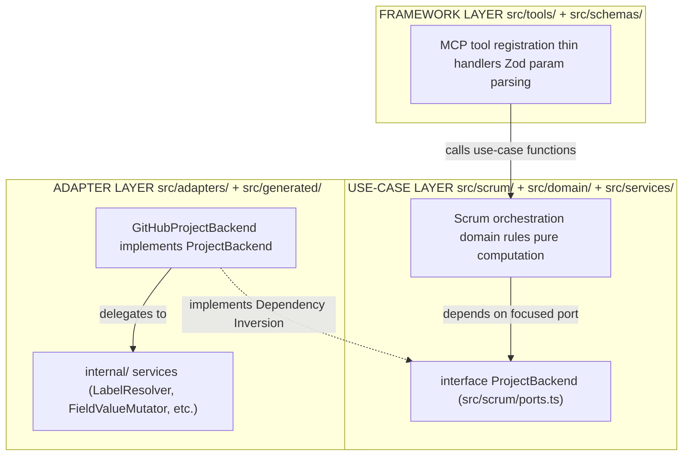

# Refactoring Plan: MCP Server Architecture

This document is the authoritative source of truth for the MCP server's architecture, known problems, and pending work. Each task is written as a self-contained problem statement with explicit rationale, TypeScript design patterns, and granular TODO items executable without full project context. Update this document when a task completes, a decision is made, or new scope is identified.

## Table of Contents

1. [Purpose and Scope](#1-purpose-and-scope)
2. [Architecture Vision](#2-architecture-vision)
3. [Stable Tool Surface](#3-stable-tool-surface)
4. [Current Implementation State](#4-current-implementation-state)
5. [Task Index](#5-task-index)
6. [Group F — Adapter Layer: Foundation and Facade](#6-group-f--adapter-layer-foundation-and-facade)
7. [Group P — Port Cleanup](#7-group-p--port-cleanup)
8. [Group T — Tool Surface Improvements](#8-group-t--tool-surface-improvements)
9. [Group A — Agent Layer Fixes](#9-group-a--agent-layer-fixes)
10. [Design Decisions](#10-design-decisions)
11. [Open Questions](#11-open-questions)

---

## 1. Purpose and Scope

The MCP server exposes a Scrum-vocabulary tool surface (`scrum_*`) where the server owns all ID resolution and the agent speaks only domain concepts: `StoryRef`, `SprintRef`, status names, and vocabulary values.

The architecture is designed so that swapping to a different project management platform requires adding one new adapter directory and changing one import in `index.ts` — no changes to tools, use cases, domain rules, or schemas. This property is achieved through a `ProjectBackend` interface that sits between the use-case layer and the GitHub-specific adapter. Nothing above that interface knows about GitHub; nothing below it knows about Scrum tools or MCP.

---

## 2. Architecture Vision

### Three-layer model



### Dependency Rules

| What                            | May import                                                                          | Must not import                                |
| ------------------------------- | ----------------------------------------------------------------------------------- | ---------------------------------------------- |
| `src/domain/`                   | Nothing (std lib only)                                                              | Anything else                                  |
| `src/scrum/`                    | `src/domain/`, `src/schemas/`                                                       | `src/adapters/`, `src/tools/`, `src/services/` |
| `src/adapters/github/`          | `src/scrum/ports.ts`, `src/domain/`, `src/services/`                                | `src/tools/`, `src/scrum/*.ts` (use cases)     |
| `src/adapters/github/internal/` | `src/adapters/github/` (types, errors, config), `src/scrum/ports.ts`, `src/domain/` | `src/tools/`, `src/scrum/*.ts`                 |
| `src/tools/`                    | `src/scrum/`, `src/domain/`, `src/schemas/`                                         | `src/adapters/` directly                       |
| `src/index.ts`                  | Everything (Main — the only place that knows all concretions)                       | —                                              |

---

## 3. Stable Tool Surface

### Read tools (7)

| Tool                 | Purpose                                                             |
| -------------------- | ------------------------------------------------------------------- |
| `scrum_orient`       | Current platform state + declared vocabulary — agent's entry point  |
| `scrum_get_sprint`   | Sprint snapshot(s): lightweight item listing grouped by sprint      |
| `scrum_get_backlog`  | Unsprinted active stories, filterable, with readiness summary       |
| `scrum_get_story`    | Full detail: body, comments, linked PRs, parsed acceptance criteria |
| `scrum_get_history`  | Completed-sprint snapshots in the same shape as `scrum_get_sprint`  |
| `scrum_get_burndown` | Day-by-day burndown series + ideal line for a sprint                |
| `scrum_get_template` | Fetch a project-configured ceremony artifact template               |

### Write tools (7)

| Tool                      | Purpose                                                                 |
| ------------------------- | ----------------------------------------------------------------------- |
| `scrum_create_story`      | Create a story and optionally place it on the board                     |
| `scrum_update_story`      | Edit story content (title, body, labels, assignees, epic, comment)      |
| `scrum_set_field`         | Single entry point for all board-field mutations                        |
| `scrum_plan_sprint`       | Bulk-assign stories to a sprint                                         |
| `scrum_log_impediment`    | Create an impediment; optionally link it to an affected story or sprint |
| `scrum_update_impediment` | Advance an impediment lifecycle: `open → in_progress → resolved`        |
| `scrum_add_vocabulary`    | Idempotent add of a field option or label to the platform schema        |

### Deprecated

| Tool             | Status                                                                                         |
| ---------------- | ---------------------------------------------------------------------------------------------- |
| `github_graphql` | Kept for diagnostic GraphQL lookups; mutations blocked; to be removed in a future cleanup pass |

---

## 4. Current Implementation State

All backend abstraction (Phase 5), tool extraction (Phase 2), write tools (Phase 3), dead-code cleanup (Phase 4), type restructure (Phases A/B/C), bug fixes (Phase D), and domain rule extraction (Phase E) are complete. The server is fully on the `scrum_*` surface.

**Phase F (Adapter refactor) — complete.** All six internal service files are complete and type-correct. `backend.ts` is now a thin facade (~380 lines) that delegates to those services. `index.ts` (`createBackend()`) is the composition root that constructs all services in dependency order before instantiating `GitHubProjectBackend`.

**Group P (Port cleanup) — complete.** `TemplatePort` removed from `ProjectReader`; all use-case functions already used focused port types; `services/github.ts` already deleted.

**Group T (Tool surface) — complete.** `vocabulary.autonomy` shape corrected in `orient.ts`; `comment` and `goal` fields already in schemas; `affects` already optional in `log_impediment`; priority derived from config; `getOrphanImpediments` and `getSprintImpediments` fully implemented and wired.

**Group A (Agent layer) — complete.** `stale_recovery` Phase 4 disambiguated to use `scrum_set_field` for status changes; `prefer_comments_over_body_edits` note cleaned up; `config.autonomy` path corrected to `vocabulary.autonomy.require_confirmation_above_n_items`; impediment de-duplication check added to session-start health check; ceremony delivery steps added to all five ceremony sequences; tool-grounded coaching section added to SKILL.md.

| File                                                      | State       | Notes                                                                                                                                                   |
| --------------------------------------------------------- | ----------- | ------------------------------------------------------------------------------------------------------------------------------------------------------- |
| `src/adapters/github/backend.ts`                          | ✅ Complete | ~380 lines; thin facade; delegates to 6 injected services; all string-interpolated mutations removed; dead private methods eliminated                   |
| `src/adapters/github/internal/burndown-calculator.ts`     | ✅ Complete | Uses `PaginatedProjectItemFetcher`; imports `resolveSprint` and `buildBurndownStoryInput`; REST response shape correct; no `any` types                   |
| `src/adapters/github/internal/field-value-mutator.ts`     | ✅ Complete | All mutations parameterized with named variables and typed generics; `gh` typed as `GitHubClient`                                                       |
| `src/adapters/github/internal/label-resolver.ts`          | ✅ Complete | `fetchAllLabels` private; `hashToColor` private; `GET_REPO_LABELS_QUERY` appears once; `RepoNodeIdProvider` interface defined here                      |
| `src/adapters/github/internal/user-milestone-resolver.ts` | ✅ Complete | Accepts `RepoNodeIdProvider`; no duplicated `fetchRepoNodeId`; `gh` typed as `GitHubClient`                                                             |
| `src/adapters/github/internal/vocabulary-manager.ts`      | ✅ Complete | Delegates label ops to `LabelResolver`; `gh` typed as `GitHubClient`                                                                                   |
| `src/adapters/github/internal/sprint-history-service.ts`  | ✅ Complete | Extracted from `backend.ts`; no dead code; `gh` typed as `GitHubClient`; dead-variable accumulations (`committedPoints` etc.) removed                  |
| `src/adapters/github/internal/http-client.ts`             | ✅ Complete | Exports `GitHubClient` interface, `graphql`, `rest` functions, and `RestResponse`                                                                       |
| `src/tools/scrum-write.ts`                                | ✅ Complete | `scrum_log_impediment`, `scrum_update_impediment` implemented                                                                                           |

---

## 5. Task Index

Tasks are ordered by dependency. Tasks within the same group that share no dependency may be executed in parallel.

| ID      | Title                                                              | Depends on  | Status         |
| ------- | ------------------------------------------------------------------ | ----------- | -------------- |
| **F.0** | **Export `GitHubClient` interface**                                | —           | ✅ Complete    |
| F.1.1   | Fix `LabelResolver` — DRY + visibility                             | F.0         | ✅ Complete    |
| F.1.2   | Fix `UserMilestoneResolver` — `RepoNodeIdProvider`                 | F.0, F.1.1  | ✅ Complete    |
| F.1.3   | Fix `FieldValueMutator` — `GitHubClient` + parameterized mutations | F.0         | ✅ Complete    |
| F.1.4   | Rewrite `BurndownCalculator`                                       | F.0         | ✅ Complete    |
| F.1.5   | Create `SprintHistoryService`                                      | F.0         | ✅ Complete    |
| F.2.1   | Wire Facade — update `backend.ts` constructor                      | F.1.1–F.1.5 | ✅ Complete    |
| F.2.2   | Move service construction to `index.ts`                            | F.2.1       | ✅ Complete    |
| **P.1** | **Remove `TemplatePort` from `ProjectReader`**                     | —           | ✅ Complete    |
| P.2     | Adopt focused ports in use cases                                   | P.1         | ✅ Complete    |
| P.3     | Extract remaining `github.ts` concerns                             | F.2.2       | ✅ Complete    |
| **T.1** | **`scrum_orient` — response shape correctness**                    | —           | ✅ Complete    |
| T.2     | `scrum_update_story` — add `comment` field                         | —           | ✅ Complete    |
| T.3     | `scrum_plan_sprint` — add `goal` field                             | —           | ✅ Complete    |
| T.4     | `scrum_log_impediment` — optional `affects` + priority fix         | —           | ✅ Complete    |
| T.5     | `getOrphanImpediments()` — implement in backend                    | F.2.1       | ✅ Complete    |
| T.6     | `SprintSnapshot.impediments` — sprint-level enrichment             | F.2.1       | ✅ Complete    |
| **A.1** | **Wrong tool references in ceremony rules**                        | T.2, T.3    | ✅ Complete    |
| A.2     | `scrum_orient` field paths in `1_workflow.xml`                     | T.1         | ✅ Complete    |
| A.3     | Impediment de-duplication guidance                                 | —           | ✅ Complete    |
| A.4     | Ceremony template delivery path                                    | —           | ✅ Complete    |
| A.5     | SKILL.md — tool-grounded coaching pattern                          | —           | ✅ Complete    |

---

## 6. Group F — Adapter Layer: Foundation and Facade

### F.0 — Export `GitHubClient` Interface

**Status:** ✅ Complete **Depends on:** nothing **Unblocks:** F.1.1, F.1.2, F.1.3, F.1.4, F.1.5

#### Problem

`http-client.ts` exports the `graphql` and `rest` functions but no named interface type. Every internal service holds a `gh` field typed to a different ad-hoc structural shape:

| Service                 | Current `gh` type                                                    |
| ----------------------- | -------------------------------------------------------------------- |
| `FieldValueMutator`     | `typeof graphql` (bare function — calls `this.gh(query, vars)`)      |
| `LabelResolver`         | `{ graphql: typeof graphql }` (object wrapper)                       |
| `UserMilestoneResolver` | `{ graphql: typeof graphql }` (object wrapper)                       |
| `BurndownCalculator`    | `{ graphql: typeof graphql; rest: typeof rest }` (two-method object) |
| `VocabularyManager`     | `{ graphql: typeof graphql; rest: typeof rest }` (two-method object) |
| `backend.ts`            | `{ graphql: typeof graphql; rest: typeof rest }` (object)            |

This is a direct violation of "pick one word per concept." The same dependency — the GitHub HTTP transport — is spelled five different ways. Swapping the transport implementation (e.g., to a cached or mocked version) requires touching every service independently.

#### Why: TypeScript structural typing + `interface` over `typeof`

TypeScript structural typing means any object that satisfies the interface shape is accepted. Declaring a named `GitHubClient` interface in `http-client.ts` enables:

1. **Mock injection in tests** — a test can pass `{ graphql: mockGraphql, rest: mockRest }` without importing the real implementation.
2. **Single change point** — updating the transport (e.g., adding retry logic) requires changing only the concrete functions, not service signatures.
3. **Elimination of `typeof`** — `typeof graphql` is a concrete function reference, not an abstraction. It couples every service to the specific module-level export, not just to the contract.

The interface uses method signature syntax (not property arrow syntax) so TypeScript enforces the call signature at the interface level:

```typescript
// src/adapters/github/internal/http-client.ts
export interface GitHubClient {
  graphql<T>(query: string, variables?: Record<string, unknown>): Promise<T>;
  rest<T>(
    path: string,
    options?: {
      method?: "GET" | "POST" | "PATCH" | "DELETE";
      params?: Record<string, string>;
      body?: unknown;
      accept?: string;
    },
  ): Promise<RestResponse<T>>;
}
```

The object `{ graphql, rest }` passed from `index.ts` already satisfies this interface structurally — no changes to `index.ts` or `backend.ts`'s constructor are required to adopt it.

#### Steps

**Step 1 — Add `GitHubClient` export to `http-client.ts`**

- [ ] Open `src/adapters/github/internal/http-client.ts`
- [ ] Add the `GitHubClient` interface above the `getToken` function (after the `RestResponse` type)
- [ ] The interface must declare `graphql<T>` and `rest<T>` as method signatures (not property arrows), matching the existing function signatures exactly
- [ ] Export it as a named export

**Step 2 — Verify structural compatibility**

- [ ] Run `deno check src/index.ts` — the `{ graphql, rest }` object passed to `GitHubProjectBackend` must satisfy `GitHubClient` without any cast
- [ ] If `deno check` fails, adjust the interface to match what the functions actually accept (do not change the function signatures themselves)

#### Acceptance Criteria

- `GitHubClient` is exported from `src/adapters/github/internal/http-client.ts`
- `{ graphql, rest }` from `http-client.ts` satisfies `GitHubClient` without a type cast
- No other files are modified in this task

---

### F.1.1 — Fix `LabelResolver` — DRY Violation and `hashToColor` Visibility

**Status:** ✅ Complete **Depends on:** F.0 **Unblocks:** F.1.2 (which depends on `LabelResolver`)

#### Problem

`LabelResolver` has two independent issues:

**DRY violation — three methods each fetch the full label list independently:**

- `resolveLabelNodeIds` fetches `GET_REPO_LABELS_QUERY`, then processes results
- `resolveOrCreateLabel` fetches `GET_REPO_LABELS_QUERY`, then processes results
- `addLabel` fetches `GET_REPO_LABELS_QUERY`, then processes results

Every call site issues a separate network round-trip to get the same data. Extracting a private `fetchAllLabels()` method consolidates the network call and makes each public method's intent explicit.

**`hashToColor` is public but is an implementation detail:** `hashToColor` computes a deterministic color for auto-created labels. It is not part of the label management contract — it is an internal utility used only within the class. Exposing it as `public` allows callers to use it, creating an unintended dependency on the color-generation algorithm.

**`gh` field uses old ad-hoc type, not `GitHubClient`:** `private readonly gh: { graphql: typeof graphql }` — must be updated to `GitHubClient` after F.0.

#### Why: SRP + DRY + information hiding

Extracting `fetchAllLabels` satisfies DRY at the method level — one reason to change the network call, one place to change it. Making `hashToColor` private enforces information hiding: the class exposes _what it does_ (resolve labels, add labels), not _how it assigns colors_.

Adopting `GitHubClient` for `gh` makes the service mockable (see F.0 rationale).

#### Steps

**Step 1 — Update `gh` field type**

- [ ] Change `private readonly gh: { graphql: typeof graphql }` to `private readonly gh: GitHubClient`
- [ ] Update the constructor parameter type to match
- [ ] Remove the `graphql` import if it is no longer referenced directly (the type comes from the interface now)
- [ ] Import `GitHubClient` from `./http-client.ts`

**Step 2 — Extract `private fetchAllLabels()`**

- [ ] Add a private method `private async fetchAllLabels(): Promise<GitHubLabel[]>` that issues `GET_REPO_LABELS_QUERY` and returns `result?.repository?.labels?.nodes ?? []`
- [ ] Replace the three independent `gh.graphql(GET_REPO_LABELS_QUERY, ...)` calls in `resolveLabelNodeIds`, `resolveOrCreateLabel`, and `addLabel` with `await this.fetchAllLabels()`
- [ ] Verify each method still works correctly — `fetchAllLabels` returns `GitHubLabel[]` which each method already processes

**Step 3 — Make `hashToColor` private**

- [ ] Change `hashToColor(name: string): string` to `private hashToColor(name: string): string`
- [ ] Search all files that import from `label-resolver.ts` and call `hashToColor` directly — there should be none; if any exist, move the call inside the class

**Step 4 — Verify**

- [ ] Run `deno check src/adapters/github/internal/label-resolver.ts`
- [ ] Run `deno check src/adapters/github/backend.ts` to catch any breakage at the import site

#### Acceptance Criteria

- `LabelResolver.gh` is typed `GitHubClient`
- `fetchAllLabels` is a single private method; `GET_REPO_LABELS_QUERY` appears exactly once in the class
- `hashToColor` is private
- All three public label methods (`resolveLabelNodeIds`, `resolveOrCreateLabel`, `addLabel`) pass `deno check`

---

### F.1.2 — Fix `UserMilestoneResolver` — Adopt `RepoNodeIdProvider`

**Status:** ✅ Complete **Depends on:** F.0, F.1.1 **Unblocks:** F.2.1

#### Problem

`UserMilestoneResolver` duplicates `fetchRepoNodeId` — a private method with identical logic to `LabelResolver.fetchRepoNodeId`. The plan in §6d proposed injecting `LabelResolver` as a constructor dependency to share the method.

However, injecting all of `LabelResolver` into `UserMilestoneResolver` for one method violates Interface Segregation at the service level: `UserMilestoneResolver` would depend on label CRUD operations, color hashing, and everything else on `LabelResolver` — none of which it needs. This couples two services that share only one capability.

#### Why: ISP at the service boundary + narrow interface injection

TypeScript interface segregation at the service level means: accept the narrowest possible collaborator type, not a concrete class. Defining a `RepoNodeIdProvider` interface with a single method creates a focused contract. `LabelResolver` satisfies it structurally — no changes to `LabelResolver` needed. Tests can pass a trivial stub instead of constructing a full `LabelResolver`.

An alternative — and simpler — solution is to pass the already-resolved `repoNodeId` as a constructor parameter. Since the server is stateless and each invocation calls `loadConfig`, the repo node ID is stable within a request. This avoids any inter-service dependency at the cost of one async call at construction time. Given the stateless-server design decision (§10), this is the preferred approach.

```typescript
// Option A — narrow interface (if repo node ID can change within a session):
export interface RepoNodeIdProvider {
  fetchRepoNodeId(): Promise<string>;
}

// Option B — primitive injection (preferred for stateless server):
constructor(gh: GitHubClient, owner: string, repo: string, labelResolver: RepoNodeIdProvider)
```

**Use Option A** (narrow interface injection). This preserves the lazy-fetch behavior (node ID fetched only when milestone creation is needed) and keeps the constructor synchronous.

#### Steps

**Step 1 — Define `RepoNodeIdProvider` interface**

- [ ] Add to `src/adapters/github/internal/label-resolver.ts` (alongside `LabelResolver`) or to a new `src/adapters/github/internal/repo-node-id.ts`
- [ ] The interface has exactly one method: `fetchRepoNodeId(): Promise<string>`
- [ ] Export it
- [ ] Note: `LabelResolver` already satisfies this interface structurally — no changes to `LabelResolver` needed

**Step 2 — Update `UserMilestoneResolver` constructor**

- [ ] Open `src/adapters/github/internal/user-milestone-resolver.ts`
- [ ] Change `private readonly gh: { graphql: typeof graphql }` to `private readonly gh: GitHubClient`
- [ ] Add constructor parameter `private readonly repoNodeIdProvider: RepoNodeIdProvider`
- [ ] Import `RepoNodeIdProvider` and `GitHubClient`
- [ ] Remove the import of `graphql` from `http-client.ts` if no longer used directly

**Step 3 — Remove the duplicated private method**

- [ ] Delete the `private async fetchRepoNodeId()` method from `UserMilestoneResolver`
- [ ] In `resolveOrCreateMilestoneNodeId`, replace `await this.fetchRepoNodeId()` with `await this.repoNodeIdProvider.fetchRepoNodeId()`

**Step 4 — Update the Facade's construction call (in F.2.1 — note here for tracking)**

- [ ] When wiring the Facade, pass `this.labelResolver` as the `repoNodeIdProvider` argument: `new UserMilestoneResolver(gh, owner, repo, this.labelResolver)`

#### Acceptance Criteria

- `UserMilestoneResolver` no longer has a `private fetchRepoNodeId()` method
- `UserMilestoneResolver` accepts `RepoNodeIdProvider` (not `LabelResolver`) as a constructor dependency
- `RepoNodeIdProvider` is exported and `LabelResolver` satisfies it without modification
- `deno check src/adapters/github/internal/user-milestone-resolver.ts` passes

---

### F.1.3 — Fix `FieldValueMutator` — `GitHubClient` Adoption and Parameterized Mutations

**Status:** ✅ Complete **Depends on:** F.0 **Unblocks:** F.2.1

#### Problem

`FieldValueMutator` has two independent defects:

**1. `gh` field is typed to the bare function (`typeof graphql`), not the object interface:**

```typescript
private readonly gh: typeof graphql;  // wrong — inconsistent with all other services
// calls: await this.gh(query, vars)   // bare function call
```

All other services use the object-wrapper form (`this.gh.graphql(...)`). After F.0 adds `GitHubClient`, every service must use the interface.

**2. All GraphQL mutations use string interpolation instead of parameterized variables:**

```typescript
// Current — string interpolation, injection risk, no type safety:
await this.gh(`mutation {
  updateProjectV2ItemFieldValue(input: {
    itemId: "${itemId}"
    fieldId: "${fieldId}"
    value: { singleSelectOptionId: "${optionId}" }
  }) { item { id } }
}`);

// Required — named variables, typed response:
await this.gh.graphql<{
  updateProjectV2ItemFieldValue: { item: { id: string } };
}>(
  `mutation SetFieldStatus($projectId: ID!, $itemId: ID!, $fieldId: ID!, $optionId: String!) {
     updateProjectV2ItemFieldValue(input: {
       projectId: $projectId, itemId: $itemId, fieldId: $fieldId,
       value: { singleSelectOptionId: $optionId }
     }) { item { id } }
  }`,
  { projectId: this.config.projectId, itemId, fieldId, optionId },
);
```

#### Why: GraphQL variable parameterization — security and type safety

Embedding IDs in mutation strings via template literals bypasses GraphQL's type system. The GitHub GraphQL API enforces `ID!` types on input fields — sending a mis-formed string in an interpolated mutation produces a runtime error with no compile-time signal. Using named variables (`$itemId: ID!`) lets the API validate the type at the protocol level and gives the TypeScript generic `<ResponseType>` meaningful structure. It also eliminates the possibility of structural injection if any ID value ever comes from untrusted input.

The `clearField` method already uses parameterized variables correctly — apply the same pattern to the five remaining mutation methods.

#### Steps

**Step 1 — Update `gh` field type**

- [ ] Change `private readonly gh: typeof graphql` to `private readonly gh: GitHubClient`
- [ ] Update the constructor parameter to `gh: GitHubClient`
- [ ] Replace all call sites of `this.gh(query, vars)` (bare function) with `this.gh.graphql(query, vars)`
- [ ] Import `GitHubClient` from `./http-client.ts`; remove the `graphql` function import

**Step 2 — Parameterize `setFieldStatus`**

- [ ] Remove the template literal mutation string
- [ ] Replace with a named operation `SetFieldStatus` with variables `$projectId: ID!`, `$itemId: ID!`, `$fieldId: ID!`, `$optionId: String!`
- [ ] Add typed generic: `this.gh.graphql<{ updateProjectV2ItemFieldValue: { item: { id: string } } }>(...)`
- [ ] Pass `{ projectId: this.config.projectId, itemId, fieldId, optionId }` as the variables object

**Step 3 — Parameterize `setFieldSprint`**

- [ ] Named operation: `SetFieldSprint` with variables `$projectId: ID!`, `$itemId: ID!`, `$fieldId: ID!`, `$iterationId: String!`
- [ ] Value type for iteration: `value: { iterationId: $iterationId }` in the mutation
- [ ] The `clearField` path (when `iterationId === null`) already uses parameterized variables — leave it as-is

**Step 4 — Parameterize `setFieldStoryPoints`**

- [ ] Named operation: `SetFieldStoryPoints` with variables `$projectId: ID!`, `$itemId: ID!`, `$fieldId: ID!`, `$number: Float!`
- [ ] Note: GitHub Projects v2 uses `Float!` (not `Int!`) for number field values
- [ ] The `clearField` null-path is already parameterized — leave as-is

**Step 5 — Parameterize `setFieldPriority`**

- [ ] Named operation: `SetFieldPriority` with variables `$projectId: ID!`, `$itemId: ID!`, `$fieldId: ID!`, `$optionId: String!`
- [ ] Same structure as `SetFieldStatus`

**Step 6 — Parameterize `setFieldAssignee`**

- [ ] Named operation `ClearAssignees` for the null path: variables `$issueId: ID!`, value `assigneeIds: []`
- [ ] Named operation `SetAssignee` for the set path: variables `$issueId: ID!`, `$userId: ID!`
- [ ] Note: `issueId` here is an issue node ID (not a project item ID) — this is correct as-is; keep the parameter name `$issueId`

**Step 7 — Verify**

- [ ] Run `deno check src/adapters/github/internal/field-value-mutator.ts`
- [ ] Confirm no bare template literal mutations remain in the file (`grep '`\`mutation {' field-value-mutator.ts` should return nothing)

#### Acceptance Criteria

- `FieldValueMutator.gh` is typed `GitHubClient`; all calls use `this.gh.graphql(...)`
- All five mutation methods (`setFieldStatus`, `setFieldSprint`, `setFieldStoryPoints`, `setFieldPriority`, `setFieldAssignee`) use named GraphQL variables — no string interpolation in mutation bodies
- All mutations have typed response generics
- `clearField` continues to use parameterized variables (already correct — do not regress)
- `deno check` passes

---

### F.1.4 — Rewrite `BurndownCalculator` from Scratch

**Status:** ✅ Complete **Depends on:** F.0 **Unblocks:** F.2.1

#### Problem

The current `burndown-calculator.ts` cannot compile and has multiple fundamental defects:

1. **`this.resolveSprint(sprint, config)` is a private method that duplicates `resolveSprint` from `resolver.ts`** — the standalone function already exists and is imported by `backend.ts`; duplicating it is a DRY violation.

2. **`this.fetchAllItems()` is a private reimplementation of `PaginatedProjectItemFetcher`** — and its inner GraphQL query is wrong: it queries `repository(owner, name) { items(...) }` which does not exist on GitHub Projects v2. Project items live on the project node (`node(id: $projectId) { ... on ProjectV2 { items(...) } }`), not on the repository node.

3. **`this.buildBurndownStoryInput(item, config)` duplicates `buildBurndownStoryInput` from `mappers.ts`** — the mapper already exists.

4. **`response.data?.events` is a wrong REST response shape** — the GitHub issue timeline REST endpoint returns an array directly at `response.data`, not `{ events: [...] }`. The current code always produces an empty completions map.

5. **`item: any`, `v: any` throughout** — type safety is lost at every mapping boundary.

6. **`this.resolveSprint()` parameter type is `IterationEntry` but the `getBurndownInput` call site uses `SprintRef`** — the types are incompatible.

The class must be rewritten entirely. The correct approach: accept `PaginatedProjectItemFetcher` (or its constructor args) via constructor, call `resolveSprint` from `resolver.ts` as a standalone function, and call `buildBurndownStoryInput` from `mappers.ts` — no re-implementations of any of these.

#### Why: DRY + Dependency Inversion + eliminating `any`

The three re-implementations (`resolveSprint`, `fetchAllItems`, `buildBurndownStoryInput`) each violate DRY. If the pagination logic or mapping logic changes, `BurndownCalculator` would diverge silently. The correct design: depend on the already-extracted abstractions, not on duplicated copies.

Eliminating `any` at the mapping boundary is required because `buildBurndownStoryInput` in `mappers.ts` already has the correct type for the raw project item — use its input type, not `any`.

#### Steps

**Step 1 — Delete the current file body (keep the header comment)**

- [ ] Open `src/adapters/github/internal/burndown-calculator.ts`
- [ ] Delete all class body content below the file header comment
- [ ] Keep the imports section — it will be rewritten

**Step 2 — Write the correct constructor**

```typescript
import { GitHubClient } from "./http-client.ts";
import { PaginatedProjectItemFetcher } from "./pagination.ts";
import { buildBurndownStoryInput } from "../mappers.ts";
import { resolveSprint } from "./resolver.ts"; // standalone function — not a class method
import type { RuntimeConfig } from "../config-loader.ts";
import type {
  BurndownInput,
  BurndownStoryInput,
  CompletionMap,
  SprintInfo,
} from "../../../scrum/ports.ts";
import type { SprintRef } from "../../../domain/types.ts";

export class BurndownCalculator {
  constructor(
    private readonly config: RuntimeConfig,
    private readonly gh: GitHubClient,
    private readonly owner: string,
    private readonly repo: string,
  ) {}
}
```

- [ ] Write this constructor exactly — no additional private fields beyond what is injected

**Step 3 — Implement `getBurndownInput(sprint: SprintRef)`**

- [ ] Call `resolveSprint(sprint, this.config)` — the standalone function from `resolver.ts`; capture the returned `iterationId: string | null`
- [ ] If `iterationId === null`, throw `new Error("Burndown does not apply to the backlog.")`
- [ ] Find the iteration entry: `this.config.iterations.all.find((i) => i.id === iterationId)` — throw if not found
- [ ] Create a `PaginatedProjectItemFetcher` instance using `this.config`, `{ graphql: this.gh.graphql }`, and appropriate options (same options as `getBacklogStories` in `backend.ts` — include `sprintFieldIds`, `includeIssueContent: true`)
- [ ] Call `fetcher.collect()` with a filter predicate that checks `item.fieldValues.nodes` for a field matching `this.config.fields.sprintFieldId` with `iterationId`
- [ ] Map filtered items with `buildBurndownStoryInput(item, this.config)` from `mappers.ts`
- [ ] Filter out nulls: `.filter((s): s is BurndownStoryInput => s !== null)`
- [ ] Compute `endDate` from `iterEntry.startDate + iterEntry.duration` days
- [ ] Return `BurndownInput` with `sprint: SprintInfo` and `stories: BurndownStoryInput[]`

**Step 4 — Implement `resolveCompletionTimestamps(input: BurndownInput)`**

- [ ] Iterate `input.stories` — for each story with a `number`, call the REST timeline endpoint
- [ ] Correct REST path: `repos/${this.owner}/${this.repo}/issues/${story.number}/timeline`
- [ ] Correct response shape: `response.data` IS the array — type it as `Array<{ event: string; created_at: string }>`
- [ ] Filter for `event === "closed"` where `created_at` falls within `[sprint.startDate, sprint.endDate]`
- [ ] Record the last such timestamp in a `Map<number, string>`
- [ ] Wrap each story in `try/catch` and `continue` on failure (individual timeline fetch errors should not abort the whole burndown)
- [ ] Return `CompletionMap` with `dataSource: "issue_close_proxy"` and the standard warning string

**Step 5 — Verify**

- [ ] Run `deno check src/adapters/github/internal/burndown-calculator.ts`
- [ ] Confirm no `any` types appear in the file
- [ ] Confirm `resolveSprint` is imported from `./resolver.ts`, not defined as a private method
- [ ] Confirm `buildBurndownStoryInput` is imported from `../mappers.ts`, not defined as a private method
- [ ] Confirm `fetchAllItems` does NOT exist as a method in the class

#### Acceptance Criteria

- File passes `deno check` with no errors
- `getBurndownInput` uses `PaginatedProjectItemFetcher` from `pagination.ts` — no custom pagination
- `resolveCompletionTimestamps` reads `response.data` as a direct array — not `response.data.events`
- Zero `any` types in the file
- `resolveSprint` and `buildBurndownStoryInput` are imported, not re-implemented

---

### F.1.5 — Create `SprintHistoryService`

**Status:** ✅ Complete **Depends on:** F.0 **Unblocks:** F.2.1

#### Problem

`SprintHistoryService` does not exist. `getCompletedSprintHistory` currently lives on `GitHubProjectBackend` as a long private method. Extracting it follows the same SRP rationale as all other service extractions.

The method uses `PaginatedProjectItemFetcher` and `buildBurndownStoryInput` from `mappers.ts` — the same dependencies as `BurndownCalculator`. Both services need `config`, `gh`, `owner`, and `repo`.

#### Why: SRP — one reason to change

`getCompletedSprintHistory` has one reason to change: the GitHub Projects v2 query shape for fetching completed sprint items. No other method in the backend shares this reason. Extracting it to a dedicated service enforces this boundary.

Note: the `SprintHistoryService` constructor must accept `owner` and `repo` in addition to `config` and `gh` — they are required for `PaginatedProjectItemFetcher`. The original plan showed `new SprintHistoryService(config, gh)` which was incomplete.

#### Steps

**Step 1 — Create `src/adapters/github/internal/sprint-history-service.ts`**

```typescript
// src/adapters/github/internal/sprint-history-service.ts
import type { GitHubClient } from "./http-client.ts";
import { PaginatedProjectItemFetcher } from "./pagination.ts";
import { buildBurndownStoryInput } from "../mappers.ts";
import type { RuntimeConfig } from "../config-loader.ts";
import type { SprintHistoryEntry } from "../../../scrum/ports.ts";

export class SprintHistoryService {
  constructor(
    private readonly config: RuntimeConfig,
    private readonly gh: GitHubClient,
    private readonly owner: string,
    private readonly repo: string,
  ) {}

  async getCompletedSprintHistory(
    window: number,
  ): Promise<SprintHistoryEntry[]> {
    // implementation extracted from backend.ts
  }
}
```

- [ ] Create the file with this header and constructor
- [ ] Copy the body of `getCompletedSprintHistory` from `backend.ts` into the new method
- [ ] Update any `this.gh.graphql` or `this.gh.rest` calls to use `this.gh.graphql` and `this.gh.rest` (should already be correct if copied from backend.ts)
- [ ] Ensure `PaginatedProjectItemFetcher` receives `{ graphql: this.gh.graphql }` (its constructor expects an object with `graphql`)
- [ ] Run `deno check src/adapters/github/internal/sprint-history-service.ts`

**Step 2 — Do not remove from `backend.ts` yet**

- [ ] Leave `getCompletedSprintHistory` in `backend.ts` until F.2.1 wires the Facade — removing it before the Facade is wired would break the server

#### Acceptance Criteria

- `sprint-history-service.ts` exists and passes `deno check`
- `SprintHistoryService` constructor accepts `(config, gh: GitHubClient, owner, repo)`
- The method correctly produces `SprintHistoryEntry[]`

---

### F.2.1 — Wire the Facade — Update `backend.ts` Constructor

**Status:** ✅ Complete **Depends on:** F.1.1, F.1.2, F.1.3, F.1.4, F.1.5 **Unblocks:** F.2.2

#### Problem

`backend.ts` still contains ~1,224 lines because the F.1 split was additive: services were created but `backend.ts` was never updated to use them. The private method bodies remain, creating duplicate implementations. The class violates SRP and is a maintenance hazard.

The target: `backend.ts` ≤ 250 lines. Every private method body is removed; every public method is a one-line delegation to an injected service.

#### Why: Facade pattern — one reason to change

A Facade class that contains no logic has exactly one reason to change: the wiring — which service handles which method. Adding a new capability requires adding a new service and a delegation line, not modifying existing logic. This satisfies OCP (open for extension, closed for modification) at the adapter boundary.

**Critical design note — true Dependency Inversion:** The `backend.ts` constructor must accept pre-built service instances, not create them with `new` internally. Constructing dependencies inside the constructor makes it impossible to inject mocks in tests. `index.ts` (the Main) is the only place that calls `new ServiceX(...)` — this is where all concretions are known and assembled. `backend.ts` receives completed collaborators.

```typescript
// WRONG — backend.ts constructs its own dependencies (not DIP):
constructor(config, gh, owner, repo) {
  this.labelResolver = new LabelResolver(config, gh, owner, repo); // ← backend knows concretions
}

// CORRECT — backend.ts receives completed collaborators (true DIP):
constructor(
  private readonly labelResolver: LabelResolver,
  private readonly fieldValueMutator: FieldValueMutator,
  private readonly burndownCalculator: BurndownCalculator,
  private readonly sprintHistoryService: SprintHistoryService,
  private readonly vocabularyManager: VocabularyManager,
  private readonly config: RuntimeConfig,
  private readonly gh: GitHubClient,
  private readonly owner: string,
  private readonly ownerType: "user" | "org",
  private readonly repo: string,
) {}
```

The `config`, `gh`, `owner`, `ownerType`, and `repo` fields remain on the Facade because several public methods that are NOT yet delegated to services (`getPlatformState`, `getSprintStories`, `getBacklogStories`, `getStoryDetail`, `createStory`, `updateStory`, `addComment`) still use them directly.

#### Steps

**Step 1 — Update the constructor signature to accept injected services**

- [ ] Add constructor parameters for all six services: `LabelResolver`, `UserMilestoneResolver`, `FieldValueMutator`, `BurndownCalculator`, `SprintHistoryService`, `VocabularyManager`
- [ ] Keep `config`, `gh: GitHubClient`, `owner`, `ownerType`, `repo` as constructor parameters (they are still needed by un-delegated methods)
- [ ] Assign all parameters to `private readonly` fields
- [ ] Do NOT use `new ServiceX(...)` inside the constructor

**Step 2 — Add delegation methods for fully-extracted services**

Replace each private method body with a one-line delegation to the corresponding service. For each of the following, verify the service's method signature matches what the public method expects:

- [ ] `getBurndownInput(sprint)` → `return this.burndownCalculator.getBurndownInput(sprint)`
- [ ] `resolveCompletionTimestamps(input)` → `return this.burndownCalculator.resolveCompletionTimestamps(input)`
- [ ] `getCompletedSprintHistory(window)` → `return this.sprintHistoryService.getCompletedSprintHistory(window)`
- [ ] `addVocabulary(kind, value)` → `return this.vocabularyManager.addVocabulary(kind, value)`
- [ ] `setField(ref, field, value)` → delegate to `FieldValueMutator` — requires resolving `ref` to `itemId` first (call `resolveStory` from `resolver.ts`), then dispatch to the appropriate `FieldValueMutator.setFieldX` method

**Step 3 — Remove duplicate private method bodies**

For each of the following, verify the corresponding service exists and is wired, then delete the private method from `backend.ts`:

- [ ] All label-related methods: `resolveOrCreateLabel`, `resolveLabelNodeIds`, `addLabel`, `hashToColor` (now on `LabelResolver`)
- [ ] All user/milestone methods: `resolveUserNodeId`, `resolveUserNodeIds`, `resolveOrCreateMilestoneNodeId` (now on `UserMilestoneResolver`)
- [ ] All field mutation methods: `setFieldStatus`, `setFieldSprint`, `setFieldStoryPoints`, `setFieldPriority`, `setFieldAssignee` (now on `FieldValueMutator`)
- [ ] `addStatusOption`, `addPriorityOption`, `addSingleSelectOption` (now on `VocabularyManager`)
- [ ] `getCompletedSprintHistory` private body (now on `SprintHistoryService`)

**Step 4 — Verify line count and correctness**

- [ ] Run `wc -l src/adapters/github/backend.ts` — target ≤ 250 lines
- [ ] Run `deno check src/adapters/github/backend.ts`

#### Acceptance Criteria

- `backend.ts` accepts all six services as constructor parameters (no `new` inside the constructor)
- `backend.ts` is ≤ 250 lines
- Every delegated public method is a one-line dispatch
- Zero duplicate private method bodies remain
- `deno check` passes

---

### F.2.2 — Move Service Construction to `index.ts`

**Status:** ✅ Complete **Depends on:** F.2.1 **Unblocks:** P.3

#### Problem

After F.2.1, `GitHubProjectBackend` expects pre-built service instances. Currently, `index.ts` calls `new GitHubProjectBackend(config, { graphql, rest }, ...)` with only primitives. The construction of the six internal services must move to `createBackend()` in `index.ts`.

`index.ts` is the Main — the only place in the system that knows all concretions. Assembly of the object graph is its sole purpose.

#### Why: Main as composition root

In Clean Architecture the Main component constructs all concretions and injects them toward the center. No other layer knows about concretions. Moving `new LabelResolver(...)` etc. to `index.ts` means any test that constructs a `GitHubProjectBackend` must also provide service instances — which forces test authors to use mocks for specific services rather than building a 1,200-line backend monolith.

#### Steps

**Step 1 — Update `createBackend()` in `index.ts`**

- [ ] Open `src/index.ts`
- [ ] In `createBackend()`, after the `gh` config is resolved, construct each service in dependency order:
  1. `const labelResolver = new LabelResolver(config, { graphql, rest }, gh.owner, primaryRepo)`
  2. `const userMilestoneResolver = new UserMilestoneResolver({ graphql, rest }, gh.owner, primaryRepo, labelResolver)`
  3. `const fieldValueMutator = new FieldValueMutator(config, { graphql, rest }, userMilestoneResolver)`
  4. `const burndownCalculator = new BurndownCalculator(config, { graphql, rest }, gh.owner, primaryRepo)`
  5. `const sprintHistoryService = new SprintHistoryService(config, { graphql, rest }, gh.owner, primaryRepo)`
  6. `const vocabularyManager = new VocabularyManager(config, { graphql, rest }, labelResolver, gh.owner, primaryRepo)`
  7. `const backend = new GitHubProjectBackend(labelResolver, userMilestoneResolver, fieldValueMutator, burndownCalculator, sprintHistoryService, vocabularyManager, config, { graphql, rest }, gh.owner, gh.owner_type, primaryRepo)`
- [ ] Note: `{ graphql, rest }` satisfies `GitHubClient` structurally — no cast required after F.0

**Step 2 — Import all service classes**

- [ ] Add imports for `LabelResolver`, `UserMilestoneResolver`, `FieldValueMutator`, `BurndownCalculator`, `SprintHistoryService`, `VocabularyManager` from their respective `internal/` paths

**Step 3 — Run full type check**

- [ ] Run `deno check src/index.ts`
- [ ] Run `deno check src/adapters/github/backend.ts`
- [ ] Confirm the server starts with `deno run src/index.ts` or equivalent and responds to a `scrum_orient` tool call

#### Acceptance Criteria

- All six services are constructed in `createBackend()` before `GitHubProjectBackend` is instantiated
- No `new LabelResolver(...)` or other service construction occurs inside `backend.ts`
- `deno check src/index.ts` passes
- Server starts and `scrum_orient` returns a valid response

---

## 7. Group P — Port Cleanup

### P.1 — Remove `TemplatePort` from `ProjectReader`

**Status:** ✅ Complete **Depends on:** nothing **Unblocks:** P.2

#### Problem

`TemplatePort` declares `fetchRepoFile(path: string): Promise<string>` — a GitHub Contents API method on a platform-agnostic interface. It currently appears in `ProjectReader extends [..., TemplatePort]`.

Because `ProjectBackend extends ProjectReader`, any non-GitHub backend must implement `fetchRepoFile` — a GitHub-specific API concept with no equivalent on Jira or Azure DevOps. The fix in §6f (removing from `ProjectBackend`) is insufficient because `ProjectReader` still extends `TemplatePort`, and all use-case layers that accept `ProjectReader` still carry this dependency.

The `getTemplateUseCase` is the only consumer of `fetchRepoFile`. It should accept `TemplatePort` directly as its own parameter — separate from `ProjectReader`.

#### Why: ISP — clients should not depend on methods they don't use

A use case that reads sprint stories should not be forced to implement or provide `fetchRepoFile`. Segregating `TemplatePort` out of `ProjectReader` means any minimal stub passed to a non-template use case is simpler to construct in tests.

#### Steps

**Step 1 — Remove `TemplatePort` from `ProjectReader`'s extends clause**

- [ ] Open `src/scrum/ports.ts`
- [ ] In the `ProjectReader` interface declaration, remove `TemplatePort` from the extends list
- [ ] `ProjectReader` should now extend: `BacklogPort, SprintPort, StoryPort, HistoryPort, BurndownPort, ImpedimentPort` (and `getPlatformState`)

**Step 2 — Update `getTemplateUseCase` to accept `TemplatePort` separately**

- [ ] Open `src/scrum/get-template.ts`
- [ ] Change the function signature to accept `backend: TemplatePort` instead of `backend: ProjectBackend` or `backend: ProjectReader`
- [ ] Import `TemplatePort` from `ports.ts`

**Step 3 — Update the tool handler that calls `getTemplateUseCase`**

- [ ] Open `src/tools/scrum-read.ts`
- [ ] The tool handler passes `backend` to `getTemplateUseCase` — `GitHubProjectBackend` still implements `TemplatePort` (it satisfies it structurally), so this should work without any cast
- [ ] Run `deno check src/tools/scrum-read.ts`

**Step 4 — Keep `TemplatePort` in `ProjectBackend` for backward compatibility**

- [ ] `ProjectBackend extends ProjectReader, ProjectWriter` — since `ProjectReader` no longer extends `TemplatePort`, decide whether `ProjectBackend` should extend `TemplatePort` explicitly
- [ ] Add `TemplatePort` directly to `ProjectBackend extends ProjectReader, ProjectWriter, TemplatePort` to keep `GitHubProjectBackend` implementing the full surface
- [ ] Add a comment: "TemplatePort is GitHub-specific — non-GitHub backends may omit this; tool handler accepts TemplatePort directly"

#### Acceptance Criteria

- `ProjectReader` does not extend `TemplatePort`
- `getTemplateUseCase` parameter type is `TemplatePort`, not `ProjectBackend`
- `GitHubProjectBackend` still implements `TemplatePort` (either via `ProjectBackend` or directly)
- `deno check src/scrum/ports.ts` and `deno check src/tools/scrum-read.ts` pass

---

### P.2 — Adopt Focused Ports in Use Cases

**Status:** ✅ Complete **Depends on:** P.1 **Unblocks:** nothing (independent improvement)

#### Problem

`ports.ts` already defines focused port interfaces (`BacklogPort`, `SprintPort`, `StoryPort`, `HistoryPort`, `BurndownPort`, `ImpedimentPort`). However, the use-case functions likely still accept `ProjectBackend` (the full 12-method interface) rather than the specific focused port they actually use. A test stub for `getBacklogUseCase` should need to implement only 2 methods, not 12.

#### Steps

For each use case file, update the `backend` parameter type to the narrowest port that satisfies its actual method calls:

| Use case file          | Current assumed type | Target type                               |
| ---------------------- | -------------------- | ----------------------------------------- |
| `get-backlog.ts`       | `ProjectBackend`     | `BacklogPort`                             |
| `get-sprint.ts`        | `ProjectBackend`     | `SprintPort & ImpedimentPort`             |
| `get-story.ts`         | `ProjectBackend`     | `StoryPort`                               |
| `get-history.ts`       | `ProjectBackend`     | `HistoryPort`                             |
| `get-burndown.ts`      | `ProjectBackend`     | `BurndownPort`                            |
| `get-template.ts`      | `ProjectBackend`     | `TemplatePort` (done in P.1)              |
| `orient.ts`            | `ProjectBackend`     | `ProjectReader` (uses `getPlatformState`) |
| `update-impediment.ts` | `ProjectBackend`     | `ImpedimentPort`                          |

- [ ] For each file above, open it and identify which `backend.X()` methods are actually called
- [ ] Import the appropriate focused port(s) from `ports.ts`
- [ ] Update the parameter type
- [ ] Run `deno check` on each file — `GitHubProjectBackend` satisfies all focused ports structurally, so tool handlers passing `backend` will not need changes

#### Acceptance Criteria

- No use-case file imports `ProjectBackend` for its `backend` parameter
- Each use-case `backend` parameter is typed to the narrowest port it needs
- All use-case files pass `deno check`

---

### P.3 — Extract Remaining `services/github.ts` Concerns

**Status:** ✅ Complete **Depends on:** F.2.2 **Unblocks:** nothing (cleanup)

#### Problem

`graphql()` and `rest()` were extracted to `adapters/github/internal/http-client.ts` in Phase C, but the original `services/github.ts` likely still exists. `scrum-write.ts` imports `graphql` directly from `services/github.ts` — bypassing `ProjectBackend` — only for the deprecated `github_graphql` tool. This creates a `tools → services/github.ts` dependency path that violates the dependency rule.

#### Steps

- [ ] Confirm whether `services/github.ts` still exists and what it exports
- [ ] If `scrum-write.ts` imports `graphql` from `services/github.ts`: redirect the import to `adapters/github/internal/http-client.ts`
- [ ] If `services/github.ts` is now empty or only re-exports from `http-client.ts`: delete it
- [ ] Run `deno check src/tools/scrum-write.ts`

#### Acceptance Criteria

- No file outside `src/adapters/github/` imports from `src/services/github.ts`
- `src/services/github.ts` can be deleted (or is deleted) without breaking any import

---

## 8. Group T — Tool Surface Improvements

### T.1 — `scrum_orient` — Response Shape Correctness

**Status:** ✅ Complete **Depends on:** nothing **Unblocks:** A.2

#### Problem

The agent's session-start rules extract fields from `scrum_orient` using paths that don't match what the use case actually returns. Specific mismatches:

| Agent expects                    | Orient actually returns                                |
| -------------------------------- | ------------------------------------------------------ |
| `vocabulary.status`              | `declared_vocabulary.status`                           |
| `vocabulary.dor`                 | `declared_vocabulary.definition_of_ready`              |
| `vocabulary.dod`                 | `declared_vocabulary.definition_of_done`               |
| `vocabulary.autonomy`            | _(not present)_                                        |
| `platform_state.missing_options` | `platform_state.fields.status.missingOptions` (nested) |

Every agent session silently uses wrong field paths, causing vocabulary-dependent operations to fail with no error.

#### Steps

**Step 1 — Update `OrientResult` type in `src/scrum/orient.ts`**

- [ ] Rename the `declared_vocabulary` field to `vocabulary` in both the return type and the object literal
- [ ] Rename `vocabulary.definition_of_ready` → `vocabulary.dor`
- [ ] Rename `vocabulary.definition_of_done` → `vocabulary.dod`
- [ ] Add `vocabulary.autonomy: { require_confirmation_above_n_items: number }` — source value from `scrumConfig.project.agent.autonomy.require_confirmation_above_n_items` (confirm field path in `domain/config.ts` before coding)

**Step 2 — Flatten `platform_state.missing_options`**

- [ ] Currently: `platform_state.fields.status.missingOptions` and `platform_state.fields.priority.missingOptions` are separate arrays
- [ ] New shape: `platform_state.missing_options: string[]` — merge both arrays into one flat list (deduplication not required, but allowed)
- [ ] Keep `platform_state.fields` for the full field-level detail; add `missing_options` as an additional top-level convenience field on `platform_state`

**Step 3 — Run type check and verify shape**

- [ ] Run `deno check src/scrum/orient.ts`
- [ ] Add a `console.log` or test call to verify the returned object has the correct key names (remove before committing)

#### Acceptance Criteria

- `scrum_orient` returns `vocabulary` (not `declared_vocabulary`) at the top level
- `vocabulary.dor`, `vocabulary.dod`, `vocabulary.autonomy` are present with correct values
- `platform_state.missing_options` is a flat `string[]` merging status and priority gaps
- `deno check src/scrum/orient.ts` passes

---

### T.2 — `scrum_update_story` — Add `comment` Field

**Status:** ✅ Complete **Depends on:** nothing **Unblocks:** A.1

#### Problem

The agent conduct rule `prefer_comments_over_body_edits` instructs the agent to use `scrum_update_story` with a `comment` field for ceremony notes and progress updates. `UpdateStorySchema` has no `comment` field, making this rule unenforceable — the agent calling `scrum_update_story` with `{ ref, comment }` will get a Zod validation error.

`backend.addComment(ref, body)` already exists on `ProjectBackend`.

#### Steps

- [ ] Open `src/schemas/scrum.ts`
- [ ] In `UpdateStorySchema`, add `comment: z.string().optional()` — place after all content fields
- [ ] Keep `.strict()` on the schema
- [ ] Open `src/tools/scrum-write.ts`
- [ ] In the `scrum_update_story` handler, after the content update block, add: `if (args.comment) { await backend.addComment(ref, args.comment); }`
- [ ] The response remains the updated `Story` object — no shape change needed
- [ ] Run `deno check src/tools/scrum-write.ts`

#### Acceptance Criteria

- `scrum_update_story` with only `{ ref, comment }` posts a comment and leaves all other fields unchanged
- `scrum_update_story` with `{ ref, title, comment }` updates the title and posts the comment
- Return shape is the same updated `Story` object
- `UpdateStorySchema` remains `.strict()`

---

### T.3 — `scrum_plan_sprint` — Add `goal` Field

**Status:** ✅ Complete **Depends on:** nothing **Unblocks:** A.1

#### Problem

`scrum_plan_sprint` is called at the end of sprint planning with the agreed sprint goal. `PlanSprintSchema` has no `goal` field, so the goal is silently dropped — the sprint starts with no documented goal, which is a core ceremony failure.

The server echoes the goal in its response; the agent records it in the sprint planning ceremony artifact (GitHub Discussions). Server-side goal persistence is out of scope for v1 (see Design Decisions).

#### Steps

- [ ] Open `src/schemas/scrum.ts`
- [ ] In `PlanSprintSchema`, add `goal: z.string().optional()`
- [ ] Open `src/tools/scrum-write.ts`
- [ ] In the `scrum_plan_sprint` handler response, include `goal: args.goal ?? null` alongside `sprint`, `assigned`, `skipped`
- [ ] Run `deno check src/tools/scrum-write.ts`

#### Acceptance Criteria

- `scrum_plan_sprint` accepts an optional `goal` and echoes it in the response
- Existing calls without `goal` remain valid (no breaking change — `goal` is optional)
- Response shape: `{ sprint, goal: string | null, assigned: number, skipped: number }`

---

### T.4 — `scrum_log_impediment` — Optional `affects` and Priority Fix

**Status:** ✅ Complete **Depends on:** nothing

#### Problem

Two issues with `scrum_log_impediment`:

1. **`affects` is required** — a project-level impediment not attributable to a single story cannot be logged. Omitting `affects` should log a project-level orphan.

2. **Priority is hardcoded as `"Must"`** — the display label must be derived from config at runtime, never hardcoded. `"Must"` may not be the configured p0 priority label name.

#### Steps

**Step 1 — Make `affects` optional**

- [ ] Open `src/schemas/scrum.ts`
- [ ] Change `affects` from required to optional: `affects: z.object({ story: StoryRefSchema.optional(), sprint: SprintRefSchema.optional() }).optional()`
- [ ] At most one sub-field should be provided — add a `.refine()` check: at most one of `story` or `sprint` is present
- [ ] In `src/tools/scrum-write.ts`, handle the case where `args.affects` is undefined — omit the link call; set `affects: null` in the response

**Step 2 — Derive p0 priority from config**

- [ ] In `src/tools/scrum-write.ts`, locate the hardcoded `"Must"` string in the `scrum_log_impediment` handler
- [ ] Replace with `scrumConfig.vocabulary.priority[0]` or whatever the correct path is to the highest-priority value in the scrum config (check `domain/config.ts` for the config shape)
- [ ] If the config path doesn't exist, throw a descriptive error rather than defaulting to a hardcoded string

**Step 3 — Update the response shape**

- [ ] Return `{ impediment: ImpedimentListing; affects: { story: StoryRef } | { sprint: SprintRef } | null }`
- [ ] Run `deno check src/tools/scrum-write.ts`

#### Acceptance Criteria

- `scrum_log_impediment` succeeds with no `affects` field; `affects: null` in response
- Default priority is the p0 label from `scrumConfig`, not the string `"Must"`
- `deno check` passes

---

### T.5 — `getOrphanImpediments()` — Implement in Backend

**Status:** ✅ Complete **Depends on:** F.2.1

#### Problem

`backend.getOrphanImpediments()` is declared on `BacklogPort` but returns `[]` in `GitHubProjectBackend`. Every `scrum_get_backlog` response has an empty `orphan_impediments` field, making project-level impediments invisible to the agent.

#### Steps

- [ ] Open `src/adapters/github/backend.ts`
- [ ] Implement `getOrphanImpediments()`: query GitHub issues labeled `"impediment"` across `this.config.scrumConfig.backends.github.tracked_repos`
- [ ] Use `GET_IMPEDIMENT_ISSUES_QUERY` (already in `queries.ts`) or a new REST query
- [ ] Filter out issues whose comment bodies contain a `PVTI_` project item ID (those are linked to a story or sprint)
- [ ] Project remaining issues to `ImpedimentListing` using the same shape as `getSprintImpediments`
- [ ] Return `[]` (not an error) when no orphans exist
- [ ] Run `deno check src/adapters/github/backend.ts`

#### Acceptance Criteria

- Unlinked impediment issues appear in `scrum_get_backlog.orphan_impediments`
- Issues with a `PVTI_` reference in any comment are excluded
- Empty array returned when no orphans exist

---

### T.6 — `SprintSnapshot.impediments` — Sprint-Level Enrichment

**Status:** ✅ Complete **Depends on:** F.2.1

#### Problem

`scrum_get_sprint` and `scrum_get_history` return `SprintSnapshot` with `impediments: []` hardcoded. Sprint-level impediment context is invisible to the agent when reviewing sprint state or history.

`ImpedimentPort.getSprintImpediments(sprint: SprintRef)` is declared on the port — it needs to be implemented and wired.

#### Steps

- [ ] Implement `getSprintImpediments(sprint: SprintRef)` in `backend.ts`: query issues labeled `"impediment"` whose bodies or comments reference the sprint's iteration name
- [ ] In `src/scrum/get-sprint.ts`, replace the hardcoded `[]` with `await backend.getSprintImpediments(sprint)`
- [ ] In `src/scrum/get-history.ts`, for each completed sprint in the result, call `await backend.getSprintImpediments({ name: entry.info.name })` and attach the result

#### Acceptance Criteria

- `SprintSnapshot.impediments` contains all impediments associated with the sprint
- Empty array returned when no impediments exist for the sprint
- `scrum_get_history` includes impediments for each historical sprint entry

---

## 9. Group A — Agent Layer Fixes

All changes in this group are to `.roo/rules-scrum-master/*.xml` and `.roo/skills/scrum-master/SKILL.md`. No TypeScript files are touched.

**Execution dependencies:** A.2 must follow T.1. A.1 (items referencing `comment`) must follow T.2. A.1 (items referencing `goal`) must follow T.3. All other items are independent.

---

### A.1 — Wrong Tool References in Ceremony Rules

**Status:** ✅ Complete **Depends on:** T.2 (comment field), T.3 (goal field)

#### Problem

Four places in the XML rules reference tools for operations those tools do not support. The agent will fail silently or perform an unintended action.

#### Steps

**`4_transitions.xml` — `board_catchup` Phase 2 and `stale_recovery` Phase 4:**

- [ ] Change "Mark as Done via `scrum_update_story`" → "Call `scrum_set_field` with `field: "status"` and value from `vocabulary.status.done`"
- [ ] Rationale: `scrum_update_story` handles content (title, body, labels); board field changes always go through `scrum_set_field`

**`3_sm_stance.xml` — `dod_lowered_for_deadline` dysfunction signal:**

- [ ] Change "Create a tech-debt story immediately via `scrum_update_story`" → "Call `scrum_create_story` with `type: "tech_debt"`"
- [ ] Rationale: `scrum_update_story` edits existing stories; new story creation requires `scrum_create_story`

**`1_workflow.xml` — `sprint_planning` ceremony Step 5:**

- [ ] Remove any mention of "capacity" as a `scrum_plan_sprint` parameter (capacity is agent-computed from `scrum_get_sprint`, not a tool parameter)
- [ ] Add: "Pass the agreed sprint goal as the `goal` parameter to `scrum_plan_sprint`"

**`2_conduct.xml` — `prefer_comments_over_body_edits` rule:**

- [ ] Clarify: "This works because `scrum_update_story` accepts a `comment` field alongside or instead of content fields — no separate tool call is needed"

#### Acceptance Criteria

- No rule in any file references `scrum_update_story` for a status change
- No rule references `scrum_update_story` for creating a new story
- Sprint planning Step 5 mentions `goal` as a parameter and does not mention `capacity` as one

---

### A.2 — `scrum_orient` Field Paths in `1_workflow.xml`

**Status:** ✅ Complete **Depends on:** T.1

#### Problem

After T.1 renames the response fields, Step 1's extraction list in `1_workflow.xml` must match the actual response shape or every session will fail to extract the vocabulary it depends on.

#### Steps

- [ ] Open `.roo/rules-scrum-master/1_workflow.xml`, find Step 1 (session initialization)
- [ ] Replace `declared_vocabulary` with `vocabulary` everywhere in Step 1
- [ ] Replace `vocabulary.definition_of_ready` → `vocabulary.dor`
- [ ] Replace `vocabulary.definition_of_done` → `vocabulary.dod`
- [ ] Replace `config.autonomy` → `vocabulary.autonomy.require_confirmation_above_n_items`
- [ ] Replace nested `platform_state.fields.*.missing_options` references → `platform_state.missing_options`

#### Acceptance Criteria

- Every field path listed in Step 1 exists as a key in a real `scrum_orient` response
- No reference to `declared_vocabulary`, `config.autonomy`, or nested `fields.*.missing_options` remains in Step 1

---

### A.3 — Impediment De-duplication Guidance

**Status:** ✅ Complete **Depends on:** nothing

#### Problem

The session-start health check in `1_workflow.xml` Step 3 tells the agent to call `scrum_log_impediment` for every blocked item with no logged impediment — but provides no guidance on determining "no logged impediment." The agent creates duplicate impediment stories on every session start.

#### Steps

- [ ] Open `.roo/rules-scrum-master/1_workflow.xml`, Step 3 (health check)
- [ ] Before the `scrum_log_impediment` call instruction, insert: "First call `scrum_get_backlog` with `labels: ['impediment']`. Only log a new impediment for blocked stories that have no matching open entry in that result."

#### Acceptance Criteria

- The health check step describes the de-duplication check before logging
- Duplicate impediment creation across sessions is not possible by following the rule

---

### A.4 — Ceremony Template Delivery Path

**Status:** ✅ Complete **Depends on:** nothing

#### Problem

Every ceremony playbook ends with "Call `scrum_get_template` when a ceremony record is needed" but none say what to do with the returned markdown. `config.yml` declares `ceremony_records.backend: github_discussions` and `ceremony_records.discussion_category: Ceremonies`, but no rule instructs the agent to post there. Ceremony documents are fetched and discarded.

#### Steps

- [ ] Open `1_workflow.xml`
- [ ] For each of the five ceremony tool sequences (`sprint_planning`, `daily_standup`, `backlog_refinement`, `sprint_review`, `retrospective`), add a final step:
  - "Fill in the blank sections with session data. Post the completed document to GitHub Discussions under `ceremony_records.discussion_category` from `config.yml` using `gh discussion create` via `execute_command`."

#### Acceptance Criteria

- Each of the five ceremony playbooks has an explicit final step naming the delivery target and command
- The step references `ceremony_records.discussion_category` from config rather than a hardcoded category name

---

### A.5 — SKILL.md — Tool-Grounded Coaching Pattern

**Status:** ✅ Complete **Depends on:** nothing

#### Problem

The routing table correctly points to reference files for coaching topics, but the reference files contain illustrative example data (sample velocity figures, hypothetical dysfunction patterns). When `scrum_*` tools are available, the agent may reason from these examples instead of actual board data, undermining coaching quality.

#### Steps

- [ ] Open `.roo/skills/scrum-master/SKILL.md`
- [ ] Add a section titled "When `scrum_*` tools are available" immediately before the routing table
- [ ] Content (≤ 8 lines):
  - "For any coaching response that references project metrics, call the relevant read tool first. Reference files provide frameworks, never data."
  - "Velocity, completion trends, retro history → call `scrum_get_history` first"
  - "Burndown or sprint progress → call `scrum_get_burndown` or `scrum_get_sprint` first"
  - "Current sprint state → call `scrum_get_sprint` first"

#### Acceptance Criteria

- Section is present and precedes the routing table
- It does not duplicate any routing table entry
- Section is ≤ 8 lines

---

## 10. Design Decisions

| Topic                                   | Decision                                                                                                                                                                                                                         |
| --------------------------------------- | -------------------------------------------------------------------------------------------------------------------------------------------------------------------------------------------------------------------------------- |
| **Epic field**                          | Maps to GitHub `Milestone`. `scrum_update_story` creates the Milestone if not found.                                                                                                                                             |
| **Assignee writes**                     | Use `updateIssue` mutation only — not a separate project field.                                                                                                                                                                  |
| **Sprint "next" resolution**            | The scheduled iteration immediately after the active one, by iteration order.                                                                                                                                                    |
| **Sprint "all" resolution**             | Every iteration not in `config.iterations.completed` at call time.                                                                                                                                                               |
| **`github_graphql` tool**               | Kept, deprecated. Mutations blocked at the tool level.                                                                                                                                                                           |
| **Config file location**                | `.github/scrum/config.yml` in the repo — fetched via GitHub API at invocation time.                                                                                                                                              |
| **Caching**                             | No server-side config cache in v1. Each tool invocation calls `loadConfig`.                                                                                                                                                      |
| **Stateless server**                    | No shared mutable state. All handlers call `loadConfig` at invocation time.                                                                                                                                                      |
| **Backend decoupling mode**             | Source-level (single Deno process). `index.ts` is the only file that knows the concrete implementation.                                                                                                                          |
| **Listing tools return `StoryListing`** | Full `Story` (body, AC, comments, linked PRs) is only returned by `scrum_get_story`. All listing tools return `StoryListing`.                                                                                                    |
| **`statusOptions` map shape**           | `{ displayName → optionId }` — keys are display names (what the agent passes), values are GitHub internal option IDs (what mutations need).                                                                                      |
| **Active item filter**                  | Listing tools silently exclude archived items and items in terminal status belonging to completed sprints. No parameter needed; history is the only window into completed work.                                                  |
| **`scrum_get_history` shape parity**    | Returns `SprintSnapshot[]` — same structure as `scrum_get_sprint("all")`. History-specific stats are additions within `SprintSnapshot.totals`.                                                                                   |
| **`StoryRef` id-only model**            | `StoryRef` contains a single field: `id: string` (opaque `PVTI_...` handle). `Story.key` is display-only (human-readable issue number, null for Draft Issues).                                                                   |
| **Draft Issues in `StoryRef`**          | `resolveStory` handles Draft Issues: `issueId` and `issueNumber` return `null`. Write operations requiring a real Issue throw a clear error prompting conversion.                                                                |
| **Impediment as first-class artifact**  | `impediment` is NOT a `StoryType`. Impediments are a separate artifact with `ImpedimentRef`, `ImpedimentListing`, and a 3-state lifecycle (`open → in_progress → resolved`).                                                     |
| **`scrum_log_impediment.affects`**      | Optional `{ story?: StoryRef; sprint?: SprintRef }`. At most one sub-field. Omit to log a project-level orphan.                                                                                                                  |
| **Impediment lifecycle writes**         | Dedicated `scrum_update_impediment` tool handles `open → in_progress → resolved`. `scrum_set_field` is not overloaded — story and impediment artifacts remain distinct at the tool surface.                                      |
| **`ScrumConfig`**                       | All use-case signatures receive `scrumConfig: ScrumConfig`. Adapter accesses GitHub fields via `as GitHubBackendConfig`.                                                                                                         |
| **Sprint goal storage**                 | `scrum_plan_sprint` echoes the `goal` string in its response but does not persist it to GitHub. The agent records the sprint goal in the sprint planning ceremony artifact. Server-side goal persistence is out of scope for v1. |
| **Facade constructor**                  | `GitHubProjectBackend` receives pre-built service instances from `index.ts`. No `new ServiceX(...)` calls inside `backend.ts`. `index.ts` is the composition root.                                                               |
| **`GitHubClient` interface**            | All internal services accept `GitHubClient` (declared in `http-client.ts`) for their `gh` field. No service holds `typeof graphql` or an ad-hoc structural type.                                                                 |
| **`RepoNodeIdProvider`**                | `UserMilestoneResolver` depends on the narrow `RepoNodeIdProvider` interface, not on all of `LabelResolver`. Satisfied structurally by `LabelResolver`.                                                                          |
| **`TemplatePort` scope**                | `TemplatePort` is GitHub-specific and excluded from `ProjectReader`. Non-GitHub backends need not implement it. Tool handlers that require it accept it as a direct parameter.                                                   |

---

## 11. Open Questions

| Question                                                                              | Status                                                                                                                               |
| ------------------------------------------------------------------------------------- | ------------------------------------------------------------------------------------------------------------------------------------ |
| Should `scrum_get_burndown` skip non-working days in the series?                      | Deferred. v1 includes all calendar days.                                                                                             |
| Should the burndown ideal line use team capacity rather than a straight line?         | Deferred. Straight line is the Scrum standard.                                                                                       |
| Should `scrum_get_history` support iteration by date range rather than just count?    | Deferred. `window` (count) is sufficient for v1.                                                                                     |
| Should `scrum_get_sprint("all")` include iterations with zero assigned items?         | Yes — an empty sprint is visible information. Agent skill should account for what to do in this case.                                |
| Should `VocabularyKind` terminology be generalized for non-GitHub backends?           | Deferred. `"status_option"`, `"priority_option"`, `"label"` are Scrum-neutral enough for v1; revisit when a second backend is added. |
| Should `fetchRepoFile` eventually be replaced with a config-embedded template system? | Open. The current GitHub-fetched approach works but couples template storage to GitHub.                                              |
