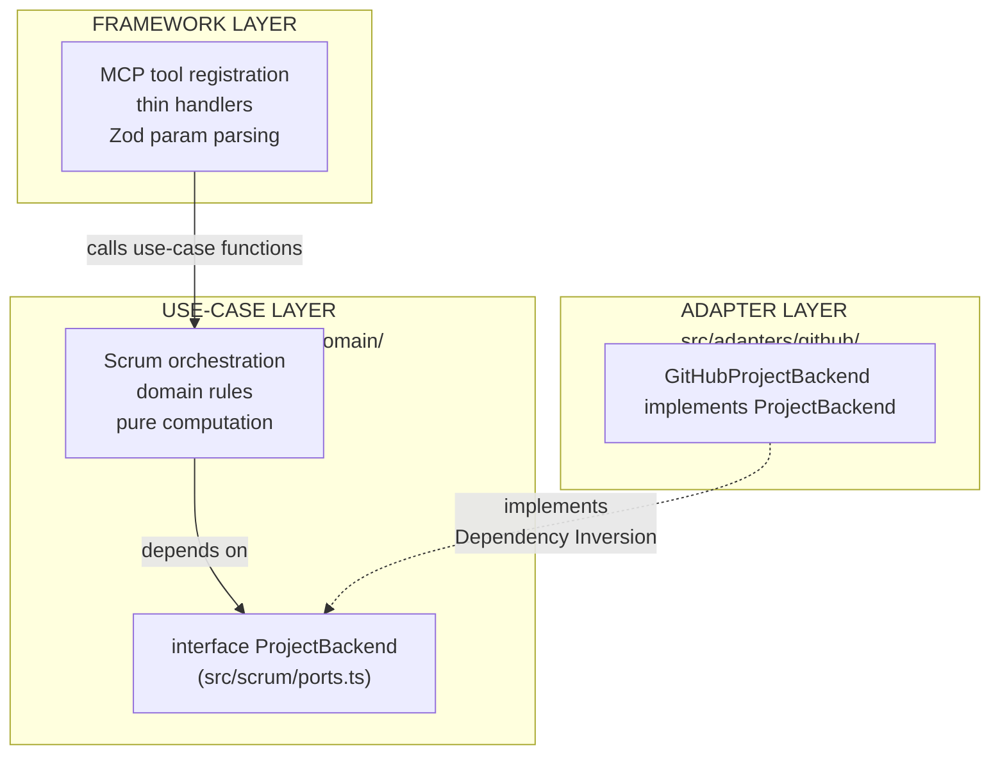

# Refactoring Plan: MCP Server Architecture

This document is the authoritative source of truth for the MCP server's architecture, known problems, and open work. Update it when a phase completes, a decision is made, or new scope is identified.

## Table of Contents

1. [Purpose and Scope](#1-purpose-and-scope)
2. [Architecture Vision](#2-architecture-vision)
3. [Stable Tool Surface](#3-stable-tool-surface)
4. [Current Implementation State](#4-current-implementation-state)
5. [Architectural Debt](#5-architectural-debt)
6. [Pending Work](#6-pending-work)
7. [Design Decisions](#7-design-decisions)
8. [Open Questions](#8-open-questions)

---

## 1. Purpose and Scope

The MCP server exposes a Scrum-vocabulary tool surface (`scrum_*`) where the server owns all ID resolution and the agent speaks only domain concepts: `StoryRef`, `SprintRef`, status names, and vocabulary values.

The architecture is designed so that swapping to a different project management platform requires adding one new adapter directory and changing one import in `index.ts` — no changes to tools, use cases, domain rules, or schemas. This property is achieved through a `ProjectBackend` interface that sits between the use-case layer and the GitHub-specific adapter. Nothing above that interface knows about GitHub; nothing below it knows about Scrum tools or MCP.

---

## 2. Architecture Vision

### Three-layer model



### Dependency Rules

| What                   | May import                                                    | Must not import                                |
| ---------------------- | ------------------------------------------------------------- | ---------------------------------------------- |
| `src/domain/`          | Nothing (std lib only)                                        | Anything else                                  |
| `src/scrum/`           | `src/domain/`, `src/types.ts`                                 | `src/adapters/`, `src/tools/`, `src/services/` |
| `src/adapters/github/` | `src/scrum/ports.ts`, `src/domain/`, `src/services/`          | `src/tools/`, `src/scrum/*.ts` (use cases)     |
| `src/tools/`           | `src/scrum/`, `src/domain/`, `src/schemas/`                   | `src/adapters/` directly                       |
| `src/index.ts`         | Everything (Main — the only place that knows all concretions) | —                                              |

---

## 3. Stable Tool Surface

### Read tools (7)

| Tool                 | Purpose                                                             |
| -------------------- | ------------------------------------------------------------------- |
| `scrum_orient`       | Current platform state + declared vocabulary — agent's entry point  |
| `scrum_get_sprint`   | Sprint snapshot(s): lightweight item listing grouped by sprint      |
| `scrum_get_backlog`  | Unsprinted active stories, filterable, with readiness summary       |
| `scrum_get_story`    | Full detail: body, comments, linked PRs, parsed acceptance criteria |
| `scrum_get_history`  | Completed-sprint snapshots in the same shape as `scrum_get_sprint`  |
| `scrum_get_burndown` | Day-by-day burndown series + ideal line for a sprint                |
| `scrum_get_template` | Fetch a project-configured ceremony artifact template               |

### Write tools (6)

| Tool                   | Purpose                                                          |
| ---------------------- | ---------------------------------------------------------------- |
| `scrum_create_story`   | Create a story and optionally place it on the board              |
| `scrum_update_story`   | Edit story content (title, body, labels, assignees, epic)        |
| `scrum_set_field`      | Single entry point for all board-field mutations                 |
| `scrum_plan_sprint`    | Bulk-assign stories to a sprint                                  |
| `scrum_log_impediment` | Create a blocking impediment linked to an affected story         |
| `scrum_add_vocabulary` | Idempotent add of a field option or label to the platform schema |

### Deprecated

| Tool             | Status                                                                                         |
| ---------------- | ---------------------------------------------------------------------------------------------- |
| `github_graphql` | Kept for diagnostic GraphQL lookups; mutations blocked; to be removed in a future cleanup pass |

---

## 4. Current Implementation State

All backend abstraction (Phase 5), tool extraction (Phase 2), write tools (Phase 3), and dead-code cleanup (Phase 4) are complete. The server is fully on the `scrum_*` surface. `index.ts` wires `registerScrumReadTools` and `registerScrumWriteTools` against `GitHubProjectBackend`.

Remaining open work lives in §5 (architectural debt) and §6 (pending feature work).

| File                             | State       | Notes                                                 |
| -------------------------------- | ----------- | ----------------------------------------------------- |
| `src/scrum/get-sprint.ts`        | 🟡 Redesign | See §6 — `"all"` param, `StoryListing` return         |
| `src/scrum/get-backlog.ts`       | 🟡 Redesign | Active-item filter pending — see §6                   |
| `src/scrum/get-history.ts`       | 🟡 Redesign | Return shape alignment with `SprintSnapshot` — see §6 |
| `src/scrum/ports.ts`             | 🟡 Redesign | Method signatures update pending — see §6             |
| `src/tools/scrum-read.ts`        | 🟡 Redesign | Tool descriptions + handlers update pending — see §6  |
| `src/adapters/github/backend.ts` | 🟡 Debt     | Class too large; smells documented in §6              |

---

## 5. Architectural Debt

These are structural problems identified by architecture audit against Clean Architecture principles. They are not crashes or functional bugs — they are constraints that will increase the cost of change as the system grows. Ordered by severity.

---

### P0 — `types.ts` mixes domain types with GitHub API wire types

`types.ts` is imported by every use case and is the closest thing the codebase has to an entity layer. It contains two incompatible categories of type:

- **Domain types** — `Story`, `SprintRef`, `StoryRef`, `BurndownResponse`, `ArtifactType`, `IterationEntry`. These are stable, platform-agnostic, and belong at the innermost layer.
- **GitHub GraphQL response shapes** — `ProjectV2Item`, `ProjectV2IssueContent`, `ProjectV2PRContent`, `ProjectV2DraftIssueContent`, `ProjectV2ItemFieldValue`, `ItemContentType`, `GraphQLResponse`. These are the raw wire format of a specific external API. They are adapter-layer details, not domain types.

The Clean Architecture Dependency Rule states that inner layers must not name outer-layer details. By colocating GitHub's connection-node shapes with `Story` and `SprintRef`, every file that imports domain types transitively acknowledges that the backing platform is GitHub and uses its specific pagination and field-value node model. If a second backend is introduced, these types become dead weight in the domain layer's primary file.

`adapters/github/raw-types.ts` already exists for this exact purpose and already holds `FieldValueNode`, `BoardFields`, `Comment`, and `LinkedPr`.

---

### P0 — Use cases are coupled to `ScrumConfigYml`, which embeds `GitHubBackendConfig`

Every use case function signature is `(backend: ProjectBackend, yml: ScrumConfigYml, params)`. `ScrumConfigYml` contains a `backends.github?: GitHubBackendConfig` field that carries GitHub auth tokens, `owner`, `project_number`, `tracked_repos`, and `field_mapping`.

Use cases do not read these fields today — but they have structural access to them, and the type system does not prevent it. More importantly, `ScrumConfigYml` is the shape of a configuration YAML file. A YAML file is an infrastructure detail. Under the Dependency Rule, infrastructure details must not be visible to the use-case layer.

The use-case layer should receive only the domain-relevant subset of configuration — sprint cadence, priority tiers, status vocabulary, Definition of Ready/Done, team roster, template paths. Platform connection details (`backends.github`) belong exclusively in the adapter that uses them. The current shape means introducing a second backend requires touching every use case signature.

---

### P1 — `ProjectBackend` violates Interface Segregation

`ProjectBackend` in `ports.ts` defines 12 methods (8 read + 4 write). Every use case receives the full interface, but each use case calls at most 1–3 methods:

- `getBacklogUseCase` calls `getBacklogStories()` only
- `getSprintUseCase` calls `getSprintStories()` only
- `getTemplateUseCase` calls `fetchRepoFile()` only
- `getBurndownUseCase` calls `getBurndownInput()` + `resolveCompletionTimestamps()`

The Interface Segregation Principle states that clients must not depend on methods they do not use. A use case forced to accept a 12-method interface cannot be tested with a minimal stub — the test double must implement the entire surface even for the 10 methods not under test. It also means any signature change anywhere in `ProjectBackend` propagates as a type-check failure to every use case, coupling unrelated concerns at compile time.

---

### P1 — `services/pagination.ts` and `services/resolver.ts` are misplaced

Both files are tightly coupled to GitHub's internals:

- `pagination.ts` constructs GitHub-specific GraphQL queries parameterized by `owner`, `ownerType`, and `projectNumber`, and its `PaginatedProjectItemFetcher` consumes raw GitHub project item node shapes.
- `resolver.ts` operates on `PVTI_` project item node IDs and maps GitHub's internal item model to `ResolvedStory`.

Both belong in `adapters/github/` alongside `backend.ts`, `mappers.ts`, `config-loader.ts`, `queries.ts`, and `raw-types.ts` — the cohesive unit of all GitHub-specific adapter code.

The `services/` folder is currently a mixed bag: the HTTP client (`github.ts`), a pure cross-cutting utility (`logger.ts`), a pure validator (`mutation-validator.ts`), and these two GitHub-specific adapter helpers. Lumping adapter internals with infrastructure services obscures the layer boundaries that the architecture diagram correctly describes.

---

### P1 — `GitHubProjectBackend` violates Single Responsibility

`GitHubProjectBackend` is ~1,160 lines and handles sprint resolution, paginated item fetching, field ID resolution, story mapping, label creation, milestone management, config state inspection, burndown completion fetching, and both GraphQL and REST execution. Each of these is a distinct reason for the class to change.

The Single Responsibility Principle defines responsibility as "a reason to change" — the class should have only one. Under the current design, a change to how burndown completion timestamps are fetched, a change to how labels are resolved, and a change to how sprint iterations are enumerated all require editing the same class. This makes changes harder to isolate, test, and review.

The class's own inline comment acknowledges this: `//todo: this class is way too massive. It should be broken down even further and separate reusable logic outside of the class`.

---

## 6. Pending Work

### 6a. Backend Code Quality — `src/adapters/github/backend.ts`

Independent of the §5 architectural debt, the class has accumulated concrete code smells:

| #   | Smell                                                      | Affected Areas                                                                              | Severity |
| --- | ---------------------------------------------------------- | ------------------------------------------------------------------------------------------- | -------- |
| 1   | Label creation logic duplicated 3+ times                   | `resolveLabelNodeIds`, `resolveOrCreateLabel`, `addLabel`, `resolveOrCreateMilestoneNodeId` | High     |
| 2   | String interpolation in GraphQL mutations (injection risk) | All `setField*` methods, `clearField`                                                       | High     |
| 3   | `createStory` is 116 lines                                 | `createStory`                                                                               | High     |
| 4   | Burndown completion logic too complex                      | `fetchAuditLogCompletions`, `fetchIssueCloseCompletions`                                    | Medium   |
| 5   | `fetchAllItems` duplicates `PaginatedProjectItemFetcher`   | `fetchAllItems`, `getCompletedSprintHistory`                                                | Medium   |
| 6   | Response types defined inline instead of in `raw-types.ts` | `GetIssueDetailsResponse`, `GetItemFieldsResponse`, `RawItem`, `RawFieldValue`              | Low      |

### 6b. Tool Surface Improvements

Three listing tools need redesign to address two problems found through agent trace analysis: invisible items (no tool surfaces items in non-current sprints with non-terminal status) and token bloat (full `Story` bodies returned in listing contexts where only title + ref is needed).

#### New shared types (add to `src/scrum/ports.ts`)

```typescript
// Lightweight listing entry — for scrum_get_sprint and scrum_get_backlog.
interface StoryListing {
  ref: { number: number; id: string };
  title: string;
  status: string | null;
  story_points: number | null;
  priority: string | null;
  sprint: string | null;
}

// Sprint + item listing — shared shape for both active and historical sprints.
interface SprintSnapshot {
  sprint: {
    name: string;
    start_date: string;
    end_date: string;
    duration_days: number;
    days_remaining: number | null; // null for completed or future sprints
  };
  items: StoryListing[];
  total_count: number;
  totals: {
    by_status: Record<string, number>;
    story_points: number;
  };
}
```

#### Active item definition

An item is **active** if: `isArchived === false` AND NOT (terminal status + assigned to a completed sprint). Items Done within the current sprint are still active. Done items in closed sprints are visible only through `scrum_get_history`. Done items with no sprint assigned are excluded from the backlog.

#### `scrum_get_sprint` changes

```typescript
// Schema: adds "all" value and optional limit
{ sprint?: SprintRef | "all", limit?: number }

// Return: single snapshot for specific ref, array for "all"
sprint = "current"|"next"|<name>  →  { sprint: SprintSnapshot }
sprint = "all"                    →  { sprints: SprintSnapshot[], total_count: number }
```

Files: `src/schemas/scrum.ts`, `src/scrum/ports.ts`, `src/scrum/get-sprint.ts`, `src/adapters/github/backend.ts`, `src/tools/scrum-read.ts`

#### `scrum_get_backlog` changes

No schema changes. Two silent backend filters added: exclude `isArchived === true`; exclude terminal-status items with no sprint. Files: `src/adapters/github/backend.ts`

#### `scrum_get_history` changes

```typescript
// Schema: adds limit
{ window?: number, limit?: number }

// Return: aligned with scrum_get_sprint("all") shape + velocity stats
{
  sprints: SprintSnapshot[],         // SprintSnapshot.totals gains committed_points, completed_points
  window: number,
  average_completed_points: number,
}
```

Files: `src/schemas/scrum.ts`, `src/scrum/ports.ts`, `src/scrum/get-history.ts`, `src/adapters/github/backend.ts`, `src/tools/scrum-read.ts`

### 6c. Unit Tests for Use Cases

No use-case unit tests exist. All current tests are integration-level. Phase 5 specified at least one unit test per use case with a stubbed `ProjectBackend`. Low priority until coverage becomes a concern.

---

## 7. Design Decisions

| Topic                                   | Decision                                                                                                                                                                                                                  |
| --------------------------------------- | ------------------------------------------------------------------------------------------------------------------------------------------------------------------------------------------------------------------------- |
| **Epic field**                          | Maps to GitHub `Milestone`. `scrum_update_story` creates the Milestone if not found.                                                                                                                                      |
| **Assignee writes**                     | Use `updateIssue` mutation only — not a separate project field.                                                                                                                                                           |
| **Sprint "next" resolution**            | The scheduled iteration immediately after the active one, by iteration order.                                                                                                                                             |
| **Sprint "all" resolution**             | Every iteration not in `config.iterations.completed` at call time.                                                                                                                                                        |
| **`github_graphql` tool**               | Kept, deprecated. Mutations blocked at the tool level.                                                                                                                                                                    |
| **Config file location**                | `.github/scrum/config.yml` in the repo — fetched via GitHub API at invocation time.                                                                                                                                       |
| **Caching**                             | No server-side config cache in v1. Each tool invocation calls `loadConfig`.                                                                                                                                               |
| **Stateless server**                    | No shared mutable state. All handlers call `loadConfig` at invocation time.                                                                                                                                               |
| **Backend decoupling mode**             | Source-level (single Deno process). `index.ts` is the only file that knows the concrete implementation.                                                                                                                   |
| **Listing tools return `StoryListing`** | Full `Story` (body, AC, comments, linked PRs) is only returned by `scrum_get_story`. All listing tools return `StoryListing`.                                                                                             |
| **`statusOptions` map shape**           | `{ displayName → optionId }` — keys are display names (what the agent passes), values are GitHub internal option IDs (what mutations need).                                                                               |
| **Active item filter**                  | Listing tools silently exclude archived items and items in terminal status belonging to completed sprints. No parameter needed; history is the only window into completed work.                                           |
| **`scrum_get_history` shape parity**    | Returns `SprintSnapshot[]` — same structure as `scrum_get_sprint("all")`. History-specific stats are additions within `SprintSnapshot.totals`.                                                                            |
| **`StoryRef` id-only model**            | `StoryRef` contains a single field: `id: string` (opaque `PVTI_...` handle). `Story.key` is display-only (human-readable issue number, null for Draft Issues). Lookup-by-key (`scrum_find_story`) is out of scope for v1. |
| **Draft Issues in `StoryRef`**          | `resolveStory` handles Draft Issues: `issueId` and `issueNumber` return `null`. Write operations requiring a real Issue throw a clear error prompting conversion.                                                         |

---

## 8. Open Questions

| Question                                                                           | Status                                                                                                       |
| ---------------------------------------------------------------------------------- | ------------------------------------------------------------------------------------------------------------ |
| Should `scrum_get_burndown` skip non-working days in the series?                   | Deferred. v1 includes all calendar days.                                                                     |
| Should the burndown ideal line use team capacity rather than a straight line?      | Deferred. Straight line is the Scrum standard.                                                               |
| Should `scrum_get_history` support iteration by date range rather than just count? | Deferred. `window` (count) is sufficient for v1.                                                             |
| Should `scrum_get_sprint("all")` include iterations with zero assigned items?      | Yes — an empty sprint is visible information. But the agent skill should account for what to do in this case |
