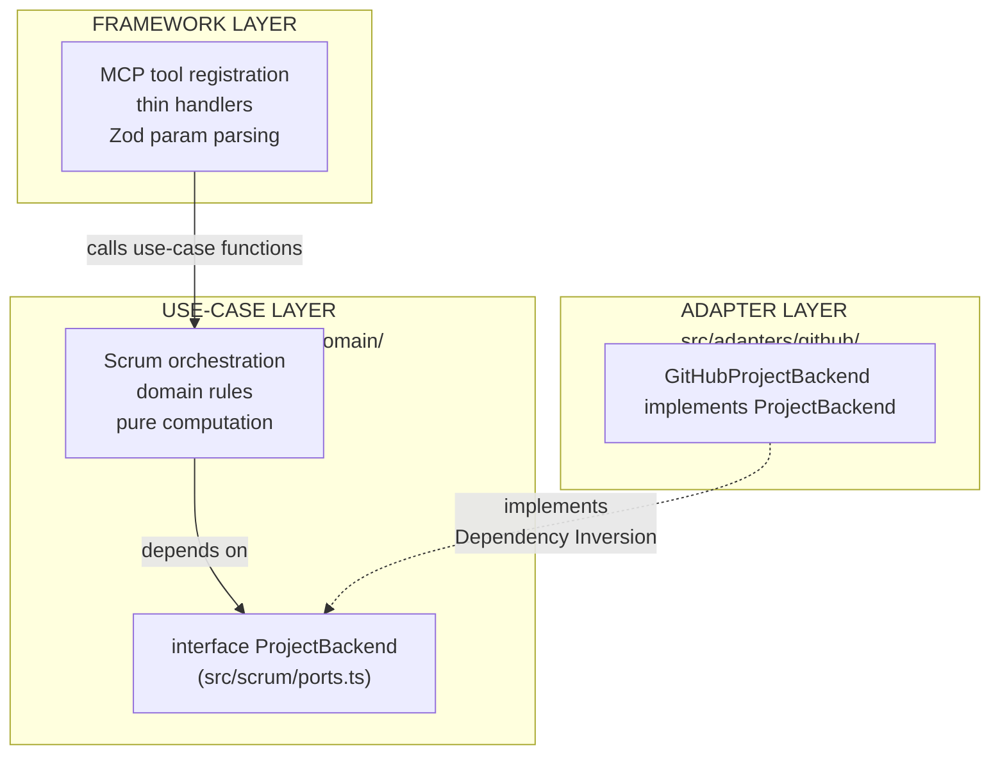

# Refactoring Plan: MCP Server Architecture

This document is the authoritative source of truth for the MCP server's architecture, known bugs, and roadmap. Update this file whenever a phase is completed, a decision is made, a bug is identified, or new scope is added.

## Table of Contents

1. [Purpose and Scope](#1-purpose-and-scope)
2. [Architecture Vision](#2-architecture-vision)
3. [Stable Tool Surface](#3-stable-tool-surface)
4. [Current Implementation State](#4-current-implementation-state)
5. [Pending Cleanup (Phase 4 / 5b)](#5-pending-cleanup-phase-4--5b)
6. [Bug Fixes — Immediate](#6-bug-fixes--immediate)
7. [Tool Surface Improvements](#7-tool-surface-improvements)
8. [ProjectBackend Port Interface](#8-projectbackend-port-interface)
9. [Migration Ledger](#9-migration-ledger)
10. [Design Decisions](#10-design-decisions)
11. [Open Questions](#11-open-questions)

---

## 1. Purpose and Scope

### Why this refactoring exists

The MCP server started as a set of GitHub-primitive tools (`github_*`) that exposed GraphQL node IDs, field IDs, and iteration IDs directly to the agent. The current refactoring replaces that surface with a Scrum-vocabulary tool surface (`scrum_*`) where the server owns all ID resolution and the agent speaks only domain concepts: `StoryRef`, `SprintRef`, status names, and vocabulary values.

### Why the architecture goes further than a rename

The Scrum tool surface (`scrum_*`) is the stable contract. The GitHub Projects v2 API is the first and current backend, but it must not be the only possible one. The architecture is designed so that swapping to a different project management platform requires adding one new directory and changing one import in `index.ts` — no changes to the tools, use cases, domain rules, or schemas.

This property is achieved through a `ProjectBackend` interface that sits between the use-case layer and the GitHub-specific adapter layer. Nothing above the interface knows about GitHub; nothing below it knows about Scrum tools or MCP.

---

## 2. Architecture Vision

### Three-layer model



### Dependency Rules

| What                   | May import                                                    | Must not import                                |
| ---------------------- | ------------------------------------------------------------- | ---------------------------------------------- |
| `src/domain/`          | Nothing (std lib only)                                        | Anything else                                  |
| `src/scrum/`           | `src/domain/`                                                 | `src/adapters/`, `src/tools/`, `src/services/` |
| `src/adapters/github/` | `src/scrum/ports.ts`, `src/domain/`, `src/services/`          | `src/tools/`, `src/scrum/*.ts` (use cases)     |
| `src/tools/`           | `src/scrum/`, `src/domain/`, `src/schemas/`                   | `src/adapters/` directly                       |
| `src/index.ts`         | Everything (Main — the only place that knows all concretions) | —                                              |

---

## 3. Stable Tool Surface

### Read tools (7)

| Tool                 | Purpose                                                             |
| -------------------- | ------------------------------------------------------------------- |
| `scrum_orient`       | Current platform state + declared vocabulary — agent's entry point  |
| `scrum_get_sprint`   | Sprint snapshot(s): lightweight item listing grouped by sprint      |
| `scrum_get_backlog`  | Unsprinted active stories, filterable, with readiness summary       |
| `scrum_get_story`    | Full detail: body, comments, linked PRs, parsed acceptance criteria |
| `scrum_get_history`  | Completed-sprint snapshots in the same shape as `scrum_get_sprint`  |
| `scrum_get_burndown` | Day-by-day burndown series + ideal line for a sprint                |
| `scrum_get_template` | Fetch a project-configured ceremony artifact template               |

### Write tools (6)

| Tool                   | Purpose                                                          |
| ---------------------- | ---------------------------------------------------------------- |
| `scrum_create_story`   | Create a story and optionally place it on the board              |
| `scrum_update_story`   | Edit story content (title, body, labels, assignees, epic)        |
| `scrum_set_field`      | Single entry point for all board-field mutations                 |
| `scrum_plan_sprint`    | Bulk-assign stories to a sprint                                  |
| `scrum_log_impediment` | Create a blocking impediment linked to an affected story         |
| `scrum_add_vocabulary` | Idempotent add of a field option or label to the platform schema |

### Deprecated

| Tool             | Status                                                                                         |
| ---------------- | ---------------------------------------------------------------------------------------------- |
| `github_graphql` | Kept for diagnostic GraphQL lookups; mutations blocked; to be removed in a future cleanup pass |

---

## 4. Current Implementation State

### Per-phase summary

| Phase | Description                                            | Status         |
| ----- | ------------------------------------------------------ | -------------- |
| 1     | Domain types, Zod schemas, `loadConfig`, resolvers     | ✅ Complete    |
| 2     | All 7 read tools extracted to use-case files           | ✅ Complete    |
| 2.5   | `rest<T>()` helper + `scrum_get_burndown`              | ✅ Complete    |
| 3     | Write tool implementations                             | ✅ Complete    |
| 5     | Backend abstraction layer (`ProjectBackend` interface) | ✅ Complete    |
| 4     | Cutover; delete legacy, cleanup types                  | 🟡 In Progress |

> **Current state:** `index.ts` wires `scrum_*` tools via `registerScrumReadTools` and `registerScrumWriteTools` with `GitHubProjectBackend`. The cutover is **complete** — the server serves the new surface. Phase 4 P1 cleanup (9 dead files) is **complete**. Remaining work: §5 P4 export removal and §5b backend code quality.

### Per-file state

| File                                      | State        | Notes                                                                                |
| ----------------------------------------- | ------------ | ------------------------------------------------------------------------------------ |
| `src/index.ts`                            | ✅ Complete  | Wires `registerScrumReadTools` + `registerScrumWriteTools`                           |
| `src/types.ts`                            | ✅ Keeper    | All types have confirmed live importers; no deletions possible (verified 2026-05-11) |
| `src/schemas/scrum.ts`                    | ✅ Complete  | All 13 schemas (7 read + 6 write)                                                    |
| `src/schemas/inputs.ts`                   | ✅ Keeper    | Only `GraphQLQuerySchema` remains (needed for deprecated `github_graphql` tool)      |
| `src/adapters/github/backend.ts`          | ✅ Complete  | `GitHubProjectBackend` implements `ProjectBackend` (all methods)                     |
| `src/adapters/github/config-loader.ts`    | ✅ Fixed     | `statusOptions` / `priorityOptions` corrected to `displayName → optionId` (2026-05-11) |
| `src/adapters/github/mappers.ts`          | ✅ Complete  | All mapper functions                                                                 |
| `src/adapters/github/queries.ts`          | ✅ Complete  | All GraphQL query strings                                                            |
| `src/adapters/github/raw-types.ts`        | ✅ Complete  | All raw response interfaces                                                          |
| `src/scrum/orient.ts`                     | ✅ Complete  | `orientUseCase()`                                                                    |
| `src/scrum/get-sprint.ts`                 | 🟡 Redesign  | Redesign pending — see §7                                                            |
| `src/scrum/get-backlog.ts`                | 🟡 Redesign  | Active-item filter pending — see §7                                                  |
| `src/scrum/get-story.ts`                  | ✅ Complete  | `getStoryUseCase()`                                                                  |
| `src/scrum/get-history.ts`                | 🟡 Redesign  | Return shape alignment pending — see §7                                              |
| `src/scrum/get-burndown.ts`               | ✅ Complete  | `getBurndownUseCase()`                                                               |
| `src/scrum/get-template.ts`               | ✅ Complete  | `getTemplateUseCase()`                                                               |
| `src/scrum/ports.ts`                      | 🟡 Redesign  | Method signatures update pending — see §7                                            |
| `src/scrum/sprint-math.ts`                | ✅ Complete  | Pure computation helpers                                                             |
| `src/domain/rules/labels.ts`              | ✅ Complete  | `classifyLabels()`                                                                   |
| `src/domain/rules/acceptance-criteria.ts` | ✅ Complete  | `parseAcceptanceCriteria()`                                                          |
| `src/domain/rules/readiness.ts`           | ✅ Complete  | `computeStoryReadiness()`, `ReadinessLevel`                                          |
| `src/services/github.ts`                  | ✅ Complete  | `graphql()`, `rest()`, `fetchRepoFile()`                                             |
| `src/services/mutation-validator.ts`      | ✅ Keeper    | `isMutationQuery()` — actively imported by `scrum-write.ts`                          |
| `src/services/pagination.ts`              | ✅ Fixed     | `raw.fieldValues?.nodes ?? []` null guard added (2026-05-11)                         |
| `src/services/resolver.ts`                | ✅ Complete  | `resolveSprint()`, `resolveStory()`                                                  |
| `src/services/logger.ts`                  | ✅ Unchanged | No changes needed                                                                    |
| `src/tools/scrum-read.ts`                 | 🟡 Redesign  | Tool descriptions + handlers update pending — see §7                                 |
| `src/tools/scrum-write.ts`                | ✅ Complete  | All 6 write tools + deprecated `github_graphql`                                      |

---

## 5. Pending Cleanup (Phase 4 / 5b)

These tasks carry over from the original plan and remain valid. They are independent of the bug fixes and improvements in §6–§7 and can be executed in any order.

### 5a. Phase 4 — Dead Code Cleanup

| Priority | File                                      | Action                                                                                                                                                                  | Status       | Last Verified |
| -------- | ----------------------------------------- | ----------------------------------------------------------------------------------------------------------------------------------------------------------------------- | ------------ | ------------- |
| P1       | `src/tools/projects.ts`                   | Delete                                                                                                                                                                  | ✅ Done      | 2026-05-11    |
| P1       | `src/tools/items.ts`                      | Delete                                                                                                                                                                  | ✅ Done      | 2026-05-11    |
| P1       | `src/tools/repository.ts`                 | Delete                                                                                                                                                                  | ✅ Done      | 2026-05-11    |
| P1       | `src/tools/projects_test.ts`              | Delete                                                                                                                                                                  | ✅ Done      | 2026-05-11    |
| P1       | `src/tools/items_test.ts`                 | Delete                                                                                                                                                                  | ✅ Done      | 2026-05-11    |
| P1       | `src/tools/repository_test.ts`            | Delete                                                                                                                                                                  | ✅ Done      | 2026-05-11    |
| P1       | `src/services/formatters.ts`              | Delete (no live importers)                                                                                                                                              | ✅ Done      | 2026-05-11    |
| P1       | `src/services/readiness.ts`               | Delete (superseded by `domain/rules/readiness.ts`)                                                                                                                      | ✅ Done      | 2026-05-11    |
| P1       | `src/services/config_test.ts`             | Delete (imports non-existent `./config.ts`)                                                                                                                             | ✅ Done      | 2026-05-11    |
| P2       | `src/schemas/inputs.ts`                   | Trimmed to `GraphQLQuerySchema` only                                                                                                                                    | ✅ Done      | 2026-05-11    |
| P3       | `src/types.ts`                            | All types confirmed live; no deletions possible                                                                                                                         | ✅ No Action | 2026-05-11    |
| P4       | `src/services/github.ts`                  | Remove `getToken`, `decodeRepoFileContent`, `enrichError`, `EnrichErrorContext`, `RepoFileResponse`, `GITHUB_API_URL`; trim `github_test.ts` (keep `formatError` tests) | ⏸️ Pending   | —             |
| P4       | `src/services/resolver.ts`                | Remove `resolveBacklogItems`, `ResolvedStory`                                                                                                                           | ⏸️ Pending   | —             |
| P4       | `src/services/mutation-validator.ts`      | Remove `export` from `MutationBlockError` (no live importers)                                                                                                           | ⏸️ Pending   | —             |
| P4       | `src/adapters/github/config-loader.ts`    | Remove `export` from `ConfigParams`, `classifyIterations` (no live importers)                                                                                           | ⏸️ Pending   | —             |
| P4       | `src/adapters/github/mappers.ts`          | `extractBoardFields` imported as `_extractBoardFields` in `backend.ts` — decision deferred                                                                              | ⏸️ Pending   | —             |
| P4       | `src/domain/rules/readiness.ts`           | Remove `export` from `computeStoryReadiness`, `ReadinessLevel` (only `computeReadinessSummary` called externally)                                                       | ⏸️ Pending   | —             |
| P4       | `src/domain/rules/labels.ts`              | Remove `export` from `STORY_TYPE_LABELS` (no live importers); keep `StoryTypeLabel`                                                                                     | ⏸️ Pending   | —             |
| P4       | `src/domain/rules/acceptance-criteria.ts` | Remove `export` from `AcceptanceCriterion` (no live importers)                                                                                                          | ⏸️ Pending   | —             |
| P4       | `src/scrum/sprint-math.ts`                | Remove `export` from `SprintWindow`, `IdealDayPoint`, `BurndownDayPoint`, `BurndownStoryInput`                                                                          | ⏸️ Pending   | —             |
| P4       | `src/services/pagination.ts`              | Remove `export` from `ItemFetchConfig` (no live importers)                                                                                                              | ⏸️ Pending   | —             |

**Dead types in `src/types.ts`** — safe to delete once P4 export removals are done: `BoardConfig`, `GhFieldBase`, `GhSingleSelectOption`, `GhSingleSelectField`, `GhIterationConfig`, `GhIterationField`, `GhField`, `GhProjectResponse`, `MergedScrumConfig`, `ResolvedScrumFields`, `SprintIteration`, `SprintStatusResult`, `BulkUpdateResult`, `SprintHistoryResponse`, `SprintSnapshot`, `SprintStory`, `SprintSummary`, `StoryReadiness`, `IterationVelocity`, `GetBacklogResult`, `ProjectsV2Connection`, `UserProjectsData`, `OrgProjectsData`, `SingleProjectData`, `ProjectItemsData`, `AddProjectItemData`, `AddDraftIssueData`, `UpdateProjectItemFieldData`, `DeleteProjectItemData`, `ArchiveProjectItemData`, `UpdateProjectData`, `LinkedContentBase`, `ProjectV2ItemFieldValue`, `DefinitionCriteria`, `PageInfo`, `ScrumField`, `StoryType`.

**Types to de-export only** (keep in file, remove `export`): `PriorityTier`, `StatusSemantics` (base types of `ScrumConfigYml`), `BurndownDayPoint`, `IdealDayPoint` (embedded in `BurndownResponse`).

> **Note on `docs/proj-diagram.md`:** The diagram's unused-export analysis has a known generator bug — it misses named imports in multi-line destructured `import type {}` blocks. Keep/delete lists above are based on direct grep verification, not the diagram.

### 5b. Backend Code Quality — `src/adapters/github/backend.ts`

The `GitHubProjectBackend` class (~1,160 lines) has accumulated technical debt independent of the §7 redesign.

#### Code Smell Inventory

| #   | Smell                                                          | Affected Methods                                                                            | Severity |
| --- | -------------------------------------------------------------- | ------------------------------------------------------------------------------------------- | -------- |
| 1   | **Label creation logic duplicated 3+ times**                   | `resolveLabelNodeIds`, `resolveOrCreateLabel`, `addLabel`, `resolveOrCreateMilestoneNodeId` | High     |
| 2   | **String interpolation in GraphQL mutations** (injection risk) | All `setField*` methods, `clearField`                                                       | High     |
| 3   | **`createStory` is 116 lines**                                 | `createStory`                                                                               | High     |
| 4   | **Burndown completion logic too complex**                      | `fetchAuditLogCompletions`, `fetchIssueCloseCompletions`                                    | Medium   |
| 5   | **`fetchAllItems` duplicates `PaginatedProjectItemFetcher`**   | `fetchAllItems`, `getCompletedSprintHistory`                                                | Medium   |
| 6   | **Response types defined inline** instead of in `raw-types.ts` | `GetIssueDetailsResponse`, `GetItemFieldsResponse`, `RawItem`, `RawFieldValue`              | Low      |

#### Planned Refactoring Tasks

| Priority | Task                                                             | Expected Outcome                            | Status     |
| -------- | ---------------------------------------------------------------- | ------------------------------------------- | ---------- |
| P1       | Extract label resolution/creation to `LabelResolver` class       | Single source of truth for label operations | ⏸️ Pending |
| P1       | Replace string interpolation with typed GraphQL variable passing | Eliminate injection risk in mutations       | ⏸️ Pending |
| P1       | Reduce `createStory` by extracting label/assignee resolution     | <60 lines, delegated to helpers             | ⏸️ Pending |
| P2       | Extract burndown completion logic to `BurndownFetcher` service   | Separated from backend concerns             | ⏸️ Pending |
| P2       | Replace `fetchAllItems` with `PaginatedProjectItemFetcher`       | Consistent pagination                       | ⏸️ Pending |
| P3       | Move inline response types to `raw-types.ts`                     | Cleaner backend file                        | ⏸️ Pending |

### 5c. Unit Tests for Use Cases

Phase 5 specified: "Write at least one new unit test per use case that stubs `ProjectBackend` with a fake implementation." No such tests exist. Existing test files are integration-level.

**Recommendation:** Low priority. Add if test coverage becomes a concern.

---

## 6. Bug Fixes — Immediate

These are confirmed bugs with known root causes. Both fixes have been applied (2026-05-11).

### Bug 1 — `scrum_set_field` always fails for status and priority mutations ✅ Fixed

**Symptom:** `Error: Status option "Done" not found in vocabulary. Run scrum_add_vocabulary to add it first.` — even when "Done" is confirmed present in `scrum_orient` output.

**Root cause:** `src/adapters/github/config-loader.ts`, lines 453 and 461.

`statusOptions` is built as `{ canonicalKey → displayName }` (e.g., `{ "done" → "Done" }`), but `setFieldStatus` in `backend.ts` does `this.config.statusOptions[value]` where `value` is the display name the agent passes (e.g., `"Done"`). The lookup `statusOptions["Done"]` returns `undefined`. The correct shape is `{ displayName → optionId }` — the agent speaks display names, GitHub mutations need the internal option ID.

```typescript
// src/adapters/github/config-loader.ts

// WRONG (current)
if (optionId) statusOptions[canonicalKey] = displayName; // line 453
if (optionId) priorityOptions[canonicalKey] = displayName; // line 461

// CORRECT (fix)
if (optionId) statusOptions[displayName] = optionId; // line 453
if (optionId) priorityOptions[displayName] = optionId; // line 461
```

**Files:** `src/adapters/github/config-loader.ts` (2 lines).

### Bug 2 — `scrum_get_backlog` crashes on items with no field values ✅ Fixed

**Symptom:** `Error: Cannot read properties of undefined (reading 'nodes')` on every `scrum_get_backlog` call.

**Root cause:** `src/services/pagination.ts`, line 337.

`raw.fieldValues.nodes.map(...)` assumes `fieldValues` is always an object. GitHub's API returns `fieldValues: null` (not `{ nodes: [] }`) for project items that have never had any field value set. The backlog query fetches `fieldValues(first: 1)` — the minimal sprint-only payload — so unset items hit this path regularly.

```typescript
// src/services/pagination.ts

// WRONG (current)
nodes: raw.fieldValues.nodes.map((fv) => ({ ... })),  // line 337

// CORRECT (fix)
nodes: (raw.fieldValues?.nodes ?? []).map((fv) => ({ ... })),
```

**Files:** `src/services/pagination.ts` (1 line).

---

## 7. Tool Surface Improvements

These changes redesign three listing tools (`scrum_get_sprint`, `scrum_get_backlog`, `scrum_get_history`) to address two problems identified through agent trace analysis:

1. **Invisible items.** Items assigned to past or future sprints with non-terminal status have no tool that surfaces them. The agent has no way to get a full board overview in a single call.
2. **Token bloat.** Listing tools return full `Story` bodies. A sprint with 10 items wastes context on 10 full issue bodies when the agent only needs titles and refs to orient itself. Full detail should only come from `scrum_get_story`.

### 7a. New shared types

These types replace `Story` in listing contexts. `Story` (full body, comments, AC) remains correct for `scrum_get_story` — that tool's purpose is unchanged.

```typescript
// Lightweight listing entry — returned by scrum_get_sprint and scrum_get_backlog.
// Agent calls scrum_get_story when it needs body, AC, comments, or linked PRs.
interface StoryListing {
  ref: { number: number; id: string }; // both forms always present after a read
  title: string;
  status: string | null; // display name from vocabulary (e.g. "In Progress")
  story_points: number | null;
  priority: string | null; // display name from vocabulary (e.g. "Must")
  sprint: string | null; // sprint name, null if unassigned
}

// Sprint + its item listing. The unit returned by both scrum_get_sprint and
// scrum_get_history — the agent uses one mental model for sprint data regardless
// of whether it is looking at active or historical sprints.
interface SprintSnapshot {
  sprint: {
    name: string;
    start_date: string;
    end_date: string;
    duration_days: number;
    days_remaining: number | null; // null for completed or future sprints
  };
  items: StoryListing[];
  total_count: number; // total matching items before limit is applied
  totals: {
    by_status: Record<string, number>; // display name → count, e.g. { "Done": 7 }
    story_points: number; // sum across all items in snapshot
  };
}
```

### 7b. Active item definition

All listing tools (`scrum_get_sprint`, `scrum_get_backlog`) filter silently — no parameter required. An item is **active** if:

- `isArchived === false`, AND
- It is not in terminal status (`done`) while assigned to a **completed** sprint.

Items that are Done within the _current_ sprint are still active — they are part of this sprint's record. Only items that are Done and belong to a sprint that has already closed are excluded; those are visible exclusively through `scrum_get_history`.

For `scrum_get_backlog` specifically, an additional filter applies: items with terminal status and no sprint assigned (orphaned Done items) are excluded.

### 7c. `scrum_get_sprint` redesign

#### Input schema changes

```typescript
// src/schemas/scrum.ts — GetSprintSchema

// Before
{ sprint?: SprintRef }   // "current" | "next" | null | string

// After
{
  sprint?: SprintRef | "all",   // adds "all"; default remains "current"
  limit?: number,               // max items per SprintSnapshot; no default (returns all)
}
```

`"all"` returns every non-completed iteration (current + next + any other scheduled future sprints). This is the primary mechanism for a full board overview.

#### Return shape

```typescript
// sprint = "current" | "next" | <explicit name>
{
  sprint: SprintSnapshot
}

// sprint = "all"
{
  sprints: SprintSnapshot[],
  total_count: number           // sum of items across all snapshots
}
```

#### Files to change

| File                             | Change                                                                                                                                                         |
| -------------------------------- | -------------------------------------------------------------------------------------------------------------------------------------------------------------- |
| `src/schemas/scrum.ts`           | Update `GetSprintSchema`: add `"all"` literal to sprint union, add `limit`                                                                                     |
| `src/scrum/ports.ts`             | Update `getSprintStories` signature: `sprint: SprintRef \| "all"`, `limit?: number`; update return type to `SprintSnapshot \| SprintSnapshot[]`                |
| `src/scrum/get-sprint.ts`        | Handle `"all"` branch; build `SprintSnapshot` return; pass `limit` through; apply active-item filter                                                           |
| `src/adapters/github/backend.ts` | `getSprintStories`: for `"all"`, collect all non-completed iteration IDs and fetch items for each; build `StoryListing[]` (no full body); apply archive filter |
| `src/tools/scrum-read.ts`        | Update tool description and handler to reflect new input/output shape                                                                                          |

### 7d. `scrum_get_backlog` active-item filter

No schema changes. Two new backend-level filters are added silently:

1. Exclude items where `isArchived === true`.
2. Exclude items where status display name equals the terminal status (`done` → display name) AND sprint is null. These are orphaned completed items that were never cleaned up.

The readiness summary, search/filter params, and overall return shape are unchanged.

#### Files to change

| File                             | Change                                                                                                 |
| -------------------------------- | ------------------------------------------------------------------------------------------------------ |
| `src/scrum/ports.ts`             | No signature change needed                                                                             |
| `src/adapters/github/backend.ts` | `getBacklogStories`: add `.filter(item => !item.isArchived)` and terminal-status filter before mapping |

### 7e. `scrum_get_history` return shape alignment

`scrum_get_history` is redesigned to return the same `SprintSnapshot` structure as `scrum_get_sprint`. The agent uses one mental model for sprint data — whether active or historical. Velocity statistics are added as a top-level wrapper.

#### Input schema change

```typescript
// src/schemas/scrum.ts — GetHistorySchema

// Before
{ window?: number }

// After
{
  window?: number,    // sprints to include; default 5
  limit?: number      // max items per SprintSnapshot; no default
}
```

#### Return shape

```typescript
{
  sprints: SprintSnapshot[],    // same shape as scrum_get_sprint("all")
  window: number,               // number of sprints returned
  average_completed_points: number,   // mean of completed_points across window
  // SprintSnapshot.totals gets two history-only additions:
  //   committed_points: number  — total SP entering the sprint
  //   completed_points: number  — total SP reaching terminal status by end
}
```

#### Files to change

| File                             | Change                                                                                                              |
| -------------------------------- | ------------------------------------------------------------------------------------------------------------------- |
| `src/schemas/scrum.ts`           | Update `GetHistorySchema`: add `limit`                                                                              |
| `src/scrum/ports.ts`             | Update `getCompletedSprintHistory` return type to `SprintSnapshot[]` (extended)                                     |
| `src/scrum/get-history.ts`       | Rebuild return using `SprintSnapshot`; add `average_completed_points`                                               |
| `src/adapters/github/backend.ts` | `getCompletedSprintHistory`: return `SprintSnapshot[]`; add `committed_points`, `completed_points` to each `totals` |
| `src/tools/scrum-read.ts`        | Update tool description and handler                                                                                 |

---

## 8. ProjectBackend Port Interface

The interface lives in [`src/scrum/ports.ts`](src/scrum/ports.ts).

### Current methods (pre-§7)

- **Read:** `getPlatformState`, `getSprintStories`, `getBacklogStories`, `getStoryDetail`, `getCompletedSprintHistory`, `getBurndownInput`, `resolveCompletionTimestamps`, `fetchRepoFile`
- **Write:** `createStory`, `updateStory`, `setField`, `addComment`, `addVocabulary`
- **Boundary types:** `SprintInfo`, `PlatformState`, `StoryDetail`, `SprintHistoryEntry`, `BurndownInput`, `CompletionMap`, `CreateStoryInput`, `StoryUpdates`, `VocabularyKind`

### Signature changes required by §7

```typescript
// Before
getSprintStories(sprintRef: SprintRef): Promise<Story[]>
getCompletedSprintHistory(window: number): Promise<SprintHistoryEntry[]>

// After
getSprintStories(
  sprintRef: SprintRef | "all",
  limit?: number
): Promise<SprintSnapshot | SprintSnapshot[]>

getCompletedSprintHistory(
  window: number,
  limit?: number
): Promise<SprintSnapshot[]>   // extended SprintSnapshot with committed/completed_points
```

`StoryListing` and `SprintSnapshot` move to `ports.ts` as boundary types (they cross the use-case / adapter boundary).

---

## 9. Migration Ledger

| Symbol                              | Current location        | Target location                        | Status     |
| ----------------------------------- | ----------------------- | -------------------------------------- | ---------- |
| `extractBoardFields()`              | `scrum-read.ts`         | `adapters/github/mappers.ts`           | ✅ Done    |
| `buildStoryFromRaw()`               | `scrum-read.ts`         | `adapters/github/mappers.ts`           | ✅ Done    |
| `buildEnrichedStory()`              | `scrum-read.ts`         | `adapters/github/mappers.ts`           | ✅ Done    |
| `buildCommentList()`                | `scrum-read.ts`         | `adapters/github/mappers.ts`           | ✅ Done    |
| `buildLinkedPrList()`               | `scrum-read.ts`         | `adapters/github/mappers.ts`           | ✅ Done    |
| `buildBurndownStoryInput()`         | `scrum-read.ts`         | `adapters/github/mappers.ts`           | ✅ Done    |
| All GraphQL query strings           | `scrum-read.ts`         | `adapters/github/queries.ts`           | ✅ Done    |
| All raw response interfaces         | `scrum-read.ts`         | `adapters/github/raw-types.ts`         | ✅ Done    |
| `loadConfig()`, `RuntimeConfig`     | `services/config.ts`    | `adapters/github/config-loader.ts`     | ✅ Done    |
| `resolveSprint()`, `resolveStory()` | `services/resolver.ts`  | `adapters/github/backend.ts` (private) | ✅ Done    |
| `getBootstrapConfig()`              | `scrum-read.ts`         | `adapters/github/config-loader.ts`     | ✅ Done    |
| `groupStoriesByStatus()` etc.       | `scrum-read.ts`         | `scrum/sprint-math.ts`                 | ✅ Done    |
| `classifyLabels()`                  | `scrum-read.ts`         | `domain/rules/labels.ts`               | ✅ Done    |
| `parseAcceptanceCriteria()`         | `scrum-read.ts`         | `domain/rules/acceptance-criteria.ts`  | ✅ Done    |
| `computeStoryReadiness()`           | `services/readiness.ts` | `domain/rules/readiness.ts`            | ✅ Done    |
| `_classifyReadiness()`              | `scrum-read.ts`         | **Deleted**                            | ✅ Done    |
| `ReadinessLevel` type               | —                       | `domain/rules/readiness.ts`            | ✅ Done    |
| Handler bodies                      | `scrum-read.ts`         | `scrum/*.ts` (one per read tool)       | ✅ Done    |
| `StoryReadiness` interface          | `types.ts`              | **Pending removal**                    | ⏸️ Phase 4 |
| `BoardConfig`, `GhFieldBase`, etc.  | `types.ts`              | **Pending removal**                    | ⏸️ Phase 4 |
| `StoryListing`, `SprintSnapshot`    | — (new)                 | `scrum/ports.ts`                       | ⏸️ §7      |

---

## 10. Design Decisions

| Topic                                   | Decision                                                                                                                                                                                                                                                           |
| --------------------------------------- | ------------------------------------------------------------------------------------------------------------------------------------------------------------------------------------------------------------------------------------------------------------------ |
| **Epic field**                          | Maps to GitHub `Milestone` type. `scrum_update_story` creates the Milestone if not found.                                                                                                                                                                          |
| **Assignee writes**                     | Use `updateIssue` mutation only — not a separate project field.                                                                                                                                                                                                    |
| **Sprint "next" resolution**            | "Next" = the scheduled iteration immediately after the active one, by iteration order.                                                                                                                                                                             |
| **Sprint "all" resolution**             | "All" = every iteration that is not in `config.iterations.completed` at call time.                                                                                                                                                                                 |
| **Sync script**                         | Retired. All information retrievable via GraphQL API.                                                                                                                                                                                                              |
| **`github_graphql` tool**               | Kept, deprecated. Mutations blocked at the tool level.                                                                                                                                                                                                             |
| **Config file location**                | `.github/scrum/config.yml` in the repo — fetched via GitHub API at invocation time.                                                                                                                                                                                |
| **Caching**                             | No server-side config cache in v1. Each tool invocation calls `loadConfig`.                                                                                                                                                                                        |
| **Stateless server**                    | All tool handlers call `loadConfig` at invocation time. No shared mutable state.                                                                                                                                                                                   |
| **Backend decoupling mode**             | Source-level (single Deno process). `index.ts` is the only file that knows which concrete implementation is wired.                                                                                                                                                 |
| **`ReadinessLevel` type**               | `type ReadinessLevel = "ready" \| "partially_ready" \| "not_ready"` in `domain/rules/readiness.ts`. Replaced `StoryReadiness` interface.                                                                                                                           |
| **Listing tools return `StoryListing`** | Full `Story` (body, AC, comments, linked PRs) is only returned by `scrum_get_story`. All listing tools return `StoryListing` — title + ref + status + points + priority. Agent calls `scrum_get_story` on demand.                                                  |
| **`statusOptions` map shape**           | `{ displayName → optionId }` — keys are display names (what the agent passes), values are GitHub internal option IDs (what mutations need). Bug fix in §6 corrects the previous inversion.                                                                         |
| **Active item filter**                  | Listing tools silently exclude archived items and items in terminal status belonging to completed sprints. No parameter needed; history is the only window into completed work.                                                                                    |
| **`scrum_get_history` shape parity**    | Returns `SprintSnapshot[]` — the same structure as `scrum_get_sprint("all")`. Agent uses one mental model for sprint data. History-specific stats (`committed_points`, `completed_points`) are additions within `SprintSnapshot.totals`, not a different envelope. |
| **`StoryRef` id-only model**            | `StoryRef` contains a single field: `id: string` (the opaque project-item handle, `PVTI_...`). Removed `number: number` (GitHub-specific) and `itemId` (redundant alias). Every read tool now returns `Story.ref.id`; every write tool consumes it. `Story.key: string \| null` is a display-only field (the human-readable issue number, or null for Draft Issues). Semantic lookup-by-key (`scrum_find_story`) is explicitly **out of scope for v1** — it would be a dedicated tool when needed. |
| **Draft Issues in `StoryRef`**          | `resolveStory` handles `DraftIssue` items: `issueId` and `issueNumber` return `null`. Write operations that require a real Issue (addComment, updateStory, setField assignee) throw a clear user-facing error prompting the user to convert the draft first. `buildStoryFromRaw` now includes Draft Issues in listing results with `key: null`. |

---

## 11. Open Questions

| Question                                                                                    | Status                                                           |
| ------------------------------------------------------------------------------------------- | ---------------------------------------------------------------- |
| Does `projects_v2_item.field_value_updated` exist in the GitHub Enterprise Cloud Audit Log? | Unverified against live schema                                   |
| Should `scrum_get_burndown` skip non-working days in the series?                            | Deferred. v1 includes all calendar days.                         |
| Should the burndown ideal line use team capacity rather than a straight line?               | Deferred. Straight line is the Scrum standard.                   |
| Should `scrum_get_history` support iteration by date range rather than just count?          | Deferred. `window` (count) is sufficient for v1.                 |
| Should `scrum_get_sprint("all")` include iterations with zero assigned items?               | Unresolved. Likely yes — an empty sprint is visible information. |
