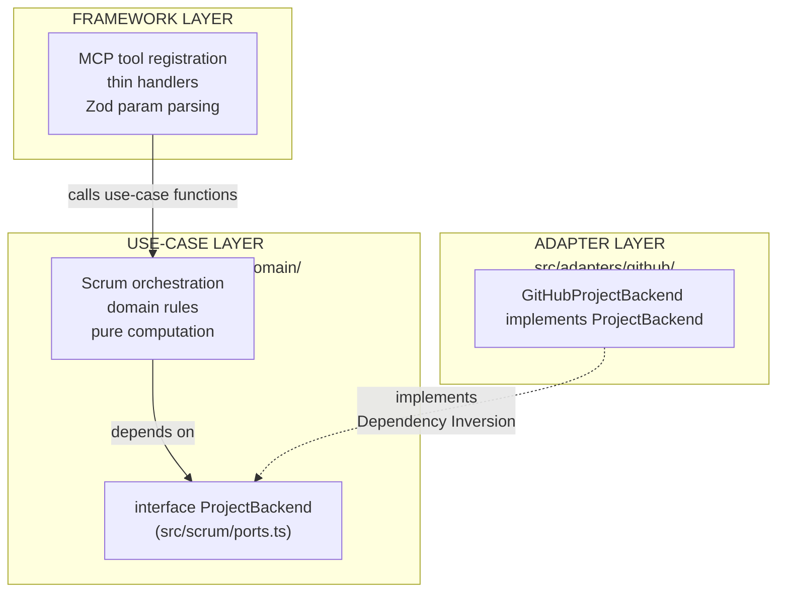

# Refactoring Plan: MCP Server Architecture

This document is the authoritative source of truth for the MCP server's architecture, known problems, and open work. Update it when a phase completes, a decision is made, or new scope is identified.

## Table of Contents

1. [Purpose and Scope](#1-purpose-and-scope)
2. [Architecture Vision](#2-architecture-vision)
3. [Stable Tool Surface](#3-stable-tool-surface)
4. [Current Implementation State](#4-current-implementation-state)
5. [Architectural Debt](#5-architectural-debt)
6. [Pending Work](#6-pending-work)
7. [Design Decisions](#7-design-decisions)
8. [Open Questions](#8-open-questions)
9. [Agent Layer Fixes](#6h-agent-layer-fixes) ← subsection of §6

---

## 1. Purpose and Scope

The MCP server exposes a Scrum-vocabulary tool surface (`scrum_*`) where the server owns all ID resolution and the agent speaks only domain concepts: `StoryRef`, `SprintRef`, status names, and vocabulary values.

The architecture is designed so that swapping to a different project management platform requires adding one new adapter directory and changing one import in `index.ts` — no changes to tools, use cases, domain rules, or schemas. This property is achieved through a `ProjectBackend` interface that sits between the use-case layer and the GitHub-specific adapter. Nothing above that interface knows about GitHub; nothing below it knows about Scrum tools or MCP.

---

## 2. Architecture Vision

### Three-layer model



### Dependency Rules

| What                   | May import                                                    | Must not import                                |
| ---------------------- | ------------------------------------------------------------- | ---------------------------------------------- |
| `src/domain/`          | Nothing (std lib only)                                        | Anything else                                  |
| `src/scrum/`           | `src/domain/`, `src/types.ts`                                 | `src/adapters/`, `src/tools/`, `src/services/` |
| `src/adapters/github/` | `src/scrum/ports.ts`, `src/domain/`, `src/services/`          | `src/tools/`, `src/scrum/*.ts` (use cases)     |
| `src/tools/`           | `src/scrum/`, `src/domain/`, `src/schemas/`                   | `src/adapters/` directly                       |
| `src/index.ts`         | Everything (Main — the only place that knows all concretions) | —                                              |

---

## 3. Stable Tool Surface

### Read tools (7)

| Tool                 | Purpose                                                             |
| -------------------- | ------------------------------------------------------------------- |
| `scrum_orient`       | Current platform state + declared vocabulary — agent's entry point  |
| `scrum_get_sprint`   | Sprint snapshot(s): lightweight item listing grouped by sprint      |
| `scrum_get_backlog`  | Unsprinted active stories, filterable, with readiness summary       |
| `scrum_get_story`    | Full detail: body, comments, linked PRs, parsed acceptance criteria |
| `scrum_get_history`  | Completed-sprint snapshots in the same shape as `scrum_get_sprint`  |
| `scrum_get_burndown` | Day-by-day burndown series + ideal line for a sprint                |
| `scrum_get_template` | Fetch a project-configured ceremony artifact template               |

### Write tools (7)

| Tool                      | Purpose                                                                                    |
| ------------------------- | ------------------------------------------------------------------------------------------ |
| `scrum_create_story`      | Create a story and optionally place it on the board                                        |
| `scrum_update_story`      | Edit story content (title, body, labels, assignees, epic)                                  |
| `scrum_set_field`         | Single entry point for all board-field mutations                                           |
| `scrum_plan_sprint`       | Bulk-assign stories to a sprint                                                            |
| `scrum_log_impediment`    | Create an impediment; optionally link it to an affected story or sprint (or log as orphan) |
| `scrum_update_impediment` | Advance an impediment lifecycle: `open → in_progress → resolved`                           |
| `scrum_add_vocabulary`    | Idempotent add of a field option or label to the platform schema                           |

### Deprecated

| Tool             | Status                                                                                         |
| ---------------- | ---------------------------------------------------------------------------------------------- |
| `github_graphql` | Kept for diagnostic GraphQL lookups; mutations blocked; to be removed in a future cleanup pass |

---

## 4. Current Implementation State

All backend abstraction (Phase 5), tool extraction (Phase 2), write tools (Phase 3), dead-code cleanup (Phase 4), type restructure (Phases A/B/C), and bug fixes (Phase D) are complete. The server is fully on the `scrum_*` surface. `index.ts` wires `registerScrumReadTools` and `registerScrumWriteTools` against `GitHubProjectBackend`.

**Phase E (Code Quality) complete:** `isTerminalStatus` is extracted to `src/domain/rules/status.ts`. `get-backlog.ts` and `get-history.ts` both import it. All Phase E bug fixes (E.1–E.6) are done.

**Phase F (Architecture) in progress — Task F.1 partially complete:** Six internal service files have been created in `src/adapters/github/internal/`. However, `backend.ts` has NOT been updated to delegate to them. The private method bodies remain in `backend.ts` unchanged — the split was additive, not a replacement. `backend.ts` is now longer than before the split started. `BurndownCalculator` and `SprintHistoryService` have structural defects. See §5 and §6d for details.

| File                                              | State       | Notes                                                                                                    |
| ------------------------------------------------- | ----------- | -------------------------------------------------------------------------------------------------------- |
| `src/adapters/github/backend.ts`                  | 🔴 Broken   | ~1,224 lines; internal services created but not wired; duplicate private methods remain — see §5, §6d    |
| `src/adapters/github/internal/burndown-calculator.ts` | 🔴 Broken   | Calls non-existent `this.fetchAllItems()` / `this.resolveSprint()`; uses `any` throughout — see §6d |
| `src/adapters/github/internal/field-value-mutator.ts` | 🟡 Partial  | Functional but uses string interpolation in GraphQL mutations — see §6d                             |
| `src/adapters/github/internal/label-resolver.ts`  | ✅ Complete  | Functional                                                                                               |
| `src/adapters/github/internal/user-milestone-resolver.ts` | 🟡 Partial | Duplicates `fetchRepoNodeId` already on `LabelResolver` — see §6d                               |
| `src/adapters/github/internal/vocabulary-manager.ts` | ✅ Complete | Functional; delegates label ops to `LabelResolver`                                                   |
| `src/adapters/github/internal/sprint-history-service.ts` | 🔴 Missing | Not created yet — see §6d                                                                         |
| `src/tools/scrum-write.ts`                        | ✅ Complete  | `scrum_log_impediment`, `scrum_update_impediment` implemented                                            |

---

## 5. Architectural Debt

These are structural problems identified by architecture audit against Clean Architecture principles. They are not crashes or functional bugs — they are constraints that will increase the cost of change as the system grows. Ordered by severity.

---

### P1 — `ProjectBackend` violates Interface Segregation

`ProjectBackend` in `ports.ts` defines 12 methods (8 read + 4 write). Every use case receives the full interface, but each use case calls at most 1–3 methods:

- `getBacklogUseCase` calls `getBacklogStories()` only
- `getSprintUseCase` calls `getSprintStories()` only
- `getTemplateUseCase` calls `fetchRepoFile()` only
- `getBurndownUseCase` calls `getBurndownInput()` + `resolveCompletionTimestamps()`

The Interface Segregation Principle states that clients must not depend on methods they do not use. A use case forced to accept a 12-method interface cannot be tested with a minimal stub — the test double must implement the entire surface even for the 10 methods not under test. It also means any signature change anywhere in `ProjectBackend` propagates as a type-check failure to every use case, coupling unrelated concerns at compile time.

---

### P1 — `GitHubProjectBackend` violates Single Responsibility (split in progress)

`GitHubProjectBackend` has grown to ~1,224 lines because the F.1 split was executed additively: six service files were created in `adapters/github/internal/` but the original private method bodies in `backend.ts` were never removed. The class now has duplicate implementations — both the new service and the old private method exist simultaneously. This is worse than the unsplit state because it creates two sources of truth.

**Current broken state:**
- `LabelResolver`, `VocabularyManager`, and `UserMilestoneResolver` are complete, but `backend.ts` still has its own copies of `resolveOrCreateLabel`, `resolveLabelNodeIds`, `addLabel`, `hashToColor`, `resolveUserNodeId`, `resolveUserNodeIds`, `resolveOrCreateMilestoneNodeId`, `addStatusOption`, `addPriorityOption`, `addSingleSelectOption`.
- `FieldValueMutator` exists but `backend.ts` still has `setFieldStatus`, `setFieldSprint`, `setFieldStoryPoints`, `setFieldPriority`, `setFieldAssignee`.
- `BurndownCalculator` was created but cannot compile without major correction (see §6d).
- `SprintHistoryService` was never created.
- `GitHubProjectBackend`'s constructor has not been updated to accept injected services.

**Target:** F.1 completion reduces `backend.ts` to ≤ 250 lines. All private method bodies are removed; every internal operation is a one-line delegation to an injected service. See §6d for the complete plan.

---

### P1 — `github.ts` conflates unrelated concerns (partially resolved)

`GitHubApiError` and `enrichError()` have been extracted: errors now live in `src/adapters/github/errors.ts` and `src/services/error-enrichment.ts` respectively. `src/services/github.ts` is now ~338 lines.

The remaining concern is HTTP transport and the GitHub Contents API still bundled together. `scrum-write.ts` also imports `graphql` directly from `services/github.ts` — only used by the deprecated `github_graphql` tool. Remaining splits are tracked in §6e.

---

## 6. Pending Work

### 6a. Backend Code Quality — `src/adapters/github/backend.ts`

**Why:** `backend.ts` has grown to ~1,224 lines due to the additive (not replacement) nature of the F.1 split. The remaining quality issues below are all resolved when F.1 is properly completed.

1. **Label creation duplicated** — ✅ Resolved by extracting to `LabelResolver`. The duplicate private methods in `backend.ts` will be removed when F.1 wires the injected service.

2. **String interpolation in GraphQL mutations** — 🔴 `FieldValueMutator.setFieldStatus/Sprint/StoryPoints/Priority` still embed `"${itemId}"`, `"${fieldId}"`, `"${optionId}"` directly in mutation strings. Replace all five with fully parameterized variables before completing F.1. See §6d for the required pattern.

3. **`createStory` is ~119 lines** — handles six distinct concerns. After F.1, `createStory` in the Facade should delegate label and user resolution to `LabelResolver` and `UserMilestoneResolver`, reducing it to the GraphQL mutation calls and orchestration logic only.

4. **`getOrphanImpediments()` and `getSprintImpediments()`** — ✅ Implemented (Phase D complete).

5. **`fetchAllItems` duplication** — `backend.ts` has one copy using `PaginatedProjectItemFetcher`. `BurndownCalculator` incorrectly reimplements its own version using a wrong query (`repository.items` does not exist on GitHub Projects v2; items live on the project node). After F.1, `BurndownCalculator` must use `PaginatedProjectItemFetcher` from `internal/pagination.ts`.

### 6b. Tool Surface Improvements

#### `getOrphanImpediments()` — backend implementation

**Why:** The `get-backlog` use case calls `backend.getOrphanImpediments()`, which is declared on `ProjectBackend` but returns `[]` in `GitHubProjectBackend`. Every `scrum_get_backlog` response has an empty `orphan_impediments` field, making project-level impediments invisible to the agent.

**Changes:** Implement `getOrphanImpediments()` in `backend.ts`: query issues labeled `"impediment"` across `tracked_repos`; filter out any issue whose comment bodies contain a `PVTI_` project item ID (those are already linked to a story or sprint); project each remaining issue to `ImpedimentListing`.

**Files:** `src/adapters/github/backend.ts`

**Acceptance criteria:**

- Unlinked impediment issues appear in `scrum_get_backlog.orphan_impediments`
- Issues with a `PVTI_` reference in any comment are excluded
- An empty array (not an error) is returned when no orphans exist

---

#### `SprintSnapshot.impediments` — enrichment (Phase 7)

**Why:** `scrum_get_sprint` and `scrum_get_history` both return `SprintSnapshot` with `impediments: []` hardcoded. Sprint-level impediment context is invisible to the agent when reviewing sprint state or history.

**Changes:** Add `getSprintImpediments(sprint: SprintRef): Promise<ImpedimentListing[]>` to `ProjectBackend`. Implement in `backend.ts`: query issues labeled `"impediment"` whose bodies or comments reference the sprint's iteration name. In `get-sprint.ts` and `get-history.ts`, replace the hardcoded `[]` with a call to this method.

**Files:** `src/scrum/ports.ts`, `src/scrum/get-sprint.ts`, `src/scrum/get-history.ts`, `src/adapters/github/backend.ts`

**Acceptance criteria:**

- `SprintSnapshot.impediments` contains all impediments associated with the sprint
- An empty array is returned when no impediments exist for the sprint

#### `scrum_log_impediment` — optional `affects` and priority fix

**Why:** `affects` is a required `StoryRef` — a project-level impediment not attributable to a single story cannot be logged. The handler also hardcodes `"Must"` as the default priority, violating the vocabulary rule: display labels must always be derived from config, never hardcoded.

**Changes:**

- Make `affects` optional in `LogImpedimentSchema`: `affects?: { story?: StoryRef; sprint?: SprintRef }`. At most one sub-field. Omitting logs a project-level orphan.
- Update return shape: `{ impediment: ImpedimentListing; affects: { story: StoryRef } | { sprint: SprintRef } | null }`
- In `registerScrumWriteTools`, rename `_scrumConfig` → `scrumConfig` and derive the p0 display label from `scrumConfig` at runtime.

**Files:** `src/schemas/scrum.ts`, `src/tools/scrum-write.ts`

**Acceptance criteria:**

- `scrum_log_impediment` succeeds with no `affects` field; return includes `affects: null`
- Default priority resolves to the p0 label from `config.yml`, not a hardcoded string

---

#### `scrum_update_impediment` — new write tool

**Why:** The impediment lifecycle (`open → in_progress → resolved`) is declared in §3 and §7 but no tool exists to advance it. The agent can log impediments but never close them.

**Changes:** Add `scrum_update_impediment`:

```typescript
// Arguments
{ ref: ImpedimentRef; status: "open" | "in_progress" | "resolved"; resolution_notes?: string }
// Returns: ImpedimentListing
```

Add `UpdateImpedimentSchema` to schemas. Create `src/scrum/update-impediment.ts` use case. Add `updateImpediment(ref, status, notes?): Promise<ImpedimentListing>` to `ProjectBackend`. Implement in `backend.ts` (update label + append resolution comment). Register in `scrum-write.ts`.

**Files:** `src/schemas/scrum.ts`, `src/scrum/update-impediment.ts` (new), `src/scrum/ports.ts`, `src/adapters/github/backend.ts`, `src/tools/scrum-write.ts`

**Acceptance criteria:**

- `scrum_update_impediment` with `status: "resolved"` updates the label and posts `resolution_notes` as a comment
- Returns `ImpedimentListing` with the updated status
- Tool appears in `scrum_orient`'s tool surface listing

---

#### `scrum_orient` — response shape correctness

**Why:** The agent's session-start rules extract `vocabulary.status`, `vocabulary.priority`, `vocabulary.dor`, `vocabulary.dod`, `vocabulary.team`, `vocabulary.autonomy`, and `platform_state.missing_options` from `scrum_orient`. The actual response uses `declared_vocabulary` as the top-level key, `definition_of_ready`/`definition_of_done` as field names, two nested `missing_options` arrays under each field, and omits `autonomy`. Every agent session starts with silent field-path mismatches that break vocabulary-dependent logic.

**Changes:**

- Rename `declared_vocabulary` → `vocabulary` in `OrientResult` and `orientUseCase`
- Rename `vocabulary.definition_of_ready` → `vocabulary.dor` and `vocabulary.definition_of_done` → `vocabulary.dod`
- Add `vocabulary.autonomy: { require_confirmation_above_n_items: number }` sourced from `scrumConfig.project.agent.autonomy`
- Flatten `platform_state.fields.status.missing_options` and `platform_state.fields.priority.missing_options` into a single `platform_state.missing_options: string[]`

**Files:** `src/scrum/orient.ts`

**Acceptance criteria:**

- `scrum_orient` returns `vocabulary` (not `declared_vocabulary`) at the top level
- `vocabulary.dor`, `vocabulary.dod`, `vocabulary.autonomy` are present with correct values from `config.yml`
- `platform_state.missing_options` is a flat string array merging all field gaps

---

#### `scrum_update_story` — comment field

**Why:** The conduct rule `prefer_comments_over_body_edits` instructs the agent to use `scrum_update_story` with a `comment` field for ceremony notes and progress updates. `UpdateStorySchema` has no `comment` field, making the rule unenforceable. `backend.addComment()` already exists on `ProjectBackend`.

**Changes:**

- Add optional `comment: string` to `UpdateStorySchema`
- Handler calls `backend.addComment(ref, comment)` after content updates when `comment` is provided
- `comment` and content fields (`title`, `body`, etc.) can be combined in one call

**Files:** `src/schemas/scrum.ts`, `src/tools/scrum-write.ts`

**Acceptance criteria:**

- `scrum_update_story` with only `{ ref, comment }` posts a comment and leaves all other fields unchanged
- Return is the updated `Story` object (same as existing behavior)
- `UpdateStorySchema` remains `.strict()`

---

#### `scrum_plan_sprint` — sprint goal

**Why:** The sprint planning ceremony calls `scrum_plan_sprint` with the agreed sprint goal. `PlanSprintSchema` has no `goal` field, so the goal is silently dropped — the sprint starts with no documented goal, which is a core ceremony failure.

**Changes:**

- Add optional `goal: string` to `PlanSprintSchema`
- Echo `goal` in the response alongside `sprint`, `assigned`, `skipped`
- The server echoes the goal back; the agent records it in the sprint planning ceremony artifact (see §6h.4)

**Files:** `src/schemas/scrum.ts`, `src/tools/scrum-write.ts`

**Acceptance criteria:**

- `scrum_plan_sprint` accepts an optional `goal` and echoes it in the response
- Existing calls without `goal` remain valid (no breaking change)

---

### 6c. Unit Tests for Use Cases

One test file exists (`src/scrum/get-backlog.test.ts`) but coverage is minimal. No other use-case unit tests exist. Phase 5 specified at least one unit test per use case with a stubbed `ProjectBackend`. Low priority until coverage becomes a concern.

---

### 6d. Backend Split — `GitHubProjectBackend` as Facade (Task F.1)

**Architectural pattern: Facade + Constructor Injection (DIP)**

`GitHubProjectBackend` implements `ProjectBackend` and acts as a **Facade**: a thin coordinator that receives six focused internal services via constructor and delegates every operation to the appropriate service. The Facade itself contains no business logic and no GraphQL queries — only dispatch. This satisfies the Single Responsibility Principle (one reason to change: the delegation wiring), the Open/Closed Principle (add a service without modifying the Facade), and the Dependency Inversion Principle (Facade depends on service instances, not on their concrete logic).

**Current state (as of 2026-05-14):** Services were created additively — `backend.ts` was not updated to wire them. See §5 and §4 for the status of each service file.

---

#### TypeScript design requirements

**1. `GitHubClient` typed interface — replace `typeof graphql` anti-pattern**

Every internal service currently holds `gh: { graphql: typeof graphql; rest: typeof rest }`, binding them to the concrete function reference. Replace with a named interface injected into every service that needs it:

```typescript
// src/adapters/github/internal/http-client.ts — add this export
export interface GitHubClient {
  graphql<T>(query: string, variables?: Record<string, unknown>): Promise<T>;
  rest<T>(path: string, options?: RequestInit & { params?: Record<string, string> }): Promise<RestResponse<T>>;
}
```

Each internal service that currently declares `gh: { graphql: typeof graphql }` or `gh: typeof graphql` should be updated to `gh: GitHubClient`. This decouples the services from the specific HTTP implementation, enables mock injection in tests, and removes the `typeof` indirection.

**2. Parameterized GraphQL mutations — required in `FieldValueMutator`**

`FieldValueMutator` embeds item IDs, field IDs, and option IDs directly in mutation strings via template literals. This is an injection risk and prevents proper type-safety. All five mutation methods must use named GraphQL variables:

```typescript
// WRONG — string interpolation, no type safety:
await this.gh(`mutation { updateProjectV2ItemFieldValue(input: { itemId: "${itemId}" ... }) }`);

// CORRECT — parameterized variables, typed response:
await this.gh.graphql<{ updateProjectV2ItemFieldValue: { item: { id: string } } }>(
  `mutation SetFieldStatus($projectId: ID!, $itemId: ID!, $fieldId: ID!, $optionId: String!) {
     updateProjectV2ItemFieldValue(input: {
       projectId: $projectId, itemId: $itemId, fieldId: $fieldId,
       value: { singleSelectOptionId: $optionId }
     }) { item { id } }
  }`,
  { projectId: this.config.projectId, itemId, fieldId, optionId },
);
```

Apply this pattern to `setFieldStatus`, `setFieldSprint`, `setFieldStoryPoints`, `setFieldPriority`, `setFieldAssignee`, and `clearField`.

**3. `BurndownCalculator` must be rewritten from scratch**

The current `burndown-calculator.ts` cannot compile and contains several fundamental defects:

- Calls `this.resolveSprint()` — `resolveSprint` is a standalone function from `resolver.ts`, not a class method
- Calls `this.fetchAllItems()` and `this.buildBurndownStoryInput()` — neither exists on `BurndownCalculator`; the former is a re-implementation of `PaginatedProjectItemFetcher`, the latter is already `buildBurndownStoryInput` in `mappers.ts`
- The GraphQL query in the private `fetchAllItems` queries `repository.items` which does not exist — GitHub Projects v2 items are on the project node, not the repository node
- Uses `item: any`, `v: any` throughout — loses all type safety at the critical mapping boundary

**Correct implementation approach:** `BurndownCalculator` should accept a `PaginatedProjectItemFetcher` instance (or factory) via constructor, and call `buildBurndownStoryInput` imported from `mappers.ts`. No re-implementation of pagination:

```typescript
import { PaginatedProjectItemFetcher } from "./pagination.ts";
import { buildBurndownStoryInput } from "../mappers.ts";
import { resolveSprint } from "./resolver.ts";       // standalone function, not a method

export class BurndownCalculator {
  constructor(
    private readonly config: RuntimeConfig,
    private readonly gh: GitHubClient,
    private readonly owner: string,
    private readonly repo: string,
  ) {}

  async getBurndownInput(sprint: SprintRef): Promise<BurndownInput> {
    const iterationId = resolveSprint(sprint, this.config);   // call the function
    // ... use PaginatedProjectItemFetcher + buildBurndownStoryInput from mappers.ts
  }
}
```

**4. `SprintHistoryService` — new file required**

`src/adapters/github/internal/sprint-history-service.ts` does not exist. It should extract `getCompletedSprintHistory` from `backend.ts`. Like `BurndownCalculator`, it uses `PaginatedProjectItemFetcher` internally and `buildBurndownStoryInput` from `mappers.ts`.

**5. `fetchRepoNodeId` duplication — consolidate in `LabelResolver`**

Both `LabelResolver` and `UserMilestoneResolver` independently implement `fetchRepoNodeId`. `UserMilestoneResolver.resolveOrCreateMilestoneNodeId` calls `this.fetchRepoNodeId()`, which is private to `UserMilestoneResolver`. Accept `LabelResolver` as a constructor dependency of `UserMilestoneResolver` and call `labelResolver.fetchRepoNodeId()` instead:

```typescript
export class UserMilestoneResolver {
  constructor(
    private readonly gh: GitHubClient,
    private readonly owner: string,
    private readonly repo: string,
    private readonly labelResolver: LabelResolver,  // inject for fetchRepoNodeId
  ) {}
}
```

This removes the duplicate and establishes `LabelResolver` as the canonical source of the repository node ID.

---

#### Facade constructor and delegation pattern

```typescript
export class GitHubProjectBackend implements ProjectBackend {
  private readonly labelResolver: LabelResolver;
  private readonly userMilestoneResolver: UserMilestoneResolver;
  private readonly fieldValueMutator: FieldValueMutator;
  private readonly burndownCalculator: BurndownCalculator;
  private readonly sprintHistoryService: SprintHistoryService;
  private readonly vocabularyManager: VocabularyManager;

  constructor(
    private readonly config: RuntimeConfig,
    private readonly gh: GitHubClient,
    private readonly owner: string,
    private readonly ownerType: "user" | "org",
    private readonly repo: string,
  ) {
    this.labelResolver = new LabelResolver(config, gh, owner, repo);
    this.userMilestoneResolver = new UserMilestoneResolver(gh, owner, repo, this.labelResolver);
    this.fieldValueMutator = new FieldValueMutator(config, gh, this.userMilestoneResolver);
    this.burndownCalculator = new BurndownCalculator(config, gh, owner, repo);
    this.sprintHistoryService = new SprintHistoryService(config, gh);
    this.vocabularyManager = new VocabularyManager(config, gh, this.labelResolver, owner, repo);
  }

  // Every public method is a one-line delegation — no logic in the Facade itself
  getBurndownInput(sprint: SprintRef): Promise<BurndownInput> {
    return this.burndownCalculator.getBurndownInput(sprint);
  }

  addVocabulary(kind: VocabularyKind, value: string): Promise<{ created: boolean }> {
    return this.vocabularyManager.addVocabulary(kind, value);
  }
  // ... etc.
}
```

The Facade retains only: constructor wiring, `fetchAllItems` (used by several methods that stay on the Facade — `getSprintStories`, `getBacklogStories`, `getBurndownInput` delegation), and the `toSprintInfo` / `resolveTerminalStatusDisplayName` helpers that are pure config-to-type converters with no external calls.

---

#### Service status after F.1

| Service                  | File                              | Action Required                                                                 |
| ------------------------ | --------------------------------- | ------------------------------------------------------------------------------- |
| `LabelResolver`          | `internal/label-resolver.ts`      | ✅ Functional — wire into Facade constructor; remove duplicate in `backend.ts`  |
| `FieldValueMutator`      | `internal/field-value-mutator.ts` | 🔴 Fix all string-interpolated mutations → parameterized variables              |
| `BurndownCalculator`     | `internal/burndown-calculator.ts` | 🔴 Rewrite from scratch — use `PaginatedProjectItemFetcher` + `mappers.ts`      |
| `SprintHistoryService`   | `internal/sprint-history-service.ts` | 🔴 Create — extract `getCompletedSprintHistory` from `backend.ts`            |
| `VocabularyManager`      | `internal/vocabulary-manager.ts`  | ✅ Functional — wire into Facade constructor; remove duplicate in `backend.ts`  |
| `UserMilestoneResolver`  | `internal/user-milestone-resolver.ts` | 🟡 Accept `LabelResolver` dependency; remove private `fetchRepoNodeId`     |

**Deliverable:** `backend.ts` ≤ 250 lines. Zero duplicate private methods. `BurndownCalculator` and `SprintHistoryService` compile and pass `deno check`. All `FieldValueMutator` mutations use GraphQL variables. All services accept `GitHubClient` by interface.

### 6e. `github.ts` Split — Remaining Extractions

**Why:** `GitHubApiError` and `enrichError()` have already been extracted (`adapters/github/errors.ts` and `services/error-enrichment.ts`). `services/github.ts` (~338 lines) still bundles HTTP transport and the GitHub Contents API in one file. `scrum-write.ts` also imports `graphql` directly from it — only for the deprecated `github_graphql` tool — leaving a `tools → services/github.ts` dependency path that bypasses `ProjectBackend`.

**Remaining splits:**

| Extract from `services/github.ts`                           | Target                           |
| ----------------------------------------------------------- | -------------------------------- |
| `graphql()`, `rest()` — HTTP transport                      | `adapters/github/http-client.ts` |
| `fetchRepoFile()`, `decodeRepoFileContent()` — Contents API | `adapters/github/contents.ts`    |

Remove the `graphql` import from `scrum-write.ts` when the deprecated `github_graphql` tool is removed or redirected to `http-client.ts`.

**Acceptance criteria:**

- No file outside `adapters/github/` imports from `services/github.ts`
- `services/github.ts` can be deleted without breaking any import

### 6f. `ProjectBackend` Port Pollution

**Problem:** The `ProjectBackend` interface (the clean port) leaks GitHub-specific details:

- `fetchRepoFile(path)` — GitHub Contents API method on a platform-agnostic interface
- `VocabularyKind = "status_option" \| "priority_option" \| "label"` — GitHub terminology
- `addVocabulary(kind, value)` — GitHub-specific vocabulary management

**Impact:** A Jira or Azure DevOps backend must implement `fetchRepoFile()`, understand GitHub label terminology, and implement vocabulary management that may not map to the target platform.

**Fix:** Remove `fetchRepoFile()` from `ProjectBackend` (handle in tool handlers directly). Generalize `VocabularyKind` or move `addVocabulary` to an extended `ProjectWriter` interface. Keep `setField()` field names — they are domain-neutral scrum concepts.


### 6h. Agent Layer Fixes

Changes to `.roo/rules-scrum-master/*.xml` and `.roo/skills/scrum-master/SKILL.md`. No TypeScript files are touched.

**Execution dependency:** 6h.2 must follow the §6b `scrum_orient` response fix. 6h.1 (item 4) must follow the §6b `scrum_update_story` comment field addition. All other items are independent.

---

#### 6h.1 Wrong tool references in ceremony rules

**Why:** Four places in the rules reference tools for operations those tools do not support. The agent will fail silently or perform an unintended action.

**Changes:**

`4_transitions.xml` — board_catchup Phase 2 and stale_recovery Phase 4:

- "Mark as Done via `scrum_update_story`" → call `scrum_set_field` with `field: "status"` and value from `vocabulary.status.done`. Status is a board field; `scrum_update_story` handles content only.

`3_sm_stance.xml` — `dod_lowered_for_deadline` dysfunction signal:

- "Create a tech-debt story immediately via `scrum_update_story`" → `scrum_create_story` with `type: "tech_debt"`. `scrum_update_story` edits existing stories; creating a new one requires `scrum_create_story`.

`1_workflow.xml` — sprint_planning ceremony Step 5:

- Remove "capacity" from the `scrum_plan_sprint` call description. Capacity is agent-computed from `scrum_get_sprint`; it is not a tool parameter.
- State that the agreed `goal` is passed as the `goal` parameter.

`2_conduct.xml` — `prefer_comments_over_body_edits` rule:

- Clarify that this works because `scrum_update_story` now accepts a `comment` field (§6b). No logic change — confirm the mechanism so the rule is self-explanatory.

**Acceptance criteria:**

- No rule in any file references `scrum_update_story` for a status change
- No rule references `scrum_update_story` for creating a new story
- Sprint planning Step 5 mentions `goal` as a parameter and does not mention `capacity` as one

---

#### 6h.2 `scrum_orient` field paths in `1_workflow.xml` Step 1

**Why:** After the §6b `scrum_orient` response fix, Step 1's extraction list must match the actual response shape or every session will fail to extract the vocabulary it depends on.

**Changes (`1_workflow.xml` Step 1 only):**

- `vocabulary.status`, `vocabulary.priority`, `vocabulary.dor`, `vocabulary.dod`, `vocabulary.team` are now correct (the rename makes them match)
- Replace `config.autonomy` → `vocabulary.autonomy.require_confirmation_above_n_items`
- Replace the `missing_options` reference with `platform_state.missing_options` (the flat merged array)

**Acceptance criteria:**

- Every field path listed in Step 1 exists as a key in a real `scrum_orient` response
- No reference to `declared_vocabulary`, `config.autonomy`, or nested `fields.*.missing_options` remains in Step 1

---

#### 6h.3 Impediment de-duplication guidance

**Why:** The session-start health check (`1_workflow.xml` Step 3) tells the agent to call `scrum_log_impediment` for every blocked item with no logged impediment. There is no guidance on how to determine "no logged impediment," causing the agent to create duplicate impediment stories on every session start.

**Change (`1_workflow.xml` Step 3):**

- Before the `scrum_log_impediment` call, add: "Call `scrum_get_backlog` with `labels: ['impediment']` first. Only call `scrum_log_impediment` for blocked stories that have no matching open entry in that result."

**Acceptance criteria:**

- The health check step describes the de-duplication check before logging
- Duplicate impediment creation across sessions is not possible by following the rule

---

#### 6h.4 Ceremony template delivery path

**Why:** Every ceremony playbook ends with "Call `scrum_get_template` when a ceremony record is needed" but none say what to do with the returned markdown. `config.yml` declares `ceremony_records.backend: github_discussions` and `ceremony_records.discussion_category: Ceremonies`, but no rule instructs the agent to post there. Ceremony documents are fetched and discarded.

**Change (`1_workflow.xml` — add final step to each ceremony's `tool_sequence`):**

- "Fill in the blank sections with session data. Post the completed document to GitHub Discussions under the `ceremony_records.discussion_category` from `config.yml` using `gh discussion create` via `execute_command`."

**Acceptance criteria:**

- Each of the five ceremony playbooks (sprint_planning, daily_standup, backlog_refinement, sprint_review, retrospective) has an explicit final step naming the delivery target and command

---

#### 6h.5 SKILL.md — tool-grounded coaching pattern

**Why:** The routing table correctly points to reference files for coaching topics, but the reference files contain illustrative example data (sample velocity figures, hypothetical dysfunction patterns). When `scrum_*` tools are available, the agent may reason from these examples instead of actual board data, undermining coaching quality.

**Change (`.roo/skills/scrum-master/SKILL.md` — add a section before the routing table):**

- Title: "When `scrum_*` tools are available"
- Rule: For any coaching response that references project metrics, call the relevant read tool first. Reference files provide frameworks, never data.
  - Velocity, completion trends, retro history → `scrum_get_history` first
  - Burndown or sprint progress → `scrum_get_burndown` / `scrum_get_sprint` first
  - Current sprint state → `scrum_get_sprint` first
- Keep the section to ≤8 lines.

**Acceptance criteria:**

- Section is present and precedes the routing table
- It does not duplicate any routing table entry

---

## 7. Design Decisions

| Topic                                         | Decision                                                                                                                                                                                                                                                                                   |
| --------------------------------------------- | ------------------------------------------------------------------------------------------------------------------------------------------------------------------------------------------------------------------------------------------------------------------------------------------ |
| **Epic field**                                | Maps to GitHub `Milestone`. `scrum_update_story` creates the Milestone if not found.                                                                                                                                                                                                       |
| **Assignee writes**                           | Use `updateIssue` mutation only — not a separate project field.                                                                                                                                                                                                                            |
| **Sprint "next" resolution**                  | The scheduled iteration immediately after the active one, by iteration order.                                                                                                                                                                                                              |
| **Sprint "all" resolution**                   | Every iteration not in `config.iterations.completed` at call time.                                                                                                                                                                                                                         |
| **`github_graphql` tool**                     | Kept, deprecated. Mutations blocked at the tool level.                                                                                                                                                                                                                                     |
| **Config file location**                      | `.github/scrum/config.yml` in the repo — fetched via GitHub API at invocation time.                                                                                                                                                                                                        |
| **Caching**                                   | No server-side config cache in v1. Each tool invocation calls `loadConfig`.                                                                                                                                                                                                                |
| **Stateless server**                          | No shared mutable state. All handlers call `loadConfig` at invocation time.                                                                                                                                                                                                                |
| **Backend decoupling mode**                   | Source-level (single Deno process). `index.ts` is the only file that knows the concrete implementation.                                                                                                                                                                                    |
| **Listing tools return `StoryListing`**       | Full `Story` (body, AC, comments, linked PRs) is only returned by `scrum_get_story`. All listing tools return `StoryListing`.                                                                                                                                                              |
| **`statusOptions` map shape**                 | `{ displayName → optionId }` — keys are display names (what the agent passes), values are GitHub internal option IDs (what mutations need).                                                                                                                                                |
| **Active item filter**                        | Listing tools silently exclude archived items and items in terminal status belonging to completed sprints. No parameter needed; history is the only window into completed work.                                                                                                            |
| **`scrum_get_history` shape parity**          | Returns `SprintSnapshot[]` — same structure as `scrum_get_sprint("all")`. History-specific stats are additions within `SprintSnapshot.totals`.                                                                                                                                             |
| **`StoryRef` id-only model**                  | `StoryRef` contains a single field: `id: string` (opaque `PVTI_...` handle). `Story.key` is display-only (human-readable issue number, null for Draft Issues). Lookup-by-key (`scrum_find_story`) is out of scope for v1.                                                                  |
| **Draft Issues in `StoryRef`**                | `resolveStory` handles Draft Issues: `issueId` and `issueNumber` return `null`. Write operations requiring a real Issue throw a clear error prompting conversion.                                                                                                                          |
| **Impediment as first-class artifact**        | `impediment` is NOT a `StoryType`. Impediments are a separate artifact with `ImpedimentRef`, `ImpedimentListing`, and a 3-state lifecycle (`open → in_progress → resolved`). Surface: `scrum_get_story.impediments`, `SprintSnapshot.impediments`, `scrum_get_backlog.orphan_impediments`. |
| **`scrum_log_impediment.affects`**            | Optional `{ story?: StoryRef; sprint?: SprintRef }`. At most one sub-field. Omit to log a project-level orphan. Bidirectional cross-reference created atomically.                                                                                                                          |
| **Impediment lifecycle writes**               | Dedicated `scrum_update_impediment` tool handles `open → in_progress → resolved`. `scrum_set_field` is not overloaded — story and impediment artifacts remain distinct at the tool surface.                                                                                                |
| **`ScrumConfig` (was `ScrumConfigYml`)**      | Renamed in Phase C. All use-case signatures receive `scrumConfig: ScrumConfig`. Adapter accesses GitHub fields via `as GitHubBackendConfig`; use-case layer uses inline `type GhDisplay` shape cast.                                                                                       |
| **`src/types.ts` and `raw-types.ts` removal** | Tombstoned in Phases B/C. Physical `rm` required locally. All types live at their architectural layer.                                                                                                                                                                                     |
| **Sprint goal storage**                       | `scrum_plan_sprint` echoes the `goal` string in its response but does not persist it to GitHub. The agent records the sprint goal in the sprint planning ceremony artifact (GitHub Discussions via `execute_command`). Server-side goal persistence is out of scope for v1.                |

---

## 8. Open Questions

| Question                                                                           | Status                                                                                                       |
| ---------------------------------------------------------------------------------- | ------------------------------------------------------------------------------------------------------------ |
| Should `scrum_get_burndown` skip non-working days in the series?                   | Deferred. v1 includes all calendar days.                                                                     |
| Should the burndown ideal line use team capacity rather than a straight line?      | Deferred. Straight line is the Scrum standard.                                                               |
| Should `scrum_get_history` support iteration by date range rather than just count? | Deferred. `window` (count) is sufficient for v1.                                                             |
| Should `scrum_get_sprint("all")` include iterations with zero assigned items?      | Yes — an empty sprint is visible information. But the agent skill should account for what to do in this case |
