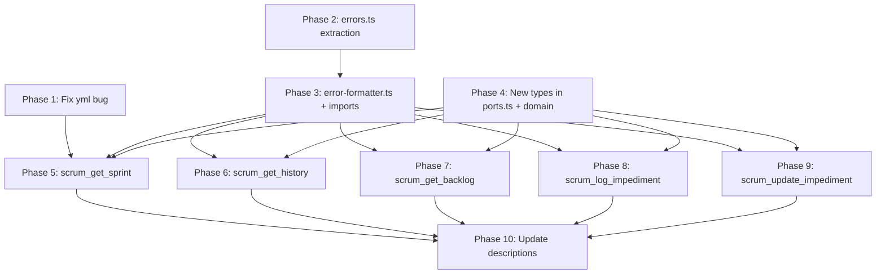

# Refactoring Implementation Plan

## Overview

This plan addresses all items in [`tasks/REFACTORING.md`](tasks/REFACTORING.md) organized into logical phases. Each phase is independently verifiable and follows clean code principles: Single Responsibility, Dependency Inversion, Interface Segregation, and the Dependency Rule.

## Clean Code Principles Applied

| Principle                 | Application                                                                           |
| ------------------------- | ------------------------------------------------------------------------------------- |
| **Single Responsibility** | Each file handles one concern — error formatting, sprint logic, backlog logic         |
| **Dependency Inversion**  | Use cases depend on `ProjectBackend` interface, never GitHub directly                 |
| **Interface Segregation** | New types (`StoryListing`, `ImpedimentListing`, `SprintSnapshot`) are narrow, not fat |
| **Dependency Rule**       | `tools → scrum/ → domain/` only; no outer-to-inner leaks                              |
| **Tell, Don't Ask**       | Handlers delegate to use cases; use cases delegate to backend port                    |
| **Fail Early**            | yml bug fix and validation guards prevent silent runtime failures                     |

---

## Phase 1: Fix yml Bug (Critical — Silent Runtime Failure) FINISHED

**Goal:** Fix 5 sites where `yml` is passed instead of `scrumConfig` in [`src/tools/scrum-read.ts`](src/tools/scrum-read.ts).

**Why first:** This is a live bug — `yml` is undefined in those handler scopes, causing silent runtime failures for `scrum_get_history`, `scrum_get_backlog`, `scrum_get_sprint`, `scrum_get_burndown`, and `scrum_get_template`.

### Changes

**File:** [`src/tools/scrum-read.ts`](src/tools/scrum-read.ts)

| Line | Current                                                      | Fix                                                                  |
| ---- | ------------------------------------------------------------ | -------------------------------------------------------------------- |
| 95   | `getHistoryUseCase(backend, yml, params.window)`             | `getHistoryUseCase(backend, scrumConfig, params.window)`             |
| 133  | `getBacklogUseCase(backend, yml, params)`                    | `getBacklogUseCase(backend, scrumConfig, params)`                    |
| 167  | `getSprintUseCase(backend, yml, params.sprint ?? "current")` | `getSprintUseCase(backend, scrumConfig, params.sprint ?? "current")` |
| 236  | `getBurndownUseCase(backend, yml, params)`                   | `getBurndownUseCase(backend, scrumConfig, params)`                   |
| 273  | `getTemplateUseCase(backend, yml, params.artifact_type)`     | `getTemplateUseCase(backend, scrumConfig, params.artifact_type)`     |

**Verification:** Start the server and call each affected tool. Confirm each returns a valid response instead of a `TypeError: yml is not defined` crash.

---

## Phase 2: Extract GitHubApiError (Prerequisite for Phase 3) FINISHED

**Goal:** Move `GitHubApiError` out of `src/services/github.ts` into its own file at `src/adapters/github/errors.ts`, so `error-formatter.ts` (Phase 3) can import just the error class without a transitive dependency on the full HTTP transport file.

**Why this is a separate phase:** `error-formatter.ts` needs to re-export `GitHubApiError` for handlers that do `instanceof` checks. If it imports directly from `services/github.ts`, we introduce a `tools → github service` dependency — the exact coupling we are trying to remove. Creating `adapters/github/errors.ts` first gives Phase 3 a clean, minimal import path.

### Step 2a — Create `src/adapters/github/errors.ts`

This is a direct extraction of lines 22–31 from `src/services/github.ts`:

```typescript
// src/adapters/github/errors.ts
// GitHubApiError — the canonical exception thrown by all GitHub HTTP helpers.
// Lives in adapters/github/ because it represents GitHub-specific failure modes.

export class GitHubApiError extends Error {
  constructor(
    message: string,
    public readonly statusCode?: number,
    public readonly graphqlErrors?: string[],
  ) {
    super(message);
    this.name = "GitHubApiError";
  }
}
```

### Step 2b — Update `src/services/github.ts`

| Action     | Detail                                                                                  |
| ---------- | --------------------------------------------------------------------------------------- |
| Remove     | The `GitHubApiError` class definition (lines 22–31)                                     |
| Add import | `import { GitHubApiError } from "../adapters/github/errors.ts";` at the top of the file |

All existing callers of `GitHubApiError` inside `github.ts` continue to work through the new import. No other changes to `github.ts` in this phase.

**Verification:** `deno check src/services/github.ts src/adapters/github/errors.ts` passes with no errors.

---

## Phase 3: Create error-formatter.ts and Update Tool Imports FINISHED

**Goal:** Extract error-formatting utilities from `src/services/github.ts` into `src/tools/error-formatter.ts`. Update both tool files to import from the new location. Fix the `graphql` import in `scrum-write.ts` at the same time.

**Why:** Tool handlers currently import `enrichError` directly from `services/github.ts`, creating a `tools → GitHub service` dependency that bypasses `ProjectBackend`. Error formatting is a tool-layer concern — it converts raw errors into human-readable MCP response strings. Moving it to `tools/` makes the dependency direction explicit.

### Step 3a — Create `src/tools/error-formatter.ts`

Move the following items from `src/services/github.ts` into this new file:

- `EnrichErrorContext` interface (currently lines 293–299)
- `REQUIRED_PERMISSION` map (currently lines 302–311) — keep **unexported** (`const`, not `export const`)
- `formatError` function (currently lines 270–278) — keep **unexported**
- `resolveHint` function (currently lines 319–392) — keep **unexported**
- `enrichError` function (currently lines 399–406) — **export this one only**

Also add a re-export of `GitHubApiError` for handlers that need `instanceof` checks:

```typescript
// src/tools/error-formatter.ts
// Error-formatting utilities for MCP tool handlers.
// Only enrichError() is exported. All internal helpers are private to this file.

export { GitHubApiError } from "../adapters/github/errors.ts";

interface EnrichErrorContext {
  operation?: string;
}

// PRIVATE — do not export
const REQUIRED_PERMISSION: Record<string, string> = {
  /* ... copy from services/github.ts ... */
};

// PRIVATE — do not export
const formatError = (err: unknown): string => {
  /* ... copy from services/github.ts ... */
};

// PRIVATE — do not export
const resolveHint = (
  err: GitHubApiError,
  ctx: EnrichErrorContext,
): string | null => {
  /* ... copy from services/github.ts ... */
};

// PUBLIC — the only export besides GitHubApiError re-export
export const enrichError = (
  err: unknown,
  ctx: EnrichErrorContext = {},
): string => {
  /* ... copy from services/github.ts ... */
};
```

**Important:** `formatError`, `REQUIRED_PERMISSION`, and `resolveHint` are private implementation details of `enrichError`. They are NOT exported. The previous plan incorrectly listed them as exports — they are `const` (unexported) in the current codebase and must remain so.

### Step 3b — Remove moved code from `src/services/github.ts`

Delete from `src/services/github.ts`:

- `EnrichErrorContext` interface
- `REQUIRED_PERMISSION` map
- `formatError` function
- `resolveHint` function
- `enrichError` function (and its `export` keyword)

After this deletion, `github.ts` retains: `getToken`, `extractOpName`, `graphql`, `rest`, `RestResponse`, `RepoFileResponse`, `decodeRepoFileContent`, and `fetchRepoFile`. The `GitHubApiError` import added in Phase 2b is already in place.

### Step 3c — Update `src/tools/scrum-read.ts` (line 21)

| Before                                                 | After                                                 |
| ------------------------------------------------------ | ----------------------------------------------------- |
| `import { enrichError } from "../services/github.ts";` | `import { enrichError } from "./error-formatter.ts";` |

### Step 3d — Update `src/tools/scrum-write.ts` (line 31)

Line 31 currently imports both `enrichError` and `graphql` from `services/github.ts` in one statement. Split into two:

```typescript
// Replace line 31:
// import { enrichError, graphql } from "../services/github.ts";

// With these two lines:
import { enrichError } from "./error-formatter.ts";
import { graphql } from "../services/github.ts"; // graphql stays here until the §6e http-client split
```

**Note:** When §6e splits `github.ts` into `adapters/github/http-client.ts`, the `graphql` import will move to `"../adapters/github/http-client.ts"`. That is out of scope for this phase — do not attempt it here.

**Verification:** `deno check src/tools/scrum-read.ts src/tools/scrum-write.ts` passes. Neither tool file has any remaining import from `services/github.ts` for `enrichError`.

---

## Phase 4: Define New Domain and Port Types FINISHED

**Goal:** Add all new types required by Phases 5–9 to their correct architectural layers before any use-case or handler code is written.

**Why first (before use cases):** Defining types in one place ensures each subsequent phase has a single canonical import target. Doing this last would require touching every phase retroactively.

### Step 4a — Add `ImpedimentRef` to `src/domain/types.ts`

Add after `StoryRef` (after line 20):

```typescript
/**
 * A reference to an impediment artifact.
 * Contains the opaque project-item handle returned by scrum_log_impediment
 * or the orphan_impediments list in scrum_get_backlog.
 */
export interface ImpedimentRef {
  id: string; // opaque project-item handle (same format as StoryRef.id)
}
```

### Step 4b — Extend `BurndownStoryInput` in `src/scrum/ports.ts`

`BurndownStoryInput` currently has `{ number, title, points, status }`. The new `SprintSnapshot.items` shape requires the project-item `id` to build `StoryListing` entries for history sprints. Add an optional field:

```typescript
export interface BurndownStoryInput {
  number: number;
  title: string;
  points: number;
  status: string | null;
  id?: string | null; // opaque project-item handle; null until adapter populates it
}
```

This is a non-breaking additive change. Existing adapter code does not need to change immediately. History `StoryListing` entries will have `ref.id = ""` until `GitHubProjectBackend.getCompletedSprintHistory` is updated to populate this field.

### Step 4c — Add `StoryListing`, `ImpedimentListing`, and `SprintSnapshot` to `src/scrum/ports.ts`

Add these after the existing type exports, before the `ProjectBackend` interface:

```typescript
/**
 * Lightweight listing entry — returned by scrum_get_sprint and scrum_get_backlog.
 * Does NOT include body, comments, or linked PRs (those are in StoryDetail only).
 *
 * ref.key is the human-readable issue number as a string (e.g. "42"),
 * or null for Draft Issues. It matches Story.key — it is NOT a number type.
 */
export interface StoryListing {
  ref: { id: string; key: string | null };
  title: string;
  status: string | null;
  story_points: number | null;
  priority: string | null;
  sprint: string | null;
}

/**
 * Lightweight impediment entry — returned inside SprintSnapshot and
 * the backlog orphan_impediments list.
 */
export interface ImpedimentListing {
  ref: { id: string };
  description: string;
  status: "open" | "in_progress" | "resolved";
  raised_by: string | null;
  raised_at: string; // ISO-8601
  resolved_at: string | null;
}

/**
 * Sprint + item listing — canonical shape for both active and historical sprints.
 * Used by scrum_get_sprint (single and "all") and scrum_get_history.
 *
 * totals.committed_points and totals.completed_points are only present in
 * history snapshots (scrum_get_history). They are absent for active sprints.
 */
export interface SprintSnapshot {
  sprint: {
    name: string;
    start_date: string;
    end_date: string;
    duration_days: number;
    days_remaining: number | null; // null for completed or future sprints
  };
  items: StoryListing[];
  total_count: number;
  totals: {
    by_status: Record<string, number>;
    story_points: number;
    committed_points?: number; // history snapshots only
    completed_points?: number; // history snapshots only
  };
  impediments: ImpedimentListing[];
}
```

**Key constraint on `StoryListing.ref.key`:** The domain model's `Story.key` is `string | null` — it is the human-readable issue number expressed as a string (e.g. `"42"`), not a `number`. Draft Issues have `key: null`. Do not use `number: number` — that field does not exist in `Story` or `StoryRef`.

### Step 4d — Remove the local `SprintSnapshot` from `src/scrum/get-history.ts`

`get-history.ts` currently defines its own local `interface SprintSnapshot` at lines 11–25. This must be removed before Phase 6, or the local definition will shadow the canonical one from `ports.ts`.

1. Delete the local `interface SprintSnapshot` block (lines 11–25) from `get-history.ts`
2. Delete the local `interface GetHistoryResult` block — it will be redefined in Phase 6
3. Add `import type { SprintSnapshot } from "./ports.ts";` at the top

Do not yet update any logic in `get-history.ts` — that is Phase 6's job.

**Verification:** `deno check src/domain/types.ts src/scrum/ports.ts src/scrum/get-history.ts` passes after all four steps.

---

## Phase 5: Redesign scrum_get_sprint FINISHED

**Goal:** Add `"all"` value and `limit` parameter to the schema; rewrite the use case to return `SprintSnapshot` for single requests and `SprintSnapshot[]` for `"all"`; simplify the handler.

### Step 5a — Update `SprintRefSchema` in `src/schemas/scrum.ts`

Add `z.literal("all")` to the union (the schema is used by both `GetSprintSchema` and `SetFieldSchema` — only `GetSprintSchema` exposes `"all"` through the `sprint` field, so add it to `SprintRefSchema` directly):

```typescript
const SprintRefSchema = z
  .union([
    z.literal("current"),
    z.literal("next"),
    z.literal("all"), // NEW — return all sprints as a SprintSnapshot array
    z.null(),
    z.string().min(1),
  ])
  .describe(
    'Which sprint to target. "current" = active, "next" = upcoming, ' +
      '"all" = active sprint + all completed sprints as a snapshot array, ' +
      "null = backlog / clear sprint assignment, " +
      "or an exact sprint name string. Use scrum_orient to see all valid names.",
  );
```

### Step 5b — Update `GetSprintSchema` in `src/schemas/scrum.ts`

Add a `limit` field (only meaningful when `sprint === "all"`):

```typescript
export const GetSprintSchema = z
  .object({
    sprint: SprintRefSchema.optional().describe(
      'Which sprint to fetch. Defaults to "current" if omitted. ' +
        'Pass "all" to receive every sprint as an array of snapshots.',
    ),
    limit: z
      .number()
      .int()
      .positive()
      .default(50)
      .describe(
        'Maximum number of sprints to return when sprint="all". ' +
          "Ignored for single-sprint requests. Defaults to 50.",
      ),
  })
  .strict();
```

### Step 5c — Rewrite `src/scrum/get-sprint.ts`

Replace the entire file. The current `SprintBoardResult` return type is replaced by `SprintSnapshot` from `ports.ts`.

```typescript
// src/scrum/get-sprint.ts — getSprintUseCase
import type { ProjectBackend, SprintSnapshot, StoryListing } from "./ports.ts";
import type { SprintRef, Story } from "../domain/types.ts";
import type { ScrumConfig } from "../domain/config.ts";

// ── Private helpers ────────────────────────────────────────────────────────────

/** Project a Story to its lightweight StoryListing entry. */
const storyToListing = (story: Story): StoryListing => ({
  ref: { id: story.ref.id, key: story.key },
  title: story.title,
  status: story.status,
  story_points: story.story_points,
  priority: story.priority,
  sprint: story.sprint,
});

/** Return null for past sprints; number of days until end_date otherwise. */
const computeDaysRemaining = (endDate: string): number | null => {
  const today = new Date().toISOString().slice(0, 10);
  if (endDate <= today) return null;
  const msPerDay = 86_400_000;
  return Math.ceil(
    (new Date(endDate).getTime() - new Date(today).getTime()) / msPerDay,
  );
};

/** Build a SprintSnapshot for a single sprint resolved from a SprintRef. */
const buildSingleSnapshot = async (
  backend: ProjectBackend,
  sprintRef: SprintRef,
): Promise<SprintSnapshot> => {
  const result = await backend.getSprintStories(sprintRef);

  if (!result.sprintInfo) {
    return {
      sprint: {
        name: "(no sprint)",
        start_date: "",
        end_date: "",
        duration_days: 0,
        days_remaining: null,
      },
      items: [],
      total_count: 0,
      totals: { by_status: {}, story_points: 0 },
      impediments: [],
    };
  }

  const { name, startDate, endDate, durationDays } = result.sprintInfo;
  const items = result.stories.map(storyToListing);
  const by_status: Record<string, number> = {};
  for (const item of items) {
    const s = item.status ?? "(none)";
    by_status[s] = (by_status[s] ?? 0) + 1;
  }

  return {
    sprint: {
      name,
      start_date: startDate,
      end_date: endDate,
      duration_days: durationDays,
      days_remaining: computeDaysRemaining(endDate),
    },
    items,
    total_count: items.length,
    totals: {
      by_status,
      story_points: items.reduce((s, i) => s + (i.story_points ?? 0), 0),
    },
    impediments: [], // impediment enrichment is out of scope for this phase
  };
};

// ── Return types ───────────────────────────────────────────────────────────────

interface SprintSingleResult {
  sprint: SprintSnapshot;
}

interface SprintAllResult {
  sprints: SprintSnapshot[];
  total_count: number;
}

// ── "all" branch ───────────────────────────────────────────────────────────────

/**
 * "all" returns: active sprint + next sprint (if any) + completed sprints up to limit.
 *
 * Design decision (REFACTORING.md §7): "all" = every iteration not in
 * config.iterations.completed. This includes current, next, and any
 * completed sprints within the limit cap.
 *
 * Current and next fetches use .catch(() => null) because one or both
 * may not exist (e.g. no next sprint has been scheduled yet).
 */
const buildAllSnapshots = async (
  backend: ProjectBackend,
  limit: number,
): Promise<SprintAllResult> => {
  const [currentResult, nextResult, historyEntries] = await Promise.all([
    buildSingleSnapshot(backend, "current").catch(() => null),
    buildSingleSnapshot(backend, "next").catch(() => null),
    backend.getCompletedSprintHistory(limit),
  ]);

  const snapshots: SprintSnapshot[] = [];

  if (currentResult) snapshots.push(currentResult);
  if (nextResult) snapshots.push(nextResult);

  const remainingSlots = limit - snapshots.length;
  for (const entry of historyEntries.slice(0, remainingSlots)) {
    const items: StoryListing[] = entry.stories.map((s) => ({
      ref: { id: s.id ?? "", key: String(s.number) },
      title: s.title,
      status: s.status,
      story_points: s.points,
      priority: null, // BurndownStoryInput does not carry priority
      sprint: entry.info.name,
    }));

    const by_status: Record<string, number> = {};
    for (const item of items) {
      const st = item.status ?? "(none)";
      by_status[st] = (by_status[st] ?? 0) + 1;
    }

    snapshots.push({
      sprint: {
        name: entry.info.name,
        start_date: entry.info.startDate,
        end_date: entry.info.endDate,
        duration_days: entry.info.durationDays,
        days_remaining: null, // completed sprint
      },
      items,
      total_count: items.length,
      totals: {
        by_status,
        story_points: items.reduce((s, i) => s + (i.story_points ?? 0), 0),
      },
      impediments: [],
    });
  }

  return { sprints: snapshots, total_count: snapshots.length };
};

// ── Public use case ────────────────────────────────────────────────────────────

export const getSprintUseCase = async (
  backend: ProjectBackend,
  _scrumConfig: ScrumConfig,
  sprintRef: SprintRef | "all",
  limit = 50,
): Promise<SprintSingleResult | SprintAllResult> => {
  if (sprintRef === "all") {
    return buildAllSnapshots(backend, limit);
  }
  const snapshot = await buildSingleSnapshot(backend, sprintRef);
  return { sprint: snapshot };
};
```

**Note on empty `ref.id` in history items:** History `StoryListing` entries will have `ref.id = ""` until `BurndownStoryInput.id` is populated by the adapter (Phase 4b). This is intentional — the agent cannot pass an empty ID to a write tool, which correctly prevents mutations on completed sprint items.

### Step 5d — Update the `scrum_get_sprint` handler in `src/tools/scrum-read.ts`

Replace the handler body:

```typescript
(async (params: z.infer<typeof GetSprintSchema>) => {
  try {
    const sprintParam = params.sprint ?? "current";
    const result = await getSprintUseCase(
      backend,
      scrumConfig,
      sprintParam,
      params.limit,
    );
    return {
      content: [{ type: "text", text: JSON.stringify(result, null, 2) }],
    };
  } catch (err: unknown) {
    return {
      content: [
        { type: "text", text: enrichError(err, { operation: "get_sprint" }) },
      ],
      isError: true,
    };
  }
});
```

No branching on result type in the handler — both `SprintSingleResult` (`{ sprint: ... }`) and `SprintAllResult` (`{ sprints: [...] }`) serialize to distinct JSON shapes. The agent reads the key names to distinguish them.

**Verification:** Call with `{ sprint: "current" }` — confirm `{ sprint: SprintSnapshot }`. Call with `{ sprint: "all", limit: 5 }` — confirm `{ sprints: SprintSnapshot[], total_count }`. Call with `{ sprint: "all" }` without `limit` — confirm default of 50 applies.

---

## Phase 6: Redesign scrum_get_history FINISHED

**Goal:** Align the return shape with `SprintSnapshot`; add velocity stats (`average_completed_points`). The schema is unchanged — `window` (1–10) already serves as the item count limit. Do not add a separate `limit` parameter.

### Step 6a — Confirm `GetHistorySchema` in `src/schemas/scrum.ts` is unchanged

The current schema is already correct:

```typescript
export const GetHistorySchema = z
  .object({
    window: z
      .number()
      .int()
      .min(1)
      .max(10)
      .default(5)
      .describe(
        "Number of completed sprints to include (1–10). Defaults to 5.",
      ),
  })
  .strict();
```

Do **not** add a `limit` field. `window` already controls how many sprints are fetched from the backend, and it already has a reasonable cap. A separate `limit` would be redundant and confusing.

### Step 6b — Rewrite `src/scrum/get-history.ts`

The local `SprintSnapshot` and `GetHistoryResult` interfaces were removed in Phase 4d. Replace the full file:

```typescript
// src/scrum/get-history.ts — getHistoryUseCase
import type { ProjectBackend, SprintHistoryEntry, SprintSnapshot, StoryListing } from "./ports.ts";
import type { ScrumConfig } from "../domain/config.ts";

interface GetHistoryResult {
  sprints: SprintSnapshot[];
  window: number;
  average_completed_points: number;
}

/**
 * Convert a completed SprintHistoryEntry to the canonical SprintSnapshot shape.
 *
 * "Done" detection: uses case-insensitive match on the status display name.
 * This is a pragmatic approximation until canonical status keys are available
 * via scrumConfig. Follow-up: replace with config-driven terminal status lookup.
 */
const entryToSnapshot = (entry: SprintHistoryEntry): SprintSnapshot => {
  const items: StoryListing[] = entry.stories.map((s) => ({
    ref: { id: s.id ?? "", key: String(s.number) },
    title: s.title,
    status: s.status,
    story_points: s.points,
    priority: null, // BurndownStoryInput does not carry priority
    sprint: entry.info.name,
  }));

  const by_status: Record<string, number> = {};
  for (const item of items) {
    const st = item.status ?? "(none)";
    by_status[st] = (by_status[st] ?? 0) + 1;
  }

  const committed_points = entry.stories.reduce((sum, s) => sum + s.points, 0);
  const completed_points = entry.stories
    .filter((s) => s.status?.toLowerCase() === "done")
    .reduce((sum, s) => sum + s.points, 0);

  return {
    sprint: {
      name: entry.info.name,
      start_date: entry.info.startDate,
      end_date: entry.info.endDate,
      duration_days: entry.info.durationDays,
      days_remaining: null, // completed sprint
    },
    items,
    total_count: items.length,
    totals: {
      by_status,
      story_points: committed_points,
      committed_points,
      completed_points,
    },
    impediments: [],
  };
};

export const getHistoryUseCase = async (
  backend: ProjectBackend,
  _scrumConfig: ScrumConfig,
  window: number,
): Promise<GetHistoryResult> => {
  const entries = await backend.getCompletedSprintHistory(window);

  if (entries.length === 0) {
    return { sprints: [], window, average_completed_points: 0 };
  }

  const sprints = entries.map(entryToSnapshot);

  const totalCompleted = sprints.reduce(
    (sum, s) => sum + (s.totals.completed_points ?? 0),
    0,
  );
  const average_completed_points = Math.round((totalCompleted / sprints.length) * 100) / 100;

  return { sprints, window, average_completed_points };
};
```

### Step 6c — Update the `scrum_get_history` handler in `src/tools/scrum-read.ts`

The handler call signature is unchanged (`params.window`). Only the description needs updating — the use case signature did not add any new parameters:

```typescript
(async (params: z.infer<typeof GetHistorySchema>) => {
  try {
    const result = await getHistoryUseCase(backend, scrumConfig, params.window);
    return {
      content: [{ type: "text", text: JSON.stringify(result, null, 2) }],
    };
  } catch (err: unknown) {
    return {
      content: [
        { type: "text", text: enrichError(err, { operation: "get_history" }) },
      ],
      isError: true,
    };
  }
});
```

**Verification:** Call with `{ window: 3 }`. Confirm the response has `sprints: SprintSnapshot[]`, `average_completed_points: number`, and each snapshot has `totals.committed_points` and `totals.completed_points`.

---

## Phase 7: Redesign scrum_get_backlog FINISHED

**Goal:** Change the `stories` return from `Story[]` to `StoryListing[]`; add the active-item filter; add the `orphan_impediments` field.

### Step 7a — Add `getOrphanImpediments()` to `ProjectBackend` in `src/scrum/ports.ts`

Add to the Read section of the `ProjectBackend` interface:

```typescript
/**
 * Return all impediments (issues tagged "impediment") that have no
 * cross-reference to a story or sprint — i.e., logged as project-level orphans.
 *
 * Only unresolved impediments (status "open" or "in_progress") are returned.
 * Resolved orphans are excluded.
 *
 * Adapter implementation note: query for issues with label "impediment" whose
 * comment bodies contain no PVTI_ item ID. An impediment is non-orphan if any
 * comment matches the pattern /PVTI_[A-Za-z0-9]+/.
 */
getOrphanImpediments(): Promise<ImpedimentListing[]>;
```

**Important:** This method must also be added to `GitHubProjectBackend` and implemented in `src/adapters/github/backend.ts`. The use-case and handler changes below are the Framework-layer work only. Until the adapter implements this method, a stub returning `Promise.resolve([])` is acceptable to unblock testing.

### Step 7b — Rewrite `src/scrum/get-backlog.ts`

Replace the entire file:

```typescript
// src/scrum/get-backlog.ts — getBacklogUseCase
import type { ImpedimentListing, ProjectBackend, StoryListing } from "./ports.ts";
import type { ScrumConfig } from "../domain/config.ts";
import type { Story } from "../domain/types.ts";
import { computeReadinessSummary } from "../domain/rules/readiness.ts";

interface GetBacklogParams {
  search?: string;
  labels?: string[];
  priority?: string;
  epic?: string;
  limit?: number;
}

interface GetBacklogResult {
  stories: StoryListing[];
  total_count: number;
  readiness: { ready: number; partially_ready: number; not_ready: number };
  orphan_impediments: ImpedimentListing[];
}

/** Project a full Story down to its lightweight StoryListing entry. */
const storyToListing = (story: Story): StoryListing => ({
  ref: { id: story.ref.id, key: story.key },
  title: story.title,
  status: story.status,
  story_points: story.story_points,
  priority: story.priority,
  sprint: story.sprint,
});

/**
 * Active-item definition: exclude items where status is "done" (case-insensitive)
 * AND sprint is null (no sprint assigned). Stories that are Done inside an open
 * sprint remain visible. Stories that are Done with no sprint assigned are stale
 * and are excluded.
 *
 * Follow-up: replace "done" string match with config-driven terminal status key
 * once canonical status keys are available.
 */
const isActiveItem = (story: Story): boolean => {
  const isDoneStatus = story.status?.toLowerCase() === "done";
  const hasNoSprint = story.sprint === null;
  return !(isDoneStatus && hasNoSprint);
};

export const getBacklogUseCase = async (
  backend: ProjectBackend,
  _scrumConfig: ScrumConfig,
  params: GetBacklogParams,
): Promise<GetBacklogResult> => {
  // Fetch stories and orphan impediments in parallel
  const [allStories, orphanImpediments] = await Promise.all([
    backend.getBacklogStories(),
    backend.getOrphanImpediments(),
  ]);

  // Apply active-item filter before any user-supplied filters
  let stories = allStories.filter(isActiveItem);

  // Apply optional query filters
  if (params.search) {
    const needle = params.search.toLowerCase();
    stories = stories.filter(
      (s) =>
        s.title.toLowerCase().includes(needle) ||
        s.body.toLowerCase().includes(needle),
    );
  }
  if (params.labels?.length) {
    stories = stories.filter((s) => params.labels!.every((l) => s.labels.includes(l)));
  }
  if (params.priority) {
    stories = stories.filter((s) => s.priority === params.priority);
  }
  if (params.epic) {
    stories = stories.filter((s) => s.epic === params.epic);
  }

  const totalCount = stories.length;
  const limitedStories = stories.slice(0, params.limit ?? 50);

  const readinessSummary = computeReadinessSummary(
    limitedStories.map((s) => ({ body: s.body, story_points: s.story_points })),
  );

  return {
    stories: limitedStories.map(storyToListing),
    total_count: totalCount,
    readiness: readinessSummary,
    orphan_impediments: orphanImpediments,
  };
};
```

### Step 7c — Update the `scrum_get_backlog` handler description in `src/tools/scrum-read.ts`

Update only the `description` string in the `server.registerTool` call. The handler body (the `async (params) => { ... }` block) is unchanged:

```
Return all active stories not yet assigned to any sprint (the product backlog).

Active items: excludes archived stories and Done stories with no sprint assigned.
All filter arguments are optional and combinable. Results are sorted by priority
descending, then story number ascending.

Args:
  search    string — case-insensitive substring match on title + body
  labels    string[] — include only stories carrying ALL of these labels
  priority  string — vocabulary display name, e.g. "Must" (from scrum_orient)
  epic      string — Milestone title (exact match)
  limit     integer > 0, default 50

Returns: {
  stories: StoryListing[],         — lightweight entries (no body or comments)
  total_count: number,
  readiness: { ready, partially_ready, not_ready },
  orphan_impediments: ImpedimentListing[]  — unresolved impediments with no story/sprint context
}
Each story has ref.id for use in subsequent write calls.
```

**Verification:** Call with no params. Confirm `stories` items have no `body` field. Confirm `orphan_impediments` is present (may be `[]` if adapter stub returns empty). Confirm Done stories with no sprint are absent from the results.

---

## Phase 8: Update scrum_log_impediment

**Goal:** Make `affects` optional; extract orchestration logic to `src/scrum/log-impediment.ts`; change the return shape to `{ impediment: ImpedimentListing, affects: ... | null }`.

### Step 8a — Replace `LogImpedimentSchema` in `src/schemas/scrum.ts`

```typescript
// Replaces the existing LogImpedimentSchema export

const ImpedimentAffectsSchema = z
  .object({
    story: StoryRefSchema.optional().describe(
      "Story being blocked by this impediment.",
    ),
    sprint: SprintRefSchema.optional().describe(
      "Sprint whose goal or overall capacity is threatened.",
    ),
  })
  .refine((val) => !(val.story !== undefined && val.sprint !== undefined), {
    message: "Provide at most one of 'story' or 'sprint', not both.",
  })
  .describe(
    "What this impediment affects. Provide story OR sprint — not both. " +
      "Omit entirely to log as a project-level orphan impediment.",
  );

export const LogImpedimentSchema = z
  .object({
    description: z
      .string()
      .min(1)
      .describe(
        "Full description of the blocker. Becomes the impediment story body " +
          "and the warning comment posted to the affected artifact.",
      ),
    affects: ImpedimentAffectsSchema.optional(),
    raised_by: z
      .string()
      .optional()
      .describe(
        'GitHub login of the person raising the impediment (e.g. "hoonsubin"). ' +
          "Defaults to the Scrum Master configured in config.yml.",
      ),
    priority: z
      .string()
      .optional()
      .describe(
        'Urgency display name (e.g. "Must"). Defaults to the highest-tier priority value. ' +
          "Call scrum_orient to see valid values.",
      ),
  })
  .strict();
```

### Step 8b — Create `src/scrum/log-impediment.ts`

This use-case file owns all orchestration logic. The handler in step 8c delegates to it entirely, keeping the handler thin.

```typescript
// src/scrum/log-impediment.ts — logImpedimentUseCase
import type { CreateStoryInput, ImpedimentListing, ProjectBackend } from "./ports.ts";
import type { ScrumConfig } from "../domain/config.ts";
import type { StoryRef } from "../domain/types.ts";

interface ImpedimentAffects {
  story?: StoryRef;
  sprint?: string;
}

interface LogImpedimentParams {
  description: string;
  affects?: ImpedimentAffects;
  raised_by?: string;
  priority?: string;
}

interface LogImpedimentResult {
  impediment: ImpedimentListing;
  affects: { story: StoryRef } | { sprint: string } | null;
}

/**
 * Build an ImpedimentListing from the newly created impediment story.
 * Fetches the story's creation timestamp via getStoryDetail.
 */
const buildImpedimentListing = async (
  backend: ProjectBackend,
  storyRef: StoryRef,
  description: string,
  raisedBy: string | null,
): Promise<ImpedimentListing> => {
  const detail = await backend.getStoryDetail(storyRef);
  return {
    ref: { id: storyRef.id },
    description,
    status: "open",
    raised_by: raisedBy ?? null,
    raised_at: detail.story.created_at,
    resolved_at: null,
  };
};

export const logImpedimentUseCase = async (
  backend: ProjectBackend,
  _scrumConfig: ScrumConfig,
  params: LogImpedimentParams,
): Promise<LogImpedimentResult> => {
  // Step 1: Create the impediment story
  const impedimentInput: CreateStoryInput = {
    title: `Impediment: ${params.description.slice(0, 80)}`,
    body: params.description,
    type: "spike",
    priority: params.priority ?? "Must",
    labels: ["impediment"],
  };
  const storyRef = await backend.createStory(impedimentInput);

  // Step 2: Add cross-references — conditional on whether affects is provided
  let affectsResult: LogImpedimentResult["affects"] = null;

  if (params.affects?.story) {
    const warningComment = [
      ":warning: **Impediment logged**",
      "",
      params.description,
      "",
      `> Raised by ${params.raised_by ?? "agent"}`,
    ].join("\n");
    const linkComment = `:link: This impediment affects story item ID: ${params.affects.story.id}`;

    await backend.addComment(params.affects.story, warningComment);
    await backend.addComment(storyRef, linkComment);
    affectsResult = { story: params.affects.story };
  } else if (params.affects?.sprint) {
    const sprintComment = `:link: This impediment affects sprint: ${params.affects.sprint}`;
    await backend.addComment(storyRef, sprintComment);
    affectsResult = { sprint: params.affects.sprint };
  }
  // If affects is absent: orphan — no cross-references created

  // Step 3: Build and return ImpedimentListing (fetches created_at from the new story)
  const impediment = await buildImpedimentListing(
    backend,
    storyRef,
    params.description,
    params.raised_by ?? null,
  );

  return { impediment, affects: affectsResult };
};
```

### Step 8c — Replace the `scrum_log_impediment` handler in `src/tools/scrum-write.ts`

Replace the entire C6 block:

```typescript
import { logImpedimentUseCase } from "../scrum/log-impediment.ts";

// ── C6: scrum_log_impediment ────────────────────────────────────────────────────

server.registerTool(
  "scrum_log_impediment",
  {
    title: "Log Impediment",
    description:
      "Log a blocking impediment: creates a spike story tagged 'impediment' and optionally " +
      "cross-links it to an affected story or sprint.\n\n" +
      "Use instead of scrum_create_story when logging something that blocks work. " +
      "Impediments appear in scrum_get_backlog filterable by the 'impediment' label.\n\n" +
      "Args:\n" +
      "  description  string (required) — full description of the blocker\n" +
      "  affects      { story?: { id } } | { sprint?: SprintRef } — what is being blocked\n" +
      "               At most one of story or sprint. Omit to log a project-level orphan.\n" +
      "  raised_by    string — GitHub login; defaults to Scrum Master\n" +
      '  priority     string — vocabulary display name (e.g. "Must"); defaults to highest tier\n\n' +
      "Returns: { impediment: ImpedimentListing, affects: { story } | { sprint } | null }",
    inputSchema: LogImpedimentSchema.shape,
    annotations: { role: "admin" },
  },
  async (params: z.infer<typeof LogImpedimentSchema>) => {
    try {
      const result = await logImpedimentUseCase(backend, scrumConfig, params);
      return {
        content: [{ type: "text", text: JSON.stringify(result, null, 2) }],
      };
    } catch (err) {
      return {
        content: [
          {
            type: "text",
            text: enrichError(err, { operation: "log_impediment" }),
          },
        ],
        isError: true,
      };
    }
  },
);
```

**Verification:** Three calls to confirm:

1. `{ description: "...", affects: { story: { id: "PVTI_..." } } }` — confirms cross-reference created, `affects.story` in response
2. `{ description: "..." }` (no affects) — confirms orphan path, `affects: null` in response
3. `{ description: "...", affects: { story: { id: "..." }, sprint: "current" } }` — expects schema validation failure

---

## Phase 9: Create scrum_update_impediment

**Goal:** Register a new write tool for impediment lifecycle management (`open → in_progress → resolved`).

### Step 9a — Update `src/scrum/ports.ts`: add `ImpedimentRef` import and `updateImpediment` method

Add `ImpedimentRef` to the existing import from `../domain/types.ts`:

```typescript
import type { ImpedimentRef, SprintRef, Story, StoryRef } from "../domain/types.ts";
```

Add `updateImpediment` to the Write section of the `ProjectBackend` interface:

```typescript
/**
 * Advance an impediment's lifecycle status.
 *
 * Adapter implementation note: map lifecycle status to GitHub Issue state and
 * labels (e.g. status:"resolved" → close the issue, add label "impediment:resolved",
 * post resolution_notes as a comment).
 */
updateImpediment(
  ref: ImpedimentRef,
  status: "open" | "in_progress" | "resolved",
  resolutionNotes?: string,
): Promise<ImpedimentListing>;
```

**Important:** This method must also be added to `GitHubProjectBackend` in `src/adapters/github/backend.ts`. The adapter work is tracked separately. Until it is implemented, calls to `scrum_update_impediment` will throw a "not implemented" error — that is safe and expected.

### Step 9b — Add `UpdateImpedimentSchema` to `src/schemas/scrum.ts`

```typescript
const ImpedimentRefSchema = z
  .object({
    id: z
      .string()
      .describe(
        "Opaque impediment item ID from scrum_log_impediment or " +
          "scrum_get_backlog (orphan_impediments[].ref.id).",
      ),
  })
  .describe("Reference to an impediment.");

export const UpdateImpedimentSchema = z
  .object({
    ref: ImpedimentRefSchema.describe("The impediment to update."),
    status: z
      .enum(["open", "in_progress", "resolved"])
      .describe(
        "New lifecycle status. Forward transitions only: open → in_progress → resolved. " +
          "Backward transitions are not permitted.",
      ),
    resolution_notes: z
      .string()
      .optional()
      .describe(
        'Required when status="resolved". Plain-text description of how the impediment was cleared.',
      ),
  })
  .strict();
```

### Step 9c — Create `src/scrum/update-impediment.ts`

```typescript
// src/scrum/update-impediment.ts — updateImpedimentUseCase
import type { ImpedimentListing, ProjectBackend } from "./ports.ts";
import type { ScrumConfig } from "../domain/config.ts";
import type { ImpedimentRef } from "../domain/types.ts";

/**
 * Advance an impediment through its lifecycle.
 *
 * Validates that resolution_notes is present when status="resolved".
 * Delegates the actual state change to the backend.
 */
export const updateImpedimentUseCase = async (
  backend: ProjectBackend,
  _scrumConfig: ScrumConfig,
  ref: ImpedimentRef,
  status: "open" | "in_progress" | "resolved",
  resolutionNotes?: string,
): Promise<ImpedimentListing> => {
  if (status === "resolved" && !resolutionNotes?.trim()) {
    throw new Error(
      'resolution_notes is required when status="resolved". ' +
        "Describe how the impediment was resolved.",
    );
  }

  return backend.updateImpediment(ref, status, resolutionNotes);
};
```

### Step 9d — Register `scrum_update_impediment` in `src/tools/scrum-write.ts`

Add the following imports at the top of the file (alongside other use-case imports):

```typescript
import { updateImpedimentUseCase } from "../scrum/update-impediment.ts";
import { UpdateImpedimentSchema } from "../schemas/scrum.ts";
```

Add the new tool registration after C6 (`scrum_log_impediment`):

```typescript
// ── C8: scrum_update_impediment ──────────────────────────────────────────────────

server.registerTool(
  "scrum_update_impediment",
  {
    title: "Update Impediment",
    description: "Advance an impediment through its lifecycle: open → in_progress → resolved.\n\n" +
      "Use after scrum_log_impediment to track progress toward resolving a blocker.\n\n" +
      "Args:\n" +
      "  ref              { id: string } — impediment item ID from scrum_log_impediment\n" +
      "                   or scrum_get_backlog (orphan_impediments[].ref.id)\n" +
      '  status           "open" | "in_progress" | "resolved"\n' +
      '  resolution_notes string — required when status="resolved"\n\n' +
      "Returns: updated ImpedimentListing.",
    inputSchema: UpdateImpedimentSchema.shape,
    annotations: { role: "admin" },
  },
  async (params: z.infer<typeof UpdateImpedimentSchema>) => {
    try {
      const result = await updateImpedimentUseCase(
        backend,
        scrumConfig,
        params.ref,
        params.status,
        params.resolution_notes,
      );
      return {
        content: [{ type: "text", text: JSON.stringify(result, null, 2) }],
      };
    } catch (err) {
      return {
        content: [
          {
            type: "text",
            text: enrichError(err, { operation: "update_impediment" }),
          },
        ],
        isError: true,
      };
    }
  },
);
```

**Verification:** Two calls to confirm:

1. `{ ref: { id: "PVTI_..." }, status: "resolved" }` without `resolution_notes` — expects validation error from use case
2. `{ ref: { id: "PVTI_..." }, status: "resolved", resolution_notes: "fixed it" }` — expects `ImpedimentListing` with `status: "resolved"` (or a "not implemented" error from the adapter if 9a adapter work is pending)

---

## Phase 10: Update Tool Descriptions

**Goal:** Ensure all affected tool descriptions in `src/tools/scrum-read.ts` and `src/tools/scrum-write.ts` reflect the updated schemas and return shapes from Phases 5–9.

This phase is documentation only — no schema, use-case, or port changes.

| Tool                      | Required Description Change                                                                                                                                            |
| ------------------------- | ---------------------------------------------------------------------------------------------------------------------------------------------------------------------- |
| `scrum_get_sprint`        | Add `"all"` option; document `limit` param; show both return shapes: `{ sprint: SprintSnapshot }` for single, `{ sprints: SprintSnapshot[], total_count }` for `"all"` |
| `scrum_get_backlog`       | Add `orphan_impediments: ImpedimentListing[]` to the Returns section; mention active-item filter (Done + no sprint excluded)                                           |
| `scrum_get_history`       | Update return shape to `{ sprints: SprintSnapshot[], window, average_completed_points }`                                                                               |
| `scrum_log_impediment`    | Already updated in Phase 8c — confirm only                                                                                                                             |
| `scrum_update_impediment` | Already written in Phase 9d — confirm only                                                                                                                             |

---

## Execution Order and Dependencies



### Dependency Summary

| Phase    | Blocked By           | Can start in parallel with |
| -------- | -------------------- | -------------------------- |
| Phase 1  | —                    | Phases 2, 4                |
| Phase 2  | —                    | Phases 1, 4                |
| Phase 3  | Phase 2              | Phase 4                    |
| Phase 4  | —                    | Phases 1, 2                |
| Phase 5  | Phases 1, 3, 4       | —                          |
| Phase 6  | Phases 3, 4          | Phase 5                    |
| Phase 7  | Phases 3, 4          | Phases 5, 6                |
| Phase 8  | Phases 3, 4          | Phases 5, 6, 7             |
| Phase 9  | Phases 3, 4          | Phases 5, 6, 7, 8          |
| Phase 10 | Phases 5, 6, 7, 8, 9 | —                          |

Phases 1, 2, and 4 have no dependencies and can all be started in any order.

---

## Clean Code Verification Checklist

For each phase, verify before marking complete:

| Check          | Criteria                                                                               |
| -------------- | -------------------------------------------------------------------------------------- |
| **SRP**        | Each file has exactly one reason to change                                             |
| **DIP**        | Use cases import only `ProjectBackend` — no adapter imports anywhere in `src/scrum/`   |
| **ISP**        | Interfaces are narrow; each use case calls at most 3 backend methods                   |
| **DRY**        | `storyToListing` and `entryToSnapshot` defined once; not duplicated across use cases   |
| **Fail Early** | Validation errors (e.g. missing `resolution_notes`) thrown before any backend calls    |
| **Naming**     | Functions named for intent: `storyToListing`, `entryToSnapshot`, `buildSingleSnapshot` |
| **Tests**      | Each use case can be tested with a stub implementing only the methods it calls         |

---

## Risk Assessment

| Risk                                                         | Mitigation                                                                                                                                                                                                     |
| ------------------------------------------------------------ | -------------------------------------------------------------------------------------------------------------------------------------------------------------------------------------------------------------- |
| History `StoryListing` items have `ref.id = ""`              | Documented as intentional. Write tools that receive an empty ID will fail at the adapter with a clear error. Resolved when `GitHubProjectBackend.getCompletedSprintHistory` populates `BurndownStoryInput.id`. |
| `"done"` case-insensitive match may miss custom status names | `_scrumConfig` is threaded to all use cases for a future config-driven fix. Noted in `isActiveItem` and `entryToSnapshot` comments.                                                                            |
| `getOrphanImpediments()` uses comment-scanning heuristic     | PVTI\_ pattern match is deterministic. Adapter stub returning `[]` is safe until full implementation lands.                                                                                                    |
| `updateImpediment()` adapter not yet implemented             | Use case validates inputs and throws clearly. Tool registration is safe to ship — calls fail with a descriptive error at the port.                                                                             |
| `affects.sprint` cross-reference is comment-only             | Acceptable for v1. `SprintSnapshot.impediments` will be populated by a future backend query.                                                                                                                   |
