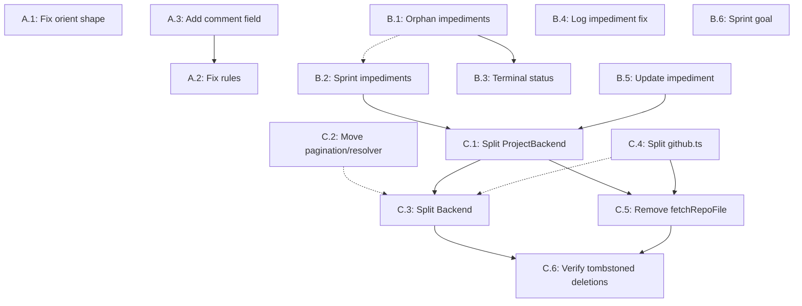

# Architecture Modernization — Task List

Atomic, sequential tasks derived from the architecture audit. Each task is independently executable and defines its expected deliverable.

**Audit basis:** [`tasks/REFACTORING.md`](tasks/REFACTORING.md) + live codebase analysis (2026-05-13)

---

## Phase A — Agent Stability (Fix Silent Session Failures) FINISHED

### Task A.1: Fix `scrum_orient` response shape

- **File:** [`src/scrum/orient.ts`](src/scrum/orient.ts)
- **Type:** Refactoring (response shape correction)
- **Description:** The `OrientResult` interface and `orientUseCase` return shape use legacy field names that don't match what agent session-start rules expect. Apply the following renames and additions:
  1. Rename top-level `declared_vocabulary` → `vocabulary`
  2. Rename `vocabulary.definition_of_ready` → `vocabulary.dor`
  3. Rename `vocabulary.definition_of_done` → `vocabulary.dod`
  4. Add `vocabulary.autonomy: { level: string } | null` sourced from `scrumConfig.project.agent.autonomy` (note: `scrumConfig.project.agent` may be `undefined`, so guard with optional chaining)
  5. Add a new top-level convenience field `platform_state.missing_options: string[]` by concatenating `fields.status.missing_options` and `fields.priority.missing_options`. This is additive — keep both per-field `missing_options` arrays unchanged in the return shape.
- **Deliverable:** Return shape matches:
  ```typescript
  interface OrientResult {
    platform_state: {
      fields: {
        status: { exists: boolean; options: string[]; missing_options: string[] };
        sprint: { exists: boolean };
        story_points: { exists: boolean };
        priority: { exists: boolean; options: string[]; missing_options: string[] };
      };
      missing_options: string[];  // convenience field: concat of status + priority missing_options
      labels: { existing: string[]; expected: string[]; missing: string[] };
      iterations: { ... };
    };
    vocabulary: {
      status: Record<string, string> | null;
      priority: Record<string, string> | null;
      story_points: { scale: string | null; values: number[] | null };
      sprint: { duration_days: number | null; velocity_window: number; length_weeks: number | null };
      team: unknown;
      dor: unknown;       // was definition_of_ready
      dod: unknown;       // was definition_of_done
      autonomy: { level: string } | null;  // new
      templates: { ... };
    };
  }
  ```
- **Dependencies:** None
- **Verification:** Run `deno task lint` and `deno task check`; confirm no type errors. Verify the handler in `src/tools/scrum-read.ts` destructures the correct field paths.

### Task A.3: Add `comment` field to `scrum_update_story`

> **Note: Execute before A.2** — A.2 rule corrections reference this new capability.

- **Files:** [`src/schemas/scrum.ts`](src/schemas/scrum.ts), [`src/tools/scrum-write.ts`](src/tools/scrum-write.ts)
- **Note:** `src/scrum/ports.ts` does **not** need to change — `addComment()` already exists on `ProjectBackend`.
- **Type:** Schema + handler extension
- **Description:** Three changes:
  1. Add optional `comment: string` to `UpdateStorySchema` in [`src/schemas/scrum.ts:217`](src/schemas/scrum.ts:217). Place it after the `epic` field, before `.strict()`.
  2. In [`src/tools/scrum-write.ts`](src/tools/scrum-write.ts), after the `await backend.updateStory(params.ref, updates as StoryUpdates)` call (currently line 168), check if `params.comment` is defined. If so, call `await backend.addComment(params.ref, params.comment)`.
  3. Update the tool `description` string (currently line 143) to document the new `comment` parameter.
- **Deliverable:** `scrum_update_story` with only `{ ref, comment }` posts a comment and leaves all other fields unchanged. `UpdateStorySchema` remains `.strict()`. The `comment` field can be combined with content fields (title, body, etc.) in one call.
- **Dependencies:** None
- **Verification:** Manual test: call `scrum_update_story` with `{ ref, comment }` only — verify comment is posted and story content is unchanged. Call with both `comment` and `body` — verify both are applied.

### Task A.2: Fix wrong tool references in agent ceremony rules

- **Files:** `.roo/rules-scrum-master/4_transitions.xml`, `3_sm_stance.xml`, `1_workflow.xml`, `2_conduct.xml`
- **Type:** Documentation/Rule correction
- **Description:** Four places reference incorrect tools. Apply these specific fixes:
  1. **`4_transitions.xml`** — In `board_catchup` Phase 2 and `stale_recovery` Phase 4: Replace "Mark as Done via `scrum_update_story`" → "Mark as Done via `scrum_set_field` with `field: 'status'` and `value: 'Done'`".
  2. **`3_sm_stance.xml`** — In `dod_lowered_for_deadline` dysfunction: Replace "Create a tech-debt story via `scrum_update_story`" → "Create a tech-debt story via `scrum_create_story` with `type: 'tech_debt'`".
  3. **`1_workflow.xml`** — In `sprint_planning` Step 5: Remove "capacity" from `scrum_plan_sprint` call description. Update to state that `goal` is passed as an optional parameter (this aligns with Task B.6).
  4. **`2_conduct.xml`** — In `prefer_comments_over_body_edits`: Confirm the mechanism works. Add a note that `scrum_update_story` now accepts a `comment` field (see Task A.3).
- **Deliverable:** No rule references `scrum_update_story` for status changes or story creation. Sprint planning Step 5 mentions `goal` as parameter, not `capacity`.
- **Dependencies:** Task A.3 (rule corrections reference the comment field addition)
- **Verification:** Grep for `scrum_update_story` in rules files — only content edits (title, body, labels, assignees, epic) should remain.

---

## Phase B — Feature Completeness (Implement Missing Functionality) FINISHED

### Task B.1: Implement `getOrphanImpediments()` backend query

- **File:** [`src/adapters/github/backend.ts`](src/adapters/github/backend.ts:447)
- **Type:** Feature implementation
- **Description:** Replace the TODO stub (line 447–450) with a real implementation:
  1. Query issues labeled `"impediment"` across all `tracked_repos` (use the same pattern as `getBacklogStories` for repo iteration).
  2. For each issue, fetch its comments and check if any comment body contains a `PVTI_` project item ID (regex: `/PVTI_\d+/`).
  3. Filter out issues that have at least one `PVTI_` reference — those are already linked to a story or sprint.
  4. Project each remaining issue to `ImpedimentListing`:
     ```typescript
     {
       ref: { id: /* project item ID */ },
       description: /* issue body */,
       status: /* "open" | "in_progress" | "resolved" based on issue state */,
       raised_by: /* issue creator login */,
       raised_at: /* created_at ISO timestamp */,
       resolved_at: /* closed_at ISO timestamp or null */,
     }
     ```
  5. Only return unresolved impediments (status "open" or "in_progress").
- **Deliverable:** `getOrphanImpediments()` returns actual orphan impediments. `scrum_get_backlog.orphan_impediments` field is populated.
- **Dependencies:** None
- **Verification:** Create an impediment issue without linking it to a story; call `scrum_get_backlog` — verify it appears in `orphan_impediments`. Create an impediment linked to a story — verify it does NOT appear.

### Task B.2: Enrich `SprintSnapshot.impediments`

- **Files:** [`src/scrum/ports.ts`](src/scrum/ports.ts:260), [`src/scrum/get-sprint.ts`](src/scrum/get-sprint.ts), [`src/scrum/get-history.ts`](src/scrum/get-history.ts), [`src/adapters/github/backend.ts`](src/adapters/github/backend.ts)
- **Type:** Feature implementation
- **Description:** Four changes:
  1. Add `getSprintImpediments(sprint: SprintRef): Promise<ImpedimentListing[]>` to `ProjectBackend` interface in [`ports.ts`](src/scrum/ports.ts:260).
  2. Implement in `GitHubProjectBackend`: query issues labeled `"impediment"` whose bodies or comments reference the sprint's iteration name (e.g., "Sprint 5"). Use the same `ImpedimentListing` projection pattern as Task B.1.
  3. In [`get-sprint.ts`](src/scrum/get-sprint.ts): call `backend.getSprintImpediments(sprint)` and assign the result to `impediments` in the snapshot (replace hardcoded `[]`).
  4. In [`get-history.ts`](src/scrum/get-history.ts:87): call `backend.getSprintImpediments(sprintName)` and assign to `impediments` (replace hardcoded `[]`).
- **Deliverable:** `SprintSnapshot.impediments` contains all impediments associated with the sprint. Empty array when no impediments exist.
- **Dependencies:** None (but B.1 is recommended first for shared patterns)
- **Verification:** Create an impediment linked to a sprint; call `scrum_get_sprint` — verify impediment appears in the snapshot.

### Task B.3: Replace hardcoded terminal status detection

- **Files:** [`src/scrum/get-backlog.ts`](src/scrum/get-backlog.ts), [`src/scrum/get-history.ts`](src/scrum/get-history.ts)
- **Type:** Refactoring (config-driven behavior)
- **Description:** Two changes:
  1. **In [`get-history.ts`](src/scrum/get-history.ts:57):** Replace the hardcoded `.toLowerCase() === "done"` in `computeTotals()` with a config-driven lookup. Create a helper function `isTerminalStatus(status: string | null, config: ScrumConfig): boolean` that:
     - Iterates `config.scrum.status` entries
     - Finds the key where `terminal: true`
     - Looks up the corresponding `status_display` value from `scrumConfig.backends.github.status_display`
     - Compares the input status (case-insensitive) against that display value
  2. **In [`get-history.ts`](src/scrum/get-history.ts:95):** Rename `_scrumConfig` → `scrumConfig` (it's already passed but unused). Pass it to `entryToSnapshot()` and `computeTotals()`.
  3. **In [`get-backlog.ts`](src/scrum/get-backlog.ts):** Apply the same `isTerminalStatus()` helper for the active-item filter (replace `.toLowerCase() === "done"`).
- **Deliverable:** Active-item filter uses the config-declared terminal status, not a hardcoded string. Renaming the done status in `config.yml` correctly affects filtering without code changes.
- **Dependencies:** None
- **Verification:** Change the terminal status name in a test `config.yml`; verify backlog filtering respects the new name.

### Task B.4: Fix `scrum_log_impediment` — optional `affects` and config-driven priority

- **Files:** [`src/schemas/scrum.ts`](src/schemas/scrum.ts), [`src/tools/scrum-write.ts`](src/tools/scrum-write.ts:383)
- **Type:** Schema + handler refactoring
- **Description:** Three changes:
  1. **Schema change** in [`src/schemas/scrum.ts:297`](src/schemas/scrum.ts:297): Make `affects` optional and union-based:
     ```typescript
     affects: z
       .union([
         z.object({ story: StoryRefSchema }),
         z.object({ sprint: SprintRefSchema }),
       ])
       .optional()
       .describe(
         "The story or sprint this impediment affects. Omit to log a project-level orphan.",
       ),
     ```
     Use `z.discriminatedUnion` if Zod version supports it, otherwise use `.union()` with `.refine()` to enforce at most one sub-field.
  2. **Handler change** in [`src/tools/scrum-write.ts:383`](src/tools/scrum-write.ts:383): Update the return shape to include `affects` in the response. When `affects` is omitted, return `affects: null`. Update the comment-logging logic with explicit conditional branching:
     - When `affects` is **absent**: skip both cross-linking comment calls (current Step 3 and Step 4 in the handler) — create the impediment issue only.
     - When `affects.story` is present: existing behavior — post a warning comment on the affected story and a back-link comment on the impediment issue.
     - When `affects.sprint` is present: skip the comment on the "affected story" (GitHub sprints are iteration fields, not issues) — post a single cross-reference comment on the impediment issue noting the sprint name (e.g., `":link: This impediment affects sprint: Sprint 5"`). Return `affects: { sprint: params.affects.sprint }` in the response.
  3. **Priority fix** in [`src/tools/scrum-write.ts:48`](src/tools/scrum-write.ts:48): Rename `_scrumConfig` → `scrumConfig`. At line 390, derive the p0 display label from `scrumConfig.scrum.priority[0].key` mapped through `scrumConfig.backends.github.priority_display` (replace hardcoded `"Must"`).
- **Deliverable:** `scrum_log_impediment` succeeds with no `affects` field; return includes `affects: null`. Default priority resolves to the p0 label from `config.yml`.
- **Dependencies:** None
- **Verification:** Call `scrum_log_impediment` without `affects` — verify it succeeds and returns `affects: null`. Call with `{ affects: { sprint: "current" } }` — verify it works.

### Task B.5: Add `scrum_update_impediment` write tool

- **Files:** New: `src/scrum/update-impediment.ts`; Existing: `src/schemas/scrum.ts`, `src/scrum/ports.ts`, `src/adapters/github/backend.ts`, `src/tools/scrum-write.ts`
- **Type:** New feature
- **Description:** Five changes:
  1. **Schema** in [`src/schemas/scrum.ts`](src/schemas/scrum.ts): Add `UpdateImpedimentSchema`:
     ```typescript
     export const UpdateImpedimentSchema = z
       .object({
         ref: z.object({
           id: z
             .string()
             .describe(
               "Impediment project item ID from scrum_get_backlog or scrum_get_sprint.",
             ),
         }),
         status: z
           .enum(["open", "in_progress", "resolved"])
           .describe("New impediment status."),
         resolution_notes: z
           .string()
           .optional()
           .describe("Notes explaining why this impediment was resolved."),
       })
       .strict();
     ```
  2. **Use case** — Create `src/scrum/update-impediment.ts`:
     ```typescript
     export const updateImpedimentUseCase = async (
       backend: ProjectBackend,
       ref: { id: string },
       status: "open" | "in_progress" | "resolved",
       resolutionNotes?: string,
     ): Promise<ImpedimentListing> => {
       return backend.updateImpediment(ref, status, resolutionNotes);
     };
     ```
  3. **Port** — Add `updateImpediment(ref, status, notes?): Promise<ImpedimentListing>` to `ProjectBackend` in [`ports.ts`](src/scrum/ports.ts).
  4. **Backend implementation** in `GitHubProjectBackend`: Update the issue label (e.g., `status_open` → `status_resolved`) and append `resolution_notes` as a comment when status is "resolved".
  5. **Registration** in [`src/tools/scrum-write.ts`](src/tools/scrum-write.ts): Register the tool with appropriate description and input schema.
- **Deliverable:** `scrum_update_impediment` with `status: "resolved"` updates the label and posts `resolution_notes` as a comment. Returns `ImpedimentListing` with updated status. Tool appears in `scrum_orient`'s tool surface listing.
- **Dependencies:** None
- **Verification:** Create an impediment; call `scrum_update_impediment` with `status: "resolved"` — verify label and comment are updated.

### Task B.6: Add `goal` field to `scrum_plan_sprint`

- **Files:** [`src/schemas/scrum.ts`](src/schemas/scrum.ts), [`src/tools/scrum-write.ts`](src/tools/scrum-write.ts:294)
- **Type:** Schema + handler extension
- **Description:** Two changes:
  1. **Schema** in [`src/schemas/scrum.ts:273`](src/schemas/scrum.ts:273): Add optional `goal: string` to `PlanSprintSchema`:
     ```typescript
     goal: z.string().optional().describe(
       "Sprint goal — a short statement of what the team aims to achieve this sprint.",
     ),
     ```
  2. **Handler** in [`src/tools/scrum-write.ts:313`](src/tools/scrum-write.ts:313): Include `goal` in the response object alongside `sprint`, `assigned`, `skipped`. When `goal` is omitted, exclude it from the response (or include as `null`). **Scope note:** `goal` is NOT persisted to GitHub in this task — it is echoed in the response only, for agent logging and ceremony artifact generation. Storing it to an iteration description field is out of scope here.
- **Deliverable:** `scrum_plan_sprint` accepts an optional `goal` and echoes it in the response. Existing calls without `goal` remain valid (no breaking change).
- **Dependencies:** None
- **Verification:** Call `scrum_plan_sprint` with `goal` — verify it appears in the response. Call without `goal` — verify no regression.

---

## Phase C — Structural Cleanup (Reduce Cost of Future Change) FINISHED

### Task C.1: Split `ProjectBackend` — Interface Segregation

- **File:** [`src/scrum/ports.ts`](src/scrum/ports.ts:196)
- **Type:** Refactoring (interface decomposition)
- **Description:** Decompose the 12-method `ProjectBackend` into focused interfaces. After Phase B additions, the interface has ~14 methods. Split as follows:

  | Interface        | Methods                                                                           | Use Cases That Depend On It                   |
  | ---------------- | --------------------------------------------------------------------------------- | --------------------------------------------- |
  | `BacklogPort`    | `getBacklogStories()`, `getOrphanImpediments()`                                   | `getBacklogUseCase`                           |
  | `SprintPort`     | `getSprintStories()`                                                              | `getSprintUseCase`                            |
  | `StoryPort`      | `getStoryDetail()`                                                                | `getStoryUseCase`                             |
  | `HistoryPort`    | `getCompletedSprintHistory()`                                                     | `getHistoryUseCase`                           |
  | `BurndownPort`   | `getBurndownInput()`, `resolveCompletionTimestamps()`                             | `getBurndownUseCase`                          |
  | `TemplatePort`   | `fetchRepoFile()`                                                                 | `getTemplateUseCase`                          |
  | `ImpedimentPort` | `getSprintImpediments()`, `updateImpediment()`                                    | `getSprintUseCase`, `updateImpedimentUseCase` |
  | `ProjectReader`  | composition of all read ports above                                               | —                                             |
  | `ProjectWriter`  | `createStory()`, `updateStory()`, `setField()`, `addComment()`, `addVocabulary()` | write tools                                   |

  Each use case imports only the port it needs. `GitHubProjectBackend` implements all interfaces.

- **Deliverable:** Each use case imports only its required port interface. Test doubles are minimal (1-3 methods instead of 14). No signature change propagates to unrelated use cases.
- **Dependencies:** Tasks B.1, B.2, B.5 (all new methods must be implemented before interface split)
- **Verification:** Run `deno task lint` — no type errors. Each use case file imports only its specific port.

### Task C.2: Move `services/pagination.ts` and `services/resolver.ts` to adapter layer

- **Files:** `src/services/pagination.ts`, `src/services/resolver.ts` → `src/adapters/github/internal/pagination.ts`, `src/adapters/github/internal/resolver.ts`
- **Type:** File migration (relocation)
- **Description:** Both files are 100% GitHub-specific but live in `services/`. Move to `adapters/github/internal/`. Update all import paths:
  - [`src/adapters/github/backend.ts:13`](src/adapters/github/backend.ts:13): `import { resolveSprint, resolveStory } from "../../services/resolver.ts"` → `"./internal/resolver.ts"` (file is co-located in `adapters/github/`)
  - [`src/adapters/github/backend.ts:14`](src/adapters/github/backend.ts:14): `import { isBacklogItem, PaginatedProjectItemFetcher } from "../../services/pagination.ts"` → `"./internal/pagination.ts"`
  - Any imports in `src/tools/scrum-read.ts` or elsewhere.
- **Deliverable:** `services/` contains only generic utilities (logger, mutation-validator, error-enrichment). `pagination.ts` and `resolver.ts` live alongside other GitHub adapter internals.
- **Dependencies:** None
- **Verification:** `deno task lint` passes. No import errors. `grep -r "services/pagination"` and `grep -r "services/resolver"` return no results outside `adapters/github/`.

### Task C.3: Split `GitHubProjectBackend` — Single Responsibility

- **File:** [`src/adapters/github/backend.ts`](src/adapters/github/backend.ts:64) (1043 lines)
- **Type:** Refactoring (class decomposition)
- **Description:** Split into 6 cohesive services in `adapters/github/internal/`. `GitHubProjectBackend` becomes a ~200-line coordinator that delegates to injected services (DIP):

  | Service                 | Responsibility                        | Lines Extracted | Key Methods                                                                                                 |
  | ----------------------- | ------------------------------------- | --------------- | ----------------------------------------------------------------------------------------------------------- |
  | `LabelResolver`         | Label CRUD + milestone resolution     | ~130            | `resolveLabelNodeIds`, `resolveOrCreateLabel`, `addLabel`, `hashToColor`, `fetchRepoNodeId`                 |
  | `FieldValueMutator`     | Board field mutations                 | ~80             | `clearField`, `setFieldStatus`, `setFieldSprint`, `setFieldStoryPoints`, `setFieldPriority`                 |
  | `BurndownCalculator`    | Burndown data + completion timestamps | ~170            | `getBurndownInput`, `resolveCompletionTimestamps`, `fetchAuditLogCompletions`, `fetchIssueCloseCompletions` |
  | `SprintHistoryService`  | Completed sprint data                 | ~50             | `getCompletedSprintHistory`                                                                                 |
  | `VocabularyManager`     | Vocabulary option management          | ~75             | `addVocabulary`, `addStatusOption`, `addPriorityOption`, `addSingleSelectOption`                            |
  | `UserMilestoneResolver` | User + milestone resolution           | ~85             | `resolveUserNodeId`, `resolveUserNodeIds`, `resolveOrCreateMilestoneNodeId`                                 |

  Remaining `GitHubProjectBackend` methods (~200 lines): `getPlatformState`, `getSprintStories`, `getBacklogStories`, `getStoryDetail`, `createStory`, `updateStory`, `setField`, `addComment`, `getOrphanImpediments`, `getSprintImpediments`, `updateImpediment`, `fetchRepoFile`.

- **Deliverable:** `backend.ts` is ~200 lines. All extracted services are in `adapters/github/internal/`. `GitHubProjectBackend` implements `ProjectBackend` via composition. No behavioral change.
- **Dependencies:** Tasks C.1 (interface split should precede or accompany this), C.2 (file relocation)
- **Verification:** `deno task lint` passes. All existing integration tests pass. Line count of `backend.ts` < 250.

### Task C.4: Split `services/github.ts` — Remaining extractions

- **File:** [`src/services/github.ts`](src/services/github.ts) → `adapters/github/http-client.ts`, `adapters/github/contents.ts`
- **Type:** File migration + refactoring
- **Description:** Three changes:
  1. Extract `graphql()`, `rest()` — HTTP transport → `adapters/github/http-client.ts`
  2. Extract `fetchRepoFile()`, `decodeRepoFileContent()` — Contents API → `adapters/github/contents.ts`
  3. Remove `graphql` import from [`src/tools/scrum-write.ts:32`](src/tools/scrum-write.ts:32) — only used by deprecated `github_graphql` tool. The deprecated tool can import directly from `http-client.ts` or keep its own reference.
- **Deliverable:** No file outside `adapters/github/` imports from `services/github.ts`. `services/github.ts` can be deleted without breaking any import.
- **Dependencies:** None
- **Verification:** `grep -r "services/github.ts"` — only `adapters/github/` and `src/index.ts` should import from it. After split, zero imports from `services/github.ts`.

### Task C.5: Remove `fetchRepoFile()` from `ProjectBackend` port

- **File:** [`src/scrum/ports.ts`](src/scrum/ports.ts:246)
- **Type:** Interface cleanup
- **Description:** `fetchRepoFile(path: string)` is a GitHub Contents API method on a platform-agnostic interface. Remove it from `ProjectBackend`. Handle it directly in tool handlers (they already have access to the backend config via `scrumConfig.backends.github`).
  1. Remove `fetchRepoFile(path: string): Promise<string>` from `ProjectBackend` in [`ports.ts`](src/scrum/ports.ts:246).
  2. In `getTemplateUseCase` (or wherever `fetchRepoFile` is called), access the Contents API directly through the backend config or a dedicated HTTP client.
  3. Generalize `VocabularyKind` or move `addVocabulary` to an extended `ProjectWriter` interface (not the base `ProjectBackend`).
- **Deliverable:** `ProjectBackend` is truly platform-agnostic. A Jira/Azure DevOps backend would not need to implement `fetchRepoFile()` or understand GitHub label terminology.
- **Dependencies:** Task C.1 (interface split), Task C.4 (http-client split must complete first so handlers have direct access to HTTP client)
- **Verification:** `grep -r "fetchRepoFile" src/scrum/` returns no results. Tool handlers access contents API directly.

### Task C.6: Verify tombstoned files are fully removed

- **Files:** `src/types.ts`, `src/adapters/github/raw-types.ts`
- **Type:** Verification
- **Description:** Both tombstoned files (`src/types.ts` and `src/adapters/github/raw-types.ts`) should already have been physically deleted from the repository. This task confirms the cleanup is complete and no stale references remain:
  1. Confirm neither file exists: `ls src/types.ts src/adapters/github/raw-types.ts` — both should return "No such file".
  2. Confirm no import references remain: `grep -r "from.*src/types" src/` — should return no results.
  3. Confirm no raw-types references remain: `grep -r "raw-types" src/` — should return no results.
  4. Run `deno task lint` — must pass with no import errors.
- **Deliverable:** Lint passes. Grep returns zero results for both deleted files.
- **Dependencies:** None (can be verified at any point; best done last to catch any stale references introduced during C.1–C.5)
- **Verification:** `deno task lint` passes cleanly.

---

## Execution Order Summary

```
Phase A (Agent Stability)      → A.1 → A.3 → A.2    (fixes silent session failures)
Phase B (Feature Completeness) → B.1 → B.2 → B.3 → B.4 → B.5 → B.6  (implements missing functionality)
Phase C (Structural Cleanup)   → C.1 → C.2 → C.3 → C.4 → C.5 → C.6  (reduces cost of future change)
```

**Dependency graph:**



**Key execution notes:**

- A.1 and A.3 are fully independent — they can be done in parallel. Only A.3 must precede A.2 (rule corrections reference the new `comment` field).
- B.1 should precede B.2 (shared impediment detection patterns — dashed arrow in graph). All other Phase B tasks are mutually independent.
- B.2 and B.5 must precede C.1 — they add new interface methods (`getSprintImpediments`, `updateImpediment`) to `ProjectBackend` that the interface segregation in C.1 depends on.
- C.1 should precede C.3 (interface split guides class decomposition).
- C.2 and C.4 are independent and can be done in parallel with other tasks.
- C.5 depends on both C.1 and C.4.
- C.6 is a verification task best done last; both tombstoned files may already be deleted.
