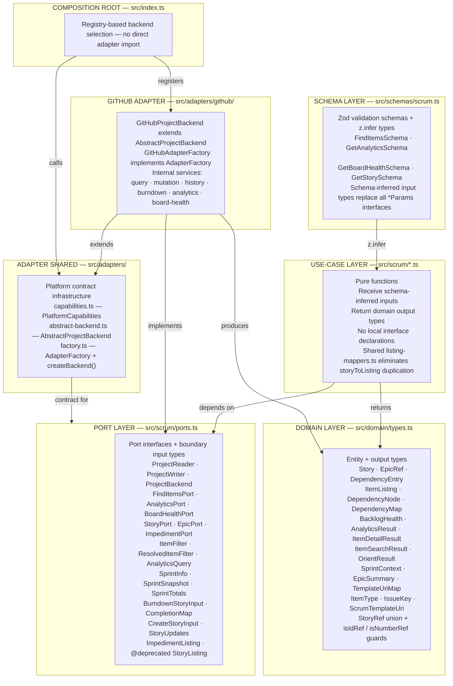
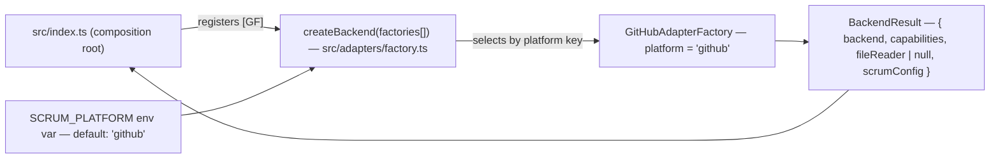

# Type Cleanup & Adapter Abstraction — Implementation Strategy

**Role:** This document is the implementation strategy for the _foundational infrastructure_ phase of REFACTORING.md's tool surface redesign. It covers type system cleanup, adapter abstraction, and the new port interfaces — the prerequisites needed before the larger tool-surface changes (unified item search, board health, analytics, agent behavioral patterns) can be implemented.

**Status:** Strategy document. For full type specs and implementation reference, see `tasks/TODO-IMPLEMENTATION.md`.

---

## Traceability to REFACTORING.md Goals

This strategy supports the following goals from [REFACTORING.md](tasks/REFACTORING.md):

| REFACTORING Goal                                             | How this strategy enables it                                                                                                                            |
| ------------------------------------------------------------ | ------------------------------------------------------------------------------------------------------------------------------------------------------- |
| **Goal 1** — Single-call item retrieval (`scrum_find_items`) | New `FindItemsPort`, `ItemFilter`, `ItemSearchResult`, `ItemListing` types provide the contract. Shared `storyToListing` mapper eliminates duplication. |
| **Goal 2** — Orient as executive summary                     | New `SprintContext` (time-progress), `EpicSummary`, `TemplateUriMap` types added. Extended `PlatformState` with epics + template URIs.                  |
| **Goal 3** — Health separate from items                      | New `BacklogHealth`, `BoardHealthPort` types. Deprecates `StoryListing` in favor of `ItemListing` (listing-only, no health).                            |
| **Goal 4** — Unified sprint analytics                        | New `AnalyticsResult`, `AnalyticsQuery`, `AnalyticsPort` types merge burndown + history.                                                                |
| **Goal 5** — Templates as resources                          | New `TemplateUriMap` type and `scrum://template/{type}` resource spec. Removes `TemplateResponse` dead type.                                            |
| **Goal 7** — Single-call dependency graph                    | New `DependencyNode` (keyed by `IssueKey`, not nullable `ref.id`), `DependencyMap` types.                                                               |
| **Goal 8** — Direct lookup by number                         | `StoryRef` extended to `{ id: string }                                                                                                                  |

**Not covered in this strategy:** Goal 6 (scrum theory alignment) and Goal 9 (task-driven health loading) are agent-behavioral concerns that belong in the follow-up tool-surface refactoring.

---

## Problem Statements

The codebase has two compounding structural problems:

### 1. Type Fragmentation

Types are duplicated across four locations (`src/domain/types.ts`, `src/scrum/ports.ts`, per-file use-case interfaces, `src/schemas/scrum.ts`) with overlapping responsibilities. Use-case functions declare their own return types locally instead of composing domain types. This violates Clean Architecture's Dependency Rule and Interface Segregation Principle.

**Signal:** 13 Known Issues (documented below). Duplicate `storyToListing` mappers in three files. Private local `OrientResult` invisible to tests.

### 2. Hard-Wired Adapter

`src/index.ts` imports `createGitHubProjectBackend` directly. There is no shared abstract base class, no capability declaration, and no factory registry. Adding a second adapter (Trello, Linear, Jira) currently requires modifying the composition root and duplicating the port contract manually.

**Signal:** `FileReaderPort` is returned unconditionally even though future adapters may not have one. No `platform` identifier for adapter selection.

---

## Target Architecture

### Layer Dependency Map

The refactored codebase has five layers. Dependencies point inward.



### Factory Registry



---

## Known Issues to Fix

These 13 issues are the specific defects this strategy resolves. Each is anchored to a phase below.

| #  | Issue                                                                         | Phase   | Impact                                                |
| -- | ----------------------------------------------------------------------------- | ------- | ----------------------------------------------------- |
| 1  | `BacklogHealth` and `BoardHealthResult` planned as duplicate types            | 1h      | Compile error avoided                                 |
| 2  | `ItemType` referenced before defined                                          | 1a      | `TemplateUriMap` and `BacklogHealth.by_type` fail     |
| 3  | `ArtifactType` vs `ItemType` confusion — different key sets                   | 1d, 5   | Wrong template keys                                   |
| 4  | `AnalyticsQuery` and `ItemFilter` belong in `ports.ts`, not `domain/types.ts` | 2a      | Input types crossing port boundary                    |
| 5  | `EpicPort.getEpics()` has no call site after `getBacklogUseCase` removal      | 5       | `orientUseCase` won't populate `platform_state.epics` |
| 6  | `StoryRef` union change needs adapter resolution spec                         | 0b, 7a  | Write-tool port methods need `resolveRef()`           |
| 7  | `SprintTotals` runtime guard is fragile (`"committed_points" in s.totals`)    | 2d      | Compiler can't narrow safely                          |
| 8  | `storyToListing` duplicated across three files                                | 4a      | Triple maintenance burden                             |
| 9  | `ItemListing` missing `priority` as named field                               | 1i, 2a  | Priority filter in `FindItemsSchema` breaks           |
| 10 | `OrientResult` is a private local interface                                   | 1n      | Invisible to tests and type annotations               |
| 11 | `src/index.ts` imports `createGitHubProjectBackend` directly                  | 0       | No platform abstraction                               |
| 12 | `StoryNotFoundError` doesn't exist yet                                        | 1 (end) | `resolveRef()` import fails                           |
| 13 | `ItemListing.sprint` missing `ref.id`                                         | 4a, 7c  | Sprint `ref.id` hardcoded to `""`                     |

---

## Implementation Phases

### Phase Dependency Graph


**Why this order:** Inner layers (adapter infrastructure, domain types) must compile before outer layers (tool handlers, composition root) can reference them. P0 must come first because `AbstractProjectBackend` is a compile target for P7. P1 (domain types) must precede P2 (port types) because port interfaces import domain types. P4–P6 migrate use-case code to use the new types before the GitHub adapter is refactored in P7.

### Risk Levels

| Level     | Meaning                                                   |
| --------- | --------------------------------------------------------- |
| 🟢 Low    | Adding new code, no existing consumers change             |
| 🟡 Medium | Existing code changes but test surface is small           |
| 🔴 High   | Existing code changes, tests change, or tools are removed |

---

### Verification Gate (run after every phase)

```bash
deno lint
deno task test
deno check src/index.ts
# Verify no inward adapter leaks:
grep -r "import.*from.*adapters/github" src/scrum/ src/domain/ src/schemas/
```

If a phase fails: `git checkout -- <files-modified-in-this-phase>` and reassess.

---

### P0: Adapter Infrastructure

🟢 **Low risk** — three new files, no existing code changes.

**Why first:** Every subsequent phase that touches `backend.ts` or `factory.ts` needs `AbstractProjectBackend` as a compile target. Creating it first avoids forward-referencing issues.

**Changes:**

| File                               | Action  | What it provides                                                                                                                                                                                                                       |
| ---------------------------------- | ------- | -------------------------------------------------------------------------------------------------------------------------------------------------------------------------------------------------------------------------------------- |
| `src/adapters/capabilities.ts`     | **New** | `PlatformCapabilities` interface + `GITHUB_CAPABILITIES` constant. Declares what features an adapter supports (audit-log burndown, native sprints, dependencies, file reader, stable item keys).                                       |
| `src/adapters/abstract-backend.ts` | **New** | `AbstractProjectBackend` — abstract base extending `ProjectReader & ProjectWriter`. Provides default `resolveRef()` (throws for `{ number }` — subclasses override) and `UnsupportedCapabilityError` defaults for optional operations. |
| `src/adapters/factory.ts`          | **New** | `AdapterFactory` interface, `BackendResult` type, `createBackend()` registry. Selects adapter by `SCRUM_PLATFORM` env var.                                                                                                             |

**Key design decisions:**

- `UnsupportedCapabilityError` for optional operations (createImpediment, updateImpediment) — capability gaps are loud, not silent.
- `resolveRef()` is `protected` — it's an internal concern, not part of the port interface.

---

### P1: Domain Types

🟡 **Medium risk** — adds ~15 new types to `src/domain/types.ts`, existing types preserved. Tests added for type guards.

**Why here:** Domain types are the single source of truth for output shapes. Every other layer imports from domain. Must be defined before ports (P2) can reference them.

**Changes to `src/domain/types.ts`:**

| Type                        | Category            | Purpose                                                                               |
| --------------------------- | ------------------- | ------------------------------------------------------------------------------------- |
| `ITEM_TYPES` / `ItemType`   | Const tuple + union | PBI vocabulary — `z.enum(ITEM_TYPES)` in schemas, no duplication                      |
| `IssueKey` + `toIssueKey`   | Branded string      | Human-readable issue number, always present vs. nullable `ref.id`                     |
| `ScrumTemplateUri`          | Template literal    | `scrum://template/{type}` — compile-time format validation                            |
| `StoryRef` union            | Extended            | `{ id: string } \| { number: number }` + `isIdRef` / `isNumberRef` guards             |
| `TemplateUriMap`            | New type            | `Partial<Record<ItemType, ScrumTemplateUri>>` — PBI templates only                    |
| `SprintContext` + factories | New type            | Sprint with time-progress fields + `riskStance` (normal/monitor/elevated)             |
| `EpicSummary`               | New type            | Lightweight epic for orient response                                                  |
| `BacklogHealth`             | New type            | Board health output — `by_type` breakdown, sprint risk, impediments                   |
| `ItemListing`               | New type            | Replaces `StoryListing` — enriched listing with `priority`, `sprint`, `epic`, deps    |
| `DependencyNode`            | New type            | Graph node keyed by `IssueKey` — includes inline state signals (status, sprint, epic) |
| `DependencyMap`             | New type            | `Record<string, DependencyNode>` — opt-in, not paid on every list call                |
| `ItemSearchResult`          | New type            | `findItems` output — `ItemListing[]` + `scope_summary` + optional `dependency_map`    |
| `AnalyticsResult`           | New type            | Merges `BurndownResponse \| null` + `SprintSnapshot[] \| null`                        |
| `ItemDetailResult`          | New type            | `getStoryDetail` output — story + comments + linked PRs + AC                          |
| `OrientResult`              | Exported            | Moved from private interface in `orient.ts` — now importable by tests and handlers    |

**Removed types:**

- `TemplateResponse` — dead code, no consumers after `scrum_get_template` removal in P6
- `ArtifactType` — moved to `src/domain/config.ts` (still referenced by `ScrumConfig.templates`)

**Key design decisions:**

- `DependencyMap` uses `IssueKey` as node identifier, not `ref.id` — because `DependencyEntry.ref.id` is nullable (acknowledged bug).
- `SprintContext` is a factory-built interface, not a class — pure data, no inheritance.
- `ItemListing.sprint.ref.id` is hardcoded to `""` — known gap until the adapter provides sprint node IDs.
- Template URIs only cover PBI types (`ItemType`). Ceremony templates (sprint_review, retrospective) stay in `vocabulary.templates` under `ArtifactType`.

---

### P2: Port Types

🟡 **Medium risk** — consolidates `src/scrum/ports.ts`, removes 6 deprecated types, adds 3 new interfaces. `SprintTotals` changes affect `get-history.ts`.

**Why here:** Port interfaces define the boundary between use-cases and adapters. They import domain types (P1) and are referenced by schemas (P3).

**Changes to `src/scrum/ports.ts`:**

| Change                                                                | Details                                                                                                                              |
| --------------------------------------------------------------------- | ------------------------------------------------------------------------------------------------------------------------------------ |
| **Add** `ItemFilter`, `ResolvedItemFilter`                            | Input types for `findItems`. Moved from domain — input types cross the port boundary, they don't belong in domain.                   |
| **Add** `AnalyticsQuery`                                              | Input type for `getAnalytics`. Same rationale — input at the port.                                                                   |
| **Extend** `SprintInfo` with `id`                                     | Iteration ID from platform, needed for `SprintContext.id`.                                                                           |
| **Extend** `PlatformState` with `epics` + `templateUris`              | `epics: { active: EpicSummary[]; totalCount: number }` — populated by `orientUseCase` in P5. `templateUris: TemplateUriMap \| null`. |
| **Replace** `SprintTotalsActive` + `SprintTotalsHistory`              | Single `SprintTotals` discriminated union with `kind: "active" \| "completed"`. Fixes Issue 7 (fragile runtime guard).               |
| **Add** `FindItemsPort`                                               | 1-method interface (`findItems`).                                                                                                    |
| **Add** `AnalyticsPort`                                               | 1-method interface (`getAnalytics`).                                                                                                 |
| **Add** `BoardHealthPort`                                             | 1-method interface (`getBoardHealth`).                                                                                               |
| **Remove** `SprintPort`, `BacklogPort`, `HistoryPort`, `BurndownPort` | Replaced by the 3 new interfaces above.                                                                                              |
| **Deprecate** `StoryListing`                                          | Replace with `ItemListing` from domain.                                                                                              |

**Key design decisions:**

- Individual use-case functions depend on narrow ports (`FindItemsPort`, `AnalyticsPort`). `ProjectReader` is a convenience union for composition root.
- TypeScript structural typing accepts `backend` (which implements `ProjectReader`) wherever a narrow port is expected.

---

### P3: Schema Types

🟢 **Low risk** — adds Zod schemas, no test files import schemas directly.

**Why here:** Schemas validate MCP tool input. They must exist before use-cases (P4) can reference `z.infer<>` types.

**Changes to `src/schemas/scrum.ts`:**

| Schema                     | Purpose                                                                                                                                                                |
| -------------------------- | ---------------------------------------------------------------------------------------------------------------------------------------------------------------------- |
| `FindItemsSchema`          | Validates `scrum_find_items` input — scope, keys[], search, type[], status[], priority, epic_id, label[], assignee, estimated, sprint_ref, include_dependencies, limit |
| `GetAnalyticsSchema`       | Validates `scrum_get_analytics` input — view, sprint_ref, history_window                                                                                               |
| `GetBoardHealthSchema`     | Validates `scrum_get_board_health` input — sprint_scope                                                                                                                |
| `StoryRefSchema` (updated) | Extended union accepting `{ id }` or `{ number }`                                                                                                                      |
| Remove `GetTemplateSchema` | Templates replaced by MCP resources                                                                                                                                    |

**Key decision:**

- `FindItemsSchema.keys` validates as `z.array(z.string().regex(/^\d+$/))` — numeric strings to avoid type coercion issues.

---

### P4: Use-Case Migration

🟡 **Medium risk** — modifies 5 use-case files, removes local interface declarations, adds shared mapper.

**Why here:** Use-cases must use the new types (P1) and ports (P2) before tool handlers (P6) and the adapter (P7) can be migrated.

**Changes:**

| Component                      | Change                                                                                                                                                               |
| ------------------------------ | -------------------------------------------------------------------------------------------------------------------------------------------------------------------- |
| `src/scrum/listing-mappers.ts` | **New** — `storyToListing(story): ItemListing` and `historyEntryToListing(story, sprintName): ItemListing` from the 3 copies in get-backlog, get-sprint, get-history |
| `src/scrum/get-story.ts`       | Remove private `GetStoryResult`; return `ItemDetailResult` from domain                                                                                               |
| `src/scrum/get-history.ts`     | Remove private `GetHistoryResult`; return `AnalyticsResult` from domain. Fix Issue 7: replace `"committed_points" in s.totals` with `s.totals.kind === "completed"`  |
| `src/scrum/get-backlog.ts`     | Remove private `GetBacklogResult`, `GetBacklogParams`; import and return `BacklogHealth`                                                                             |
| `src/scrum/get-sprint.ts`      | Remove private `SprintSingleResult`, `SprintAllResult`; import mapper from `listing-mappers.ts`                                                                      |
| `src/scrum/get-burndown.ts`    | Remove private `GetBurndownParams`; use `z.infer<typeof GetAnalyticsSchema>`                                                                                         |

**Key design decision:**

- Shared mapper lives in `listing-mappers.ts`, **not** in any single use-case file. This avoids creating a new dependency focal point that other modules would hesitantly import from.

---

### P5: Orient Use-Case

🟡 **Medium risk** — modifies `src/scrum/orient.ts`. Local `OrientResult` replaced with exported domain type. Adds `getEpics()` call (one additional backend call).

**Why here:** Orient is the session entry point. It must return the new types (SprintContext, EpicSummary, TemplateUriMap) before tool handlers (P6) can expose them.

**Changes:**

| Before                           | After                                                                                                                      |
| -------------------------------- | -------------------------------------------------------------------------------------------------------------------------- |
| Private `OrientResult` interface | Import exported `OrientResult` from `../domain/types.ts`                                                                   |
| No epics in response             | Calls `backend.getEpics()` → filters open epics → populates `platform_state.epics.active`                                  |
| Raw sprint date fields           | Uses `sprintContextFromSprintInfo()` factory → computes `days_elapsed`, `days_remaining`, `time_elapsed_pct`, `riskStance` |
| Static template path map         | Builds `TemplateUriMap` from `ITEM_TYPES` intersection with `scrumConfig.templates`                                        |

**Key design decision:**

- `getEpics()` is called once during orient (acceptable cost — orient is a session-start call, not a mid-workflow call). Fallback: all open epics when no active sprint exists.

---

### P6: Tool Handler Migration 🔴

🔴 **High risk** — removes 5 MCP tools, adds 3 new ones. Breaking change for external consumers.

**Why here:** Tool handlers must reference the migrated use-cases (P4) and schemas (P3). Must wait until those are stable.

**Changes to `src/tools/scrum-read.ts`:**

| Action     | Tool                     | Replaced by                                   |
| ---------- | ------------------------ | --------------------------------------------- |
| **Remove** | `scrum_get_sprint`       | `scrum_find_items({ scope: "sprint" })`       |
| **Remove** | `scrum_get_backlog`      | `scrum_find_items` + `scrum_get_board_health` |
| **Remove** | `scrum_get_burndown`     | `scrum_get_analytics({ view: "burndown" })`   |
| **Remove** | `scrum_get_history`      | `scrum_get_analytics({ view: "history" })`    |
| **Remove** | `scrum_get_template`     | `scrum://template/{type}` resource            |
| **Add**    | `scrum_find_items`       | Unified item search across all PBIs           |
| **Add**    | `scrum_get_analytics`    | Unified sprint analytics (burndown + history) |
| **Add**    | `scrum_get_board_health` | Board health dashboard (no item lists)        |

**Risk mitigation:** The 5 removed tool names produce clear error messages pointing to the replacement. External consumers will break — document this as a breaking change.

---

### P7: GitHub Adapter Migration 🟡

🟡 **Medium risk** — extends `GitHubProjectBackend` from `AbstractProjectBackend`, adds 3 new port methods. Some internal services (analytics-service, board-health-service) don't exist yet — needs creation.

**Why here:** Adapter migration depends on the abstract base (P0), new port interfaces (P2), and `StoryNotFoundError` (P1). Must happen before the composition root (P8) can use the factory registry.

**Changes:**

| Component                          | Change                                                                                                                                                                                                        |
| ---------------------------------- | ------------------------------------------------------------------------------------------------------------------------------------------------------------------------------------------------------------- |
| `GitHubProjectBackend`             | Extend `AbstractProjectBackend` instead of raw `implements ProjectBackend`. Override `resolveRef()` — delegates `{ number }` to `findItems()`. Implement `findItems()`, `getAnalytics()`, `getBoardHealth()`. |
| `GitHubAdapterFactory`             | **New** — wraps existing factory body in `AdapterFactory`, returns `BackendResult` with `GITHUB_CAPABILITIES`.                                                                                                |
| `internal/analytics-service.ts`    | **New** — merges `SprintHistoryService` + `BurndownCalculator` behind `getAnalytics(query)`.                                                                                                                  |
| `internal/board-health-service.ts` | **New** — implements `getBoardHealth()` query.                                                                                                                                                                |
| `internal/story-query-service.ts`  | Add `findItems(filter): ItemSearchResult` — replaces `getSprintStories` + `getBacklogStories`.                                                                                                                |

**Key design decision:**

- `resolveRef()` uses `findItems()` for `{ number }` lookup — this avoids a dedicated `resolveIssueNumber` query and keeps the adapter implementation simple. The cost is one `findItems` call per `{ number }` resolve.

---

### P8: Composition Root

🟢 **Low risk** — rewrites `src/index.ts` to use the factory registry.

**Why here:** The composition root wires everything together. It must wait until all components (P0–P7) exist.

**Changes to `src/index.ts`:**

| Before                                       | After                                                                 |
| -------------------------------------------- | --------------------------------------------------------------------- |
| Direct `createGitHubProjectBackend()` import | `createBackend([new GitHubAdapterFactory()])`                         |
| `fileReader` assumed always present          | `fileReader` is `null`-checked — templates fall back to MCP resources |
| Manual wiring                                | Registry-based, factory declares platform                             |

**Key design decision:**

- `fileReader` being `null` is handled explicitly at the composition root, not silenced with a no-op default. If a future adapter has no file system, template tool registration is simply skipped.

---

## Out of Scope

The following are explicitly **not** covered by this implementation strategy. They are either future concerns or belong to the tool-surface refactoring phase that follows.

| Concern                                                                                                        | Where it belongs                                                       |
| -------------------------------------------------------------------------------------------------------------- | ---------------------------------------------------------------------- |
| Agent behavioral design (session protocol, lookup ladder, dependency graph navigation, temporal anchor stance) | REFACTORING.md §6 — agent layer, not server layer                      |
| Backend implementation of `scrum_find_items` GraphQL query                                                     | Follow-up tool-surface refactoring                                     |
| Backend implementation of epic enumeration in `scrum_orient`                                                   | Follow-up tool-surface refactoring                                     |
| `scrum://template/{type}` MCP resource registration                                                            | Follow-up — `server.registerResourceTemplate()` wiring                 |
| `scrum_get_board_health` health metric computation backend queries                                             | Follow-up — `board-health-service.ts` implementation detail            |
| Config-driven `ItemType` vocabulary extension                                                                  | Future extension point — currently hardcoded                           |
| Stateful orient comparison server                                                                              | Not a function of the MCP server (which is stateless)                  |
| Ceremony template conversion to MCP resources                                                                  | Templates stay as `ArtifactType`-keyed in `vocabulary.templates`       |
| Full tool-surface removal/rename of existing tools                                                             | P6 covers tool registration — actual name changes happen in follow-up  |
| Non-GitHub adapter implementations (Trello, Linear, Jira)                                                      | Future adapter work — infrastructure is ready, implementations are not |

---

## File Inventory

### New Files (9)

| File                                                   | Purpose                                                 |
| ------------------------------------------------------ | ------------------------------------------------------- |
| `src/adapters/capabilities.ts`                         | `PlatformCapabilities` + `GITHUB_CAPABILITIES`          |
| `src/adapters/abstract-backend.ts`                     | `AbstractProjectBackend` + `UnsupportedCapabilityError` |
| `src/adapters/factory.ts`                              | `AdapterFactory` + `BackendResult` + `createBackend()`  |
| `src/scrum/listing-mappers.ts`                         | Shared `storyToListing` + `historyEntryToListing`       |
| `src/scrum/find-items.ts`                              | `findItemsUseCase`                                      |
| `src/scrum/get-analytics.ts`                           | `getAnalyticsUseCase`                                   |
| `src/scrum/get-board-health.ts`                        | `getBoardHealthUseCase`                                 |
| `src/adapters/github/internal/analytics-service.ts`    | Merges SprintHistoryService + BurndownCalculator        |
| `src/adapters/github/internal/board-health-service.ts` | `getBoardHealth()` implementation                       |

### Modified Files (15)

| File                                                  | What changes                                                                                                             |
| ----------------------------------------------------- | ------------------------------------------------------------------------------------------------------------------------ |
| `src/domain/types.ts`                                 | Add ~15 new types; extend `StoryRef`; delete `TemplateResponse`                                                          |
| `src/domain/errors.ts`                                | Add `StoryNotFoundError`                                                                                                 |
| `src/domain/config.ts`                                | Move `ArtifactType` here                                                                                                 |
| `src/scrum/ports.ts`                                  | Add `ItemFilter`, `AnalyticsQuery`, `SprintTotals`; extend `SprintInfo`, `PlatformState`; add 3 ports; remove 6 ports    |
| `src/schemas/scrum.ts`                                | Add `FindItemsSchema`, `GetAnalyticsSchema`, `GetBoardHealthSchema`; update `StoryRefSchema`; remove `GetTemplateSchema` |
| `src/scrum/orient.ts`                                 | Remove local `OrientResult`; add `getEpics()`; use `sprintContextFromSprintInfo()`                                       |
| `src/scrum/get-story.ts`                              | Remove local `GetStoryResult`                                                                                            |
| `src/scrum/get-history.ts`                            | Remove local `GetHistoryResult`; fix SprintTotals narrowing                                                              |
| `src/scrum/get-backlog.ts`                            | Remove local result/params types                                                                                         |
| `src/scrum/get-sprint.ts`                             | Remove local result types; use shared mapper                                                                             |
| `src/scrum/get-burndown.ts`                           | Remove local `GetBurndownParams`                                                                                         |
| `src/adapters/github/backend.ts`                      | Extend `AbstractProjectBackend`; add `resolveRef()`, `findItems`, `getAnalytics`, `getBoardHealth`                       |
| `src/adapters/github/factory.ts`                      | Wrap in `GitHubAdapterFactory`                                                                                           |
| `src/adapters/github/internal/story-query-service.ts` | Add `findItems(filter)`                                                                                                  |
| `src/tools/scrum-read.ts`                             | Add 3 tools; remove 5 tools                                                                                              |

### Deleted Files (5)

| File                        | Reason                                              |
| --------------------------- | --------------------------------------------------- |
| `src/scrum/get-template.ts` | Templates replaced by MCP resources                 |
| `src/scrum/get-sprint.ts`   | Replaced by `find-items.ts`                         |
| `src/scrum/get-backlog.ts`  | Replaced by `find-items.ts` + `get-board-health.ts` |
| `src/scrum/get-history.ts`  | Replaced by `get-analytics.ts`                      |
| `src/scrum/get-burndown.ts` | Replaced by `get-analytics.ts`                      |

---

## Type Migration Summary

### New Types (29)

| Type                        | Layer    | Purpose                         |
| --------------------------- | -------- | ------------------------------- |
| `ITEM_TYPES` / `ItemType`   | Domain   | Const tuple + union             |
| `IssueKey` + `toIssueKey`   | Domain   | Branded issue-number string     |
| `ScrumTemplateUri`          | Domain   | Template literal URI            |
| `isIdRef` / `isNumberRef`   | Domain   | `StoryRef` union type guards    |
| `SprintContext` + factories | Domain   | Sprint with time-progress       |
| `EpicSummary`               | Domain   | Lightweight epic for orient     |
| `TemplateUriMap`            | Domain   | PBI template URI discovery      |
| `BacklogHealth`             | Domain   | Board health output             |
| `ItemListing`               | Domain   | Enriched listing entry          |
| `DependencyNode`            | Domain   | Graph node by `IssueKey`        |
| `DependencyMap`             | Domain   | Full dependency graph           |
| `ItemSearchResult`          | Domain   | `findItems` output              |
| `AnalyticsResult`           | Domain   | `getAnalytics` output           |
| `ItemDetailResult`          | Domain   | `getStoryDetail` output         |
| `OrientResult`              | Domain   | Exported orient output          |
| `StoryNotFoundError`        | Domain   | Error for unresolved references |
| `ItemFilter`                | Ports    | `findItems` input               |
| `ResolvedItemFilter`        | Ports    | Filter with defaults            |
| `AnalyticsQuery`            | Ports    | `getAnalytics` input            |
| `SprintTotals`              | Ports    | Discriminated union             |
| `FindItemsPort`             | Ports    | Unified item search             |
| `AnalyticsPort`             | Ports    | Unified analytics               |
| `BoardHealthPort`           | Ports    | Board health                    |
| `PlatformCapabilities`      | Adapters | Feature declaration             |
| `AdapterFactory`            | Adapters | Factory contract                |
| `BackendResult`             | Adapters | Composition root type           |
| `SprintInfo.id`             | Ports    | Iteration ID (field addition)   |

### Removed Types (16)

| Type                  | Was in                 | Replacement                                          |
| --------------------- | ---------------------- | ---------------------------------------------------- |
| `GetStoryResult`      | `get-story.ts:12`      | `ItemDetailResult`                                   |
| `GetHistoryResult`    | `get-history.ts:20`    | `AnalyticsResult`                                    |
| `GetBacklogResult`    | `get-backlog.ts:23`    | `BacklogHealth`                                      |
| `GetBacklogParams`    | `get-backlog.ts:16`    | `z.infer<typeof FindItemsSchema>`                    |
| `SprintSingleResult`  | `get-sprint.ts:112`    | `SprintSnapshot`                                     |
| `SprintAllResult`     | `get-sprint.ts:116`    | `{ sprints: SprintSnapshot[]; total_count: number }` |
| `GetBurndownParams`   | `get-burndown.ts:17`   | `z.infer<typeof GetAnalyticsSchema>`                 |
| `SprintTotalsActive`  | `ports.ts:182`         | `SprintTotals` (discriminated union)                 |
| `SprintTotalsHistory` | `ports.ts:192`         | `SprintTotals` (discriminated union)                 |
| `SprintPort`          | `ports.ts:241`         | `FindItemsPort`                                      |
| `BacklogPort`         | `ports.ts:230`         | `FindItemsPort`                                      |
| `HistoryPort`         | `ports.ts:260`         | `AnalyticsPort`                                      |
| `BurndownPort`        | `ports.ts:268`         | `AnalyticsPort`                                      |
| `TemplateResponse`    | `domain/types.ts:214`  | Deleted — dead code                                  |
| `GetTemplateSchema`   | `schemas/scrum.ts:418` | N/A — templates are MCP resources                    |

### Duplicated Code Eliminated

| Pattern                                    | Files affected                       | Fix                                                   |
| ------------------------------------------ | ------------------------------------ | ----------------------------------------------------- |
| `storyToListing` / `historyEntryToListing` | get-backlog, get-sprint, get-history | Shared `src/scrum/listing-mappers.ts`                 |
| `"committed_points" in s.totals` guard     | get-history.ts:128                   | `totals.kind === "completed"` via discriminated union |
| Ad-hoc port intersections `A & B & C`      | get-sprint.ts, get-history.ts        | Narrow port interfaces — no intersections needed      |
