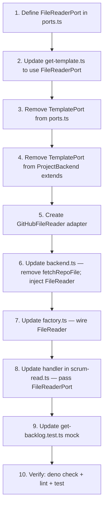

# Implementation Plan — Stories #43, #48, #89

> Sprint 2 · Epic: Clean Architecture Remediation All three stories are "In Progress" with ACs partially satisfied.

---

## Story #43 — Fix FieldValueMutator: GitHubClient + parameterized mutations

**Assessment:** All ACs appear satisfied in the current code. This is a verification + cleanup story.

- [ ] **43.1** Run `deno check` to confirm `FieldValueMutator` compiles cleanly with `GitHubClient` typing
- [ ] **43.2** Run `deno lint` to confirm zero errors
- [ ] **43.3** Run `deno test` on any co-located tests for `field-value-mutator`
- [ ] **43.4** Verify no string-interpolated GraphQL remains anywhere in `field-value-mutator.ts` (confirmed: all mutations use `$variable` syntax)
- [ ] **43.5** Update story status to "Done" and mark all ACs checked

**Files affected:**

- [`src/adapters/github/internal/field-value-mutator.ts`](src/adapters/github/internal/field-value-mutator.ts) — verify only

---

## Story #48 — Adopt focused ports in use cases

**Assessment:** Use-case function signatures already use focused ports (BacklogPort, SprintPort, StoryPort, etc.). Remaining work is cleanup of stale comments and test mock refactoring.

- [ ] **48.1** Fix stale JSDoc comments in use-case files that say "Receives backend: ProjectBackend":
  - [`src/scrum/get-sprint.ts`](src/scrum/get-sprint.ts:5) — update @param doc
  - [`src/scrum/get-template.ts`](src/scrum/get-template.ts:4) — update header comment
  - [`src/scrum/get-story.ts`](src/scrum/get-story.ts:4) — update header comment
  - [`src/scrum/get-burndown.ts`](src/scrum/get-burndown.ts:4) — update header comment
  - [`src/scrum/orient.ts`](src/scrum/orient.ts:4) — update header comment
- [ ] **48.2** Refactor [`get-backlog.test.ts`](src/scrum/get-backlog.test.ts:9) to use focused port mocks instead of monolithic `ProjectBackend`:
  - Replace `import type { ProjectBackend }` with `import type { BacklogPort, EpicPort }`
  - Rewrite `createMockBackend()` to return `BacklogPort & EpicPort` (only 3 methods needed: `getBacklogStories`, `getOrphanImpediments`, `getEpics`)
  - Remove stub implementations for unused methods (~110 lines of dead mock code)
- [ ] **48.3** Run `deno check` on all `src/scrum/` files — verify zero errors
- [ ] **48.4** Run `deno lint` — verify zero errors
- [ ] **48.5** Run `deno test src/scrum/get-backlog.test.ts` — verify all tests pass with new mock
- [ ] **48.6** Update story status to "Done" and mark all ACs checked

**Files affected:**

- [`src/scrum/get-sprint.ts`](src/scrum/get-sprint.ts) — comment fix
- [`src/scrum/get-template.ts`](src/scrum/get-template.ts) — comment fix
- [`src/scrum/get-story.ts`](src/scrum/get-story.ts) — comment fix
- [`src/scrum/get-burndown.ts`](src/scrum/get-burndown.ts) — comment fix
- [`src/scrum/orient.ts`](src/scrum/orient.ts) — comment fix
- [`src/scrum/get-backlog.test.ts`](src/scrum/get-backlog.test.ts) — mock refactor (primary change)

---

## Story #89 — Remove `fetchRepoFile` from the backend port

**Assessment:** Zero ACs satisfied. Full implementation needed. This unblocks #91 (item body templates).



### Detailed Steps

- [ ] **89.1** Define `FileReaderPort` in [`src/scrum/ports.ts`](src/scrum/ports.ts):
  ```typescript
  export interface FileReaderPort {
    fetchRepoFile(path: string): Promise<string>;
  }
  ```
  Place it near the other focused ports (before `ProjectReader`).

- [ ] **89.2** Update [`src/scrum/get-template.ts`](src/scrum/get-template.ts) — change import from `TemplatePort` to `FileReaderPort`:
  - Line 7: `import type { FileReaderPort } from "./ports.ts";`
  - Line 16: `backend: FileReaderPort`

- [ ] **89.3** Remove `TemplatePort` interface from [`src/scrum/ports.ts`](src/scrum/ports.ts:279-281):
  - Delete lines 273-281 (the `TemplatePort` interface + JSDoc)
  - Delete the comment block at lines 339-340 about TemplatePort

- [ ] **89.4** Remove `TemplatePort` from `ProjectBackend` extends clause in [`src/scrum/ports.ts`](src/scrum/ports.ts:341):
  - Change `export interface ProjectBackend extends ProjectReader, ProjectWriter, TemplatePort {}`
  - To: `export interface ProjectBackend extends ProjectReader, ProjectWriter {}`

- [ ] **89.5** Create `GitHubFileReader` adapter class. Two options:
  - **Option A (recommended):** New file [`src/adapters/github/internal/file-reader.ts`](src/adapters/github/internal/file-reader.ts) wrapping `fetchRepoFile` from `contents.ts`. Implements `FileReaderPort`.
  - **Option B:** Reuse existing `contents.ts` — export a class that implements `FileReaderPort` directly.

  Choose **Option A** for clean separation:
  ```typescript
  import type { FileReaderPort } from "../../../scrum/ports.ts";
  import { fetchRepoFile } from "./contents.ts";

  export class GitHubFileReader implements FileReaderPort {
    constructor(private readonly owner: string, private readonly repo: string) {}
    fetchRepoFile(path: string): Promise<string> {
      return fetchRepoFile(this.owner, this.repo, path);
    }
  }
  ```

- [ ] **89.6** Update [`src/adapters/github/backend.ts`](src/adapters/github/backend.ts):
  - Remove import of `fetchRepoFile` from `./internal/contents.ts` (line 9)
  - Remove `fetchRepoFile` method (lines 195-197)
  - The backend no longer implements `TemplatePort` (which no longer exists)

- [ ] **89.7** Update [`src/adapters/github/factory.ts`](src/adapters/github/factory.ts) — create and wire `GitHubFileReader`:
  - Import `GitHubFileReader` from the new file
  - Instantiate with `owner` and `repo`
  - Export it so tool handlers can consume it

- [ ] **89.8** Update tool handler in [`src/tools/scrum-read.ts`](src/tools/scrum-read.ts) — `scrum_get_template` handler:
  - Pass `FileReaderPort` (GitHubFileReader instance) instead of `ProjectBackend` to `getTemplateUseCase`

- [ ] **89.9** Update [`src/scrum/get-backlog.test.ts`](src/scrum/get-backlog.test.ts):
  - Remove `fetchRepoFile` from the mock (no longer part of `ProjectBackend`)

- [ ] **89.10** Search for any remaining references to `TemplatePort`:
  - Run: `rg "TemplatePort" src/` — should return zero results
  - Run: `rg "fetchRepoFile" src/scrum/` — should return zero results (only adapter layer references)

- [ ] **89.11** Run `deno check` — verify zero type errors
- [ ] **89.12** Run `deno lint` — verify zero errors
- [ ] **89.13** Run `deno test` — verify all tests pass
- [ ] **89.14** Update story status to "Done" and mark all ACs checked

**Files affected:**

| File                                                                                         | Action                                                                                   |
| -------------------------------------------------------------------------------------------- | ---------------------------------------------------------------------------------------- |
| [`src/scrum/ports.ts`](src/scrum/ports.ts)                                                   | ADD `FileReaderPort`, REMOVE `TemplatePort`, REMOVE `TemplatePort` from `ProjectBackend` |
| [`src/scrum/get-template.ts`](src/scrum/get-template.ts)                                     | Swap `TemplatePort` → `FileReaderPort`                                                   |
| [`src/adapters/github/internal/file-reader.ts`](src/adapters/github/internal/file-reader.ts) | **NEW** — `GitHubFileReader` class                                                       |
| [`src/adapters/github/backend.ts`](src/adapters/github/backend.ts)                           | Remove `fetchRepoFile` import and method                                                 |
| [`src/adapters/github/factory.ts`](src/adapters/github/factory.ts)                           | Wire `GitHubFileReader`                                                                  |
| [`src/tools/scrum-read.ts`](src/tools/scrum-read.ts)                                         | Pass `FileReaderPort` to template use-case                                               |
| [`src/scrum/get-backlog.test.ts`](src/scrum/get-backlog.test.ts)                             | Remove `fetchRepoFile` from mock                                                         |
| [`src/adapters/github/internal/contents.ts`](src/adapters/github/internal/contents.ts)       | No change (internal helper retained)                                                     |

---

## Execution Order

1. **Story #43** — Verification only (fastest, unblocks confidence)
2. **Story #48** — Comment fixes + test mock refactor (independent of #89)
3. **Story #89** — New port + adapter + cleanup (largest change, blocks #91)

Stories #43 and #48 can be done in parallel. Story #89 should follow after both are done since it touches `ports.ts` and `get-backlog.test.ts` which are also modified by #48.
