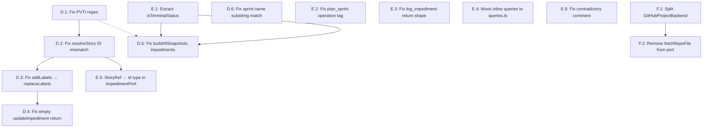

# Task List

Atomic, sequential tasks derived from the [REFACTORING.md](./REFACTORING.md) or [AUDIT.md](./AUDIT.md) documents.

Keep this document up to date, and replace it with tasks that are relevant.

---

## Phase D — Runtime Bug Fixes (Silent Functional Failures) FINISHED

These bugs return wrong data or break cross-tool workflows without raising errors.
Fix these before any agent-facing testing.

---

### Task D.1: Fix PVTI regex — orphan impediment detection never matches

- **File:** [`src/adapters/github/backend.ts:493`](src/adapters/github/backend.ts)
- **Type:** Bug fix
- **Description:** GitHub Projects v2 item IDs are alphanumeric (e.g., `PVTI_kwDOBZCr-c8AAA`). The current pattern only matches numeric suffixes, so `getOrphanImpediments()` silently treats every impediment issue as linked and returns an empty array for every project.

  Change line 493:

  ```typescript
  // WRONG — \d+ never matches real GitHub project item IDs
  const PVTI_PATTERN = /PVTI_\d+/;

  // CORRECT — alphanumeric + hyphens
  const PVTI_PATTERN = /PVTI_[\w-]+/;
  ```

- **Deliverable:** `getOrphanImpediments()` correctly identifies orphan issues (those with no `PVTI_[\w-]+` reference in their comments) and returns them in `scrum_get_backlog.orphan_impediments`.
- **Dependencies:** None
- **Verification:** Create an impediment issue in the repo with no comments; call `scrum_get_backlog` — verify it appears in `orphan_impediments`. Add a comment containing a `PVTI_` token — verify it disappears from the list.

---

### Task D.2: Fix `updateImpediment` — `resolveStory()` called with wrong ID type

- **Files:** [`src/adapters/github/backend.ts:617–628`](src/adapters/github/backend.ts), [`src/schemas/scrum.ts`](src/schemas/scrum.ts)
- **Type:** Bug fix (broken cross-tool workflow)
- **Description:** `getOrphanImpediments()` (line 512) and `getSprintImpediments()` (line 605) both store the GitHub Issue node ID (`I_kwD…`) in `ref.id`. But `updateImpediment` at line 623 passes this `ref` to `resolveStory()`, which expects a project item ID (`PVTI_…`). The result is that every `scrum_update_impediment` call against a listed impediment fails with a resolution error.

  Fix: remove the `resolveStory()` call from `updateImpediment`. The issue node ID stored in `ref.id` can be used directly as the GraphQL subject ID for the label mutation and comment. The `resolveStory()` indirection is only needed when going from a project item to an issue — that step is not needed here.
  1. **In `updateImpediment` (backend.ts:622–628):** Replace the `resolveStory` call with a direct assignment:

     ```typescript
     // REMOVE this block:
     const resolved = await resolveStory(ref, { graphql: this.gh.graphql });
     if (!resolved.issueId) {
       throw new Error(`Impediment "${ref.id}" is a Draft Issue…`);
     }
     // Use resolved.issueId throughout → replace with ref.id
     ```

     Then replace every `resolved.issueId` reference in the method body with `ref.id`.

  2. **Update schema description in `UpdateImpedimentSchema`:** Change the `id` field description from "Impediment project item ID" to "Impediment issue node ID as returned by `scrum_get_backlog.orphan_impediments` or `scrum_get_sprint.impediments` `ref.id` field."

- **Deliverable:** `scrum_update_impediment` succeeds when given an `id` from `scrum_get_backlog.orphan_impediments` or `scrum_get_sprint.impediments`. The `resolveStory` import can be removed from `updateImpediment` (but is still needed elsewhere in backend.ts).
- **Dependencies:** None (but D.1 should precede so that impediment IDs are actually populated before testing this fix)
- **Verification:** Call `scrum_get_backlog` — take an `id` from `orphan_impediments[0].ref.id`; call `scrum_update_impediment` with that id and `status: "in_progress"` — verify it succeeds.

---

### Task D.3: Fix `updateImpediment` — old status labels persist after update

- **File:** [`src/adapters/github/backend.ts:676–683`](src/adapters/github/backend.ts)
- **Type:** Bug fix
- **Description:** The mutation at line 678 uses `addLabelsToLabelable`, which only appends labels without removing any. Despite the code at lines 663–673 computing the correct full replacement set (`updatedLabelIds`), the wrong mutation means the old `status_open` label stays alongside the new `status_resolved`. The issue ends up with both labels.

  Change the mutation name and input field from `addLabelsToLabelable / subjectId` to `replaceLabelsOnLabelable / labelableId`:

  ```typescript
  // WRONG:
  await this.gh.graphql(
    `mutation UpdateIssueLabels($issueId: ID!, $labelIds: [ID!]!) {
      addLabelsToLabelable(input: { subjectId: $issueId, labelIds: $labelIds }) {
        issue { number }
      }
    }`,
    { issueId: ref.id, labelIds: updatedLabelIds },
  );

  // CORRECT:
  await this.gh.graphql(
    `mutation ReplaceIssueLabels($issueId: ID!, $labelIds: [ID!]!) {
      replaceLabelsOnLabelable(input: { labelableId: $issueId, labelIds: $labelIds }) {
        labelable { ... on Issue { number } }
      }
    }`,
    { issueId: ref.id, labelIds: updatedLabelIds },
  );
  ```

  The `updatedLabelIds` computation at lines 663–673 is correct — only the mutation call needs to change.

- **Deliverable:** After `scrum_update_impediment`, the issue has exactly one `status_*` label matching the new status. No old status labels remain.
- **Dependencies:** D.2 (must be able to reach the mutation line without failing on `resolveStory`)
- **Verification:** Create an issue with `status_open` label; call `scrum_update_impediment` with `status: "resolved"` — verify the issue has `status_resolved` only, and `status_open` is gone.

---

### Task D.4: Fix `updateImpediment` — returns empty `description` and `raised_at`

- **File:** [`src/adapters/github/backend.ts:640–711`](src/adapters/github/backend.ts)
- **Type:** Bug fix
- **Description:** The return value at lines 704–711 has `description: ""` and `raised_at: ""` because the fields are commented with "Would require fetching". Both values are available in the existing `GetIssue` query — they just aren't currently selected.
  1. **Extend the GraphQL query** at lines 641–652. Add `body` and `createdAt` to the `... on Issue` selection:

     ```graphql
     ... on Issue {
       number
       body
       createdAt
       labels(first: 20) { nodes { name id } }
       closed
       closedAt
     }
     ```

  2. **Extend the TypeScript type** at lines 632–640. Add the new fields:

     ```typescript
     node: {
       __typename: "Issue";
       number: number;
       body: string | null;      // add
       createdAt: string;        // add
       labels?: { nodes: Array<{ name: string; id: string }> };
       closed: boolean;
       closedAt: string | null;
     };
     ```

  3. **Populate the return value** at lines 704–711:
     ```typescript
     return {
       ref: { id: ref.id },
       description: issue.body ?? "", // was: ""
       status: impedimentStatus,
       raised_by: null,
       raised_at: issue.createdAt, // was: ""
       resolved_at: issue.closedAt,
     };
     ```

- **Deliverable:** `scrum_update_impediment` returns an `ImpedimentListing` with populated `description` and `raised_at`.
- **Dependencies:** D.2 (changes to the method must be sequential — apply to the already-fixed body from D.2)
- **Verification:** Call `scrum_update_impediment`; verify `description` equals the issue body text and `raised_at` is a valid ISO-8601 timestamp.

---

### Task D.5: Fix `buildAllSnapshots` — completed sprint entries always have empty impediments

- **File:** [`src/scrum/get-sprint.ts:132–179`](src/scrum/get-sprint.ts)
- **Type:** Bug fix
- **Description:** `buildSingleSnapshot` correctly calls `backend.getSprintImpediments(sprintRef)` (line 88) and sets `impediments` from the result. But `buildAllSnapshots` at line 177 hardcodes `impediments: []` for every completed sprint entry, making `scrum_get_sprint` with `sprint: "all"` return no impediments for any historical sprint.

  The fix uses the existing `getSprintImpediments` API and batches the calls with `Promise.all` to avoid sequential await inside the loop:
  1. After resolving `historyEntries` at line 139, build the snapshots in two steps. First compute sprint snapshots, then fetch impediments in parallel:
     ```typescript
     const completedSnapshots = await Promise.all(
       historyEntries.map(async (entry) => {
         const items = entry.stories.map(historyStoryToListing);
         const by_status: Record<string, number> = {};
         for (const item of items) {
           if (item.status)
             by_status[item.status] = (by_status[item.status] ?? 0) + 1;
         }
         const committedPoints = entry.stories.reduce(
           (s, st) => s + (st.points ?? 0),
           0,
         );
         const completedPoints = entry.stories
           .filter((st) => isTerminalStatus(st.status))
           .reduce((s, st) => s + (st.points ?? 0), 0);
         const impediments = await backend.getSprintImpediments(
           entry.info.name,
         );
         return {
           sprint: {
             /* same as existing */
           },
           items,
           total_count: items.length,
           totals: {
             by_status,
             story_points: committedPoints,
             committed_points: committedPoints,
             completed_points: completedPoints,
           },
           impediments,
         };
       }),
     );
     ```
     Replace the existing `for` loop that pushes snapshots with the result of this `Promise.all`.

  > **Note on `isTerminalStatus`:** This task requires a terminal-status check for completed points. Use the shared helper extracted in Task E.1 — sequence E.1 before or alongside this task.

- **Deliverable:** `scrum_get_sprint` with `sprint: "all"` includes correct `impediments` arrays for completed sprint snapshots, consistent with `scrum_get_history` behavior.
- **Dependencies:** E.1 (the `isTerminalStatus` helper is needed here), D.1 (impediments must be detectable)
- **Verification:** Link an impediment issue to a sprint via comment; call `scrum_get_sprint` with `sprint: "all"` — verify the impediment appears in that sprint's snapshot.

---

### Task D.6: Fix sprint name substring matching — "Sprint 1" matches inside "Sprint 10"

- **File:** [`src/adapters/github/backend.ts:583–596`](src/adapters/github/backend.ts)
- **Type:** Bug fix
- **Description:** `getSprintImpediments` identifies the sprint by checking whether `issue.body` or comments `.includes(sprintNameLower)`. For a sprint named "Sprint 1", this also matches "Sprint 10", "Sprint 11", etc. Sprint 1 impediments will incorrectly appear in Sprint 10's snapshot.

  Replace the `.includes()` calls with a word-boundary regex:

  ```typescript
  // At line 583 — add after sprintNameLower:
  const sprintNamePattern = new RegExp(
    `\\b${sprintName.replace(/[.*+?^${}()|[\]\\]/g, "\\$&")}\\b`,
    "i",
  );

  // Replace line 589:
  // WRONG: issue.body?.toLowerCase().includes(sprintNameLower)
  // CORRECT:
  const bodyMatches = sprintNamePattern.test(issue.body ?? "");

  // Replace lines 591–593:
  // WRONG: c.body?.toLowerCase().includes(sprintNameLower)
  // CORRECT:
  const commentMatches = comments.some((c) =>
    sprintNamePattern.test(c.body ?? ""),
  );
  ```

  The `sprintNameLower` variable and the regex can coexist — just replace the two `.includes()` usages. Remove `sprintNameLower` if it is no longer referenced after this change.

- **Deliverable:** `getSprintImpediments("Sprint 1")` does not return impediments that only mention "Sprint 10" or "Sprint 11".
- **Dependencies:** None
- **Verification:** Create an issue mentioning "Sprint 10"; call `getSprintImpediments("Sprint 1")` — verify it is excluded. Create an issue mentioning "Sprint 1" — verify it is included.

---

## Phase E — Code Quality FINISHED

These are correctness issues and DRY violations that will cause confusion or incorrect diagnostics, but don't break the primary data path.

---

### Task E.1: Extract duplicated `isTerminalStatus` to shared domain rule

- **Files:** [`src/scrum/get-backlog.ts:46–56`](src/scrum/get-backlog.ts), [`src/scrum/get-history.ts`](src/scrum/get-history.ts), new: `src/domain/rules/status.ts`
- **Type:** Refactoring (DRY)
- **Description:** An identical 10-line `isTerminalStatus(status, config)` function is defined in both `get-backlog.ts` and `get-history.ts`. Pure domain rules belong in `src/domain/rules/`.
  1. **Create `src/domain/rules/status.ts`**:

     ```typescript
     import type { ScrumConfig } from "../config.ts";

     /**
      * Returns true when `status` matches the terminal (done) status declared in config.
      * Resolves via scrum.status[terminal=true] → backends.github.status_display.
      * Falls back to "Done" if no terminal key is found.
      */
     export const isTerminalStatus = (
       status: string | null,
       config: ScrumConfig,
     ): boolean => {
       const scrumStatus = config.scrum.status ?? {};
       const terminalKey = Object.entries(scrumStatus).find(
         ([, meta]) => meta.terminal,
       )?.[0];
       if (!terminalKey) return (status?.toLowerCase() ?? "") === "done";

       const ghConfig = config.backends.github as Record<string, unknown>;
       const statusDisplay =
         (ghConfig.status_display as Record<string, string>) ?? {};
       const displayValue = statusDisplay[terminalKey] ?? "Done";

       return (status?.toLowerCase() ?? "") === displayValue.toLowerCase();
     };
     ```

  2. **In `get-backlog.ts`:** Remove the local `isTerminalStatus` definition; add `import { isTerminalStatus } from "../domain/rules/status.ts";`.

  3. **In `get-history.ts`:** Same removal and import.

- **Deliverable:** `isTerminalStatus` is defined once. `get-backlog.ts` and `get-history.ts` import it from `src/domain/rules/status.ts`. `grep -r "isTerminalStatus" src/scrum/` returns no function definitions, only imports and call sites.
- **Dependencies:** None — but sequence before D.5 since that task uses this helper.
- **Verification:** `deno lint` passes. `grep -r "const isTerminalStatus" src/` returns exactly one result (in `src/domain/rules/status.ts`).

---

### Task E.2: Fix wrong `operation` tag in `scrum_plan_sprint` error handler

- **File:** [`src/tools/scrum-write.ts:364`](src/tools/scrum-write.ts)
- **Type:** Bug fix (error telemetry)
- **Description:** The outer `catch` block of the `scrum_plan_sprint` handler at line 364 uses `operation: "create_story"` — copy-paste residue from `scrum_create_story`. Error telemetry and logs will misattribute plan-sprint failures as story-creation failures.

  Change line 364:

  ```typescript
  // WRONG:
  content: [{ type: "text", text: enrichError(err, { operation: "create_story" }) }],

  // CORRECT:
  content: [{ type: "text", text: enrichError(err, { operation: "plan_sprint" }) }],
  ```

- **Deliverable:** Plan-sprint errors are logged with `operation: "plan_sprint"`.
- **Dependencies:** None
- **Verification:** `grep -n "plan_sprint" src/tools/scrum-write.ts` — confirms the outer catch block uses the correct tag.

---

### Task E.3: Fix `scrum_log_impediment` — returns full `Story` instead of `ImpedimentListing`

- **File:** [`src/tools/scrum-write.ts:439–443`](src/tools/scrum-write.ts)
- **Type:** Bug fix (tool return shape)
- **Description:** The `scrum_log_impediment` handler currently returns `detail.story` (the full `Story` object). `REFACTORING.md §6b` specifies the return shape as:

  ```typescript
  { impediment: ImpedimentListing; affects: { story?: StoryRef; sprint?: SprintRef } | null }
  ```

  An agent expecting `result.impediment` to log or display the created impediment receives nothing useful.

  Replace the current return block:

  ```typescript
  // REMOVE:
  const detail = await backend.getStoryDetail(storyRef);
  return {
    content: [{ type: "text", text: JSON.stringify(detail.story, null, 2) }],
  };

  // REPLACE WITH:
  const impediment: ImpedimentListing = {
    ref: storyRef,
    description: params.description,
    status: "open",
    raised_by: null, // not known at creation time without a re-fetch
    raised_at: new Date().toISOString(),
    resolved_at: null,
  };
  return {
    content: [
      {
        type: "text",
        text: JSON.stringify(
          { impediment, affects: params.affects ?? null },
          null,
          2,
        ),
      },
    ],
  };
  ```

  This avoids an extra `getStoryDetail` round-trip (latency) and returns the shape the agent expects. `raised_by` is omitted intentionally — it would require a re-fetch, and the caller already knows who raised it.

- **Deliverable:** `scrum_log_impediment` returns `{ impediment: ImpedimentListing, affects: ... }`. The `getStoryDetail` import can be removed from this code path if it is no longer needed elsewhere in the handler.
- **Dependencies:** None
- **Verification:** Call `scrum_log_impediment`; verify the response body has `impediment.ref`, `impediment.description`, `impediment.status === "open"`, and `affects` matching what was passed (or `null` if omitted).

---

### Task E.4: Move inline GraphQL queries to `queries.ts`

- **Files:** [`src/adapters/github/backend.ts`](src/adapters/github/backend.ts), [`src/adapters/github/queries.ts`](src/adapters/github/queries.ts)
- **Type:** Code style / consistency
- **Description:** `getOrphanImpediments()` (line ~449) and `getSprintImpediments()` (line ~539) each define multi-line GraphQL query strings inline. Every other query in the project is a named constant in `queries.ts`. The two queries are also nearly identical — same field set, same label filter — differing only in which issues are included.
  1. In `queries.ts`, add two named exports:

     ```typescript
     export const GET_IMPEDIMENT_ISSUES_QUERY = `
       query GetImpediments($owner: String!, $repo: String!, $states: [IssueState!]) {
         repository(owner: $owner, name: $repo) {
           issues(first: 100, labels: ["impediment"], states: $states) {
             nodes {
               id
               title
               body
               state
               createdAt
               closedAt
               author { login }
               comments(first: 100) {
                 nodes { body }
               }
             }
           }
         }
       }
     `;
     ```

     A single query parameterized by `$states` covers both use cases: `[OPEN]` for orphans and `[OPEN, CLOSED]` for sprint impediments.

  2. In `getOrphanImpediments()` and `getSprintImpediments()` in `backend.ts`: remove the inline query strings and replace with the imported constant.

  3. Update the import line at the top of `backend.ts` to include the new constant from `queries.ts`.

- **Deliverable:** No inline multi-line GraphQL strings remain in `backend.ts`. Both impediment methods use the shared `GET_IMPEDIMENT_ISSUES_QUERY` constant.
- **Dependencies:** None (but recommended after D.1–D.6 to avoid conflating bug fixes with structural changes)
- **Verification:** `grep -n "query Get" src/adapters/github/backend.ts` returns no results. Both methods import from `queries.ts`.

---

### Task E.5: Fix `ImpedimentPort.updateImpediment` — uses `StoryRef` for an impediment reference

- **File:** [`src/scrum/ports.ts`](src/scrum/ports.ts)
- **Type:** Type correctness / semantic clarity
- **Description:** `ImpedimentPort.updateImpediment` is declared as:

  ```typescript
  updateImpediment(ref: StoryRef, ...): Promise<ImpedimentListing>
  ```

  `StoryRef` is semantically wrong — impediments are not stories. Using a story ref type here causes confusion and may mislead future callers into passing story IDs where impediment IDs are expected.

  Change the parameter type to the inline structural type already used elsewhere for opaque IDs:

  ```typescript
  // In ImpedimentPort:
  updateImpediment(
    ref: { id: string },
    status: "open" | "in_progress" | "resolved",
    resolutionNotes?: string,
  ): Promise<ImpedimentListing>;
  ```

  Update the implementation signature in `backend.ts` accordingly (line 618: `ref: StoryRef` → `ref: { id: string }`).

- **Deliverable:** `ImpedimentPort.updateImpediment` accepts `{ id: string }`, not `StoryRef`. The change is non-breaking since `StoryRef` is structurally compatible with `{ id: string }`.
- **Dependencies:** D.2 (D.2 already removes the `resolveStory` call that used `StoryRef`-specific behavior)
- **Verification:** `deno check` passes. `grep "StoryRef" src/scrum/ports.ts` does not appear in the `ImpedimentPort` definition.

---

### Task E.6: Remove contradictory export comment in `contents.ts`

- **File:** [`src/adapters/github/internal/contents.ts`](src/adapters/github/internal/contents.ts)
- **Type:** Code clarity
- **Description:** `decodeRepoFileContent` has two contradictory comments: one says "Exported for unit testing" and a `todo` says "this function is only used inside unit tests. Doesn't have to be exported." Decide and apply:
  - If the function is used only in tests: unexport it (`const decodeRepoFileContent` instead of `export const decodeRepoFileContent`) and remove both comments.
  - If it should stay exported: remove the `todo` comment.

  Check whether any non-test file imports `decodeRepoFileContent`:

  ```sh
  grep -r "decodeRepoFileContent" src/
  ```

  If the only imports are in test files, unexport it and delete both conflicting comments.

- **Deliverable:** `decodeRepoFileContent` has a single, accurate visibility decision. No contradictory comments remain.
- **Dependencies:** None
- **Verification:** `deno lint` passes. If unexported: `grep -r "export.*decodeRepoFileContent" src/` returns no results.

---

## Phase F — Incomplete Architecture

Work planned in the original refactoring effort that was not completed during Phases A–C.

---

### Task F.1: Split `GitHubProjectBackend` — Single Responsibility Principle

- **File:** [`src/adapters/github/backend.ts`](src/adapters/github/backend.ts) (1,303 lines)
- **Type:** Refactoring (class decomposition)
- **Description:** `GitHubProjectBackend` has grown to more than 1,000 lines across Phases A–C. The planned split from `REFACTORING.md §6a` is unblocked. Extract 6 cohesive services into `adapters/github/internal/`. `GitHubProjectBackend` becomes a ~200-line coordinator that delegates via constructor injection (DIP):

  | New file                              | Responsibility                        | Key methods to move                                                                                         |
  | ------------------------------------- | ------------------------------------- | ----------------------------------------------------------------------------------------------------------- |
  | `internal/label-resolver.ts`          | Label CRUD + milestone lookup         | `resolveLabelNodeIds`, `resolveOrCreateLabel`, `addLabel`, `hashToColor`, `fetchRepoNodeId`                 |
  | `internal/field-value-mutator.ts`     | Board field mutations                 | `clearField`, `setFieldStatus`, `setFieldSprint`, `setFieldStoryPoints`, `setFieldPriority`                 |
  | `internal/burndown-calculator.ts`     | Burndown data + completion timestamps | `getBurndownInput`, `resolveCompletionTimestamps`, `fetchAuditLogCompletions`, `fetchIssueCloseCompletions` |
  | `internal/sprint-history-service.ts`  | Completed sprint data                 | `getCompletedSprintHistory`                                                                                 |
  | `internal/vocabulary-manager.ts`      | Vocabulary option management          | `addVocabulary`, `addStatusOption`, `addPriorityOption`, `addSingleSelectOption`                            |
  | `internal/user-milestone-resolver.ts` | User + milestone resolution           | `resolveUserNodeId`, `resolveUserNodeIds`, `resolveOrCreateMilestoneNodeId`                                 |

  Methods remaining on `GitHubProjectBackend` after extraction (~200 lines):
  `getPlatformState`, `getSprintStories`, `getBacklogStories`, `getStoryDetail`, `createStory`, `updateStory`, `setField`, `addComment`, `getOrphanImpediments`, `getSprintImpediments`, `updateImpediment`, `fetchRepoFile`.

  Each internal service receives only the dependencies it needs (graphql client, config, owner, repo) via constructor — no access to `GitHubProjectBackend` internals.

- **Deliverable:** `backend.ts` is ≤ 250 lines. All extracted services live in `adapters/github/internal/`. `GitHubProjectBackend` implements `ProjectBackend` via composition. Zero behavioral change.
- **Dependencies:** None — Phase C.1 (interface split) and C.2 (file migration) are already complete.
- **Verification:** `deno lint` passes. `wc -l src/adapters/github/backend.ts` outputs ≤ 250.

---

### Task F.2: Remove `fetchRepoFile()` from `ProjectBackend` / `TemplatePort`

- **Files:** [`src/scrum/ports.ts`](src/scrum/ports.ts), [`src/scrum/get-template.ts`](src/scrum/get-template.ts), [`src/tools/scrum-read.ts`](src/tools/scrum-read.ts)
- **Type:** Interface cleanup (platform-agnostic contract)
- **Description:** `TemplatePort` (and via composition `ProjectReader` / `ProjectBackend`) exposes `fetchRepoFile(path: string): Promise<string>`. This is a GitHub Contents API method on a platform-agnostic interface. A Jira or Linear backend would have no equivalent.
  1. Remove `TemplatePort` from `src/scrum/ports.ts` entirely (or keep the interface but remove it from `ProjectReader`'s `extends` list).
  2. In `get-template.ts`: instead of calling `backend.fetchRepoFile(path)`, import `fetchRepoFile` directly from `src/adapters/github/internal/contents.ts`. This is acceptable in a use-case function only if the tool layer passes the GitHub-specific fetcher as an injected dependency. Preferred approach: move the `fetchRepoFile` call into the tool handler in `scrum-read.ts` and remove `getTemplateUseCase` entirely if it has no remaining platform-agnostic logic.
  3. Remove `fetchRepoFile()` from `GitHubProjectBackend` once the interface no longer requires it (the implementation in `internal/contents.ts` still exists and is used directly).

- **Deliverable:** `ProjectBackend`, `ProjectReader`, and their focused sub-interfaces contain no GitHub-specific methods. `grep -r "fetchRepoFile" src/scrum/` returns zero results.
- **Dependencies:** F.1 (class decomposition; `fetchRepoFile` delegating to `internal/contents.ts` is cleaner after the split), C.4 already complete (`contents.ts` exists).
- **Verification:** `deno lint` passes. `scrum_get_template` still works end-to-end. `grep -r "fetchRepoFile" src/scrum/` returns no results.

---

## Execution Order Summary

```
Phase D (Runtime Bugs)   → E.1 → D.1 → D.2 → D.3 → D.4 → D.5 → D.6
Phase E (Code Quality)   → E.1 → E.2 → E.3 → E.4 → E.5 → E.6
Phase F (Architecture)   → F.1 → F.2
```

**Dependency graph:**



**Key execution notes:**

- **E.1 first** — the `isTerminalStatus` shared helper is needed by both the existing use cases and D.5. Do it before any other task.
- **D.1 → D.2 → D.3 → D.4 are sequential** — each fix builds on the previous one in the same `updateImpediment` / `getOrphanImpediments` code path.
- **D.5 depends on E.1** — the `buildAllSnapshots` refactor calls `isTerminalStatus` from the shared module.
- **D.6 and E.2 / E.3 / E.4 / E.6 are fully independent** — they can be done in any order alongside Phase D.
- **E.5 follows D.2** — the type change in `ImpedimentPort` aligns with D.2's removal of `resolveStory`, making both changes consistent.
- **F.1 before F.2** — `fetchRepoFile` removal is cleaner once `backend.ts` is decomposed and `contents.ts` is the canonical location.
