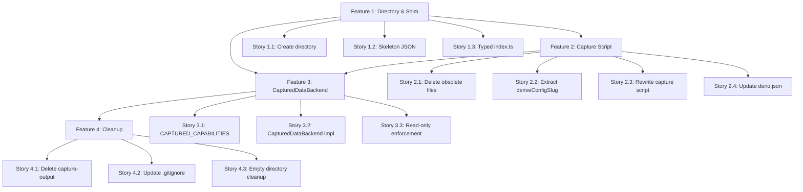

# Fixture Capture Refactoring — Project Plan

## Epic Overview

**Epic Name:** Fixture Capture Refactoring

**Epic Description:** Replace the manual, GitHub-coupled fixture capture pipeline with a port-only automated system that directly outputs importable test fixtures.

**Business Value:**

- Eliminates manual copy-paste step (saves ~15min per fixture refresh)
- Decouples from GitHub internals — survives backend adapter swaps
- Enables cross-backend fixture generation (GitHub → Jira etc.)
- Reduces script size from ~640 lines to ~80 lines

**Success Metrics:**

- No raw GraphQL in capture script
- No [`extractGitHubOwnerRepo()`](scripts/capture-test-fixtures.ts) or GitHub-specific functions
- Single [`captured.json`](src/test/__fixtures__/captured.json) output file directly importable by tests
- [`CapturedDataBackend`](src/test/support/captured-backend.ts) passes all abstract method contracts
- `deno task test` and `deno task depcruise` pass after each phase

**Key Milestones:**

1. Fixture directory and typed shim established
2. Port-only capture script operational
3. `CapturedDataBackend` ready for test injection
4. Old capture infrastructure removed

---

## Feature Breakdown

### Feature 1: Fixture Directory & Shim

**Description:** Create [`src/test/__fixtures__/`](src/test/__fixtures__/) with a skeleton [`captured.json`](src/test/__fixtures__/captured.json) and a fully typed [`index.ts`](src/test/__fixtures__/index.ts) that re-exports port types. This is the foundation — establishes the import path before any data exists.

**Stories:** 1.1 Create [`src/test/__fixtures__/`](src/test/__fixtures__/) directory 1.2 Write skeleton [`captured.json`](src/test/__fixtures__/captured.json) with `capturedAt`, `schemaVersion`, `profiles: {}` 1.3 Write [`index.ts`](src/test/__fixtures__/index.ts) with [`CapturedProfile`](src/test/__fixtures__/index.ts), [`CapturedFixtures`](src/test/__fixtures__/index.ts) interfaces and convenience exports 1.4 Verify `deno task test` and `deno lint` pass

### Feature 2: Port-Only Capture Script

**Description:** Rewrite [`scripts/capture-test-fixtures.ts`](scripts/capture-test-fixtures.ts) to call only port methods ([`createBackend`](src/adapters/factory.ts) → [`getPlatformState`](src/scrum/ports.ts) → [`findItems`](src/scrum/ports.ts) → [`getStoryDetail`](src/scrum/ports.ts)). Remove all GraphQL, GitHub internals, CLI flags, and augmentation logic.

**Stories:** 2.1 Delete [`scripts/capture/types.ts`](scripts/capture/types.ts) and [`scripts/capture/augment-config.yml`](scripts/capture/augment-config.yml) 2.2 Extract [`deriveConfigSlug()`](scripts/capture/slug.ts) to [`scripts/capture/slug.ts`](scripts/capture/slug.ts) with simplified signature `(configPath: string) => string` 2.3 Rewrite main script — only positional args, no flags, no GraphQL 2.4 Update [`deno.json`](deno.json) `capture-fixtures` task with restricted `--allow-write` 2.5 Run capture against real configs, verify output 2.6 Run `deno task test` and `deno lint`

### Feature 3: CapturedDataBackend

**Description:** Implement [`CapturedDataBackend`](src/test/support/captured-backend.ts) as a full [`AbstractProjectBackend`](src/adapters/abstract-backend.ts) subclass that serves real captured data. Must implement **ALL** abstract methods including `composeStorySnapshot`, `composeStoryAfterSetField`, `composeStoryAfterStoryUpdate`, `composeStoryAfterCreateStory`, `getEpics`, `getSprintCompletion`, `getAnalytics`, `getBoardHealth`, `getSprintImpediments`, `getOrphanImpediments` (not just the 3 read methods from the existing plan).

**Stories:** 3.1 Define [`CAPTURED_CAPABILITIES`](src/adapters/capabilities.ts) constant 3.2 Implement [`CapturedDataBackend`](src/test/support/captured-backend.ts) with all abstract methods 3.3 Implement write methods as throwing errors 3.4 Verify `deno task test` and `deno lint` pass 3.5 Add `.gitattributes` entry for [`captured.json`](src/test/__fixtures__/captured.json)

### Feature 4: Old Infrastructure Cleanup

**Description:** Remove the old [`scripts/capture-output/`](scripts/capture-output/) directory (including flag-garbage directories), update [`.gitignore`](.gitignore), and verify no dangling references remain.

**Stories:** 4.1 Delete [`scripts/capture-output/`](scripts/capture-output/) entirely 4.2 Add `scripts/capture-output/` to [`.gitignore`](.gitignore) 4.3 Delete [`scripts/capture/`](scripts/capture/) directory if empty (after Phase 2) 4.4 Search for references to `capture-output`, `augment-config`, raw GraphQL in docs 4.5 Run `deno task test` and `deno task depcruise`

---

## Dependency Graph

---

## Priority & Value Matrix

| Feature                 | Priority | Value  | Effort   | Rationale                                 |
| ----------------------- | -------- | ------ | -------- | ----------------------------------------- |
| F1: Directory & Shim    | P1       | High   | XS (1pt) | Foundation — everything depends on it     |
| F2: Capture Script      | P1       | High   | M (5pt)  | Core deliverable — most complex           |
| F3: CapturedDataBackend | P1       | High   | S (3pt)  | Needed for tests to consume captured data |
| F4: Cleanup             | P2       | Medium | XS (1pt) | Housekeeping — no feature impact          |

---

## Sprint Planning

**Estimated Total Effort:** ~10 story points **Team Velocity:** N/A (single-contributor) **Recommended Sprints:** 1 sprint (if full-time focus) or 2 sprints (if part-time)

### Sprint 1 (Week 1-2): Foundation + Implementation

- F1: Directory & Shim (1pt)
- F2: Capture Script (5pt)
- F3: CapturedDataBackend (3pt)

### Sprint 2 (Week 3-4): Cleanup + Validation

- F4: Cleanup (1pt)

---

## Risk Assessment

| Risk                                                                                                      | Likelihood | Impact | Mitigation                                                                                                                                                                  |
| --------------------------------------------------------------------------------------------------------- | ---------- | ------ | --------------------------------------------------------------------------------------------------------------------------------------------------------------------------- |
| Captured JSON shape incompatible with real backend output                                                 | Medium     | High   | Validate with dry-run before finalizing schema; the plan's `schemaVersion` field allows future migrations                                                                   |
| `CapabilityStatus` import issues                                                                          | Low        | Medium | Properly import [`CapabilityStatus`](src/adapters/capabilities.ts) from [`src/adapters/capabilities.ts`](src/adapters/capabilities.ts) (it's a `const` object, not an enum) |
| [`AbstractProjectBackend`](src/adapters/abstract-backend.ts) interface drift (new abstract methods added) | Low        | Medium | `deno check src/` catches missing method implementations at compile time                                                                                                    |
| Capture script fails against remote configs (MesseBuddy)                                                  | Medium     | Low    | The script should handle errors per-config gracefully; failing to capture one profile shouldn't abort others                                                                |
| Old `capture-output/` references in docs                                                                  | Medium     | Low    | Add a search step in Phase 4 for any stale references                                                                                                                       |

---

## References

- [Refactoring Plan](tasks/FIXTURE_CAPTURE_REFACTORING.md) — Detailed design document with architecture decision, file specs, and implementation phases
- [AbstractProjectBackend](src/adapters/abstract-backend.ts) — Base class that `CapturedDataBackend` must fully implement
- [Port Interfaces](src/scrum/ports.ts) — The `PlatformState`, `ItemSearchResult`, `StoryDetail` types and `ProjectBackend` interface
- [Factory](src/adapters/factory.ts) — `createBackend()` used by the capture script
- [Config Boot](src/scrum/config-boot.ts) — `loadScrumConfig()` used to bootstrap configs
- [Capabilities](src/adapters/capabilities.ts) — Where `CAPTURED_CAPABILITIES` and `CapabilityStatus` live
- [Current Capture Script](scripts/capture-test-fixtures.ts) — The ~640-line script being rewritten
