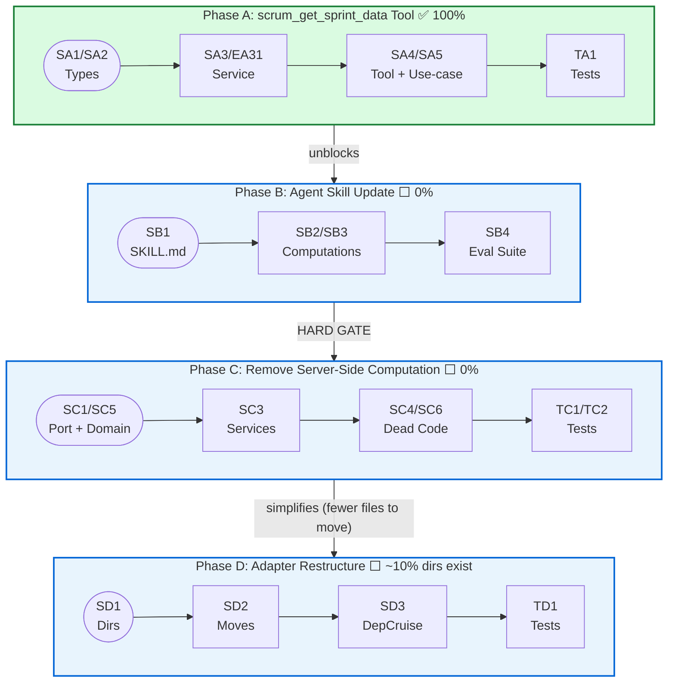

# Context Map — Server Refactoring (Phases B, C, D)

> Generated: 2026-06-08 (Updated 2026-06-08 with Phase C deep-dive corrections from 30+ source file investigation). Source: Systematic investigation of current codebase state against project plan ([`tasks/server-refactoring/project-plan.md`](tasks/server-refactoring/project-plan.md)), source refactoring plan ([`tasks/REFACTORING.md`](tasks/REFACTORING.md)). Principle: _Server Returns Facts; Agent Applies Judgment_

---

## Overall Status

| Phase | Description                          | Status                                                                        | Gate            |
| ----- | ------------------------------------ | ----------------------------------------------------------------------------- | --------------- |
| **A** | Add `scrum_get_sprint_data` Tool     | ✅ ~100% Complete                                                             | Unblocks B      |
| **B** | Agent Skill Update                   | ✅ Gate Cleared — see [`evaluation/report.md`](src/test/evaluation/report.md) | Hard gate for C |
| **C** | Remove Server-Side Computation       | ❌ 0% Not Started                                                             | Blocked by B    |
| **D** | Adapter Restructure (Five-Subfolder) | ⚠️ ~10% (dirs exist)                                                          | Benefits from C |

**Phase A delivery** (confirmed by investigation):

- [`SprintDataQuery`](src/scrum/ports.ts:190) and [`SprintRawData`](src/scrum/ports.ts:217) types defined in port interface
- [`SprintDataPort`](src/scrum/ports.ts:394) interface added to `ProjectReader` composition ([`line 419`](src/scrum/ports.ts:419))
- [`SprintDataService`](src/adapters/github/internal/read-services/sprint-data-service.ts) deployed at `read-services/sprint-data-service.ts`
- `burndown-completion.ts` extracted to [`src/adapters/github/internal/infra/burndown-completion.ts`](src/adapters/github/internal/infra/burndown-completion.ts)
- `scrum_get_sprint_data` registered in [`SCRUM_READ_TOOL_NAMES`](src/tools/scrum-read.ts:39) and tool table
- [`handleGetSprintData`](src/tools/handlers/read.ts:73) handler + [`getSprintDataUseCase`](src/scrum/get-sprint-data.ts:18) use-case exist
- `computeSprintEndDate` reused by SprintDataService ([`line 13`](src/adapters/github/internal/read-services/sprint-data-service.ts:13))
- `SprintRawDataSchema` + `SprintRawItemSchema` + `SprintInfoSchema` registered in [`scrum-outputs.ts`](src/schemas/scrum-outputs.ts:367)
- `completed_at` field added to [`ItemAggregate`](src/scrum/ports.ts:185)
- `getSprintData` has default `UnsupportedCapabilityError` in [`AbstractProjectBackend`](src/adapters/abstract-backend.ts:176)

---

## Phase A — Delivered Artifacts (already complete)

### Types Added

| Type                         | Location                                           | Notes                                          |
| ---------------------------- | -------------------------------------------------- | ---------------------------------------------- |
| `SprintDataQuery`            | [`src/scrum/ports.ts:190`](src/scrum/ports.ts:190) | `sprint_ref: SprintRef`                        |
| `SprintRawItem`              | [`src/scrum/ports.ts:200`](src/scrum/ports.ts:200) | Flat per-item, `completedAt: string \| null`   |
| `SprintRawData`              | [`src/scrum/ports.ts:217`](src/scrum/ports.ts:217) | `sprint: SprintInfo`, `items: SprintRawItem[]` |
| `ItemAggregate.completed_at` | [`src/scrum/ports.ts:185`](src/scrum/ports.ts:185) | Extended existing type                         |

### Port Method Added

| Method                                 | Interface                | Location                                                                       |
| -------------------------------------- | ------------------------ | ------------------------------------------------------------------------------ |
| `getSprintData(query)`                 | `SprintDataPort`         | [`src/scrum/ports.ts:395`](src/scrum/ports.ts:395)                             |
| `ProjectReader extends SprintDataPort` | Composition              | [`src/scrum/ports.ts:419`](src/scrum/ports.ts:419)                             |
| Default impl (throws)                  | `AbstractProjectBackend` | [`src/adapters/abstract-backend.ts:176`](src/adapters/abstract-backend.ts:176) |

### Tool Registration

| Tool                    | Schema                | Handler               |
| ----------------------- | --------------------- | --------------------- |
| `scrum_get_sprint_data` | `SprintRawDataSchema` | `handleGetSprintData` |

---

## Phase B — Files to Modify

### B. SB1 — Update Agent SKILL.md

| File                                | Purpose                | Changes Needed                                                                                  |
| ----------------------------------- | ---------------------- | ----------------------------------------------------------------------------------------------- |
| `.roo/skills/scrum-master/SKILL.md` | Agent skill definition | Replace all `scrum_get_analytics` + `scrum_get_board_health` calls with `scrum_get_sprint_data` |
| `.roo/skills/scrum-master/SKILL.md` | Agent skill definition | Add `history_window` parameter to sprint data queries                                           |
| `.roo/skills/scrum-master/SKILL.md` | Agent skill definition | Update tool descriptions to read `SprintRawData.completed_at` for burndown                      |

### SB2 — Agent Burndown + Velocity

| File                                | Purpose                 | Changes Needed                                                             |
| ----------------------------------- | ----------------------- | -------------------------------------------------------------------------- |
| `.roo/skills/scrum-master/SKILL.md` | Agent skill computation | Add agent-side burndown series calculation from `completed_at` timestamps  |
| `.roo/skills/scrum-master/SKILL.md` | Agent skill computation | Add agent-side ideal burndown line from committed points + sprint duration |
| `.roo/skills/scrum-master/SKILL.md` | Agent skill computation | Add agent-side velocity calculation from completed sprint history          |

### SB3 — Agent Readiness + Risk

| File                                | Purpose                 | Changes Needed                                                    |
| ----------------------------------- | ----------------------- | ----------------------------------------------------------------- |
| `.roo/skills/scrum-master/SKILL.md` | Agent skill computation | Add DoR criteria evaluation using `scrum_find_items` listing data |
| `.roo/skills/scrum-master/SKILL.md` | Agent skill computation | Add sprint risk counting (unestimated, blocked, no-assignee)      |
| `.roo/skills/scrum-master/SKILL.md` | Agent skill computation | Add readiness percentage derivation                               |

### SB4 — Agent Evaluation Suite (new)

| File                                   | Purpose             | Changes Needed                                                                        |
| -------------------------------------- | ------------------- | ------------------------------------------------------------------------------------- |
| `evaluation/burndown-parity.ts` (new)  | Parity test harness | Compare old `scrum_get_analytics` vs agent-side burndown from `scrum_get_sprint_data` |
| `evaluation/readiness-parity.ts` (new) | Parity test harness | Compare old `scrum_get_board_health` vs agent-side readiness from `scrum_find_items`  |
| `evaluation/report.md` (new)           | Evaluation report   | Document methodology, tolerance bounds, discrepancies                                 |

---

## Phase C — Files to Modify

> **Phase B gate status:** ✅ Cleared. Evaluation report at [`src/test/evaluation/report.md`](src/test/evaluation/report.md) confirms burndown/risk/readiness parity. Phase C may proceed.

### SC1 — Port Cleanup + Call Sites

| File                                                                         | Line(s) | Changes Needed                                                                                       |
| ---------------------------------------------------------------------------- | ------- | ---------------------------------------------------------------------------------------------------- |
| [`src/scrum/ports.ts`](src/scrum/ports.ts:364)                               | 364–366 | Remove `AnalyticsPort` interface entirely                                                            |
| [`src/scrum/ports.ts`](src/scrum/ports.ts:372)                               | 372–374 | Remove `BoardHealthPort` interface entirely                                                          |
| [`src/scrum/ports.ts`](src/scrum/ports.ts:430)                               | 430     | Remove `getSprintCompletion` from `ProjectReader`                                                    |
| [`src/scrum/ports.ts`](src/scrum/ports.ts:411-419)                           | 414–415 | Remove `AnalyticsPort` and `BoardHealthPort` from `ProjectReader extends` list                       |
| [`src/scrum/ports.ts`](src/scrum/ports.ts:89)                                | 89–93   | Remove `AnalyticsQuery` interface (no longer crosses port)                                           |
| [`src/scrum/ports.ts`](src/scrum/ports.ts:13)                                | 13–15   | Remove `AnalyticsResult`, `BacklogHealth` from imports (moved to adapter scope)                      |
| [`src/scrum/orient.ts`](src/scrum/orient.ts:90-101)                          | 90–101  | Replace `backend.getSprintCompletion()` call with `backend.getSprintData()` scoped to current sprint |
| [`src/scrum/orient.ts`](src/scrum/orient.ts:108-119)                         | 108–119 | Update `buildSprintContext()` — `sprintContextFromSprintInfo` no longer needs `workPct`              |
| [`src/domain/types.ts`](src/domain/types.ts:224)                             | 224     | Remove `SprintRiskStance` type (moves to agent)                                                      |
| [`src/domain/types.ts`](src/domain/types.ts:236)                             | 236     | Remove `riskStance` field from `SprintContext` interface                                             |
| [`src/domain/types.ts`](src/domain/types.ts:245-254)                         | 245–254 | Remove `computeRiskStance()` function                                                                |
| [`src/domain/types.ts`](src/domain/types.ts:260-289)                         | 260–289 | Update `sprintContextFromSprintInfo()` — remove `workPct` param, remove risk computation             |
| [`src/domain/types.ts`](src/domain/types.ts:474)                             | 474     | **KEEP** `SprintWindowMeta` — still used by `SprintContext` which is preserved                       |
| [`src/adapters/abstract-backend.ts`](src/adapters/abstract-backend.ts:159)   | 159     | Remove abstract `getAnalytics()` method                                                              |
| [`src/adapters/abstract-backend.ts`](src/adapters/abstract-backend.ts:164)   | 164     | Remove abstract `getBoardHealth()` method                                                            |
| [`src/adapters/abstract-backend.ts`](src/adapters/abstract-backend.ts:144)   | 144     | Remove abstract `getSprintCompletion()` method                                                       |
| [`src/adapters/abstract-backend.ts`](src/adapters/abstract-backend.ts:27-29) | 27–29   | Remove `AnalyticsResult`, `BacklogHealth` type imports                                               |

**Types to KEEP in ports.ts:** `BurndownStoryInput` ([line 242](src/scrum/ports.ts:242)), `BurndownInput` ([line 257](src/scrum/ports.ts:257)), `CompletionMap` ([line 263](src/scrum/ports.ts:263)), `SprintHistoryEntry` ([line 251](src/scrum/ports.ts:251)), `ItemAggregate` ([line 173](src/scrum/ports.ts:173)) — these are shared between SprintDataService and burndown-completion.ts, not tied to the removed analysis services.

### SC2 — Tool Deprecation Stubs

| File                                                             | Line(s)     | Changes Needed                                                                                          |
| ---------------------------------------------------------------- | ----------- | ------------------------------------------------------------------------------------------------------- |
| [`src/tools/handlers/read.ts`](src/tools/handlers/read.ts:53-63) | 53–63       | Replace `handleGetAnalytics` with stub returning `{ deprecated: true, use: "scrum_get_sprint_data" }`   |
| [`src/tools/handlers/read.ts`](src/tools/handlers/read.ts:65-71) | 65–71       | Replace `handleGetBoardHealth` with stub returning `{ deprecated: true, use: "scrum_get_sprint_data" }` |
| [`src/scrum/get-analytics.ts`](src/scrum/get-analytics.ts)       | entire file | Replace with stub use-case (or remove, handler calls stub directly)                                     |
| [`src/scrum/get-board-health.ts`](src/scrum/get-board-health.ts) | entire file | Replace with stub use-case (or remove, handler calls stub directly)                                     |
| [`src/tools/scrum-read.ts`](src/tools/scrum-read.ts:174-215)     | 174–215     | Keep tool registrations but update descriptions to indicate deprecation                                 |
| [`src/tools/scrum-read.ts`](src/tools/scrum-read.ts:19-20)       | 19–20       | Remove `AnalyticsResultSchema`, `BacklogHealthSchema` imports (no longer needed as output schemas)      |

### SC3 — Remove 4 Adapter Services

| File                                                                                  | Action                                                                                                                                                   |
| ------------------------------------------------------------------------------------- | -------------------------------------------------------------------------------------------------------------------------------------------------------- |
| [`analytics-service.ts`](src/adapters/github/internal/analytics-service.ts)           | 🗑️ DELETE — burndown + history computation                                                                                                               |
| [`board-health-service.ts`](src/adapters/github/internal/board-health-service.ts)     | 🗑️ DELETE — readiness + risk computation                                                                                                                 |
| [`sprint-history-service.ts`](src/adapters/github/internal/sprint-history-service.ts) | 🗑️ DELETE — velocity computation                                                                                                                         |
| [`burndown-calculator.ts`](src/adapters/github/internal/burndown-calculator.ts)       | 🗑️ DELETE — burndown series computation                                                                                                                  |
| [`backend.ts`](src/adapters/github/backend.ts)                                        | Remove `analyticsService`, `boardHealthService` deps (lines 95–96, 277–286), method bodies `getAnalytics()`, `getBoardHealth()`, `getSprintCompletion()` |
| [`create-backend.ts`](src/adapters/github/create-backend.ts)                          | Remove lines 115–116, 169–181 (4 service instantiations + wiring), update deps object                                                                    |
| [`backend.ts`](src/adapters/github/backend.ts)                                        | Remove `computeSprintCompletion()` delegation to storyQueryService (line 336–338)                                                                        |

**`_test_utils.ts`** ([src/adapters/github/internal/_test_utils.ts](src/adapters/github/internal/_test_utils.ts)) — **KEEP** (generic test infrastructure: `createGhSpy`, `makeConfig`, `makeCtx`). No content references the 4 deleted services.

### SC4 — Remove Dead Code

| File                                                                                         | Line(s)     | Function(s)                                                     | Action                                                                                                  |
| -------------------------------------------------------------------------------------------- | ----------- | --------------------------------------------------------------- | ------------------------------------------------------------------------------------------------------- |
| [`src/scrum/listing-mappers.ts`](src/scrum/listing-mappers.ts:51-69)                         | 51–69       | `historyEntryToItemListing()`                                   | 🗑️ DELETE (only caller was analytics-service)                                                           |
| [`src/adapters/github/mappers.ts`](src/adapters/github/mappers.ts:533-543)                   | 533–543     | `aggregateToBurndownInput()`                                    | 🗑️ DELETE (called by sprint-history-service:42 AND mappers-aggregate.test.ts:76)                        |
| [`src/adapters/github/mappers.ts`](src/adapters/github/mappers.ts:581-584)                   | 581–584     | `buildBurndownStoryInput()`                                     | 🗑️ DELETE (only called by burndown-calculator.ts:68)                                                    |
| [`src/scrum/sprint-math.ts`](src/scrum/sprint-math.ts:111-126)                               | 111–126     | `buildIdealLine()`                                              | 🗑️ DELETE after SC3 (called by analytics-service.ts:194 AND burndown-parity.test.ts:219)                |
| [`src/scrum/sprint-math.ts`](src/scrum/sprint-math.ts:131-167)                               | 131–167     | `buildDaySeries()`                                              | 🗑️ DELETE after SC3 (called by analytics-service.ts:195 AND burndown-parity.test.ts:187)                |
| [`src/scrum/sprint-math.ts`](src/scrum/sprint-math.ts:79-103)                                | 79–103      | `buildSprintWindow()`                                           | 🗑️ DELETE after SC3 (called by analytics-service.ts:181 AND burndown-parity.test.ts:184)                |
| [`src/domain/rules/readiness.ts`](src/domain/rules/readiness.ts)                             | entire file | `computeReadinessSummary()` + helpers                           | 🗑️ DELETE after SC3 (imported by board-health-service.ts:12)                                            |
| [`src/domain/types.ts`](src/domain/types.ts:312-316)                                         | 312–316     | `SprintRisk` interface                                          | 🗑️ DELETE after SC3 (only used by BacklogHealth:325)                                                    |
| [`src/test/evaluation/burndown-parity.test.ts`](src/test/evaluation/burndown-parity.test.ts) | 17, 183–265 | `buildDaySeries`, `buildIdealLine`, `buildSprintWindow` imports | 🗑️ DELETE test after parity gate cleared. Or KEEP for regression but remove function-import assertions. |

**NOTE:** `buildIdealLine()`, `buildDaySeries()`, and `buildSprintWindow()` are called by both `analytics-service.ts` AND `burndown-parity.test.ts`. Delete all three simultaneously after SC3 is complete. The evaluation test can be removed or its imports updated if kept for regression.

**Functions to KEEP (confirmed non-dead):**

| Function                           | File                                                                                              | Caller(s)                                                                                                       | Reason                                                                                              |
| ---------------------------------- | ------------------------------------------------------------------------------------------------- | --------------------------------------------------------------------------------------------------------------- | --------------------------------------------------------------------------------------------------- |
| `computeSprintEndDate()`           | [`src/scrum/sprint-math.ts:23`](src/scrum/sprint-math.ts:23)                                      | `mappers.ts:378`, `SprintDataService:81`, `burndown-calculator.ts:71`, `fake-backend.ts:79`                     | KEEP — needed by SprintDataService and mappers                                                      |
| `completionsFromBoardItems()`      | [`infra/burndown-completion.ts:19`](src/adapters/github/internal/infra/burndown-completion.ts:19) | `SprintDataService:100`, `burndown-calculator.ts:98`                                                            | KEEP — shared between SprintDataService + deleted service; becomes SprintDataService-only after SC3 |
| `parseAcceptanceCriteria()`        | `domain/rules/acceptance-criteria.ts`                                                             | `get-story.ts:29`                                                                                               | KEEP — needed for `ItemDetailResult.acceptance_criteria`                                            |
| `sprintCompletionFromAggregates()` | [`src/adapters/github/mappers.ts:546`](src/adapters/github/mappers.ts:546)                        | `story-query-service.ts:362`, `mappers-aggregate.test.ts:86`                                                    | KEEP — used by computeSprintCompletion                                                              |
| `buildAggregateFromRaw()`          | [`src/adapters/github/mappers.ts:494`](src/adapters/github/mappers.ts:494)                        | `SprintDataService:137`, `sprint-history-service:40`, `story-query-service:361`, `mappers-aggregate.test.ts:66` | KEEP — core aggregate builder used by SprintDataService and story-query-service                     |
| `ITEM_TYPES`                       | [`src/domain/types.ts:155`](src/domain/types.ts:155)                                              | `board-health-service.ts:13`, `orient.ts:11`, `scrum-outputs.ts` comment                                        | KEEP — used by orient use-case and schemas                                                          |

### SC5 — Remove Domain Readiness + Risk-Stance

| File                                                             | Line(s)     | Changes Needed                                                                          |
| ---------------------------------------------------------------- | ----------- | --------------------------------------------------------------------------------------- |
| [`src/domain/rules/readiness.ts`](src/domain/rules/readiness.ts) | entire file | 🗑️ DELETE — previously thought dead; actually imported by board-health-service.ts (SC3) |
| [`src/domain/types.ts`](src/domain/types.ts:224)                 | 224         | Remove `SprintRiskStance` type                                                          |
| [`src/domain/types.ts`](src/domain/types.ts:236)                 | 236         | Remove `riskStance` from `SprintContext`                                                |
| [`src/domain/types.ts`](src/domain/types.ts:245-254)             | 245–254     | Remove `computeRiskStance()`                                                            |
| [`src/domain/types.ts`](src/domain/types.ts:260-289)             | 260–289     | Simplify `sprintContextFromSprintInfo()` — remove `workPct` param                       |

### SC6 — Remove Output Schema Types

| Schema to Remove           | Location                                                           | Lines   | Used By                                                                                                  |
| -------------------------- | ------------------------------------------------------------------ | ------- | -------------------------------------------------------------------------------------------------------- |
| `ReadinessBreakdownSchema` | [`src/schemas/scrum-outputs.ts`](src/schemas/scrum-outputs.ts:214) | 214–218 | Inlined in `BacklogHealthSchema`                                                                         |
| `BacklogHealthSchema`      | [`src/schemas/scrum-outputs.ts`](src/schemas/scrum-outputs.ts:220) | 220–236 | `scrum_get_board_health` output schema; imported by `scrum-read.ts:20`, `scrum-read.contract.test.ts:18` |
| `SprintWindowMetaSchema`   | [`src/schemas/scrum-outputs.ts`](src/schemas/scrum-outputs.ts:238) | 238–244 | Inlined in `BurndownResponseSchema`, `SprintSnapshotSchema`                                              |
| `BurndownResponseSchema`   | [`src/schemas/scrum-outputs.ts`](src/schemas/scrum-outputs.ts:246) | 246–272 | Inlined in `AnalyticsResultSchema`                                                                       |
| `SprintTotalsSchema`       | [`src/schemas/scrum-outputs.ts`](src/schemas/scrum-outputs.ts:274) | 274–287 | Inlined in `SprintSnapshotSchema`                                                                        |
| `SprintSnapshotSchema`     | [`src/schemas/scrum-outputs.ts`](src/schemas/scrum-outputs.ts:289) | 289–294 | Inlined in `AnalyticsResultSchema`                                                                       |
| `AnalyticsResultSchema`    | [`src/schemas/scrum-outputs.ts`](src/schemas/scrum-outputs.ts:296) | 296–301 | `scrum_get_analytics` output schema; also imported by `scrum-read.ts:19`                                 |

**Block to delete:** Lines 214–301 in scrum-outputs.ts. Then remove imports from `scrum-read.ts:19-20` and `scrum-read.contract.test.ts:17-18`.

**Domain types to clean (all in [`src/domain/types.ts`](src/domain/types.ts)):**

| Type                 | Location                                             | Notes                           |
| -------------------- | ---------------------------------------------------- | ------------------------------- |
| `BurndownResponse`   | [`src/domain/types.ts:483`](src/domain/types.ts:483) | Server no longer produces       |
| `BurndownDayPoint`   | [`src/domain/types.ts:493`](src/domain/types.ts:493) | Server no longer produces       |
| `IdealDayPoint`      | [`src/domain/types.ts:500`](src/domain/types.ts:500) | Server no longer produces       |
| `BurndownStory`      | [`src/domain/types.ts:506`](src/domain/types.ts:506) | Server no longer produces       |
| `DataSource`         | [`src/domain/types.ts:467`](src/domain/types.ts:467) | Only used by `BurndownResponse` |
| `SprintSnapshot`     | [`src/domain/types.ts:561`](src/domain/types.ts:561) | Server no longer produces       |
| `SprintTotals`       | [`src/domain/types.ts:538`](src/domain/types.ts:538) | Server no longer produces       |
| `SprintTotalsKind`   | [`src/domain/types.ts:553`](src/domain/types.ts:553) | Derived from `SprintTotals`     |
| `BacklogHealth`      | [`src/domain/types.ts:325`](src/domain/types.ts:325) | Server no longer produces       |
| `SprintRisk`         | [`src/domain/types.ts:312`](src/domain/types.ts:312) | Only used by `BacklogHealth`    |
| `ReadinessBreakdown` | [`src/domain/types.ts:319`](src/domain/types.ts:319) | Only used by `BacklogHealth`    |
| `AnalyticsResult`    | [`src/domain/types.ts:574`](src/domain/types.ts:574) | Server no longer produces       |

---

## Phase D — Files to Move/Modify

### Current Adapter Internal File Listing

All files currently in `src/adapters/github/internal/` (flat except `assemblers/` and newly created `infra/` and `read-services/`):

```
internal/
├── _test_fixtures.ts                          → infra/ (test fixture data, no business logic)
├── _test_utils.ts                             → infra/ (test utilities, no business logic)
├── analytics-service.ts                       → 🗑️ DELETE (Phase C SC3)
├── board-health-service.ts                    → 🗑️ DELETE (Phase C SC3)
├── board-item-projection.ts                   → query-strategies/
├── board-item-projection.test.ts              → query-strategies/
├── board-scan-coordinator.ts                  → read-services/
├── burndown-calculator.ts                     → 🗑️ DELETE (Phase C SC3)
├── concurrent.ts                              → infra/
├── config-reloader.ts                         → infra/
├── epic-service.ts                            → read-services/
├── execution-engine.ts                        → query-pipeline/
├── field-value-mutator.ts                     → write-services/
├── field-value-mutator.test.ts                → write-services/
├── file-reader.ts                             → infra/
├── filter-strategy-router.ts                  → query-strategies/
├── filter-strategy-router.test.ts             → query-strategies/
├── http-client.ts                             → infra/
├── http-client.test.ts                        → infra/
├── impediment-service.ts                      → read-services/
├── infra-context.ts                           → infra/
├── item-filter.ts                             → query-strategies/
├── item-filter.test.ts                        → query-strategies/
├── iteration-classifier.ts                    → infra/
├── label-resolver.ts                          → write-services/
├── label-resolver.test.ts                     → write-services/
├── owner-graphql.ts                           → infra/
├── owner-graphql.test.ts                      → infra/
├── pagination.ts                              → query-pipeline/
├── pagination.test.ts                         → query-pipeline/
├── platform-request.ts                        → infra/
├── project-items-cache.ts                     → query-pipeline/
├── project-items-cache.test.ts                → query-pipeline/
├── project-items-query-builder.ts             → query-pipeline/
├── project-items-query-builder.test.ts        → query-pipeline/
├── project-items-response-types.ts            → infra/
├── resolve-issue-number.ts                    → infra/
├── resolve-issue-number.test.ts               → infra/
├── resolver.ts                                → infra/
├── result-normalizer.ts                       → query-strategies/
├── result-normalizer.test.ts                  → query-strategies/
├── search-query-builder.ts                    → query-strategies/
├── search-query-builder.test.ts               → query-strategies/
├── search-result-normalizer.ts                → query-strategies/
├── search-result-normalizer.test.ts           → query-strategies/
├── sprint-history-service.ts                  → 🗑️ DELETE (Phase C SC3)
├── story-mutation-service.ts                  → write-services/
├── story-mutation-service.test.ts             → write-services/
├── story-query-service.ts                     → read-services/
├── story-query-service.test.ts                → read-services/
├── user-milestone-resolver.ts                 → write-services/
├── user-milestone-resolver.test.ts            → write-services/
├── vocabulary-manager.ts                      → write-services/
├── vocabulary-manager.test.ts                 → write-services/
├── assemblers/                                → (keep as peer)
├── infra/                                     → (already exists, EA32 contributed burndown-completion.ts)
└── read-services/                             → (already exists, Phase A contributed sprint-data-service.ts)
```

### Classification Counts (after Phase C deletions)

| Destination         | Source Files        | Test Files | Total  |
| ------------------- | ------------------- | ---------- | ------ |
| `query-pipeline/`   | 4                   | 2          | 6      |
| `query-strategies/` | 7                   | 4          | 11     |
| `read-services/`    | 4 (incl. existing)  | 1          | 5      |
| `write-services/`   | 5                   | 3          | 8      |
| `infra/`            | 12 (incl. existing) | 4          | 16     |
| `assemblers/`       | (keep as peer)      | —          | —      |
| **Total**           | **32**              | **14**     | **46** |

> Note: After Phase C SC3 deletes 4 service files + SC4 removes dead code, the move scope reduces from 50 to ~46 files.

### Import Path Updates Required (Phase D)

Every file listed above must have its relative import paths updated when moved. Key patterns to update:

- `../../` → `../` for files moving from `internal/` to `internal/query-pipeline/`, etc.
- Cross-subfolder imports must respect dep-cruiser rules (see below)

---

## Risk Register

### Critical Risks

| #   | Risk                                                                                                                                                                            | Impact                                                                                                                 | Likelihood | Mitigation                                                                                                                                  | Status                          |
| --- | ------------------------------------------------------------------------------------------------------------------------------------------------------------------------------- | ---------------------------------------------------------------------------------------------------------------------- | ---------- | ------------------------------------------------------------------------------------------------------------------------------------------- | ------------------------------- |
| R1  | `readiness.ts` is NOT dead code — it IS imported by [`board-health-service.ts`](src/adapters/github/internal/board-health-service.ts:12) via `computeReadinessSummary`          | Must wait for Phase C SC3 (board-health-service.ts deletion). Cannot be deleted independently.                         | High       | Delete only as part of SC3 when `board-health-service.ts` is removed. Earlier zero-imports finding was incorrect (insufficient grep).       | ⚠️ Needs SC3 first              |
| R2  | `CapturedDataBackend` missing `getSprintData()` — will throw `UnsupportedCapabilityError`                                                                                       | Contract tests for `scrum_get_sprint_data` will fail against captured backend                                          | High       | Must add `getSprintData()` override to [`CapturedDataBackend`](src/test/support/captured-backend.ts) before TA1 can pass                    | ⚠️ Needs fix                    |
| R3  | `riskStance` coupled to `orient.ts` via `sprintContextFromSprintInfo()`                                                                                                         | Phase C SC1/SC5 must coordinate: remove `workPct` computation in orient.ts and `riskStance` in types.ts simultaneously | High       | Trace: orient.ts:108 → sprintContextFromSprintInfo(info, daysSince, workPct) → SprintContext.riskStance. Must strip at both ends in one PR. | ⚠️ Needs planning               |
| R4  | `computeSprintEndDate()` called from `mappers.ts:378` AND `SprintDataService`                                                                                                   | Marking it deprecated too early breaks live adapter code                                                               | Medium     | **KEEP** `computeSprintEndDate()` — the plan explicitly avoids removing it. Only deprecate `buildIdealLine`/`buildDaySeries`.               | ✅ Known                        |
| R5  | `buildSprintWindow()` is NOT called by SprintDataService but IS called by analytics-service.ts:181 + burndown-parity.test.ts:184                                                | Can be deleted after SC3; parity test must be updated or removed                                                       | Low        | Delete simultaneously with analytics-service.ts. burndown-parity.test.ts is no longer needed after gate clearance.                          | ✅ Safe — Phase B gate cleared  |
| R6  | `aggregateToBurndownInput()` called via `buildBurndownStoryInput()` at mappers.ts:583 → burndown-calculator.ts:68                                                               | Incorrect removal order                                                                                                | Medium     | Remove only after burndown-calculator.ts is deleted (SC3 → SC4)                                                                             | ⚠️ Sequencing                   |
| R7  | Phase C SC2 stubs must import `SprintDataQuery` — ensure no Zod schema mismatch                                                                                                 | Stub response shape must be valid for existing tool registrations                                                      | Low        | Keep tool registrations active; replace handler body only                                                                                   | ✅ Low risk                     |
| R8  | Phase C SC6 — domain type removal may cascade to other imports (`scrum-outputs.ts`, `filters.ts`, etc.)                                                                         | Breaking compilation of unrelated files                                                                                | Medium     | Run `deno check src/` after each removal to catch cascading imports                                                                         | ⚠️ Needs verification           |
| R9  | `SprintContextSchema` in [`src/schemas/scrum-outputs.ts:73`](src/schemas/scrum-outputs.ts:73) has a `riskStance` field (`z.enum(...)`) that must be removed in SC6              | Type mismatch between `OrientResultSchema` and `SprintContext` in domain                                               | Medium     | Remove `riskStance` from `SprintContextSchema` when removing `SprintRiskStance` from domain types in SC5. Both must be removed together.    | ⚠️ SC5/SC6 coupling             |
| R10 | `AnalyticsResult`, `BacklogHealth`, `SprintSnapshot`, `SprintTotals` types are imported by `fake-backend.ts`, `captured-backend.ts`, `abstract-backend.ts`, `github/backend.ts` | All test backend classes break if types are removed without updating their methods                                     | High       | Remove port methods first (SC1), then test implementations, then types. Never remove a type that a method signature still references.       | ⚠️ Sequencing chain SC1→SC3→SC6 |

### Confirmed Dead Code (zero imports)

| File                                                                               | Function                                                                                                                     | Evidence                                                              |
| ---------------------------------------------------------------------------------- | ---------------------------------------------------------------------------------------------------------------------------- | --------------------------------------------------------------------- |
| `src/domain/rules/readiness.ts` (moved — NOT dead code)                            | `computeReadinessSummary()` imported by [`board-health-service.ts`](src/adapters/github/internal/board-health-service.ts:12) | Will be removed as part of Phase C SC3, not independently             |
| [`src/scrum/listing-mappers.ts:51-69`](src/scrum/listing-mappers.ts:51-69)         | `historyEntryToItemListing()`                                                                                                | Only caller is analytics-service (deleted in SC3)                     |
| [`src/adapters/github/mappers.ts:533-543`](src/adapters/github/mappers.ts:533-543) | `aggregateToBurndownInput()`                                                                                                 | Only called by sprint-history-service and `buildBurndownStoryInput()` |
| [`src/adapters/github/mappers.ts:581-584`](src/adapters/github/mappers.ts:581-584) | `buildBurndownStoryInput()`                                                                                                  | Only called by burndown-calculator                                    |

### Functions to KEEP (confirmed non-dead)

| Function                           | File                                                                                              | Caller(s)                                               | Reason                                                     |
| ---------------------------------- | ------------------------------------------------------------------------------------------------- | ------------------------------------------------------- | ---------------------------------------------------------- |
| `computeSprintEndDate()`           | [`src/scrum/sprint-math.ts:23`](src/scrum/sprint-math.ts:23)                                      | `mappers.ts:378` (toSprintInfo), `SprintDataService:81` | Live production code                                       |
| `completionsFromBoardItems()`      | [`infra/burndown-completion.ts:19`](src/adapters/github/internal/infra/burndown-completion.ts:19) | `SprintDataService:100`, `BurndownCalculator`           | Shared between Phase A and C; extracted to infra/          |
| `parseAcceptanceCriteria()`        | `domain/rules/acceptance-criteria.ts`                                                             | `get-story.ts:29`                                       | Needed for `ItemDetailResult.acceptance_criteria`          |
| `buildSprintWindow()`              | [`src/scrum/sprint-math.ts:79`](src/scrum/sprint-math.ts:79)                                      | TBD — verify callers                                    | Not imported by SprintDataService; check analytics-service |
| `sprintCompletionFromAggregates()` | [`src/adapters/github/mappers.ts:546`](src/adapters/github/mappers.ts:546)                        | `board-health-service.ts`, backend                      | Live production code                                       |
| `buildAggregateFromRaw()`          | [`src/adapters/github/mappers.ts`](src/adapters/github/mappers.ts)                                | Multiple (SprintDataService, mappers-aggregate.test.ts) | Core aggregate builder                                     |

### Phase B Hard Gate

**Phase C must NOT begin until Phase B evaluation suite confirms output parity.**

The evaluation suite (SB4) must prove that agent-side burndown/velocity/risk/readiness from `scrum_get_sprint_data` + `scrum_find_items` match old server-computed values within acceptable tolerance. Without this gate, Phase C has no rollback path if the agent work is incomplete.

---

## Dependency Graph



### Internal Sub-dependencies (Phase C)

```
SC1 (Port cleanup) ──────────────→ SC6 (Schema cleanup)
        │                                  │
        ▼                                  ▼
SC5 (Domain cleanup) ───────────── SC6 needs SC1 done
        │                       (types removed when no
        ▼                       longer used by port)
SC3 (Service deletion)
        │
        ▼
SC4 (Dead code removal)
  (aggregateToBurndownInput
   removed only after SC3
   deletes sprint-history-service)
```

---

## Dep-Cruiser Rules (Phase D Target)

Rules to enforce after files are moved:

| Rule | Source              | Destination Constraint                                                             |
| ---- | ------------------- | ---------------------------------------------------------------------------------- |
| 1    | `query-pipeline/`   | May only be imported by `query-strategies/` and `read-services/` (via coordinator) |
| 2    | `query-strategies/` | May NOT import `read-services/` or `write-services/`                               |
| 3    | `read-services/`    | May NOT import paginator directly or `write-services/`                             |
| 4    | `write-services/`   | May NOT import `query-pipeline/`                                                   |
| 5    | `infra/`            | May NOT import any service folder                                                  |
| 6    | `assemblers/`       | May import `query-pipeline/` and `query-strategies/` (bridging role)               |

### Rules File

Existing rules in [`.dependency-cruiser.cjs`](.dependency-cruiser.cjs). New internal boundary rules should be added as additional `forbidden` entries targeting the `src/adapters/github/internal/` subfolder pattern.

---

## Test Files

### Phase A — New Tests

| Test                 | Location                                     | Purpose                                                               | Status      |
| -------------------- | -------------------------------------------- | --------------------------------------------------------------------- | ----------- |
| TA1 — Contract tests | `src/test/tools/scrum-read.contract.test.ts` | Validate `scrum_get_sprint_data` output against `SprintRawDataSchema` | ✅ Complete |

### Phase B — New Tests (Agent-side) — ✅ GATE CLEARED

| Test                  | Location                                                                                     | Purpose                                   | Status      |
| --------------------- | -------------------------------------------------------------------------------------------- | ----------------------------------------- | ----------- |
| SB4 — Burndown parity | [`src/test/evaluation/burndown-parity.test.ts`](src/test/evaluation/burndown-parity.test.ts) | Compare old vs. agent-side burndown       | ✅ Complete |
| SB4 — Risk parity     | [`src/test/evaluation/risk-parity.test.ts`](src/test/evaluation/risk-parity.test.ts)         | Compare old vs. agent-side risk/readiness | ✅ Complete |
| SB4 — Report          | [`src/test/evaluation/report.md`](src/test/evaluation/report.md)                             | Sign-off document                         | ✅ Complete |

### Phase C — Test Changes

| Test                                      | Location                                                                                         | Action                                                                             | Notes                                                                            |
| ----------------------------------------- | ------------------------------------------------------------------------------------------------ | ---------------------------------------------------------------------------------- | -------------------------------------------------------------------------------- |
| TC1 — Stub regression                     | `src/test/tools/` (new file or inline)                                                           | NEW — verify stub responses                                                        | Test both `scrum_get_board_health` and `scrum_get_analytics`                     |
| TC2 — Dep-cruiser compliance              | Run `deno task depcruise`                                                                        | VERIFY — zero violations                                                           | Check no references to removed services                                          |
| Existing: `scrum-read.contract.test.ts`   | [`src/test/tools/scrum-read.contract.test.ts`](src/test/tools/scrum-read.contract.test.ts)       | MODIFY — remove test cases at lines 98–151 (4 tests: 2 board-health + 2 analytics) | Also remove `AnalyticsResultSchema`, `BacklogHealthSchema` imports (lines 17–18) |
| Existing: `scrum-read.golden.test.ts`     | [`src/test/tools/scrum-read.golden.test.ts`](src/test/tools/scrum-read.golden.test.ts)           | UNCHANGED — no golden snapshots for analytics/board-health                         | Only orient + sprint_data + find_items snapshots exist                           |
| Existing: `scrum-mcp.integration.test.ts` | [`src/test/tools/scrum-mcp.integration.test.ts`](src/test/tools/scrum-mcp.integration.test.ts)   | VERIFY — still passes with stubs                                                   | Integration test uses full MCP path                                              |
| Existing: `burndown-parity.test.ts`       | [`src/test/evaluation/burndown-parity.test.ts`](src/test/evaluation/burndown-parity.test.ts)     | MODIFY — remove function-direct imports (lines 17, 183–265) or delete after SC4    | Depends on `buildDaySeries`/`buildIdealLine`/`buildSprintWindow`                 |
| Existing: `risk-parity.test.ts`           | [`src/test/evaluation/risk-parity.test.ts`](src/test/evaluation/risk-parity.test.ts)             | KEEP — validates agent-side readiness proxy, no direct server function imports     | Does not import any server function scheduled for removal                        |
| Existing: `mappers-aggregate.test.ts`     | [`src/adapters/github/mappers-aggregate.test.ts`](src/adapters/github/mappers-aggregate.test.ts) | MODIFY — remove test at line 74 that specifically tests `aggregateToBurndownInput` | SC4 dependency — only after sprint-history-service is deleted                    |
| Existing: `scrum-write.contract.test.ts`  | `src/test/tools/scrum-write.contract.test.ts`                                                    | UNCHANGED                                                                          | Write tools are unaffected                                                       |

### Phase D — Test Changes

| Test                            | Location                                        | Action                                                       | Notes                                                         |
| ------------------------------- | ----------------------------------------------- | ------------------------------------------------------------ | ------------------------------------------------------------- |
| TD1 — Boundary rules            | Run `deno task depcruise`                       | NEW rule validation                                          | Internal subfolder boundary constraints                       |
| `mappers-aggregate.test.ts`     | `src/adapters/github/mappers-aggregate.test.ts` | MODIFY — update after SC4 removes `aggregateToBurndownInput` | Test at line 74 specifically tests the function to be removed |
| Every co-located `*.test.ts`    | Various                                         | MOVE with source file                                        | 18 test files must move to new subfolder locations            |
| Existing: `captured-backend.ts` | `src/test/support/captured-backend.ts`          | MODIFY — must add `getSprintData()`                          | Currently throws; needed for TA1 contract tests               |

### Other Adapter Tests (unaffected by Phase C/D)

| Test                          | Location                                                            | Notes                                                                    |
| ----------------------------- | ------------------------------------------------------------------- | ------------------------------------------------------------------------ |
| `scrum-test-utils.ts`         | `src/test/support/scrum-test-utils.ts`                              | Unaffected — provides `ConfigShapedFakeBackend`                          |
| `contract-assertions.ts`      | `src/test/support/contract-assertions.ts`                           | Unaffected — `assertOrientMatchesConfig`, `assertFindItemsMatchesConfig` |
| `config-profile.ts`           | `src/test/support/config-profile.ts`                                | Unaffected — derives vocabulary expectations                             |
| `fake-backend.ts`             | `src/test/support/fake-backend.ts`                                  | May need `getSprintData()` override for Phase A tests                    |
| `config-profile.test.ts`      | `src/test/support/config-profile.test.ts`                           | Unaffected                                                               |
| `fixture-backend.ts`          | `src/test/support/fixture-backend.ts`                               | Unaffected                                                               |
| GitHub adapter internal tests | `src/adapters/github/internal/*.test.ts`                            | Move with source file in Phase D                                         |
| GitHub adapter root tests     | `src/adapters/github/*.test.ts` (e.g., `mappers-aggregate.test.ts`) | Mappers tests may need SC4 updates                                       |
| `scrum/golden/`               | `src/test/tools/__snapshots__/`                                     | Golden snapshots need regeneration after schema changes                  |

---

## Key Architectural Invariants to Preserve

| Invariant                                                                    | Status                 | Phase Concern                                                   |
| ---------------------------------------------------------------------------- | ---------------------- | --------------------------------------------------------------- |
| **Invariant 2** — Server Returns Facts; Agent Applies Judgment               | ❌ Currently violated  | Primary goal of all phases                                      |
| **Invariant 8** — Tool Surface Stability                                     | ✅ Must preserve       | Phase C SC2: tools remain registered, only handler body changes |
| **Invariant 9** — Port interface has fact methods only                       | ❌ Currently violated  | Phase C SC1: remove AnalyticsPort, BoardHealthPort              |
| **Dependency Rule** — domain → nothing; scrum → domain+port; adapters → port | ✅ Currently satisfied | Phase C SC5 ensures domain has zero runtime computation         |
| **Invariant 10** — Mapper Is the Platform Boundary                           | ✅ Currently satisfied | Phase C SC4 preserves mappers.ts as wire→domain translation     |

---

## Quick Reference: Key File Locations

| Area                       | File                                                                                                                                     | Lines of Interest                                                                                                                                                                                                                                                                                                                                                                                                   |
| -------------------------- | ---------------------------------------------------------------------------------------------------------------------------------------- | ------------------------------------------------------------------------------------------------------------------------------------------------------------------------------------------------------------------------------------------------------------------------------------------------------------------------------------------------------------------------------------------------------------------- |
| Port interface             | [`src/scrum/ports.ts`](src/scrum/ports.ts)                                                                                               | Remove `AnalyticsPort:364-366`, `BoardHealthPort:372-374`, `getSprintCompletion:430`, `AnalyticsQuery:89-93`, imports `AnalyticsResult`/`BacklogHealth:13-15`. **KEEP** `BurndownStoryInput:242`, `BurndownInput:257`, `CompletionMap:263`, `ItemAggregate:173`                                                                                                                                                     |
| Port composition           | [`src/scrum/ports.ts:411-444`](src/scrum/ports.ts:411)                                                                                   | `ProjectReader` — remove `AnalyticsPort`, `BoardHealthPort` from extends list (lines 414-415)                                                                                                                                                                                                                                                                                                                       |
| Abstract backend           | [`src/adapters/abstract-backend.ts`](src/adapters/abstract-backend.ts)                                                                   | Remove `getAnalytics():159`, `getBoardHealth():164`, `getSprintCompletion():144`, plus imports `AnalyticsResult`/`BacklogHealth:28-29`                                                                                                                                                                                                                                                                              |
| Risk stance                | [`src/domain/types.ts:224-289`](src/domain/types.ts:224)                                                                                 | Remove `SprintRiskStance:224`, `riskStance:236`, `computeRiskStance():245-254`, simplify `sprintContextFromSprintInfo():260-289` (remove `workPct` param)                                                                                                                                                                                                                                                           |
| Orient use-case            | [`src/scrum/orient.ts:89-120`](src/scrum/orient.ts:89)                                                                                   | Remove `workPct` computation (lines 90–101); update `buildSprintContext()` to call `sprintContextFromSprintInfo` without `workPct` (line 108–119)                                                                                                                                                                                                                                                                   |
| Output schemas (SC6)       | [`src/schemas/scrum-outputs.ts`](src/schemas/scrum-outputs.ts)                                                                           | Block-delete lines 214–301: `ReadinessBreakdownSchema`, `BacklogHealthSchema`, `SprintWindowMetaSchema`, `BurndownResponseSchema`, `SprintTotalsSchema`, `SprintSnapshotSchema`, `AnalyticsResultSchema`. Also remove `riskStance` from `SprintContextSchema:83`.                                                                                                                                                   |
| Tool registrations         | [`src/tools/scrum-read.ts`](src/tools/scrum-read.ts)                                                                                     | Remove `AnalyticsResultSchema`/`BacklogHealthSchema` imports (lines 19–20); keep tool registrations but update descriptions (lines 174–249); tool names stay in `SCRUM_READ_TOOL_NAMES` (line 39)                                                                                                                                                                                                                   |
| Handlers (SC2)             | [`src/tools/handlers/read.ts`](src/tools/handlers/read.ts)                                                                               | Replace `handleGetAnalytics:53-63` and `handleGetBoardHealth:65-71` with deprecation stubs returning `{ deprecated: true, use: "scrum_get_sprint_data" }`; remove imports of use-cases (lines 19–20)                                                                                                                                                                                                                |
| Sprint math (SC4)          | [`src/scrum/sprint-math.ts`](src/scrum/sprint-math.ts)                                                                                   | **KEEP** `computeSprintEndDate:23`; **DELETE** `buildSprintWindow:79-103`, `buildIdealLine:111-126`, `buildDaySeries:131-167` after SC3                                                                                                                                                                                                                                                                             |
| Sprint interface (private) | [`src/scrum/sprint-math.ts:67-73`](src/scrum/sprint-math.ts:67)                                                                          | `SprintWindow` private interface — remove with `buildSprintWindow`                                                                                                                                                                                                                                                                                                                                                  |
| Listing mappers (SC4)      | [`src/scrum/listing-mappers.ts`](src/scrum/listing-mappers.ts)                                                                           | **KEEP** `toItemListing:28-42`; **DELETE** `historyEntryToItemListing:51-69`; remove `BurndownStoryInput` import (line 13)                                                                                                                                                                                                                                                                                          |
| GitHub mappers (SC4)       | [`src/adapters/github/mappers.ts`](src/adapters/github/mappers.ts)                                                                       | **DELETE** `aggregateToBurndownInput:533-543`, `buildBurndownStoryInput:581-584`; **KEEP** `sprintCompletionFromAggregates:546-573`, `buildAggregateFromRaw:494-531`                                                                                                                                                                                                                                                |
| Sprint data service        | [`src/adapters/github/internal/read-services/sprint-data-service.ts`](src/adapters/github/internal/read-services/sprint-data-service.ts) | ~152 lines; Phase A delivery — KEEP unchanged                                                                                                                                                                                                                                                                                                                                                                       |
| Burndown completion        | [`src/adapters/github/internal/infra/burndown-completion.ts`](src/adapters/github/internal/infra/burndown-completion.ts)                 | ~41 lines; shared utility — KEEP (SprintDataService will be sole caller after SC3)                                                                                                                                                                                                                                                                                                                                  |
| Captured backend           | [`src/test/support/captured-backend.ts`](src/test/support/captured-backend.ts)                                                           | Remove `getAnalytics:203-208`, `getBoardHealth:210-217`, plus `AnalyticsResult`/`BacklogHealth` imports (lines 30–31)                                                                                                                                                                                                                                                                                               |
| Fake backend               | [`src/test/support/fake-backend.ts`](src/test/support/fake-backend.ts)                                                                   | Remove `getAnalytics:368-371`, `getBoardHealth:373-376`, `getSprintCompletion:301-304`, plus `AnalyticsResult`/`BacklogHealth` fields (lines 67–68, 177–178) and imports (lines 13–14)                                                                                                                                                                                                                              |
| GitHub backend             | [`src/adapters/github/backend.ts`](src/adapters/github/backend.ts)                                                                       | Remove `analyticsService:95`, `boardHealthService:96` from deps; remove `getAnalytics:277-279`, `getBoardHealth:285-287`, `getSprintCompletion:336-338` methods; remove `AnalyticsResult`/`BacklogHealth` imports (lines 59–60)                                                                                                                                                                                     |
| Create backend             | [`src/adapters/github/create-backend.ts`](src/adapters/github/create-backend.ts)                                                         | Remove 4 service instantiations (lines 115–116, 169–181); remove imports (lines 19, 25, 31–32)                                                                                                                                                                                                                                                                                                                      |
| Story query service        | [`src/adapters/github/internal/story-query-service.ts`](src/adapters/github/internal/story-query-service.ts)                             | Remove `computeSprintCompletion:361-362` method if `getSprintCompletion` is removed from port; otherwise KEEP if method is reused                                                                                                                                                                                                                                                                                   |
| Readiness rules (SC5)      | [`src/domain/rules/readiness.ts`](src/domain/rules/readiness.ts)                                                                         | Entire file — DELETE after SC3 (imported by board-health-service.ts:12)                                                                                                                                                                                                                                                                                                                                             |
| Domain types to keep       | [`src/domain/types.ts`](src/domain/types.ts)                                                                                             | Keep `SprintContext` (without riskStance:236), `SprintWindowMeta:474`, `ITEM_TYPES:155`                                                                                                                                                                                                                                                                                                                             |
| Domain types to remove     | [`src/domain/types.ts`](src/domain/types.ts)                                                                                             | Remove `SprintRiskStance:224`, `riskStance:236`, `computeRiskStance:245-254`, restructure `sprintContextFromSprintInfo:260-289`; remove types: `BurndownResponse:483`, `BurndownDayPoint:493`, `IdealDayPoint:500`, `BurndownStory:506`, `DataSource:467`, `SprintSnapshot:561`, `SprintTotals:538`, `SprintTotalsKind:553`, `BacklogHealth:325`, `SprintRisk:312`, `ReadinessBreakdown:319`, `AnalyticsResult:574` |
| Domain types — special     | [`src/domain/types.ts:312`](src/domain/types.ts:312)                                                                                     | `SprintRisk` — used by `BacklogHealth:325` only; remove both together                                                                                                                                                                                                                                                                                                                                               |
| Contract tests             | [`src/test/tools/scrum-read.contract.test.ts`](src/test/tools/scrum-read.contract.test.ts)                                               | Remove 4 test cases at lines 98–151; remove imports at lines 17–18                                                                                                                                                                                                                                                                                                                                                  |
| Evaluation (Phase B)       | [`src/test/evaluation/`](src/test/evaluation/)                                                                                           | Remove `burndown-parity.test.ts` (depends on deleted sprint-math functions) or update to not import server functions; `risk-parity.test.ts` KEEP (no server function imports)                                                                                                                                                                                                                                       |
| Mapper aggregate test      | [`src/adapters/github/mappers-aggregate.test.ts`](src/adapters/github/mappers-aggregate.test.ts)                                         | Remove `aggregateToBurndownInput` test (line 74) and import (line 3)                                                                                                                                                                                                                                                                                                                                                |

---

## Sequencing Summary

```
Phase A (complete) → Phase B (agent) → Phase C (server cleanup) → Phase D (structure)

Within Phase C:
  SC1 (port cleanup) ─┐
  SC5 (domain cleanup) ─┤  ─→ can be done in parallel
  SC6 (schema cleanup) ─┘
         │
         ▼
  SC3 (4 services delete) → SC4 (dead code removal)
         │                      │
         └──────────────────────┘ (both after SC1/SC5)

Within Phase D:
  SD1 (dirs exist) ← already mostly done
  SD2 (46 file moves) → SD3 (dep-cruise rules) → TD1 (tests)
```
