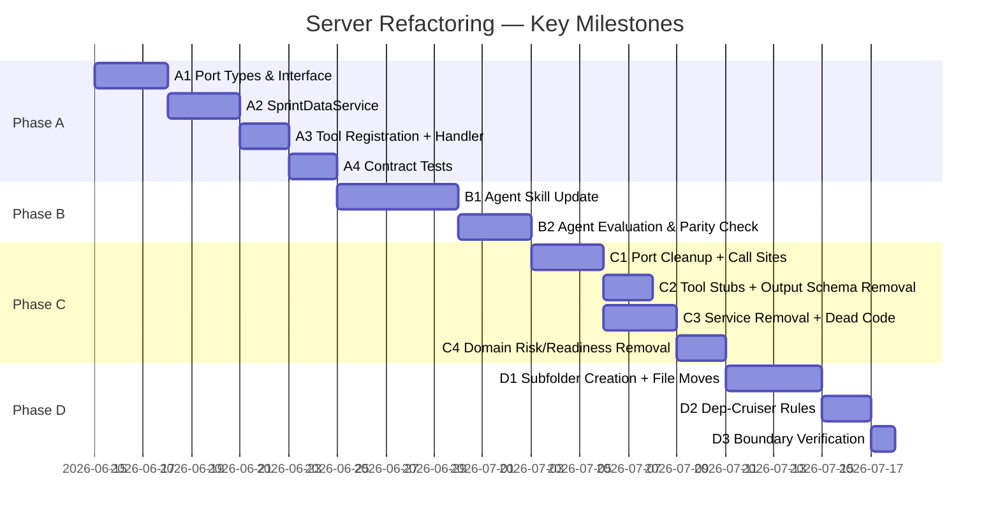

# Server Refactoring: Align to Architecture Vision

**Epic:** Server Refactoring — Align MCP Scrum Server to Architecture Vision **Reference:** [`tasks/REFACTORING.md`](/tasks/REFACTORING.md) — Refactoring Plan (source document) **Reference:** [`docs/ARCHITECTURE.MD`](/docs/ARCHITECTURE.MD) — Architecture Vision (target state) **Principle:** _Server Returns Facts; Agent Applies Judgment_

ALWAYS read the following documents to check the active state:

- tasks/server-refactoring/context-map.md
- tasks/server-refactoring/issues-checklist.md

---

## 1. Project Overview

### Feature Summary

The MCP Scrum server currently computes Scrum judgments — readiness evaluation, risk calculation, burndown series, velocity history — inside its adapter and domain layers. This violates Architectural Invariant 2: _Server Returns Facts; Agent Applies Judgment_. Scrum judgments require domain knowledge that belongs in the agent skill layer, not the server.

This refactoring restores the architecture boundary by:

1. **Adding a new `scrum_get_sprint_data` tool** that returns raw sprint items with completion timestamps — no aggregation, no computation.
2. **Updating the SM agent skill** to consume the new tool and compute its own burndown, velocity, risk, and readiness.
3. **Removing all server-side Scrum computation** — 4 adapter services, 2 domain rule modules, 1 risk-stance computation, and dead mappers.
4. **Restructuring the adapter** into the five-subfolder contract with dep-cruiser boundary rules.

All phases preserve **Invariant 8 — Tool Surface Stability**: existing `scrum_*` tool names, parameter shapes, and response schemas never change in a breaking way.

### Success Criteria

| Criterion                                                                       | Measure                                                            | Phase |
| ------------------------------------------------------------------------------- | ------------------------------------------------------------------ | ----- |
| New `scrum_get_sprint_data` tool returns schema-valid `SprintRawData` JSON      | Contract test passes                                               | A     |
| Agent produces equivalent burndown/velocity/risk from raw data vs. pre-computed | Agent evaluation suite confirms parity                             | B     |
| `scrum_get_board_health` and `scrum_get_analytics` return deprecation stubs     | Tool responds `{ deprecated: true, use: "scrum_get_sprint_data" }` | C     |
| `deno task depcruise` passes with zero violations                               | CI gate green                                                      | C, D  |
| No runtime Scrum computation in `domain/` or adapter                            | Zero imports of removed readiness/risk functions                   | C     |
| Adapter directory structure matches five-subfolder contract                     | Directory listing matches ARCHITECTURE.MD §4.5                     | D     |
| Adapter internal dep-cruiser rules enforce all boundary constraints             | Custom rules pass                                                  | D     |

### Key Milestones



### Risk Assessment

| Risk                                                                                                 | Impact                                                  | Likelihood | Mitigation                                                                                                                                                                                                                                                                                                                                                                                                                                                                                                                                                                |
| ---------------------------------------------------------------------------------------------------- | ------------------------------------------------------- | ---------- | ------------------------------------------------------------------------------------------------------------------------------------------------------------------------------------------------------------------------------------------------------------------------------------------------------------------------------------------------------------------------------------------------------------------------------------------------------------------------------------------------------------------------------------------------------------------------- |
| Phase B output parity fails                                                                          | Blocks entire Phase C                                   | Medium     | Run agent evaluations against both old and new tools in parallel; do not start Phase C until gate clears                                                                                                                                                                                                                                                                                                                                                                                                                                                                  |
| `acceptance-criteria.ts` removal breaks `get-story` tool                                             | Production tool returns empty AC                        | High       | **Cannot remove** `parseAcceptanceCriteria()` — it's called by [`get-story.ts`](/src/scrum/get-story.ts:29). Investigation confirmed: `ItemDetailResult.acceptance_criteria` depends on it. Action: keep function, add comment noting the architecture tension.                                                                                                                                                                                                                                                                                                           |
| `computeSprintEndDate()` removal breaks `mappers.ts`                                                 | Sprint iteration bootstrapping fails                    | High       | `computeSprintEndDate()` is called by [`mappers.ts:378`](/src/adapters/github/mappers.ts:378) inside `toSprintInfo()` (imported at line 18). Cannot blindly deprecate. Action: trace all call sites, keep function in server (it's pure math, not a judgment), deprecate only when removing `buildIdealLine`/`buildDaySeries`.                                                                                                                                                                                                                                            |
| `completionsFromBoardItems()` shared between Phase A and Phase C                                     | Premature removal breaks Phase A service                | High       | Ensure `burndown-completion.ts` is extracted to `infra/` **before** Phase C starts. The `BurndownCalculator` that also calls it can be removed only after the extraction.                                                                                                                                                                                                                                                                                                                                                                                                 |
| `aggregateToBurndownInput()` removal sequencing                                                      | Incorrect removal order breaks `burndown-calculator.ts` | Medium     | `aggregateToBurndownInput()` has a second internal caller via `buildBurndownStoryInput()` at [`mappers.ts:583`](/src/adapters/github/mappers.ts:583), which is called by [`burndown-calculator.ts:68`](/src/adapters/github/internal/burndown-calculator.ts:68). Phase C SC4 must remove `aggregateToBurndownInput` only after `burndown-calculator.ts` is deleted (SC3). Either remove `buildBurndownStoryInput()` at the same time or inline it. Unit test at [`mappers-aggregate.test.ts:76`](/src/adapters/github/mappers-aggregate.test.ts:76) must also be removed. |
| Agent skill `.roo/skills/scrum-master/SKILL.md` has no agent-side burndown/velocity/risk computation | Phase C leaves SM skill non-functional                  | Critical   | Phase B must implement agent-side equivalents of all removed computations. The Phase B exit gate must verify this explicitly.                                                                                                                                                                                                                                                                                                                                                                                                                                             |
| Deprecation stubs in Phase C violate downstream MCP clients                                          | Client expecting real data breaks silently              | Low        | Stubs return `{ deprecated: true, use: "scrum_get_sprint_data" }` as structured content — same response shape, no breaking type change. Hard removal deferred to a follow-up.                                                                                                                                                                                                                                                                                                                                                                                             |

---

## 2. Work Item Hierarchy

```mermaid
graph TD
    E[Epic: Server Refactoring] --> FA[Feature A: Add scrum_get_sprint_data Tool]
    E --> FB[Feature B: Agent Skill Update]
    E --> FC[Feature C: Remove Server-Side Computation]
    E --> FD[Feature D: Adapter Restructure Five-Subfolder]

    FA --> SA1[Story: Define SprintDataQuery + SprintRawData types]
    FA --> SA2[Story: Add getSprintData to ProjectReader port]
    FA --> SA3[Story: Implement SprintDataService in adapter]
    FA --> SA4[Story: Register scrum_get_sprint_data MCP tool]
    FA --> SA5[Story: Add handler + use-case layer]
    FA --> TA1[Test: Contract tests for new tool output schema]

    SA3 --> EA31[Enabler: Extend ItemAggregate with completed_at field]
    SA3 --> EA32[Enabler: Share completionsFromBoardItems from burndown-completion]

    FB --> SB1[Story: Update SKILL.md to use scrum_get_sprint_data]
    FB --> SB2[Story: Implement agent-side burndown + velocity computation]
    FB --> SB3[Story: Implement agent-side readiness + risk assessment]
    FB --> SB4[Enabler: Create agent evaluation suite for output parity]

    FC --> SC1[Story: Remove port methods + redirect call sites]
    FC --> SC2[Story: Replace tools with deprecation stubs]
    FC --> SC3[Story: Remove 4 adapter computation services]
    FC --> SC4[Story: Remove dead mappers + dead code]
    FC --> SC5[Story: Remove domain readiness rules + risk-stance]
    FC --> SC6[Story: Remove output types from schemas]
    FC --> TC1[Test: Regression tests for stub responses]
    FC --> TC2[Test: Dep-cruiser compliance]

    FD --> SD1[Enabler: Create 5 subdirectories under internal/]
    FD --> SD2[Story: Classify and move 32 source + 18 test = 50 files to contract locations]
    FD --> SD3[Enabler: Add dep-cruiser rules for internal boundaries]
    FD --> SD4[Story: Split files with mixed responsibilities]
    FD --> TD1[Test: Dep-cruiser internal boundary rule tests]

    SA1 -.-> EA31
    SA2 -.-> SC1
    SA3 -.-> EA32
    FC -.-> FD
```



---

## 3. GitHub Issues Breakdown

### 3.1 Epic Issue

```markdown
# Epic: Server Refactoring — Align MCP Scrum Server to Architecture Vision

## Epic Description

The MCP Scrum server computes Scrum judgments (readiness, risk, burndown, velocity) inside its adapter and domain layers, violating the architecture invariant "Server Returns Facts; Agent Applies Judgment". This epic restores the boundary across four phases: add raw sprint data tool, update agent skill, remove server computation, restructure adapter.

## Business Value

- **Primary Goal**: Restore Architecture Invariant 2 — no Scrum judgment computation in the server. All Scrum rules move to the agent skill layer.
- **Success Metrics**: Zero `domain/` runtime computation; zero references to removed services; dep-cruiser passes with internal adapter boundary rules.
- **User Impact**: Agent behavior becomes explainable and adjustable without server deployments. Tuning risk thresholds or DoR criteria requires only a skill file edit.

## Epic Acceptance Criteria

- [ ] New `scrum_get_sprint_data` tool returns schema-valid raw sprint data
- [ ] Agent skill consumes `scrum_get_sprint_data` and computes equivalent judgments
- [ ] Phase B exit gate confirmed (agent evaluation parity)
- [ ] `scrum_get_board_health` and `scrum_get_analytics` return deprecation stubs
- [ ] 4 adapter computation services removed: analytics-service, board-health-service, sprint-history-service, burndown-calculator
- [ ] `computeRiskStance()` and readiness rules removed from domain layer
- [ ] Adapter internal directory matches five-subfolder contract
- [ ] Dep-cruiser internal boundary rules enforce subfolder isolation
- [ ] All 6 existing dep-cruiser rules remain passing (no regressions)

## Features in this Epic

- [ ] Feature A — Add `scrum_get_sprint_data` Tool
- [ ] Feature B — Agent Skill Update
- [ ] Feature C — Remove Server-Side Computation
- [ ] Feature D — Adapter Restructure (Five-Subfolder Contract)

## Definition of Done

- [ ] All feature stories completed across 4 phases
- [ ] Phase B exit gate verified by agent evaluation
- [ ] `deno task test` passes (~257 tests)
- [ ] `deno task depcruise` passes
- [ ] `deno lint` passes
- [ ] Documentation updated (ARCHITECTURE.MD alignment confirmed)

## Labels

`epic`, `priority-critical`, `value-high`, `architecture`

## Milestone

V2 Architecture Alignment

## Estimate

L (20-40 story points across 4 phases)
```

### 3.2 Feature A — Add `scrum_get_sprint_data` Tool

```markdown
# Feature A: Add scrum_get_sprint_data Tool

## Feature Description

Add a new non-breaking MCP tool that returns raw sprint items with completion timestamps. The tool returns `SprintRawData` — flat per-item facts, no aggregation, no burndown series, no health computation. The adapter's `SprintDataService` reuses the existing aggregate board scan pipeline and the `completionsFromBoardItems()` utility from `burndown-completion.ts`.

## User Stories in this Feature

- [ ] SA1 — Define `SprintDataQuery` and `SprintRawData` types in port interface
- [ ] SA2 — Add `getSprintData(query)` to `ProjectReader` port
- [ ] SA3 — Implement `SprintDataService` in adapter
- [ ] SA4 — Register `scrum_get_sprint_data` as MCP tool
- [ ] SA5 — Add handler + use-case layer

## Technical Enablers

- [ ] EA31 — Extend `ItemAggregate` with `completed_at` field
- [ ] EA32 — Extract `burndown-completion.ts` to `infra/` for shared use

## Dependencies

**Blocks**: Feature B (Agent Skill Update) **Blocked by**: Nothing (non-breaking, no prerequisites)

## Acceptance Criteria

- [ ] `getSprintData(query)` added to `ProjectReader` port interface at [`src/scrum/ports.ts`](/src/scrum/ports.ts)
- [ ] `SprintDataQuery` and `SprintRawData` types defined in port interface
- [ ] `SprintDataService` created at `src/adapters/github/internal/read-services/`
- [ ] Service reuses `completionsFromBoardItems()` from burndown-completion.ts
- [ ] `scrum_get_sprint_data` registered in [`src/tools/scrum-read.ts`](/src/tools/scrum-read.ts)
- [ ] Tool name added to `SCRUM_READ_TOOL_NAMES` constant
- [ ] Handler in [`src/tools/handlers/read.ts`](/src/tools/handlers/read.ts)
- [ ] Output schema registered as `outputSchema` on tool definition
- [ ] Use-case file created at `src/scrum/get-sprint-data.ts`
- [ ] Contract test validates output against `SprintRawDataSchema`

## Definition of Done

- [ ] All user stories delivered
- [ ] Technical enablers completed
- [ ] `deno task test` passes (all existing + new tests)
- [ ] Contract test covers new tool schema
- [ ] Output schema registered and Zod-validated
- [ ] No breaking changes to existing tools

## Labels

`feature`, `priority-high`, `value-high`, `server`

## Epic

#1 — Server Refactoring

## Estimate

8 story points
```

### 3.3 Feature B — Agent Skill Update

```markdown
# Feature B: Agent Skill Update

## Feature Description

Update the SM agent skill to consume `scrum_get_sprint_data` and compute Scrum judgments (burndown, velocity, risk, readiness) from raw data. This phase validates that the server's raw data is sufficient for the agent to produce equivalent-quality Scrum judgments. The agent evaluation suite confirms output parity as the hard exit gate before Phase C.

## User Stories in this Feature

- [ ] SB1 — Update `.roo/skills/scrum-master/SKILL.md` to call `scrum_get_sprint_data`
- [ ] SB2 — Implement agent-side burndown series + velocity computation
- [ ] SB3 — Implement agent-side readiness assessment + sprint risk evaluation

## Technical Enablers

- [ ] SB4 — Create agent evaluation suite for output parity comparison

## Dependencies

**Blocks**: Feature C (Remove Server-Side Computation) — this is the **hard exit gate** **Blocked by**: Feature A (`scrum_get_sprint_data` tool must exist)

## Acceptance Criteria

- [ ] Agent skill calls `scrum_get_sprint_data` instead of `scrum_get_analytics` + `scrum_get_board_health`
- [ ] Agent computes burndown series from raw `SprintRawData` timestamps
- [ ] Agent computes velocity from completed sprint history windows
- [ ] Agent applies DoR criteria from config to evaluate readiness
- [ ] Agent counts sprint risks (unestimated, blocked, no-assignee)
- [ ] Agent outputs match old server-computed values within acceptable tolerance
- [ ] Evaluation suite documents the comparison methodology and tolerance bounds
- [ ] Phase C not started until evaluation confirms parity

## Definition of Done

- [ ] Agent skill fully migrated to `scrum_get_sprint_data`
- [ ] Agent-side burndown implementation produces equivalent output
- [ ] Agent-side velocity calculation produces equivalent output
- [ ] Agent-side readiness assessment produces equivalent output
- [ ] Agent-side risk evaluation produces equivalent output
- [ ] Evaluation documentation committed to repository
- [ ] Phase B exit gate verified and signed off

## Labels

`feature`, `priority-critical`, `value-high`, `agent-skill`

## Epic

#1 — Server Refactoring

## Estimate

8 story points
```

### 3.4 Feature C — Remove Server-Side Computation

```markdown
# Feature C: Remove Server-Side Computation

## Feature Description

**Prerequisite: Phase B exit gate confirmed.** Remove all Scrum computation from the server: 4 adapter services, 2 domain rule modules, dead mappers, risk-stance logic, and output schema types. Replace `scrum_get_board_health` and `scrum_get_analytics` with deprecation stubs. Clean the port interface of computation-oriented methods.

## Stories / Enablers

- [ ] SC1 — Remove `getBoardHealth()`, `getAnalytics()`, and `getSprintCompletion()` from port, redirect all call sites in use-case layer to `getSprintData()`
- [ ] SC2 — Deprecate `scrum_get_board_health` and `scrum_get_analytics` with `{ deprecated: true, use: "scrum_get_sprint_data" }` stubs
- [ ] SC3 — Remove 4 adapter services: `analytics-service.ts`, `board-health-service.ts`, `sprint-history-service.ts`, `burndown-calculator.ts`
- [ ] SC4 — Remove dead code: `historyEntryToItemListing()` in listing-mappers.ts, `aggregateToBurndownInput()` and `buildBurndownStoryInput()` in mappers.ts, `buildIdealLine()` and `buildDaySeries()` in sprint-math.ts (callers removed)
- [ ] SC5 — Remove domain readiness rules module (`src/domain/rules/readiness.ts`), remove `computeRiskStance()`, strip `riskStance` from `sprintContextFromSprintInfo()`
- [ ] SC6 — Remove output schema types: `BacklogHealthSchema`, `AnalyticsResultSchema`, `BurndownResponseSchema`, `SprintSnapshotSchema`, `SprintTotalsSchema`, `ReadinessBreakdownSchema`

## Tests

- [ ] TC1 — Regression tests: stub responses return correct shape
- [ ] TC2 — Dep-cruiser compliance: no references to removed services

## Dependencies

**Blocks**: Feature D **Blocked by**: Feature B (Phase B exit gate — hard prerequisite)

## Acceptance Criteria

- [ ] Phase B exit gate verified before Phase C begins
- [ ] `getBoardHealth()`, `getAnalytics()`, `getSprintCompletion()` removed from port
- [ ] All orient.ts call sites using `workPct` and `sprintContextFromSprintInfo` updated to not require risk computation
- [ ] `scrum_get_board_health` responds with deprecation stub, not error
- [ ] `scrum_get_analytics` responds with deprecation stub, not error
- [ ] `analytics-service.ts`, `board-health-service.ts`, `sprint-history-service.ts`, `burndown-calculator.ts` files deleted
- [ ] `historyEntryToItemListing()` removed (only caller was analytics service)
- [ ] `aggregateToBurndownInput()` and `buildBurndownStoryInput()` removed (callers: sprint-history-service and burndown-calculator, both deleted in SC3)
- [ ] `computeRiskStance()` removed from `domain/types.ts`
- [ ] `riskStance` field removed from `SprintContext` interface and `SprintContextSchema`
- [ ] Readiness evaluation module removed from `domain/rules/readiness.ts`
- [ ] `parseAcceptanceCriteria()` preserved at `domain/rules/acceptance-criteria.ts` (needed by `get-story.ts` use case)
- [ ] `completionsFromBoardItems()` preserved (moved to `infra/` for SprintDataService)
- [ ] `computeSprintEndDate()` preserved (called by mappers.ts:378 inside `toSprintInfo()`, imported at mappers.ts:18)
- [ ] `buildIdealLine()`, `buildDaySeries()`, `buildSprintWindow()` in sprint-math.ts are marked deprecated with comment directing to agent skill — **not yet removed**
- [ ] `BacklogHealth`, `AnalyticsResult`, `BurndownResponse`, `SprintSnapshot`, `SprintTotals` types removed from server output schemas
- [ ] Zero references to removed services anywhere in `src/`
- [ ] `deno task depcruise` passes
- [ ] `deno task test` passes

## Definition of Done

- [ ] Phase B gate cleared
- [ ] All port methods cleaned
- [ ] All computation services removed
- [ ] Stubs respond correctly
- [ ] Domain has zero runtime computation (except `parseAcceptanceCriteria` by explicit exception)
- [ ] Output schemas cleaned of removed types
- [ ] `deno task test`, `deno lint`, `deno task depcruise` all pass

## Labels

`feature`, `priority-critical`, `value-high`, `server`, `architecture`

## Epic

#1 — Server Refactoring

## Estimate

13 story points
```

### 3.5 Feature D — Adapter Restructure (Five-Subfolder Contract)

```markdown
# Feature D: Adapter Restructure (Five-Subfolder Contract)

## Feature Description

Restructure the flat `src/adapters/github/internal/` directory into the five-subfolder contract prescribed by ARCHITECTURE.MD §4.5: `query-pipeline/`, `query-strategies/`, `read-services/`, `write-services/`, `infra/`. Add dep-cruiser rules enforcing import boundaries between subfolders. The `assemblers/` directory remains as a peer.

## Stories / Enablers

- [ ] SD1 — Create 5 subdirectories under `internal/` with the contract structure
- [ ] SD2 — Classify and move 32 source + 18 test = 50 files to their contract directories
- [ ] SD3 — Add dep-cruiser rules enforcing internal subfolder import boundaries
- [ ] SD4 — Split files with mixed responsibilities at function boundaries before moving

## Tests

- [ ] TD1 — Dep-cruiser internal boundary rule tests pass

## File Classification Map

| File                              | Current Location       | Destination         | Rationale                      |
| --------------------------------- | ---------------------- | ------------------- | ------------------------------ |
| `project-items-query-builder.ts`  | `internal/`            | `query-pipeline/`   | GraphQL query construction     |
| `project-items-cache.ts`          | `internal/`            | `query-pipeline/`   | Cache management               |
| `execution-engine.ts`             | `internal/`            | `query-pipeline/`   | Pagination execution           |
| `pagination.ts`                   | `internal/`            | `query-pipeline/`   | Pagination state               |
| `filter-strategy-router.ts`       | `internal/`            | `query-strategies/` | Filter routing                 |
| `result-normalizer.ts`            | `internal/`            | `query-strategies/` | Result normalization           |
| `search-query-builder.ts`         | `internal/`            | `query-strategies/` | Search query construction      |
| `search-result-normalizer.ts`     | `internal/`            | `query-strategies/` | Search result normalization    |
| `board-item-projection.ts`        | `internal/`            | `query-strategies/` | Board item projection          |
| `item-filter.ts`                  | `internal/`            | `query-strategies/` | Scrum-semantic predicate       |
| `board-scan-coordinator.ts`       | `internal/`            | `read-services/`    | Data aggregation               |
| `story-query-service.ts`          | `internal/`            | `read-services/`    | Story data aggregation         |
| `epic-service.ts`                 | `internal/`            | `read-services/`    | Epic data aggregation          |
| `impediment-service.ts`           | `internal/`            | `read-services/`    | Impediment data aggregation    |
| `sprint-data-service.ts`          | NEW                    | `read-services/`    | Sprint data (Phase A)          |
| `story-mutation-service.ts`       | `internal/`            | `write-services/`   | Mutations only                 |
| `field-value-mutator.ts`          | `internal/`            | `write-services/`   | Mutations only                 |
| `label-resolver.ts`               | `internal/`            | `write-services/`   | Mutations only                 |
| `vocabulary-manager.ts`           | `internal/`            | `write-services/`   | Mutations only                 |
| `user-milestone-resolver.ts`      | `internal/`            | `write-services/`   | Mutations only                 |
| `http-client.ts`                  | `internal/`            | `infra/`            | API client, no business logic  |
| `infra-context.ts`                | `internal/`            | `infra/`            | Infrastructure context         |
| `resolver.ts`                     | `internal/`            | `infra/`            | Ref resolution                 |
| `resolve-issue-number.ts`         | `internal/`            | `infra/`            | Issue number resolution        |
| `config-reloader.ts`              | `internal/`            | `infra/`            | Config, no business logic      |
| `concurrent.ts`                   | `internal/`            | `infra/`            | Concurrency helper             |
| `file-reader.ts`                  | `internal/`            | `infra/`            | File reading                   |
| `platform-request.ts`             | `internal/`            | `infra/`            | Platform request plumbing      |
| `owner-graphql.ts`                | `internal/`            | `infra/`            | Owner GraphQL utility          |
| `iteration-classifier.ts`         | `internal/`            | `infra/`            | Iteration classification       |
| `burndown-completion.ts`          | `internal/`            | `infra/`            | Shared utility (Phase A needs) |
| `project-items-response-types.ts` | `internal/`            | `infra/`            | Response type shapes (leaf)    |
| `assemblers/`                     | `internal/assemblers/` | (keep as peer)      | Strategy implementations       |

> **Note on test file co-location:** Each of the 32 source files above has a co-located `*.test.ts` file (18 total across the classification map) that must move with its source module. The actual scope for SD2 is 32 source files + 18 test files = **50 files** requiring import path updates and directory moves.

## Dep-Cruiser Rules to Add
```

Rule: query-pipeline may only be imported by query-strategies/ and read-services/ Rule: query-strategies may NOT import read-services/ or write-services/ Rule: read-services may NOT import paginator directly or write-services/ Rule: write-services may NOT import query-pipeline/ Rule: infra may NOT import any service folder

```
## Dependencies

**Blocks**: Nothing (independent restructure)
**Blocked by**: Feature C (Phase C reduces file count, simplifying the move)

## Acceptance Criteria

- [ ] 5 subdirectories created under `internal/`: `query-pipeline/`, `query-strategies/`, 
      `read-services/`, `write-services/`, `infra/`
- [ ] All 32 source files moved to their contract locations
- [ ] Files with mixed responsibilities split before moving
- [ ] `assemblers/` remains as a peer directory (not in the five-subfolder structure)
- [ ] Dep-cruiser rules enforce: `query-pipeline/` → only importable by `query-strategies/` 
      and `read-services/`
- [ ] Dep-cruiser rules enforce: `query-strategies/` → may not import `read-services/` 
      or `write-services/`
- [ ] Dep-cruiser rules enforce: `read-services/` → may not import paginator directly 
      or `write-services/`
- [ ] Dep-cruiser rules enforce: `write-services/` → may not import `query-pipeline/`
- [ ] Dep-cruiser rules enforce: `infra/` → may not import any service folder
- [ ] `deno task depcruise` passes with new rules
- [ ] All imports updated to reflect new directory structure
- [ ] `deno task test` passes

## Definition of Done

- [ ] Directory structure matches ARCHITECTURE.MD
- [ ] Dep-cruiser internal boundary rules pass
- [ ] All imports consistent with new structure
- [ ] No broken imports or missing files
- [ ] `deno task test`, `deno lint`, `deno task depcruise` all pass

## Labels

`feature`, `priority-medium`, `value-medium`, `server`, `infrastructure`

## Epic

#1 — Server Refactoring

## Estimate

13 story points
```

---

## 4. Priority and Value Matrix

| Issue                                         | Priority | Value  | Rationale                                                           |
| --------------------------------------------- | -------- | ------ | ------------------------------------------------------------------- |
| **Epic: Server Refactoring**                  | P0       | High   | Core architecture compliance; blocking future agent improvements    |
| **Feature A: Add Sprint Data Tool**           | P1       | High   | Non-breaking capability add; prerequisite for all subsequent phases |
| SA1 — Define sprint data types                | P1       | High   | Foundation type work, unblocks SA2-SA5                              |
| SA2 — Add getSprintData port method           | P1       | High   | Port interface extension (non-breaking add)                         |
| SA3 — Implement SprintDataService             | P1       | High   | Core adapter implementation                                         |
| EA31 — Extend ItemAggregate with completed_at | P1       | Medium | Enables reusable aggregate profile                                  |
| EA32 — Extract burndown-completion to infra   | P1       | Medium | Enables sharing between Phase A and C                               |
| SA4 — Register MCP tool                       | P1       | High   | The actual agent-visible capability                                 |
| SA5 — Handler + use-case                      | P1       | High   | Full tool path completion                                           |
| TA1 — Contract tests                          | P1       | Medium | Schema stability enforcement                                        |
| **Feature B: Agent Skill Update**             | P0       | High   | Hard exit gate for Phase C                                          |
| SB1 — Update SKILL.md                         | P0       | High   | Migration to new tool                                               |
| SB2 — Agent burndown + velocity               | P0       | High   | Core computation parity                                             |
| SB3 — Agent readiness + risk                  | P0       | High   | Core computation parity                                             |
| SB4 — Agent evaluation suite                  | P0       | High   | Exit gate verification infrastructure                               |
| **Feature C: Remove Computation**             | P0       | High   | Core architecture compliance                                        |
| SC1 — Port cleanup                            | P0       | High   | Interface contract hygiene                                          |
| SC2 — Tool stubs                              | P0       | High   | Invariant 8 preservation                                            |
| SC3 — Service removal                         | P0       | High   | Primary architecture fix                                            |
| SC4 — Dead code removal                       | P1       | Medium | Cleanup after service removal                                       |
| SC5 — Domain cleanup                          | P0       | High   | "Zero runtime computation" contract                                 |
| SC6 — Schema cleanup                          | P1       | Medium | Output surface hygiene                                              |
| TC1 — Stub regression tests                   | P1       | Medium | Regression protection                                               |
| TC2 — Dep-cruiser compliance                  | P1       | Medium | Structural enforcement                                              |
| **Feature D: Adapter Restructure**            | P2       | Medium | Structure hygiene, no functional change                             |
| SD1 — Subdirectory creation                   | P2       | Medium | Structural prerequisite                                             |
| SD2 — File classification + move              | P2       | Medium | Primary restructuring work                                          |
| SD3 — Dep-cruiser internal rules              | P2       | Medium | Boundary enforcement                                                |
| SD4 — File splitting                          | P2       | Low    | May not be needed if classifications clean                          |
| TD1 — Boundary rule tests                     | P2       | Low    | Structural regression protection                                    |

---

## 5. Dependency Management

### Dependency Graph

```mermaid
graph LR
    subgraph PHASE_A["Phase A — Add Sprint Data"]
        A1[SprintDataQuery + SprintRawData types]
        A2[getSprintData port method]
        A3[SprintDataService implementation]
        A4[Tool registration + handler]
        A5[Contract tests]
    end

    subgraph PHASE_B["Phase B — Agent Skill Update"]
        B1[Update SKILL.md to use new tool]
        B2[Agent burndown + velocity computation]
        B3[Agent readiness + risk assessment]
        B4[Agent evaluation suite]
    end

    subgraph PHASE_C["Phase C — Remove Computation"]
        C1[Port cleanup: remove computation methods]
        C2[Tool deprecation stubs]
        C3[Remove 4 adapter services]
        C4[Remove dead code and mappers]
        C5[Remove domain readiness + risk-stance]
        C6[Remove output schema types]
    end

    subgraph PHASE_D["Phase D — Adapter Restructure"]
        D1[Create 5 subdirectories]
        D2[Classify and move ~37 files]
        D3[Add dep-cruiser boundary rules]
        D4[Split mixed-responsibility files]
    end

    A1 --> A2 --> A3 --> A4 --> A5
    A5 -.-> B1

    B1 --> B2 --> B3 --> B4
    B4 -.->|EXIT GATE| C1

    C1 --> C2 --> C3 --> C4 --> C5 --> C6
    C6 -.-> D1 --> D2
    C3 -.-> D2
    D2 --> D3 --> D4

    style B4 fill:#f96,stroke:#333,color:#000
    style C1 fill:#f96,stroke:#333,color:#000
```



### Dependency Types

| Type             | Phase A → B                                                | Phase B → C                               | Phase C → D                                                                         |
| ---------------- | ---------------------------------------------------------- | ----------------------------------------- | ----------------------------------------------------------------------------------- |
| **Blocks**       | A must deliver `scrum_get_sprint_data` before B can use it | B exit gate must clear before C can start | C reduces file count, simplifying D moves                                           |
| **Prerequisite** | Tool infrastructure complete                               | Agent evaluation parity confirmed         | All computation services removed                                                    |
| **Parallel**     | —                                                          | —                                         | D can technically start before C finishes if file classification done independently |

### Critical Path Items

| Item                                            | Why Critical                                                                                                                                                      |
| ----------------------------------------------- | ----------------------------------------------------------------------------------------------------------------------------------------------------------------- |
| Phase B exit gate (SB4 — evaluation suite)      | Without this, Phase C is blocked. If Phase C starts before parity is confirmed, there is no rollback for agent judgment computation.                              |
| `completionsFromBoardItems()` extraction (EA32) | Shared between Phase A and Phase C. Must be extracted to `infra/` **before** Phase C removes `burndown-calculator.ts`.                                            |
| `parseAcceptanceCriteria()` preservation        | Confirmed: called by `get-story.ts:29` for `ItemDetailResult.acceptance_criteria`. Cannot be removed despite being in `domain/rules/`.                            |
| `computeSprintEndDate()` preservation           | Called by `mappers.ts:378` inside `toSprintInfo()` (imported at mappers.ts:18). Pure math utility. Cannot be blindly deprecated with other sprint-math functions. |

---

## 6. Estimation

### Phase A — Add Sprint Data Tool (8 SP)

| Issue                                         | Points | Rationale                                                                                                      |
| --------------------------------------------- | ------ | -------------------------------------------------------------------------------------------------------------- |
| SA1 — SprintDataQuery + SprintRawData types   | 2      | Extend `ItemAggregate` with `completed_at`; add query type. Simple type extension.                             |
| SA2 — getSprintData port method               | 1      | Single method addition to `ProjectReader`.                                                                     |
| EA31 — Extend ItemAggregate with completed_at | 2      | Requires audit of all aggregate consumers for completed_at compatibility.                                      |
| EA32 — Extract burndown-completion to infra   | 2      | File move + import path updates; verify no cyclic deps created.                                                |
| SA3 — Implement SprintDataService             | 5      | Core implementation: reuse board scan coordinator, call `completionsFromBoardItems`, assemble `SprintRawData`. |
| SA4 — Register MCP tool                       | 1      | Add to `SCRUM_READ_TOOL_NAMES`, tool definition, output schema.                                                |
| SA5 — Handler + use-case                      | 1      | Thin handler in `handlers/read.ts`, use-case file in `scrum/get-sprint-data.ts`.                               |
| TA1 — Contract tests                          | 3      | Schema validation, config-shaped fake backend tests, MCP integration.                                          |

### Phase B — Agent Skill Update (8 SP)

| Issue                           | Points | Rationale                                                                          |
| ------------------------------- | ------ | ---------------------------------------------------------------------------------- |
| SB1 — Update SKILL.md           | 3      | Rewire tool calls from old tools to `scrum_get_sprint_data`.                       |
| SB2 — Agent burndown + velocity | 5      | Implement day-by-day burndown from raw timestamps; velocity from history windows.  |
| SB3 — Agent readiness + risk    | 3      | DoR evaluation from per-item listing data; risk counting from status fields.       |
| SB4 — Evaluation suite          | 5      | Create test harness comparing old vs. new outputs; document tolerance methodology. |

### Phase C — Remove Computation (13 SP)

| Issue                                                                     | Points | Rationale                                                                                                                                                                                                          |
| ------------------------------------------------------------------------- | ------ | ------------------------------------------------------------------------------------------------------------------------------------------------------------------------------------------------------------------ |
| SC1 — Port cleanup: remove 3 port methods + redirect orient.ts call sites | 5      | Remove `getBoardHealth`, `getAnalytics`, `getSprintCompletion` from port; redirect orient.ts `workPct` computation; ensure `ProjectReader` composition updated                                                     |
| SC2 — Tool deprecation stubs                                              | 3      | Replace handler implementations of `scrum_get_board_health` and `scrum_get_analytics` with stub that returns `{ deprecated: true, use: "scrum_get_sprint_data" }`                                                  |
| SC3 — Remove 4 adapter computation services                               | 5      | Delete `analytics-service.ts`, `board-health-service.ts`, `sprint-history-service.ts`, `burndown-calculator.ts`; remove from adapter composition                                                                   |
| SC4 — Remove dead code                                                    | 3      | Remove `historyEntryToItemListing()` from `listing-mappers.ts`; remove `aggregateToBurndownInput()` from `mappers.ts`; mark `buildIdealLine()`, `buildDaySeries()` in `sprint-math.ts` as deprecated               |
| SC5 — Remove domain readiness + risk-stance                               | 3      | Remove `src/domain/rules/readiness.ts`; remove `computeRiskStance()` from `domain/types.ts`; strip `riskStance` from `sprintContextFromSprintInfo()`; preserve `parseAcceptanceCriteria()`                         |
| SC6 — Remove output schema types                                          | 2      | Remove `BacklogHealthSchema`, `AnalyticsResultSchema`, `BurndownResponseSchema`, `SprintSnapshotSchema`, `SprintTotalsSchema`, `ReadinessBreakdownSchema` from `scrum-outputs.ts`; remove all related domain types |
| TC1 — Stub regression tests                                               | 2      | Verify stub responses return expected shape; verify existing contract tests still pass                                                                                                                             |
| TC2 — Dep-cruiser compliance                                              | 1      | Verify dep-cruiser passes with no references to removed files                                                                                                                                                      |

### Phase D — Adapter Restructure (13 SP)

| Issue                                     | Points | Rationale                                                                                                                              |
| ----------------------------------------- | ------ | -------------------------------------------------------------------------------------------------------------------------------------- |
| SD1 — Create 5 subdirectories             | 1      | Directory creation only                                                                                                                |
| SD2 — File classification + move          | 8      | Move 32 source files + 18 co-located test files = 50 total; update all import paths across adapter and tests; verify no broken imports |
| SD3 — Dep-cruiser internal boundary rules | 3      | Add 5 new rules to `.dependency-cruiser.cjs`; verify each rule enforces its constraint                                                 |
| SD4 — Split mixed-responsibility files    | 2      | If any file has mixed concerns (e.g., `item-filter.ts`), split at function level before moving                                         |
| TD1 — Boundary rule tests                 | 1      | Run `deno task depcruise` to validate all new rules                                                                                    |

### Total Estimation Summary

| Phase                          | Points | Issues | T-Shirt |
| ------------------------------ | ------ | ------ | ------- |
| Phase A — Add Sprint Data Tool | 8      | 8      | M       |
| Phase B — Agent Skill Update   | 8      | 4      | M       |
| Phase C — Remove Computation   | 13     | 8      | L       |
| Phase D — Adapter Restructure  | 13     | 5      | L       |
| **Total**                      | **42** | **25** | **XL**  |

---

## 7. Verification Gates

### Phase A Verification Gate

| Check                                              | Command / Method                                                | Expected Outcome                                  |
| -------------------------------------------------- | --------------------------------------------------------------- | ------------------------------------------------- |
| New tool returns schema-valid JSON                 | Contract test: `assertHandlerSchema` on `scrum_get_sprint_data` | Output validates against `SprintRawDataSchema`    |
| All existing tests pass                            | `deno task test`                                                | ~257 tests pass (existing + new)                  |
| No breaking changes to existing tools              | Confirm `SCRUM_READ_TOOL_NAMES` unchanged                       | 5 existing tools unchanged                        |
| Output schema registered                           | Inspect tool definition `outputSchema`                          | `SprintRawDataSchema` present                     |
| SprintDataService reuses completionsFromBoardItems | Verify import path                                              | `burndown-completion.ts` imported, not duplicated |

### Phase B Verification Gate (Exit Gate for Phase C)

| Check                                           | Method                                        | Expected Outcome                                                |
| ----------------------------------------------- | --------------------------------------------- | --------------------------------------------------------------- |
| Agent burndown matches old server output        | Agent evaluation suite comparing both outputs | Series points match within tolerance (documented in eval suite) |
| Agent velocity matches old server output        | Agent evaluation suite                        | Velocity values equivalent                                      |
| Agent readiness matches old server output       | Agent evaluation suite                        | Readiness counts equivalent                                     |
| Agent risk assessment matches old server output | Agent evaluation suite                        | Risk signals equivalent                                         |
| Evaluation methodology documented               | Commit eval methodology document              | Methodology, tolerance, and comparison reasoning committed      |
| Phase C NOT started before gate clears          | Scrum board / project tracking                | No Phase C issues in In Progress or Done                        |

### Phase C Verification Gate

| Check                                     | Command / Method                                                                                      | Expected Outcome                                                       |
| ----------------------------------------- | ----------------------------------------------------------------------------------------------------- | ---------------------------------------------------------------------- |
| Phase B gate verified                     | Team sign-off on B evaluation results                                                                 | Confirmed before C begins                                              |
| Port methods removed                      | `grep -r "getBoardHealth\|getAnalytics\|getSprintCompletion" src/scrum/ports.ts`                      | Lines removed; no references in port interface                         |
| No references to removed services         | `grep -r "analytics-service\|board-health-service\|sprint-history-service\|burndown-calculator" src/` | Zero matches                                                           |
| Domain layer has zero runtime computation | `grep -r "computeReadinessSummary\|computeRiskStance\|readiness" src/domain/`                         | Zero matches except `parseAcceptanceCriteria` (preserved by exception) |
| Stub tools respond correctly              | Call `scrum_get_board_health` and `scrum_get_analytics` via MCP                                       | Returns `{ deprecated: true, use: "scrum_get_sprint_data" }`           |
| Dead code removed                         | Verify `historyEntryToItemListing` not in `listing-mappers.ts`                                        | Function removed                                                       |
| `completionsFromBoardItems()` preserved   | Check `src/adapters/github/internal/infra/burndown-completion.ts`                                     | File exists with `completionsFromBoardItems` function                  |
| `parseAcceptanceCriteria()` preserved     | Check `src/domain/rules/acceptance-criteria.ts`                                                       | File exists with `parseAcceptanceCriteria` function                    |
| `computeSprintEndDate()` preserved        | Check `src/scrum/sprint-math.ts`                                                                      | Function exists, NOT marked deprecated                                 |
| Dep-cruiser passes                        | `deno task depcruise`                                                                                 | Zero violations                                                        |
| All tests pass                            | `deno task test`                                                                                      | All existing + regression tests pass                                   |
| Lint passes                               | `deno lint`                                                                                           | Zero violations                                                        |

### Phase D Verification Gate

| Check                                | Command / Method                                               | Expected Outcome                                                                              |
| ------------------------------------ | -------------------------------------------------------------- | --------------------------------------------------------------------------------------------- |
| Directory structure matches contract | `find src/adapters/github/internal/ -type d`                   | `query-pipeline/`, `query-strategies/`, `read-services/`, `write-services/`, `infra/` present |
| `assemblers/` remains as peer        | `ls src/adapters/github/internal/`                             | `assemblers/` listed alongside the five subfolders                                            |
| All files moved                      | `find src/adapters/github/internal/ -maxdepth 1 -name "*.ts"`  | Only `assembler-output.ts`, `_test_fixtures.ts`, `_test_utils.ts` at root (if they exist)     |
| query-pipeline isolation             | `grep -r "query-pipeline" src --include="*.ts"`                | Only imported by `query-strategies/`, `read-services/`, and root adapter                      |
| query-strategies isolation           | Test rule: `query-strategies` must not import `read-services/` | Dep-cruiser rule passes                                                                       |
| read-services isolation              | Test rule: `read-services` must not import paginator directly  | Dep-cruiser rule passes                                                                       |
| write-services isolation             | Test rule: `write-services` must not import `query-pipeline/`  | Dep-cruiser rule passes                                                                       |
| infra isolation                      | Test rule: `infra` must not import any service folder          | Dep-cruiser rule passes                                                                       |
| No broken imports                    | `deno check src/`                                              | Zero type errors                                                                              |
| Dep-cruiser passes                   | `deno task depcruise`                                          | Zero violations (all 6 existing + 5 new rules)                                                |
| All tests pass                       | `deno task test`                                               | All ~257 tests pass                                                                           |
| Lint passes                          | `deno lint`                                                    | Zero violations                                                                               |

---

## Appendix A — Key Investigation Findings

### A.1 `parseAcceptanceCriteria()` — MUST PRESERVE

```
File: src/domain/rules/acceptance-criteria.ts
Caller: src/scrum/get-story.ts:29
Purpose: Parses markdown checkboxes from story body for ItemDetailResult.acceptance_criteria
```

Despite being in `domain/rules/` and being listed as an agent-side concern in ARCHITECTURE.MD, this function is called by the `get-story` use case to populate the `acceptance_criteria` field of `ItemDetailResult`. Removing it would break `scrum_get_item_detail`. **Action: keep the function.** Add a comment documenting the architecture tension — the value is computed server-side but the architecture intends it as agent-domain. A future refactoring can move AC parsing to the agent and remove this field from the tool response.

### A.2 `completionsFromBoardItems()` — SHARED, MUST PRESERVE

```
File: src/adapters/github/internal/burndown-completion.ts:19
Called by: BurndownCalculator (Phase C removal target) AND SprintDataService (Phase A target)
```

This utility is the only module that extracts completion timestamps from board items. It is required by both the new `SprintDataService` and the existing `BurndownCalculator`. **Action:** Move to `infra/` during Phase A (EA32) so it's available for both consumers. When Phase C removes the `BurndownCalculator`, this file stays.

### A.3 `computeSprintEndDate()` — MUST PRESERVE

```
File: src/scrum/sprint-math.ts:23
Called by: src/adapters/github/mappers.ts:18 (import) / src/adapters/github/mappers.ts:378 (call site inside toSprintInfo())
```

This is a pure date math utility with callers beyond analytics/burndown. The `mappers.ts` caller computes sprint metadata from platform iteration data (not from a user-facing analytics query). **Action:** Do not deprecate or remove this function. Mark only `buildIdealLine()` and `buildDaySeries()` as deprecated from sprint-math.ts.

### A.4 `historyEntryToItemListing()` — DEAD CODE, SAFE TO REMOVE

```
File: src/scrum/listing-mappers.ts:51-69
Only caller: analytics-service.ts
```

After Phase C removes the analytics service, this function has no callers. Safe to remove. The `toItemListing()` function at `listing-mappers.ts:28` is the replacement used by `find-items.ts`.

### A.5 `aggregateToBurndownInput()` — DEAD CODE AFTER BOTH CALLERS REMOVED

```
File: src/adapters/github/mappers.ts:532-542
Caller 1: sprint-history-service.ts:42 (direct .map() call, Phase C removal target)
Caller 2: mappers.ts:583 inside buildBurndownStoryInput(), which is called by burndown-calculator.ts:68 (Phase C removal target)
```

Note the removal sequencing: `aggregateToBurndownInput()` has **two** live code paths, not one. Caller 1 is the direct `.map()` call from `sprint-history-service.ts:42` (will be deleted in SC3). Caller 2 is indirect — `buildBurndownStoryInput()` at `mappers.ts:583` wraps `aggregateToBurndownInput()` and is itself called by `burndown-calculator.ts:68` (also deleted in SC3). The unit test at `mappers-aggregate.test.ts:76` must also be removed. **Action:** Remove `aggregateToBurndownInput()` and `buildBurndownStoryInput()` in SC4, which is safe only after SC3 has deleted both calling services. Alternatively, inline `aggregateToBurndownInput` into `buildBurndownStoryInput` and remove only the helper export.

### A.6 Phase B Exit Gate — Critical Path

The Phase B evaluation suite (SB4) is the single most important dependency in this plan. Without it:

- Phase C has no way to verify agent parity
- Starting Phase C means removing server computation with no fallback
- If agent computation is subtly wrong, the SM skill breaks silently

**Recommendation:** Build the evaluation suite early (can start in parallel with Phase A tool development) and run it as a CI workflow that compares old tool outputs vs. new tool outputs. The sign-off should require both automated passing and human review of the comparison report.

---

_Generated: 2026-06-08 · Source: `tasks/REFACTORING.md`, `docs/ARCHITECTURE.MD`, and codebase investigation_
